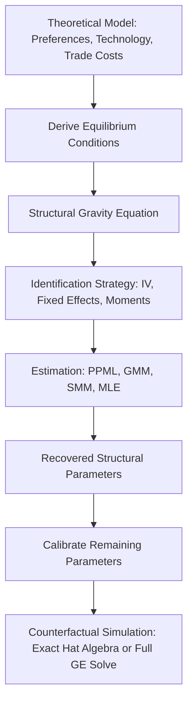
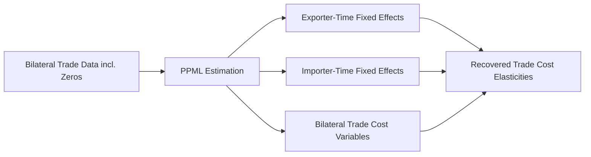
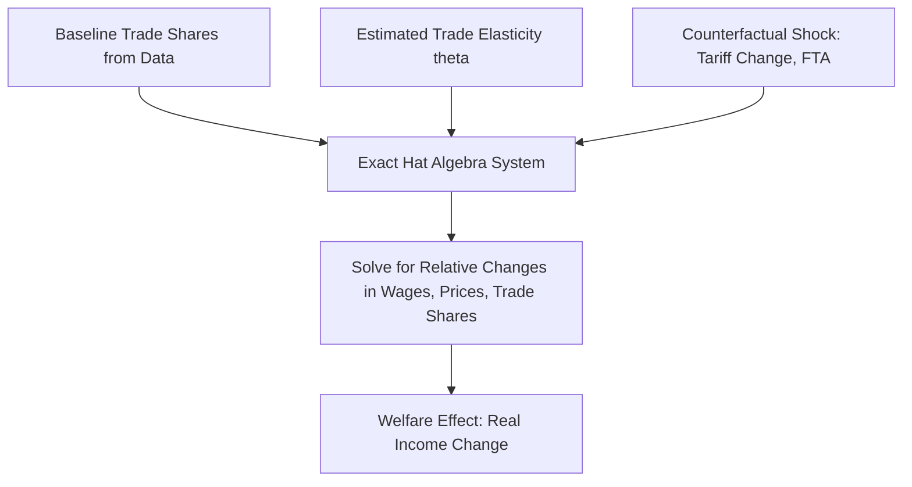

## Structural Estimation of Trade Models

### Overview

Structural estimation of trade models refers to the empirical strategy of estimating the deep parameters of a theoretically-derived general equilibrium trade model, rather than running reduced-form regressions detached from theory. The researcher specifies a full model (preferences, technology, market structure, trade costs), derives estimating equations directly from its equilibrium conditions, and recovers parameters (trade elasticities, productivity dispersion, fixed costs of exporting) that are interpretable within that theoretical system and usable for counterfactual policy analysis.

This approach sits opposite to purely reduced-form gravity estimation in the methodological spectrum, though modern quantitative trade work (post-2003) increasingly blends both: gravity-consistent structural estimation.

### Why Structural Estimation Matters

**Key Points**

- Reduced-form estimates (e.g., a tariff elasticity of trade flows) are policy-relevant but not necessarily portable across counterfactuals — they may not remain stable if the underlying policy regime changes (the Lucas critique applied to trade).
- Structural models recover parameters tied to primitives (elasticity of substitution $\sigma$, dispersion parameter $\theta$, fixed costs $f$), which are assumed invariant to the counterfactual being studied.
- This allows researchers to simulate "what if" scenarios: NAFTA withdrawal, a new FTA, a tariff war, a reduction in trade costs from infrastructure — without needing to have observed such a shock historically.

### The General Structural Workflow

1. **Specify the theoretical model** — a general equilibrium trade model with explicit micro-foundations (e.g., Armington, Krugman monopolistic competition, Eaton-Kortum Ricardian, Melitz heterogeneous firms).
2. **Derive equilibrium equations** — solve for bilateral trade flows, prices, and wages as functions of parameters and observables.
3. **Map to an estimating equation** — typically a "structural gravity equation" that nests naturally from the model's market-clearing conditions.
4. **Choose an identification strategy** — instruments, fixed effects, or moment conditions that isolate the parameters of interest from confounding general-equilibrium forces.
5. **Estimate** — via Poisson Pseudo-Maximum Likelihood (PPML), Generalized Method of Moments (GMM), Simulated Method of Moments (SMM), or Maximum Likelihood (MLE).
6. **Calibrate the remaining, non-estimated parameters** using external data or literature-based values.
7. **Solve the full general equilibrium counterfactual** using the "exact hat algebra" (Dekle, Eaton & Kortum 2008) technique or by fully re-solving the system numerically.

### Canonical Structural Trade Models

#### Armington Model

- Assumes goods are differentiated by country of origin (the "Armington assumption"), with a constant elasticity of substitution (CES) aggregator across origin countries.
- Yields the simplest micro-foundation for gravity: bilateral trade share depends on relative prices raised to the power $-\sigma$, where $\sigma$ is the elasticity of substitution between varieties from different countries.
- Widely used in Computable General Equilibrium (CGE) models (e.g., GTAP) because of its tractability, despite lacking firm-level heterogeneity or an extensive margin of trade.

#### Eaton-Kortum (2002) Ricardian Model

- Productivity across countries and goods is drawn from a Fréchet distribution: $F_i(z) = \exp(-T_i z^{-\theta})$, where $T_i$ is a country's absolute advantage (technology level) and $\theta$ governs comparative advantage dispersion (a lower $\theta$ implies more heterogeneity in comparative advantage, hence larger trade responses to cost changes).
- Delivers a closed-form "structural gravity" equation:

$$X_{ij} = \frac{T_i (c_i \tau_{ij})^{-\theta}}{\sum_k T_k (c_k \tau_{kj})^{-\theta}} X_j$$

where $X_{ij}$ is exports from $i$ to $j$, $c_i$ is $i$'s unit cost of production, and $\tau_{ij}$ is the iceberg trade cost.

- The parameter $\theta$ is the central object of estimation — it plays the role of the trade elasticity and governs both the gains from trade and the sensitivity of trade flows to cost shocks.
- Estimation of $\theta$ commonly uses **price data** (since the model implies specific relationships between bilateral price dispersion and trade costs) or **tariff-based instrumental variables** (Eaton & Kortum 2002; Simonovska & Waugh 2014).

#### Krugman (1980) Monopolistic Competition Model

- Firms are symmetric, produce differentiated varieties under increasing returns to scale, and consumers have CES love-of-variety preferences.
- Trade elasticity is governed directly by $\sigma - 1$, where $\sigma$ is the elasticity of substitution across varieties.
- No extensive margin of firm entry/exit response to trade costs (all firms always export) — a key limitation relative to Melitz.

#### Melitz (2003) Heterogeneous Firms Model

- Firms draw productivity $\varphi$ from a distribution (commonly Pareto) after paying a sunk entry cost, then decide whether to pay a fixed cost of exporting $f_{ij}$ based on a productivity cutoff $\varphi^*$.
- Generates an **extensive margin** (number of exporting firms) and **intensive margin** (average exports per firm) response to trade cost changes — matching well-documented firm-level export patterns (only a subset of firms export; exporters are larger and more productive — the "exporter premium").
- Key parameters to estimate: the Pareto shape parameter $k$ (productivity dispersion), $\sigma$ (elasticity of substitution), and fixed/sunk costs of exporting.
- Structural estimation often uses firm-level customs or production data with methods such as indirect inference or SMM, matching moments like the fraction of exporting firms, export intensity distributions, and firm size distributions (Helpman, Melitz & Rubinstein 2008 adapt a version with an extensive-margin correction for zero trade flows).

### The Structural Gravity Framework (Head & Mayer, 2014 taxonomy)

Nearly all modern structural trade models — Armington, Krugman, Eaton-Kortum, Melitz — nest into a common "structural gravity" reduced form:

$$X_{ij} = \frac{Y_i Y_j}{Y} \left( \frac{t_{ij}}{\Pi_i P_j} \right)^{1-\sigma}$$

where $Y_i$ is origin output, $Y_j$ is destination expenditure, $t_{ij}$ are bilateral trade costs, and $\Pi_i$, $P_j$ are outward and inward "multilateral resistance" terms (Anderson & van Wincoop, 2003) capturing general-equilibrium price effects.

**Key Points**

- Multilateral resistance terms explain why bilateral trade costs alone cannot predict trade flows — a country's trade with $j$ also depends on its trade costs with all other partners (relative, not absolute, trade costs matter).
- These terms are typically controlled for using origin and destination fixed effects in estimation — this is the primary contribution of the "structural gravity" literature to empirical practice.
- Anderson & van Wincoop's contribution is to show that omitting multilateral resistance biases trade cost effect estimates (the classic gravity misspecification problem).

### Estimation Methods

#### PPML (Poisson Pseudo-Maximum Likelihood)

- Standard workhorse since Santos Silva & Tenreyro (2006) demonstrated that log-linearizing gravity equations produces biased estimates under heteroskedasticity (Jensen's inequality bias) and cannot handle zero trade flows.
- PPML estimates the multiplicative gravity equation directly without log-transformation, is robust to heteroskedasticity, and naturally accommodates zeros.
- Standard specification includes exporter-time and importer-time fixed effects (to absorb multilateral resistance) and a pair fixed effect or bilateral trade cost proxies (distance, common language, tariffs, FTA dummies).

#### GMM (Generalized Method of Moments)

- Used when the model implies moment conditions (e.g., orthogonality between an instrument and a structural error term) rather than a fully specified likelihood.
- Common in trade cost/tariff elasticity estimation where an instrument (e.g., geographic or historical trade cost proxies) is used to address the endogeneity of trade costs or prices to trade volumes.

#### SMM (Simulated Method of Moments) / Indirect Inference

- Used when the model has no closed-form likelihood or moment conditions (common with firm heterogeneity models featuring discrete export decisions, fixed costs, and selection).
- The researcher simulates firm-level or trade outcomes under candidate parameters, compares simulated moments (e.g., export participation rate, average firm size differential between exporters and non-exporters) to their empirical counterparts, and searches over parameters to minimize the distance between simulated and real moments.

#### Maximum Likelihood Estimation (MLE)

- Used when the model provides a fully specified distributional assumption (e.g., Fréchet productivity draws in Eaton-Kortum), allowing direct likelihood-based estimation of $\theta$ from bilateral price or trade data.

### Identification Challenges

**Key Points**

- **Endogeneity of trade costs**: tariffs, FTAs, and even distance-based proxies may be correlated with unobserved trade-cost shocks or be endogenously determined by political-economy forces (countries may adopt lower tariffs precisely because they already trade heavily — reverse causality).
- **Zero trade flows**: many country pairs have zero recorded trade, especially at disaggregated product levels; log-linear OLS gravity drops these observations, causing selection bias. PPML and Heckman-type selection corrections (Helpman-Melitz-Rubinstein, 2008) address this directly.
- **Multilateral resistance / general equilibrium feedback**: any policy counterfactual changes trade costs for a pair, which changes relative prices everywhere, which changes wages, income, and trade globally. Structural estimation must be paired with a general equilibrium solution method to trace these feedbacks — partial equilibrium regression coefficients cannot be used for counterfactuals directly.
- **Separating trade elasticity from trade cost levels**: the trade elasticity ($\theta$ or $\sigma - 1$) and the level of trade costs $\tau_{ij}$ enter multiplicatively in most models, requiring external information (e.g., tariff data with known ad-valorem rates) to separately identify the elasticity from unobserved cost components.

### Counterfactual Analysis: Exact Hat Algebra

A major practical innovation (Dekle, Eaton & Kortum, 2008) allows researchers to compute counterfactual outcomes (e.g., real income change from a tariff) using only **observed baseline trade shares** and the **estimated trade elasticity**, without needing to separately estimate or calibrate the full set of country-level technology and trade-cost parameters.

- Variables are expressed in relative changes (a "hat," $\hat{x} = x'/x$) between baseline and counterfactual equilibrium.
- This reduces the informational burden dramatically: only bilateral trade shares, the trade elasticity, and the size of the policy shock are required as inputs.
- Widely used in quantitative trade papers evaluating NAFTA, Brexit, US-China tariffs, and regional trade agreements (e.g., Caliendo & Parro, 2015 on NAFTA using a multi-sector Eaton-Kortum framework).

### Worked Example: Estimating the Trade Elasticity in Eaton-Kortum

**Example**

Consider estimating $\theta$ using bilateral tariff data as an instrument for trade costs, following the logic of Caliendo & Parro (2015):

1. Take the structural gravity equation in ratio form to difference out unobserved exporter and importer fixed effects:

$$\ln\left(\frac{X_{ij} X_{jk} X_{ki}}{X_{ik} X_{kj} X_{ji}}\right) = -\theta \ln\left(\frac{\tau_{ij} \tau_{jk} \tau_{ki}}{\tau_{ik} \tau_{kj} \tau_{ji}}\right)$$

using a three-country "cycle" of trade shares. This "triple-difference" trick cancels out all origin and destination-specific terms (technology, wages, price indices), leaving only relative trade costs.

2. Proxy $\tau_{ij}$ using observed ad-valorem tariffs $(1 + \text{tariff}_{ij})$.
3. Regress the log trade-share cycle ratio on the log tariff cycle ratio; the estimated coefficient is $-\theta$.
4. Typical estimates in the literature for aggregate manufacturing range around $\theta \approx 4$–$9$ (Head & Mayer, 2014 survey; Eaton & Kortum, 2002 original estimate around 8.28, though many sector-specific values vary substantially). [Unverified] — the exact estimate is highly sensitive to sector aggregation, data vintage, and instrument choice; treat specific numeric values as illustrative rather than a settled consensus figure.

### Comparison of Model Frameworks

| Model | Firm Heterogeneity | Extensive Margin | Key Parameter(s) | Common Estimation Method |
| --- | --- | --- | --- | --- |
| Armington | No | No | $\sigma$ (elasticity of substitution) | PPML on gravity equation |
| Krugman (1980) | No (symmetric firms) | No | $\sigma$ | PPML on gravity equation |
| Eaton-Kortum (2002) | Implicit (Ricardian) | Yes (goods-level) | $\theta$ (Fréchet dispersion) | MLE, GMM (price/tariff-based) |
| Melitz (2003) | Yes | Yes (firm-level) | $k$ (Pareto shape), $\sigma$, fixed costs | SMM, indirect inference, HMR selection correction |

### Data Requirements

**Key Points**

- Bilateral trade flow data (e.g., UN Comtrade, BACI, CEPII gravity datasets) at the country-pair-sector-year level.
- Bilateral trade cost proxies: distance, tariffs (WITS/TRAINS), common language, colonial history, FTA membership (CEPII Gravity dataset).
- For firm-heterogeneity models: firm- or plant-level customs/production microdata (often requires restricted-access data such as national customs records or firm censuses).
- Price data (for Eaton-Kortum-style identification via relative price dispersion, e.g., using retail price surveys such as the Economist's Big Mac Index or International Comparison Program data as illustrative sources of cross-country price variation).

### Notation Summary Diagram

<svg xmlns="http://www.w3.org/2000/svg" viewBox="0 0 720 300">
<text x="360" y="25" text-anchor="middle" font-size="16" font-weight="bold" fill="#1a1a1a">Structural Gravity: Core Notation (svg_diagram)</text>
<rect x="20" y="50" width="330" height="220" rx="8" fill="#eef4fb" stroke="#4a7ab5" stroke-width="1.5" />
<text x="185" y="75" text-anchor="middle" font-size="14" font-weight="bold" fill="#2c4a6e">Observables</text>
<text x="35" y="100" font-size="13" fill="#1a1a1a">X_ij : exports from i to j</text>
<text x="35" y="125" font-size="13" fill="#1a1a1a">Y_i : origin output</text>
<text x="35" y="150" font-size="13" fill="#1a1a1a">E_j : destination expenditure</text>
<text x="35" y="175" font-size="13" fill="#1a1a1a">dist_ij : bilateral distance</text>
<text x="35" y="200" font-size="13" fill="#1a1a1a">tariff_ij : ad-valorem tariff</text>
<text x="35" y="225" font-size="13" fill="#1a1a1a">FTA_ij : trade agreement dummy</text>
<text x="35" y="250" font-size="13" fill="#1a1a1a">language, colony, border dummies</text>
<rect x="370" y="50" width="330" height="220" rx="8" fill="#fbeeee" stroke="#b54a4a" stroke-width="1.5" />
<text x="535" y="75" text-anchor="middle" font-size="14" font-weight="bold" fill="#6e2c2c">Structural Parameters</text>
<text x="385" y="100" font-size="13" fill="#1a1a1a">theta : Frechet dispersion (EK)</text>
<text x="385" y="125" font-size="13" fill="#1a1a1a">sigma : elasticity of substitution</text>
<text x="385" y="150" font-size="13" fill="#1a1a1a">k : Pareto shape (Melitz)</text>
<text x="385" y="175" font-size="13" fill="#1a1a1a">f_ij : fixed cost of exporting</text>
<text x="385" y="200" font-size="13" fill="#1a1a1a">tau_ij : iceberg trade cost</text>
<text x="385" y="225" font-size="13" fill="#1a1a1a">Pi_i, P_j : multilateral resistance</text>
<text x="385" y="250" font-size="13" fill="#1a1a1a">T_i : country technology level</text>
</svg>

### Applications in Policy Analysis

**Key Points**

- Evaluating regional trade agreements' welfare effects (e.g., NAFTA — Caliendo & Parro, 2015; CPTPP or RCEP ex-ante studies).
- Quantifying gains from trade and losses from tariff wars (e.g., US-China 2018–2019 tariff escalation studies using Eaton-Kortum or Armington frameworks with hat algebra).
- Assessing the welfare cost of trade frictions from infrastructure gaps, border effects, or non-tariff barriers.
- Estimating the impact of trade on labor markets and regional inequality when combined with economic geography extensions (Redding & Rossi-Hansberg, 2017 review).

**Related Topics**

- Structural gravity model derivations (Anderson & van Wincoop, 2003; Head & Mayer, 2014 gravity handbook chapter)
- Eaton-Kortum Ricardian trade model in depth
- Melitz (2003) heterogeneous firms model and firm-level trade margins
- Exact hat algebra and quantitative trade model counterfactuals (Dekle, Eaton & Kortum, 2008; Costinot & Rodríguez-Clare, 2014 handbook chapter)
- PPML estimation and the treatment of zero trade flows (Santos Silva & Tenreyro, 2006)
- Helpman-Melitz-Rubinstein (2008) selection-corrected gravity estimation
- Multi-sector and multi-factor extensions (Caliendo & Parro, 2015)
- Economic geography and spatial general equilibrium trade models (Redding & Rossi-Hansberg, 2017)
- Trade elasticity estimates: cross-study comparison and sensitivity analysis