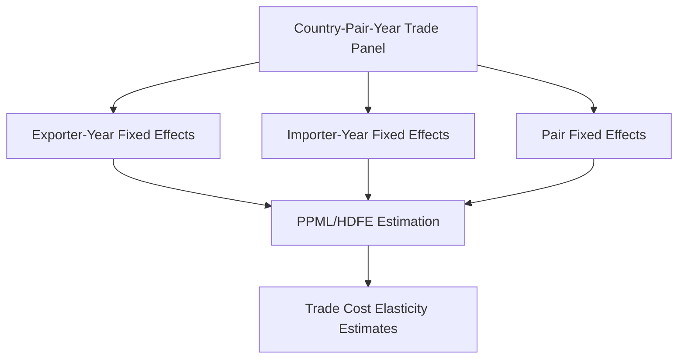
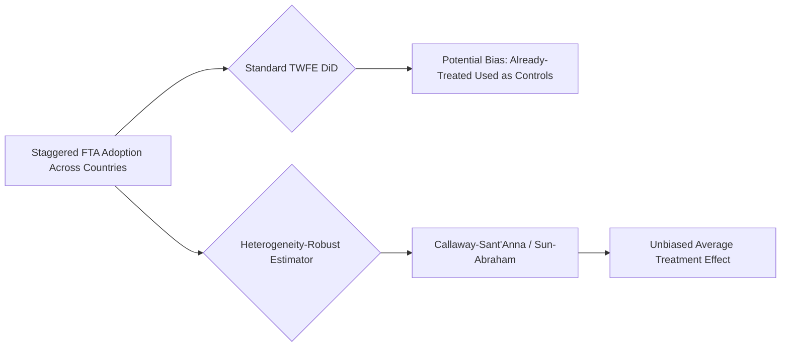

## Panel Data Methods


### Overview

Panel data methods combine cross-sectional variation (across countries, country-pairs, firms, or industries) with time-series variation (across years or other periods), allowing researchers to control for unobserved heterogeneity that would otherwise bias cross-sectional estimates. In international economics, panel methods are the dominant empirical toolkit for gravity models, exchange rate pass-through, FDI determinants, trade and growth regressions, and policy evaluation using difference-in-differences designs.

### Why Panels Matter in International Economics

**Key Points**

- Cross-sectional trade or FDI regressions cannot separate genuine causal effects from **omitted, time-invariant country or pair characteristics** (culture, institutions, geography-correlated unobservables).
- Panels allow researchers to include fixed effects that absorb such unobserved heterogeneity, isolating variation from within-unit changes over time.
- International economics data is naturally panel-structured: bilateral trade flows, exchange rates, FDI stocks, and tariffs are typically observed for many country-pairs across many years.

### Data Structures Common to International Economics

| Structure | Example | Fixed Effects Typically Used |
| --- | --- | --- |
| Country-year panel | GDP, real exchange rate, capital account openness | Country FE, Year FE |
| Country-pair-year panel | Bilateral trade, gravity model | Exporter-year FE, Importer-year FE, Pair FE |
| Firm-year panel | Export participation, firm productivity | Firm FE, Year FE, Sector-year FE |
| Country-pair-sector-year panel | Product-level trade flows, tariffs | Exporter-sector-year FE, Importer-sector-year FE, Pair FE |

### Core Estimators

#### Pooled OLS

- Ignores panel structure entirely; treats all observations as independent cross-sections stacked over time.
- Produces biased and inconsistent estimates if unobserved unit-specific effects are correlated with regressors — rarely appropriate as a final specification in trade or macro panels, but useful as a baseline comparison.

#### Fixed Effects (Within) Estimator

- Removes time-invariant unit-specific heterogeneity by demeaning each variable relative to its unit-specific (and/or time-specific) mean, or equivalently by including dummy variables for each unit.
- The workhorse of modern gravity estimation: exporter-year and importer-year fixed effects absorb multilateral resistance terms (see structural gravity), while pair fixed effects absorb any time-invariant bilateral characteristics (distance, common language, colonial ties) — meaning these variables **cannot be separately estimated** once pair fixed effects are included, since they are collinear with the fixed effect.
- Identification comes purely from **within-pair variation over time** (e.g., a country joining a trade agreement, a tariff change), which is often a much smaller and noisier source of variation than cross-sectional differences.

$$y_{it} = \alpha_i + \beta x_{it} + \varepsilon_{it}$$

where $\alpha_i$ is the unit fixed effect, removed via the within transformation:

$$(y_{it} - \bar{y}_i) = \beta (x_{it} - \bar{x}_i) + (\varepsilon_{it} - \bar{\varepsilon}_i)$$

#### Random Effects Estimator

- Assumes the unit-specific effect $\alpha_i$ is uncorrelated with regressors and treats it as part of the composite error term, estimated via Generalized Least Squares (GLS).
- More efficient than fixed effects **if** the assumption holds, but this assumption is rarely credible in trade and macro applications where unobserved heterogeneity (institutions, geography) is almost certainly correlated with covariates of interest.
- The Hausman test is the traditional tool for choosing between fixed and random effects, though it is used less often in contemporary trade literature, where fixed effects are the default due to their weaker identifying assumptions. [Inference] — practice varies by subfield and journal norms, so treat "fixed effects as default" as a description of common practice rather than a universal rule.

#### First-Differencing

- An alternative to the within transformation, removing time-invariant heterogeneity by differencing consecutive periods rather than demeaning.
- Numerically equivalent to fixed effects only in the two-period case; with $T>2$, the two estimators differ in efficiency depending on the serial correlation structure of the error term.

### High-Dimensional Fixed Effects and Estimation

**Key Points**

- Structural gravity estimation typically requires **three-way fixed effects** (exporter-year, importer-year, and pair), which can involve tens of thousands of dummy variables in country-pair-sector-year panels.
- Direct dummy-variable estimation becomes computationally infeasible at scale; specialized algorithms (iterative demeaning / alternating projections, as in Guimarães & Portugal, 2010) or dedicated software (Stata's `reghdfe`, R's `fixest`, Python's `pyfixest`) are used to estimate high-dimensional fixed-effects models efficiently.
- These same high-dimensional FE structures are combined with PPML (Poisson Pseudo-Maximum Likelihood) for gravity estimation with count/zero-inflated trade data (Correia, Guimarães & Zylkin, 2020 — the `ppmlhdfe` estimator).



### Dynamic Panel Models

- Include a lagged dependent variable as a regressor: $y_{it} = \rho y_{i,t-1} + \beta x_{it} + \alpha_i + \varepsilon_{it}$.
- The within (fixed-effects) estimator is **biased in dynamic panels with small $T$** (Nickell bias, 1981), because the demeaning transformation correlates the lagged dependent variable with the transformed error term.
- **Arellano-Bond (1991) GMM estimator**: first-differences the model to remove fixed effects, then uses further lags of the dependent variable as instruments for the differenced lagged term.
- **Blundell-Bond (1998) System GMM**: augments Arellano-Bond by also estimating the equation in levels using lagged differences as instruments, improving efficiency especially when the dependent variable is highly persistent (common in cross-country growth and convergence regressions).
- Common application: cross-country growth regressions (Barro-type), where lagged GDP per capita is included to capture convergence dynamics, and dynamic panel bias is a central econometric concern.

### Difference-in-Differences (DiD) in Panel Settings

- A canonical policy-evaluation design: compares outcome changes for a "treated" group (e.g., countries joining a trade agreement, firms exposed to a tariff shock) against a "control" group, before and after treatment.

$$y_{it} = \alpha_i + \gamma_t + \delta \, (\text{Treat}_i \times \text{Post}_t) + \varepsilon_{it}$$

- $\delta$ identifies the treatment effect under the **parallel trends assumption**: absent treatment, treated and control units would have followed the same trend.
- **Modern staggered-adoption concerns**: when treatment timing varies across units (e.g., countries joining an FTA in different years), standard two-way fixed effects (TWFE) DiD estimators can be severely biased due to "bad comparisons" between already-treated and later-treated units acting as controls (Goodman-Bacon, 2021; Callaway & Sant'Anna, 2021; de Chaisemartin & D'Haultfœuille, 2020).
- Newer heterogeneity-robust estimators (Callaway-Sant'Anna, Sun-Abraham, de Chaisemartin-D'Haultfœuille) are increasingly the recommended default for staggered trade-policy adoption studies (e.g., staggered FTA implementation, staggered tariff liberalization schedules). [Inference] — this is an active and fast-moving area of applied econometrics; best-practice recommendations continue to evolve, so treat specific estimator recommendations as reflecting the current literature rather than a permanently settled standard.



### Standard Error Considerations

**Key Points**

- Panel data typically exhibits serial correlation within units and cross-sectional dependence across units (e.g., common global shocks affecting all country-pairs), both of which invalidate standard (i.i.d.) standard errors.
- **Clustered standard errors** are standard practice — commonly clustered at the pair level (for bilateral trade panels) or at the country level; two-way clustering (by exporter and importer, or by pair and year) is used when dependence exists along multiple dimensions (Cameron, Gelbach & Miller, 2011).
- **Driscoll-Kraay standard errors** address both serial correlation and cross-sectional dependence, often used in macro panels (e.g., real exchange rate panels, cross-country financial contagion studies).
- With relatively few clusters (e.g., under ~30–50), cluster-robust inference can be unreliable; wild cluster bootstrap methods (Cameron, Gelbach & Miller, 2008) are a common remedy. [Unverified] — the precise threshold for "too few clusters" is debated in the econometrics literature and depends on the specific data-generating process, so treat this as a rule of thumb rather than a fixed cutoff.

### Panel Unit Root and Cointegration Tests

- Used in international macro panels (real exchange rates, purchasing power parity testing, current account sustainability).
- **Panel unit root tests** (Levin-Lin-Chu, 2002; Im-Pesaran-Shin, 2003) test for stationarity while exploiting cross-sectional information to increase test power relative to individual time-series unit root tests — historically motivated by the "PPP puzzle" (individual real exchange rate series often fail to reject a unit root, but panel tests find more evidence of stationarity/mean reversion).
- **Panel cointegration tests** (Pedroni, 1999, 2004; Westerlund, 2007) examine long-run equilibrium relationships across panel units, such as long-run PPP or the long-run relationship between current account and macro fundamentals.
- Cross-sectional dependence (common shocks, such as global financial cycles) can severely bias standard panel unit root/cointegration tests; second-generation tests (e.g., Pesaran's CIPS test, 2007) explicitly account for cross-sectional dependence via common factor structures.

### Practical Estimation Example

**Example**

A standard structural gravity specification using PPML with high-dimensional fixed effects (conceptual pseudocode, `fixest` in R or `ppmlhdfe` in Stata):



```
Model: Trade_ijt ~ log(Distance_ij) + FTA_ijt + Tariff_ijt
| Exporter_i^Year_t + Importer_j^Year_t + Pair_ij

Estimator: PPML (Poisson pseudo-maximum likelihood)
Fixed Effects: Exporter-Year, Importer-Year, Pair
Standard Errors: Clustered by Pair_ij
```

Interpretation: the coefficient on `FTA_ijt` identifies the percentage change in trade flows associated with FTA formation, purely from **within-pair variation** over time (i.e., comparing trade for the same pair before and after the agreement), after netting out any time-varying country-level shocks common to each exporter or importer (absorbed by the exporter-year and importer-year fixed effects).

### Common Pitfalls

**Key Points**

- Including pair fixed effects together with time-invariant bilateral variables (distance, common language, colonial history) in the same regression — these are perfectly collinear with the pair fixed effect and will be dropped or produce meaningless coefficients.
- Interpreting fixed-effects (within) estimates as if they used the same variation as cross-sectional estimates — within-estimator identification can differ substantially in magnitude and even sign from between-estimator (cross-sectional) results if there is a mix of measurement error or reverse causality operating differently across dimensions.
- Applying standard TWFE DiD in staggered-adoption settings without checking for treatment effect heterogeneity across cohorts, risking substantial bias per the Goodman-Bacon decomposition.
- Failing to cluster standard errors appropriately, especially in country-pair panels with strong serial correlation within pairs, which understates standard errors and overstates statistical significance.

**Related Topics**

- Structural gravity models and structural estimation of trade elasticities
- Poisson Pseudo-Maximum Likelihood (PPML) estimation and zero trade flows
- High-dimensional fixed-effects estimation techniques (iterative demeaning, `reghdfe`/`fixest`/`ppmlhdfe`)
- Difference-in-differences and staggered treatment adoption (Callaway-Sant'Anna, Sun-Abraham estimators)
- Dynamic panel GMM (Arellano-Bond, Blundell-Bond) in cross-country growth regressions
- Panel unit root and cointegration tests for purchasing power parity (PPP) and real exchange rate analysis
- Cross-sectional dependence and common factor models in macro panels (Pesaran CIPS test)
- Cluster-robust and multi-way clustered standard error methods