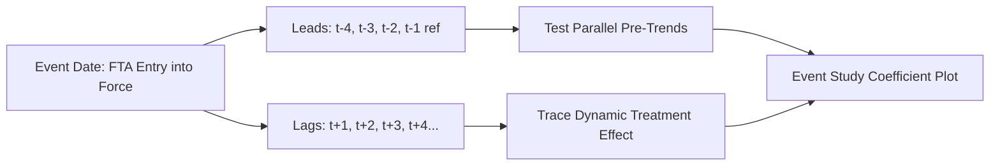
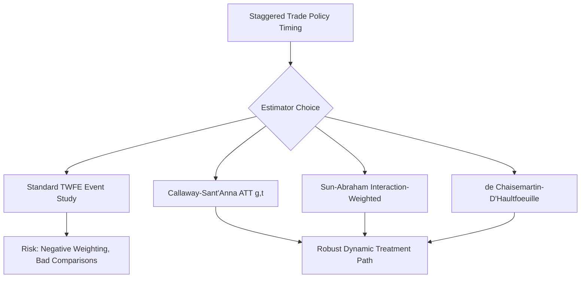

## Event Study Approaches to Trade Policy Changes

### Overview

Event study methods examine the dynamic response of an outcome variable (trade flows, stock returns, exchange rates, firm-level investment) around a specific, precisely-dated policy shock — a tariff announcement, an FTA entry into force, a trade war escalation, or a WTO accession. Unlike a single-coefficient DiD design, event studies estimate a full trajectory of effects before and after the event, making them well suited both for testing the parallel-trends identifying assumption and for characterizing how effects build up or dissipate over time.

### Core Specification

The canonical event-study regression replaces a single treatment indicator with a full set of leads and lags around the event date:

$$y_{it} = \alpha_i + \gamma_t + \sum_{k=-K, k \neq -1}^{L} \beta_k \, D_{i,t}^{k} + \varepsilon_{it}$$

where $D_{i,t}^{k}$ is an indicator equal to 1 if unit $i$ is $k$ periods away from its event date at time $t$, $\alpha_i$ and $\gamma_t$ are unit and time fixed effects, and the period immediately before treatment ($k=-1$) is typically omitted as the reference category.

**Key Points**

- The **leads** ($k<0$) test the pre-trends assumption: if $\beta_k$ for $k<0$ are jointly insignificant and near zero, this supports (but does not prove) the parallel trends assumption.
- The **lags** ($k \geq 0$) trace out the dynamic treatment effect path — whether the policy's impact grows, is immediate and constant, or fades over time.
- The reference period must be excluded to avoid perfect collinearity with the unit and time fixed effects; the choice of reference period is not innocuous and can affect the visual and statistical interpretation of the leads/lags plot (Sun & Abraham, 2021 discuss this "reference period" sensitivity in detail).



### Application to Trade Policy: Typical Design

#### Tariff or FTA Event Studies

- Outcome: log bilateral trade flows, firm-level exports, or import prices.
- Event: FTA signing/ratification date, WTO accession date, unilateral tariff imposition date (e.g., US Section 301 tariffs on China, 2018).
- Unit of analysis: country pair, product-country pair, or firm.
- Common finding pattern in the literature: trade flows often begin adjusting **before** formal implementation (anticipation effects from pre-announced tariff schedules or FTA ratification timelines), which is why leads are essential diagnostic tools rather than optional robustness checks.

#### Exchange Rate and Financial Market Event Studies

- Outcome: exchange rate returns, sovereign bond spreads, equity index returns around narrow event windows (days, sometimes intraday).
- Event: central bank announcements, trade policy announcements (e.g., tariff threat tweets/statements), currency interventions.
- Uses much shorter windows than trade-flow event studies (days rather than years), following the classic financial event-study methodology (MacKinlay, 1997) with abnormal returns computed relative to a market/factor model benchmark.

#### Firm-Level Event Studies

- Outcome: firm exports, investment, employment, stock returns.
- Event: firm-specific exposure to a tariff change (e.g., differential exposure based on pre-existing product mix or supply chain linkages — a "shift-share" or "exposure" design).
- Often combined with a **Bartik-style exposure measure**: interacting a firm's baseline exposure share to an affected product/country with the aggregate tariff shock, to generate continuous rather than binary treatment intensity.

### Staggered Timing and Modern Econometric Concerns

**Key Points**

- Trade policy events are frequently **staggered**: different countries join an FTA, get subjected to a tariff, or achieve WTO accession at different calendar times.
- Standard two-way fixed effects (TWFE) event-study specifications estimated on staggered data can produce **biased and even sign-reversed estimates** of the dynamic treatment path, because later-treated units can act as "already-treated" controls for earlier-treated units under heterogeneous treatment effects (Goodman-Bacon, 2021; Sun & Abraham, 2021).
- This has motivated a family of **heterogeneity-robust event-study estimators**:
  - **Callaway & Sant'Anna (2021)**: estimates group-time average treatment effects $ATT(g,t)$ using not-yet-treated or never-treated units as clean controls, then aggregates into an event-study-style dynamic path.
  - **Sun & Abraham (2021)**: an "interaction-weighted" estimator that corrects the standard TWFE event-study regression by appropriately re-weighting cohort-specific effects.
  - **de Chaisemartin & D'Haultfœuille (2020)**: proposes an alternative estimator (`did_multiplegt`) robust to heterogeneous and dynamic effects.
  - **Borusyak, Jaravel & Spiess (2024)**: an efficient "imputation" estimator constructing counterfactuals directly from a model estimated on untreated observations.
- Applied trade papers using staggered FTA/tariff timing increasingly report results from at least one of these robust estimators alongside (or instead of) standard TWFE, particularly since roughly 2021 onward. [Inference] — the pace and extent of this adoption varies by journal, subfield, and paper vintage, so treat this as a description of a trend rather than a universal current standard.



### Identification Assumptions

**Key Points**

- **Parallel trends**: absent the policy, treated and control units would have evolved similarly — partially testable via the pre-event leads.
- **No anticipation** (or explicitly modeled anticipation): if agents adjust behavior before the formal event date (common with pre-announced tariff schedules), the "true" event window must include the announcement date, not just implementation, or anticipation effects will contaminate the "pre-period" leads and bias inference on pre-trends.
- **No confounding events**: no other policy or shock coincides with the event date and differentially affects treated vs. control units — a particular concern in trade policy, where tariff changes are frequently bundled with other reforms (currency policy, export subsidies) or occur amid broader trade tensions affecting many partners simultaneously.
- **Stable unit treatment**: one unit's treatment status does not affect another's outcome — potentially violated in trade settings via general-equilibrium spillovers (e.g., trade diversion, where a tariff on country A's exports increases country B's exports to the same destination, contaminating B as a "control").

### Constructing and Reading the Event-Study Plot

**Example**

A typical event-study coefficient plot for an FTA event, reported with 95% confidence intervals:



```
Period relative     Coefficient      95% CI
to FTA entry         (beta_k)
-----------------------------------------------
t - 4                 0.01          [-0.03, 0.05]
t - 3                 0.02          [-0.02, 0.06]
t - 2                 0.00          [-0.03, 0.03]
t - 1 (reference)     0.00          (omitted)
t + 1                 0.08          [ 0.03, 0.13]
t + 2                 0.15          [ 0.09, 0.21]
t + 3                 0.19          [ 0.12, 0.26]
t + 4                 0.21          [ 0.13, 0.29]
```

Interpretation: leads near zero and statistically insignificant support the parallel-trends assumption; the growing sequence of positive, significant lag coefficients indicates a gradually building trade-creation effect from the FTA, consistent with a common empirical pattern of delayed adjustment in bilateral trade following agreement implementation. [Unverified] — this pattern is illustrative of commonly reported findings and not a guaranteed feature of any specific FTA event; actual dynamics vary substantially by agreement, sector, and country pair.

### Practical Estimation Notes

**Key Points**

- **Fixed effects**: pair (or firm) fixed effects and time fixed effects are standard; for gravity-style event studies, exporter-year and importer-year fixed effects are often layered in as well to control for multilateral resistance evolving over time.
- **Standard errors**: clustered at the unit level (pair, firm, or country) to account for serial correlation in the event-time indicators, which are themselves serially correlated by construction.
- **Binning endpoints**: leads/lags beyond a chosen window (e.g., $k < -4$ or $k > +6$) are often "binned" into a single indicator for the most distant periods, both to preserve degrees of freedom and to avoid extrapolating effects far from the event based on sparse observations.
- **Balanced vs. unbalanced panels around the event**: if the panel is unbalanced (units enter/exit the sample at different points relative to the event), composition changes can be mistaken for dynamic treatment effects — a particular risk in firm-level trade data with entry and exit.

### Comparison: Event Study vs. Standard DiD vs. Synthetic Control

| Feature | Standard DiD (2-period) | Event Study | Synthetic Control |
| --- | --- | --- | --- |
| Timing | Single pre/post comparison | Full dynamic path around event | Single treated unit vs. weighted synthetic comparator |
| Pre-trend testing | Not directly testable | Directly testable via leads | Visual fit assessment in pre-period |
| Best suited for | Simple, sharp binary treatment | Trade policy with rich time dimension | Single large treated unit (e.g., one country's major policy reform) |
| Staggered timing robustness | N/A (single period) | Requires heterogeneity-robust estimators | Less commonly extended to staggered multi-unit settings |

### Applications in Trade Policy Literature

**Key Points**

- US-China trade war (2018–2019): firm- and product-level event studies examining the response of import prices, trade volumes, and stock returns around tariff announcement and implementation dates.
- Brexit referendum and EU exit: event studies on UK-EU trade flows, investment, and financial market variables around the 2016 referendum and subsequent implementation milestones.
- WTO accession events (e.g., China's 2001 WTO accession): used to study dynamic trade creation and firm entry responses following accession.
- Regional trade agreement formation (NAFTA, EU enlargement rounds): dynamic trade-creation and trade-diversion effects traced via event-study leads/lags around ratification and phase-in dates.

**Related Topics**

- Difference-in-differences and staggered adoption bias (Goodman-Bacon decomposition)
- Heterogeneity-robust estimators: Callaway-Sant'Anna, Sun-Abraham, de Chaisemartin-D'Haultfœuille, Borusyak-Jaravel-Spiess
- Synthetic control methods for single-unit trade policy evaluation
- Panel data methods in international economics
- Structural gravity models and general equilibrium trade cost pass-through
- Anticipation effects and pre-announcement bias in policy evaluation
- Shift-share (Bartik) instrument designs for firm-level tariff exposure