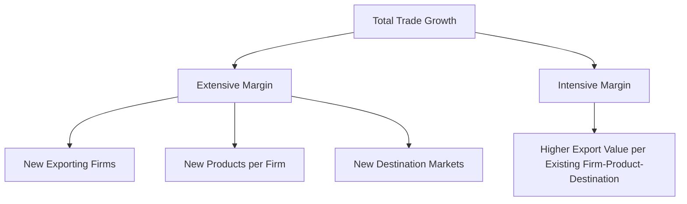
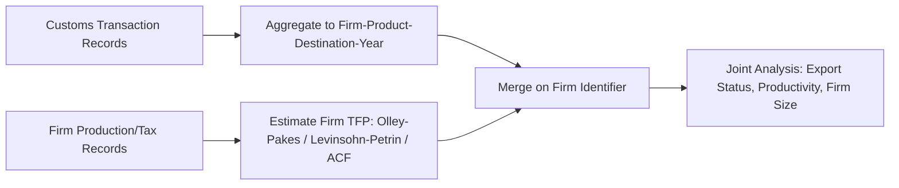

## Firm-Level and Transaction-Level Trade Data

### Overview

Firm-level and transaction-level (customs) trade data disaggregate international trade flows below the country-product level down to the individual exporting/importing firm, and in the most granular case, to the individual shipment or customs declaration. This granularity revealed empirical regularities invisible in aggregate data — most importantly, that only a small, systematically different subset of firms export — and became the primary evidentiary basis for the heterogeneous-firms trade literature (Melitz, 2003) and its empirical companions.

### Data Sources and Structure

#### Types of Micro-Level Trade Data

| Data Type | Granularity | Typical Source | Example Datasets |
| --- | --- | --- | --- |
| Customs transaction data | Shipment/declaration level | National customs authorities | US Census LFTTD, French customs (Douanes), Colombian DIAN records |
| Firm-trade linked data | Firm-year (aggregated across shipments) | Merged customs + firm registries/tax records | France (BRN + Douanes), Chile, Belgium firm-level datasets |
| Firm production + trade data | Firm-year, includes output, employment, capital | Merged customs + census/production surveys | US Longitudinal Business Database + trade data, Chilean ENIA + customs |
| Product-level import/export data | HS 6-digit or higher | UN Comtrade, BACI (CEPII), national customs aggregates | BACI, WITS/TRAINS |

**Key Points**

- Transaction-level data typically records: exporting/importing firm identifier, HS product code (often 8–10 digit national tariff-line detail, finer than the 6-digit international HS standard), destination/origin country, value, quantity, unit of measure, and transaction date.
- Firm-level (aggregated) data collapses transactions to the firm-year-destination-product level or coarser, often the level at which such data is made publicly available due to disclosure restrictions.
- Access to the most granular transaction-level data is typically restricted to secure research data centers (e.g., US Census Bureau Research Data Centers, INSEE-CASD in France) due to firm confidentiality requirements — public-use versions are usually aggregated or anonymized.

### Foundational Stylized Facts from Micro Trade Data

**Key Points**

- **Exporter rarity**: only a small share of firms in any economy export — commonly cited figures are in the range of a few percent to around 20% of firms depending on country and sector, [Unverified] — exact shares vary substantially by country, sector definition, and firm-size threshold, so treat specific percentages as illustrative rather than universal.
- **Exporter premia**: exporting firms are systematically larger, more productive, more capital- and skill-intensive, and pay higher wages than non-exporters within the same industry (Bernard & Jensen, 1995, 1999, for the US; replicated across many countries).
- **Extensive vs. intensive margins**: aggregate trade growth decomposes into growth from new firms/products entering trade (extensive margin) versus growth in trade volume among continuing exporters (intensive margin) — the relative importance of each margin is a central empirical question addressed with firm-level data (Bernard, Jensen, Redding & Schott review; Amiti & Freund on China's extensive margin).
- **Firm size distribution of exports is highly skewed**: a very small number of "superstar" firms typically account for a disproportionate share of aggregate exports (a well-documented "top-heavy" pattern in nearly every country studied) — motivating models with granular/idiosyncratic firm shocks affecting aggregate trade and exchange rate dynamics (Gabaix's granular hypothesis, di Giovanni & Levchenko applications to trade).
- **Multi-product, multi-destination exporting**: most exporting firms sell multiple products to multiple destinations, and firms tend to export their "core" (best-selling) products to more markets — a pattern central to multi-product firm trade models (Bernard, Redding & Schott, 2011; Mayer, Melitz & Ottaviano, 2014 on "market size and the trade of core competencies").

### Key Empirical Applications

#### Testing and Estimating Heterogeneous-Firm Trade Models

- Firm-level export participation, export value distributions, and destination-count patterns are used to estimate or calibrate Melitz-type model parameters: the Pareto shape parameter of the productivity distribution, fixed costs of exporting, and the elasticity of substitution.
- Estimation approaches include Simulated Method of Moments (matching moments like the share of exporters, the exporter size premium, or the destination-count distribution) and semi-parametric methods exploiting the structure of firm entry/exit decisions.

#### Trade Policy Pass-Through and Incidence

- Transaction-level import data with prices (unit values) allows direct estimation of exchange rate and tariff pass-through into firm-level import/export prices, avoiding the aggregation bias inherent in country-level price indices.
- Enables study of **incomplete pass-through** and the role of markups, marginal cost variation, and pricing-to-market at the firm-product level (Amiti, Itskhoki & Konings, 2014, on Belgian firm-level exchange rate pass-through).

#### Trade War / Tariff Incidence Studies

- Firm- and product-level US import data (US Census LFTTD, alongside HTS tariff schedules) has been the primary data source for measuring the incidence of 2018–2019 US-China tariffs — a widely cited finding is that tariffs were passed through nearly completely to US import prices, implying the cost burden fell largely on US importers/consumers rather than foreign exporters (Amiti, Redding & Weinstein, 2019; Fajgelbaum et al., 2020). [Unverified] — the precise pass-through magnitude and welfare cost estimates vary by study, product coverage, and time period, so treat specific point estimates as illustrative of a broader finding rather than a single settled number.

#### Global Value Chains and Input-Output Linkages

- Firm-transaction data increasingly links imports of intermediate inputs to firm-level export outcomes, informing research on how import liberalization affects downstream firm productivity and export performance (Goldberg, Khandelwal, Pavcnik & Topalova, 2010, on Indian trade liberalization).
- Customs data with product-level detail supports "carbon content of trade," "value-added trade," and GVC positioning analyses when merged with input-output tables.

### Empirical Methods Specific to Micro Trade Data

#### Handling the Extensive Margin and Zeros

- Firm-level trade data has a very high share of zero trade values (most firms do not export to most destinations in most periods) — this motivates the same set of tools discussed under structural gravity estimation (PPML, Heckman-type selection corrections), but applied at the firm rather than country level.
- **Helpman-Melitz-Rubinstein (2008)** two-stage selection correction is commonly adapted to firm-level export participation decisions, modeling the firm's binary export decision in a first stage and the trade value equation in a second stage, correcting for selection into exporting.

#### Firm Fixed Effects and Within-Firm Estimation

- Firm-year-destination panels allow inclusion of firm fixed effects, isolating within-firm variation in export behavior over time from cross-sectional differences in average firm characteristics — critical for causal identification of how firm-level shocks (a real exchange rate movement, a tariff change, an import cost shock) affect export decisions.
- Common specification:

$$\ln(X_{fdt}) = \alpha_f + \gamma_{dt} + \beta \, Z_{fdt} + \varepsilon_{fdt}$$

where $\alpha_f$ is a firm fixed effect, $\gamma_{dt}$ is a destination-year fixed effect (absorbing destination-specific demand shocks), and $Z_{fdt}$ is the firm-level shock of interest.

#### Matching Firm Trade Data to Production/Balance Sheet Data

- Merging customs records with firm production census or tax data enables joint analysis of trade and productivity, requiring a common firm identifier (tax ID, business registry number) and careful reconciliation of reporting periods and firm entity definitions (parent vs. establishment level).
- A frequent methodological concern is **measurement of firm-level productivity** itself (TFP estimation via Olley-Pakes, Levinsohn-Petrin, or Ackerberg-Caves-Frazer methods) before relating it to trade participation, since naive OLS productivity estimates suffer from simultaneity bias between input choices and productivity shocks.

### Practical Data Challenges

**Key Points**

- **Firm identifier consistency**: firm IDs can change due to mergers, restructuring, or administrative re-registration, requiring identifier-cleaning algorithms to construct consistent firm panels over time.
- **Intermediary/wholesaler trade**: a meaningful share of recorded "exporters" in customs data are trading intermediaries or wholesalers rather than producing firms, complicating the interpretation of "exporter premia" if not separately identified (Bernard, Grazzi & Tomasi, 2015, on the role of wholesalers in French trade data).
- **Unit value as a price proxy**: transaction "unit values" (value divided by quantity) are commonly used as price proxies but conflate genuine price variation with quality/composition variation within an HS code, a well-known measurement concern (Hallak & Schott, 2011).
- **Confidentiality and access restrictions**: most transaction-level datasets require researcher access agreements, on-site or remote secure data enclaves, and disclosure review of any output statistics — a practical constraint on replicability and multi-country comparative work.
- **Reconciling customs product classifications across countries**: national tariff-line classifications (8–10 digit) do not always concord cleanly to the international 6-digit HS standard or across countries' own national extensions, requiring concordance tables and careful handling of classification revisions over time (HS revisions occur roughly every 5 years).

### Illustrative Firm-Level Regression Table Structure

**Example**

A typical exporter premium regression using firm-level data, following Bernard-Jensen-style specifications:

$$\ln(Y_f) = \alpha + \beta \, \text{Exporter}_f + \delta \, X_f + \gamma_s + \varepsilon_f$$

| Dependent Variable | Exporter Premium (β), illustrative | Notes |
| --- | --- | --- |
| log(Employment) | positive, economically large | Exporters systematically larger |
| log(Value Added per Worker) | positive | Productivity premium |
| log(Average Wage) | positive | Wage premium, often linked to skill intensity |
| Capital per Worker | positive | Capital intensity premium |

Coefficients are illustrative of a widely replicated qualitative pattern across countries; [Unverified] exact magnitudes are highly country-, sector-, and period-specific and should be drawn from the specific dataset/study in question rather than treated as universal constants.

### Comparison: Firm-Level vs. Aggregate Trade Data for Research Design

| Dimension | Aggregate (Country-Product) Data | Firm/Transaction-Level Data |
| --- | --- | --- |
| Extensive margin visibility | Not observable | Directly observable (firm entry/exit) |
| Heterogeneity | Averaged away | Directly estimable (productivity, size dispersion) |
| Selection bias risk | Cannot correct for firm-level selection | Can model firm-level selection explicitly (HMR-type corrections) |
| Computational/access burden | Low; publicly available (Comtrade, BACI) | High; often requires secure enclave access |
| Suitable for | Gravity model estimation, macro trade elasticities | Heterogeneous-firm model estimation, pass-through, GVC analysis |

**Related Topics**

- Melitz (2003) heterogeneous firms model and its structural estimation
- Extensive vs. intensive margin decompositions of trade growth
- Exchange rate and tariff pass-through at the firm level
- Firm-level productivity estimation methods (Olley-Pakes, Levinsohn-Petrin, Ackerberg-Caves-Frazer)
- Multi-product firm trade models and "core competency" export patterns
- Global value chains and firm-level input-output linkages
- US-China trade war tariff incidence studies using customs microdata
- Helpman-Melitz-Rubinstein selection correction applied to firm-level export decisions