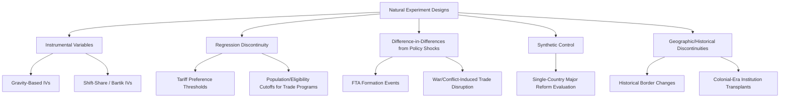
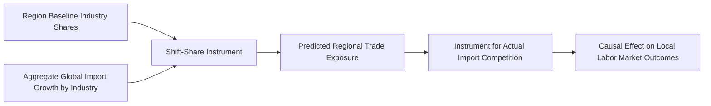

## Natural Experiments in Economics Research


### Overview

A natural experiment exploits an exogenous, quasi-random event or policy discontinuity that generates variation in treatment exposure not driven by the choices of the economic agents under study. In international economics, natural experiments are the primary route to causal identification when randomized controlled trials are infeasible at the scale of countries, tariffs, exchange rate regimes, or trade agreements — leveraging wars, geographic accidents, arbitrary policy thresholds, or historically-driven trade cost variation as sources of "as-if random" variation.

### Why Natural Experiments Matter in International Economics

**Key Points**

- Nearly all first-order questions in international economics (does trade cause growth? does exchange rate policy affect the current account? does an FTA cause welfare gains?) suffer from **severe endogeneity**: countries do not choose trade policy, exchange rate regimes, or FTA membership randomly — these choices are correlated with unobserved determinants of the outcome itself.
- Natural experiments provide identification by locating variation that is plausibly unrelated to these confounding forces, approximating the logic of a randomized experiment without an experimenter.
- The credibility of any natural-experiment design rests entirely on the plausibility of its exclusion restriction or exogeneity claim — this makes the **institutional narrative** justifying "why this variation is as-if random" as important as the statistical methodology itself.

### Taxonomy of Natural Experiment Designs



### Instrumental Variables Approaches

#### Gravity-Based and Geographic Instruments

- Exploits the fact that bilateral distance, common language, colonial history, and other gravity-model geographic variables are plausibly exogenous to current trade policy outcomes, and can instrument for endogenous trade volumes in growth regressions.
- **Frankel & Romer (1999)**: constructs a "geography-predicted trade" instrument (predicted bilateral trade based purely on distance, population, and land area, aggregated to a country's total predicted trade share) to instrument for actual trade openness in cross-country growth regressions, addressing the reverse-causality concern that growth itself may cause trade.
- Criticism and refinements: subsequent work questions whether geography-based instruments satisfy the exclusion restriction, since geography may affect growth through channels other than trade (institutions, disease environment) — motivating more granular, sector- or bilateral-specific instruments in later work.

#### Shift-Share (Bartik) Instruments

- Constructs an instrument by interacting a unit's **initial/baseline exposure share** to a set of categories (e.g., a region's initial industry mix, a firm's initial product mix) with an **aggregate, plausibly exogenous shock** common to each category (e.g., a global tariff change, a national-level import cost shock).

$$Z_{it} = \sum_{k} s_{ik,0} \times g_{kt}$$

where $s_{ik,0}$ is unit $i$'s baseline share in category $k$ and $g_{kt}$ is the aggregate national/global shock to category $k$ at time $t$.

- The classic international trade application: the **"China shock" instrument** (Autor, Dorn & Hanson, 2013) instruments for a US region's exposure to Chinese import competition using the region's initial industry employment shares interacted with import growth in *other* high-income countries (to avoid contamination from US-specific demand shocks), identifying the local labor market effects of trade exposure.
- Identification in shift-share designs has been shown to rest critically on either the exogeneity of the shares or the exogeneity of the shocks (Goldsmith-Pinkham, Sorkin & Swift, 2020; Borusyak, Hull & Jaravel, 2022) — a substantial recent econometric literature has refined the conditions under which shift-share instruments are valid, generally emphasizing that the identifying assumption should be framed around the exogeneity of the underlying shocks rather than the shares.



#### Historical and Persistence-Based Instruments

- Uses historically determined variation (colonial-era institutions, historical trade routes, pre-existing ethnic/linguistic linkages) to instrument for contemporary trade costs or institutional quality, under the assumption that historical shocks affect current outcomes only through the channel of interest.
- Example logic: distance to historically navigable rivers or coastlines instrumenting for contemporary trade costs, or colonial-origin legal systems instrumenting for institutional quality in trade-and-institutions research (in the spirit of Acemoglu, Johnson & Robinson, 2001, applied to trade contexts).

### Regression Discontinuity Designs (RDD) in Trade Policy

**Key Points**

- Exploits **sharp eligibility thresholds** in trade policy — for instance, tariff preference programs (GSP, AGOA) with arbitrary product- or country-eligibility cutoffs, or income-based thresholds determining eligibility for preferential trade treatment.
- Compares outcomes for units just above vs. just below the threshold, under the assumption that units are otherwise similar except for treatment status — validity requires that units cannot precisely manipulate their position relative to the cutoff.
- Example: research using product-level thresholds in preferential tariff schemes (e.g., de minimis import value thresholds, GSP graduation thresholds based on per-capita income or export value) to estimate causal effects of tariff preferences on export growth.
- **Threats to validity**: policy thresholds are sometimes set with knowledge of underlying economic characteristics (defeating the "as-if random" assumption near the cutoff), and strategic sorting/manipulation around trade-preference thresholds (e.g., firms artificially adjusting export values to stay below a threshold) is a documented concern requiring density (McCrary-type) manipulation tests. [Inference] — the specific degree of manipulation risk depends heavily on the policy design and enforcement context, so this should be checked empirically in each application rather than assumed.

### Natural Experiments from Wars, Conflicts, and Trade Disruptions

**Key Points**

- Wars, blockades, and sudden diplomatic ruptures generate sharp, arguably exogenous (from the perspective of the affected trade relationship) disruptions to bilateral trade costs, used to estimate trade cost elasticities or the gains from trade.
- Classic applications: the reunification of Germany, the dissolution of the Soviet Union and the sudden collapse of intra-COMECON trade, the Suez Canal closures, and WWI/WWII-era trade disruptions have all been used as natural experiments to identify trade cost elasticities and trade's contribution to income (e.g., Glick & Taylor, 2010, on the wartime trade disruption).
- The India-Pakistan partition and border trade cutoffs, and more recent Russia-Ukraine war sanctions and trade rerouting, are used similarly as natural experiments for studying trade cost pass-through, resilience, and rerouting patterns.

### Synthetic Control Method

- Constructs a "synthetic" counterfactual for a single treated unit (a country undergoing a major policy reform, currency union entry, or trade liberalization) as a weighted average of untreated "donor pool" units, chosen to match the treated unit's pre-treatment outcome trajectory as closely as possible.
- Particularly suited to international economics questions where the treated unit is a single country and no natural comparison group exists (Abadie, Diamond & Hainmueller, 2015, methodology; applications include estimating the economic costs of German reunification, or the effect of a specific country's currency union entry or major trade liberalization episode).
- Formal weight-construction:

$$\hat{W}^{*} = \arg\min_{W} \left\| X_1 - X_0 W \right\|$$

subject to non-negativity and adding-up constraints on the weight vector $W$, where $X_1$ is the treated unit's pre-treatment characteristics/outcomes and $X_0$ is the matrix of donor pool units' corresponding values.

- **Inference** in synthetic control settings typically relies on placebo/permutation tests (applying the same procedure to untreated donor units and comparing the magnitude of the "placebo effect" to the actual treated-unit effect) rather than conventional standard errors, due to the single-treated-unit setting.

### Comparison of Natural Experiment Designs

| Design | Source of Identifying Variation | Typical International Economics Application | Main Threat to Validity |
| --- | --- | --- | --- |
| IV (gravity/geography) | Exogenous geographic/historical variation | Trade-and-growth causal estimation | Exclusion restriction violations (geography affects growth via other channels) |
| Shift-share (Bartik) | Baseline exposure shares × aggregate shocks | Local labor market effects of import competition | Share endogeneity, correlated aggregate shocks |
| RDD | Sharp policy eligibility thresholds | Tariff preference program effects | Manipulation/sorting around the threshold |
| War/conflict disruption | Sudden, large exogenous trade cost shock | Trade elasticity and gains-from-trade estimation | Confounding contemporaneous shocks (e.g., broader economic collapse) |
| Synthetic control | Weighted comparison unit construction | Single-country major reform evaluation | Donor pool quality, pre-treatment fit adequacy |

### Practical Example: Constructing a Shift-Share Trade Exposure Measure

**Example**

Conceptual construction of a regional import-competition exposure instrument (in the spirit of Autor-Dorn-Hanson):



```
Step 1: Compute region r's baseline (year 0) employment share in industry k:
        share_rk0 = Employment_rk0 / Employment_r0

Step 2: Compute the change in imports from China in industry k, 
        measured using OTHER high-income countries' import growth 
        (to avoid reverse causality from US-specific demand shocks):
        ΔImport_k = ΔImports_China_to_OtherHighIncomeCountries_k

Step 3: Construct the shift-share instrument:
        Z_r = Σ_k share_rk0 × ΔImport_k

Step 4: Use Z_r as an instrument for the actual regional change 
        in Chinese import exposure in a 2SLS regression of local 
        labor market outcomes (employment, wages) on import exposure.
```

### Key Methodological Concerns Across Natural Experiment Designs

**Key Points**

- **Exclusion restriction plausibility** is always the central, non-statistically-testable assumption — no formal test can fully validate an instrument's exogeneity; researchers instead present institutional narrative, placebo tests, and overidentification tests (where multiple instruments are available) as supporting (not conclusive) evidence.
- **External validity**: natural experiments, by construction, identify a **Local Average Treatment Effect (LATE)** — the effect for the specific subpopulation whose treatment status was affected by the instrument or discontinuity — which may not generalize to the full population of interest or to different policy counterfactuals.
- **Weak instrument concerns**: gravity- and geography-based instruments in cross-country growth regressions have sometimes been criticized for weak first-stage power, requiring weak-instrument-robust inference methods (e.g., Anderson-Rubin confidence sets).
- **Pre-trend and placebo testing** remain essential complements to nearly all natural-experiment designs (DiD-based, synthetic control, shift-share) to bolster the credibility of the "as-if random" claim.

**Related Topics**

- Instrumental variables and two-stage least squares in cross-country regressions
- Shift-share (Bartik) instrument validity and recent econometric critiques
- Regression discontinuity design methodology and manipulation testing
- Synthetic control method and placebo inference
- Event study approaches to trade policy changes
- The "China shock" literature and local labor market effects of trade
- Gravity models and geography-based instruments for trade and growth
- War, conflict, and historical trade disruption as sources of identification