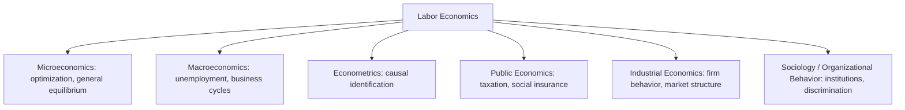

## Scope and Methodology of Labor Economics

### Definition and Disciplinary Scope

Labor economics is the branch of economics studying the functioning and dynamics of markets for labor services — the exchange of work effort, skill, and time for wages, salaries, and non-wage compensation. It examines the behavior of two principal agents: **workers** (or households, as suppliers of labor) and **firms** (as demanders of labor), along with the institutions — unions, government agencies, regulatory bodies — that shape the terms of that exchange.

The discipline's scope spans several interlocking domains:

- **Labor supply**: how individuals and households allocate time between market work, non-market work (e.g., home production), and leisure, given wages, non-labor income, and preferences.
- **Labor demand**: how firms decide how much labor to hire, at what skill mix, given output prices, technology, and the cost of labor relative to capital.
- **Wage determination**: how supply and demand interact — under competitive and non-competitive conditions — to set wage levels and wage structures (differentials by education, experience, occupation, industry, geography, gender, and race).
- **Human capital formation**: investment in education, training, and health as determinants of productivity and earnings over the life cycle.
- **Labor market institutions**: unions, minimum wage laws, employment protection legislation, collective bargaining, and social insurance programs (unemployment insurance, disability insurance).
- **Unemployment and labor market dynamics**: job search, matching frictions, turnover, and the cyclical and structural determinants of unemployment.
- **Personnel economics**: internal firm decisions about compensation design, incentive contracts, promotion ladders, and workforce composition.

Labor economics sits at the intersection of microeconomics (individual and firm optimization), macroeconomics (aggregate employment and unemployment), and applied econometrics (given the field's heavy reliance on empirical identification of causal effects).

### Methodological Foundations

**Theoretical methodology.** Labor economics is built on a core of neoclassical optimization models:

- The labor supply model treats the worker as maximizing utility $U(C, L)$ over consumption $C$ and leisure $L$ subject to a time and budget constraint, generating the classic income and substitution effect decomposition of the labor supply response to wage changes.
- The labor demand model treats the firm as maximizing profit, choosing labor input where the value of the marginal product of labor equals the wage: $VMP_L = w$, under short-run (fixed capital) and long-run (variable capital) production structures.
- Human capital theory (Becker, Mincer) models schooling and training as investments with costs (foregone earnings, tuition) and returns (higher future wages), yielding the Mincerian earnings equation as a canonical empirical specification:

$$\ln(w_i) = \beta_0 + \beta_1 S_i + \beta_2 X_i + \beta_3 X_i^2 + \epsilon_i$$

where $S_i$ is years of schooling, $X_i$ is labor market experience, and the quadratic in experience captures the concave age-earnings profile.

These models are frequently extended to incorporate **imperfect competition** (monopsony), **asymmetric information** (signaling, screening, adverse selection in hiring), and **search frictions** (Diamond-Mortensen-Pissarides matching models), since real labor markets routinely violate the frictionless competitive benchmark.

**Empirical methodology.** Labor economics is widely regarded as a leading field in the development and application of microeconometric identification strategies, largely because labor questions (the effect of schooling on wages, the effect of minimum wage on employment, the effect of unions on pay) are inherently plagued by selection bias, reverse causality, and omitted variable bias. Core empirical tools include:

- **Instrumental variables (IV)**: exploiting exogenous variation (e.g., compulsory schooling laws, draft lottery numbers, quarter-of-birth) to identify causal effects of endogenous regressors like education.
- **Difference-in-differences (DiD)**: comparing outcome changes across treated and untreated groups before and after a policy change (e.g., a state minimum wage increase), foundational to the Card-Krueger minimum wage debates.
- **Regression discontinuity design (RDD)**: exploiting sharp eligibility cutoffs (e.g., unemployment insurance benefit thresholds) to estimate local causal effects.
- **Natural and field experiments**: using policy discontinuities or randomized interventions (e.g., job training program evaluations) as quasi-experimental or experimental variation.
- **Structural estimation**: fully specifying and estimating dynamic optimization models (e.g., search-and-matching models) to recover deep parameters and conduct counterfactual policy simulation, as opposed to the "reduced-form" approach of the tools above.

[Inference] The field's methodological identity has shifted markedly since the 1990s toward what is often called the "credibility revolution," prioritizing quasi-experimental identification over purely structural or theoretical modeling, though structural methods remain active, particularly in search-and-matching and dynamic labor supply research.

### Data Sources Characteristic of the Field

Labor economics is unusually data-intensive relative to other economics subfields, drawing on:

- **Household/individual surveys**: e.g., the Current Population Survey (CPS), Panel Study of Income Dynamics (PSID), and their international analogs — providing repeated cross-sections or panel data on employment, wages, and demographics.
- **Administrative records**: matched employer-employee data (e.g., unemployment insurance wage records, social security earnings histories), which minimize measurement error and allow linkage of worker and firm outcomes.
- **Establishment surveys**: firm-level data on employment, wages, and vacancies (e.g., the Job Openings and Labor Turnover Survey, JOLTS).

### Relationship to Adjacent Fields

Labor economics distinguishes itself from **industrial economics** in that industrial economics centers on firm and market structure in *output* markets (pricing, entry, competition among sellers of goods), whereas labor economics centers on the market for the *input* of labor itself — though personnel economics and the theory of the firm create substantial methodological overlap between the two.

### Key Points

- Labor economics studies the supply of, demand for, and price (wage) of labor services, plus the institutions mediating that exchange.
- Its theoretical core rests on constrained optimization by workers and firms, extended to accommodate frictions and imperfect competition.
- Its empirical core is defined by quasi-experimental identification strategies (IV, DiD, RDD) developed partly *in* labor economics and later exported to the rest of applied microeconomics.
- The field draws heavily on large-scale survey and administrative microdata, distinguishing its empirical culture from more theory-driven subfields.

**Related Topics**

- Historical Evolution of Labor Economics as a Discipline
- Neoclassical Labor Supply Theory (Income and Substitution Effects)
- Labor Demand and the Elasticity of Substitution
- Human Capital Theory (Becker, Mincer, Ben-Porath model)
- Search and Matching Models (Diamond-Mortensen-Pissarides)
- Monopsony and Imperfect Competition in Labor Markets
- The Credibility Revolution in Applied Microeconometrics