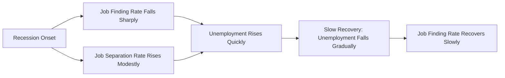

## Stylized Facts About Labor Markets

### Purpose of Stylized Facts in Labor Economics

Stylized facts are broad, empirically robust regularities that hold across time periods, countries, and datasets closely enough to serve as the phenomena a theory of labor markets must be able to explain. They function as the discipline's empirical benchmarks: a labor supply model, a search-and-matching model, or a wage-setting theory is judged in part by whether it can reproduce these patterns. The facts below are grouped by domain.

### Employment and Unemployment Dynamics

- **Unemployment is persistent and serially correlated.** Unemployment rates move slowly and show strong positive autocorrelation; sharp reversals are rare outside major recessions.
- **Unemployment is strongly procyclical in its comovement with output, and countercyclical in level.** Unemployment rises sharply during recessions and falls more gradually during expansions — an asymmetry sometimes summarized as "unemployment rises like a rocket, falls like a feather."
- **Job finding rates are far more volatile than job separation rates over the business cycle.** [Inference] This finding, most closely associated with Shimer's (2005) critique of standard search-and-matching calibrations, implies that cyclical unemployment fluctuations are driven primarily by changes in the rate at which unemployed workers find jobs rather than by changes in the rate at which employed workers lose them, though the relative contribution of each margin remains debated in the literature.
- **Gross worker flows are large relative to net changes in employment.** Even when aggregate employment is stable, there is substantial simultaneous hiring and separation ("job creation and destruction" or "churn"), documented extensively in matched employer-employee data (e.g., Davis-Haltiwanger-Schuh job flows literature).
- **The Beveridge curve exhibits a stable negative relationship** between the unemployment rate and the job vacancy rate, though it can shift outward (indicating reduced matching efficiency) during and after major downturns.

### Wage Behavior

- **Nominal wages are downwardly rigid.** Nominal wage cuts are empirically rare even during recessions; adjustment tends to occur through wage freezes, reduced wage growth, or compositional shifts rather than outright cuts, consistent with menu-cost and morale-based efficiency wage theories.
- **Real wages are only mildly procyclical, and considerably less volatile than employment.** This weak cyclicality of measured real wages, relative to the volatility of hours and employment, was a central puzzle motivating real business cycle and search-theoretic labor models.
- **The college wage premium has risen substantially since the 1980s** in the United States and most other advanced economies, reflecting skill-biased technical change interacting with the relative supply of skilled labor.
- **Wage inequality has increased**, with widening gaps both between and within observable skill/education/experience groups ("residual" or "within-group" inequality), a pattern central to the polarization and skill-biased technical change literatures.
- **Wages rise with tenure and experience but at a decreasing rate**, consistent with a concave Mincerian age-earnings profile and human capital accumulation with diminishing returns.

### Labor Supply Patterns

- **Labor force participation among prime-age men has declined gradually over recent decades** across most advanced economies, a trend only partially explained by disability, incarceration, and opioid-related factors in the U.S. context. [Unverified] The relative weight of these explanatory channels is actively contested in the empirical literature.
- **Female labor force participation rose sharply through the late 20th century** before flattening or, in some countries, mildly declining in recent years — attributed to rising education, fertility decline, contraceptive access, and changing social norms.
- **Hours worked per employed person have declined secularly** over the long run (the 19th-to-20th century decline in the standard workweek), while remaining comparatively stable over shorter horizons.
- **Labor supply elasticities differ systematically by demographic group**: married women historically exhibit higher labor supply elasticities than prime-age men, though this gap has narrowed over time as female labor force attachment has strengthened.

### Structural and Cross-Sectional Patterns

- **Wage differentials by industry and firm persist even after controlling for observable worker characteristics** ("inter-industry wage differentials"), a finding difficult to reconcile with a purely competitive spot-labor-market model and often cited as evidence for efficiency wages or rent-sharing.
- **Large firms pay higher wages than small firms for observably similar workers** (the "firm-size wage premium"), robust across countries and time periods.
- **Job-to-job transitions are procyclical**, rising in expansions as outside options improve and falling in recessions, a pattern central to job-ladder models of wage growth.
- **A substantial and persistent gender wage gap exists** even after controlling for education, experience, and occupation, with the unexplained residual commonly attributed to some combination of discrimination, compensating differentials, and unobserved preference or productivity differences.

### Visual Summary

### Key Points

- Stylized facts serve as the empirical discipline that theoretical labor market models must satisfy.
- Unemployment dynamics are asymmetric and driven predominantly by job-finding rather than job-separation volatility.
- Nominal wage rigidity and muted real wage cyclicality are central, still partially unresolved puzzles.
- Rising wage inequality, a persistent gender wage gap, and firm-size/industry wage premia are robust cross-sectional regularities inconsistent with the simplest competitive spot-market model.

**Related Topics**

- The Beveridge Curve and Matching Efficiency
- Shimer's Unemployment Volatility Puzzle
- Nominal Wage Rigidity and Efficiency Wage Theory
- Skill-Biased Technical Change and Wage Polarization
- Job Ladder Models and On-the-Job Search
- Decomposing the Gender Wage Gap (Oaxaca-Blinder and Extensions)