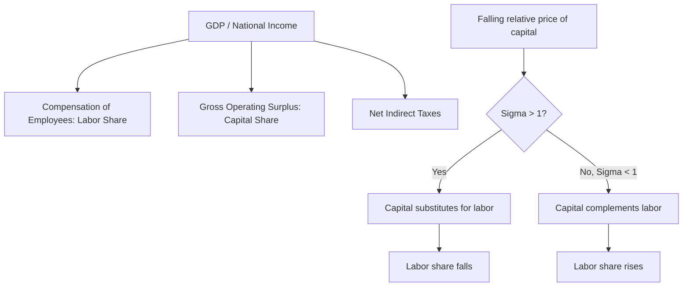

## National Income Accounting and Labor's Share

### National Income Accounting Framework

National income accounting decomposes aggregate output into the incomes earned by the factors of production that generated it. In the standard framework, Gross Domestic Product (GDP), measured via the income approach, equals the sum of compensation of employees, gross operating surplus (returns to capital, including corporate profits and depreciation), and taxes on production and imports net of subsidies:

$$Y = W + R + T$$

where $W$ is aggregate labor compensation, $R$ is aggregate capital income (broadly defined), and $T$ is net indirect taxes. This identity is the accounting foundation for defining the **labor share of income**.

### Defining the Labor Share

The labor share is the fraction of national or aggregate output paid out as compensation to labor, rather than to capital:

$$\text{Labor Share} = \frac{W}{Y} = \frac{\text{Compensation of Employees}}{\text{GDP (or National Income)}}$$

**Measurement variants and their complications:**

- **Numerator scope**: "Compensation of employees" typically includes wages, salaries, employer-paid benefits, and employer payroll tax contributions. Some measures also attempt to impute a labor-income component of proprietors' (self-employed) income, since national accounts often classify all proprietors' income as "mixed income" combining returns to the proprietor's labor and capital — a classification ambiguity that materially affects labor share estimates depending on the imputation method.
- **Denominator scope**: labor share can be computed relative to GDP, to GDP net of depreciation (Net Domestic Product), or to value added in a specific sector (e.g., the nonfarm business sector, the standard scope used in most U.S. labor share research to avoid volatility from agriculture and imputed housing rents).
- **Housing and public sector adjustments**: imputed rental income of owner-occupied housing and government compensation (which is definitionally 100% labor share by national accounting convention) can distort economy-wide labor share measures, motivating the common focus on the private nonfarm business sector.

### The Historical "Stability" of Labor's Share and Its Breakdown

For much of the 20th century, the constancy of the labor share across time was treated as one of the primary stylized facts of macroeconomics — enshrined in Kaldor's (1957) list of stylized growth facts and consistent with a Cobb-Douglas aggregate production function:

$$Y = A K^{\alpha} L^{1-\alpha}$$

Under Cobb-Douglas technology with competitive factor markets, the labor share is constant and equal to $(1-\alpha)$ regardless of the capital-labor ratio, because the elasticity of substitution between capital and labor is exactly 1.

Since roughly the early 1980s (accelerating from the mid-1990s/2000s), labor share has declined across most advanced economies and many emerging economies — a break from the historical stylization now central to research on rising inequality. [Inference] The precise magnitude and even the direction of the trend vary by measurement choice (proprietor income imputation, sectoral scope, housing treatment), so cross-study comparisons require care about which labor share series is being cited.

### Leading Explanations for the Decline

- **Capital-augmenting technical change with elasticity of substitution above 1.** If capital and labor are more substitutable than Cobb-Douglas implies ($\sigma > 1$), a falling relative price of capital equipment (driven by IT and automation) leads firms to substitute toward capital, mechanically lowering labor share.
- **Rising market concentration and markups.** [Inference] A body of research (notably associated with De Loecker and Eeckhout) attributes declining labor share partly to rising firm markups and market power, as firms with pricing power capture a larger wedge between price and marginal cost, though the magnitude of this channel relative to alternatives remains actively debated.
- **Globalization and offshoring.** Trade integration, particularly the entry of China and other emerging economies into global supply chains, may have shifted labor-intensive production abroad, altering the domestic capital-labor mix in advanced economies.
- **Decline in labor bargaining power.** Falling unionization rates, weakening labor market institutions, and rising employer concentration (monopsony power) reduce workers' ability to capture a constant share of surplus, independent of technology.
- **Superstar firm dynamics.** [Inference] The reallocation of economic activity toward a small number of highly productive, capital-light "superstar" firms with naturally lower labor shares can lower the aggregate labor share through composition effects even if no individual firm's labor share changes, a mechanism proposed by Autor, Dorn, Katz, Patterson, and Van Reenen; this remains one of several competing, only partially reconciled explanations rather than a settled consensus.

### Labor Share and the Elasticity of Substitution

The behavior of labor share under a general CES (constant elasticity of substitution) production function clarifies the theoretical stakes:

$$Y = \left[\alpha K^{\frac{\sigma-1}{\sigma}} + (1-\alpha) L^{\frac{\sigma-1}{\sigma}}\right]^{\frac{\sigma}{\sigma-1}}$$

- If $\sigma = 1$ (Cobb-Douglas): labor share is invariant to the capital-labor ratio.
- If $\sigma > 1$: capital and labor are relatively easy substitutes, and capital deepening (rising $K/L$) *reduces* labor share.
- If $\sigma < 1$: capital and labor are relative complements, and capital deepening *increases* labor share.

The empirically estimated value of $\sigma$ for the aggregate U.S. and global economy is a long-standing and only partially resolved econometric question, with most recent estimates clustering modestly above 1, which is consistent with — though not sufficient on its own to fully explain — the observed labor share decline.

### Visual Summary

### Key Points

- Labor share is defined as aggregate labor compensation divided by aggregate output, and is highly sensitive to accounting choices around proprietor income, sectoral scope, and housing.
- The historical near-constancy of labor share, a canonical Kaldor fact consistent with Cobb-Douglas technology, has broken down since the 1980s/2000s across most advanced economies.
- Competing (non-mutually-exclusive) explanations include capital-biased technical change with $\sigma > 1$, rising markups/market power, globalization, declining labor bargaining power, and superstar-firm reallocation.
- The economy-wide elasticity of substitution between capital and labor is the central theoretical parameter determining the sign of labor share's response to capital deepening.

**Related Topics**

- Cobb-Douglas vs. CES Production Functions in Macro-Labor Models
- The Superstar Firm Hypothesis (Autor et al.)
- Markups, Market Power, and the De Loecker-Eeckhout Debate
- Monopsony Power and Labor's Bargaining Share
- Proprietor Income Imputation Methods in Labor Share Measurement