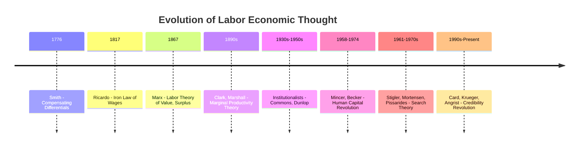

## History of Labor Economic Thought

### Classical Political Economy: Labor as the Source of Value

The earliest systematic treatment of labor in economics arose from classical political economy's concern with value and distribution rather than labor markets per se.

- **Adam Smith** (*Wealth of Nations*, 1776) introduced the division of labor as the primary engine of productivity growth and discussed compensating wage differentials — the idea that wages must adjust to offset non-pecuniary differences across jobs (danger, unpleasantness, required skill), a concept still central to modern labor economics.
- **David Ricardo** formalized the labor theory of value and the "iron law of wages," under which wages tend toward a subsistence level determined by population dynamics (drawing on Malthusian population theory), with any wage above subsistence triggering population growth that drives wages back down.
- **Karl Marx** extended the labor theory of value into a theory of exploitation, arguing that the difference between the value labor creates and the wage paid (surplus value) accrues to capital owners — framing the wage relationship fundamentally as a site of class conflict rather than voluntary exchange, a perspective that persists in institutionalist and some heterodox labor economics traditions.

### The Marginalist Revolution and Neoclassical Labor Demand

The marginalist revolution of the 1870s (Jevons, Menger, Walras) and its extension by **John Bates Clark** in the 1890s established the marginal productivity theory of distribution: under competitive markets, each factor of production is paid its marginal product. This gave labor demand its first rigorous microeconomic foundation — firms hire labor up to the point where the value of the marginal product equals the wage — and shifted the theoretical center of gravity from classical concerns about the *level* of wages to neoclassical concerns about the *allocation* of labor across uses.

**Alfred Marshall**'s *Principles of Economics* (1890) synthesized supply and demand analysis for labor markets and introduced derived demand analysis — showing how the demand for labor depends on the demand for the output labor produces — along with an early treatment of the elasticity of substitution between factors.

### Institutional Economics and the Critique of Pure Market Models

In the early-to-mid 20th century, American institutionalists (**John R. Commons**, **Thorstein Veblen**, later **John Dunlop**) argued that neoclassical competitive models poorly described actual labor markets, which they saw as structured by custom, bargaining power, internal firm rules, and legal institutions. Commons's work on collective bargaining and the "web of rules" governing employment relationships directly informed U.S. labor law and laid groundwork for what became **industrial relations** as a semi-distinct field alongside labor economics proper.

This tradition also produced early **segmented/dual labor market theory** (Doeringer and Piore, 1971), positing a "primary" sector with stable jobs, internal promotion ladders, and good wages, versus a "secondary" sector with unstable, low-wage jobs — a structural challenge to the notion of a single, frictionlessly clearing labor market.

### The Human Capital Revolution (1950s–1970s)

The modern field of labor economics as a distinct, mathematically rigorous subdiscipline is usually dated to the **human capital revolution**, centered at the University of Chicago and Columbia University.

- **Jacob Mincer** (1958, 1974) developed the formal human capital earnings function, modeling schooling and experience as investments generating a lifetime earnings profile — the Mincerian equation remains the most widely estimated specification in empirical labor economics.
- **Gary Becker** (*Human Capital*, 1964) generalized human capital theory into a comprehensive framework for education, on-the-job training, migration, and health as investment decisions, and later extended economic reasoning to discrimination (*The Economics of Discrimination*, 1957) and household time allocation (*A Treatise on the Family*, 1981), effectively founding the "economic approach to human behavior" that reshaped labor economics' scope.
- **T.W. Schultz** independently developed parallel human capital ideas, particularly applied to agricultural and development economics, sharing intellectual credit for establishing human capital as a core concept.

This era also produced the modern theory of **labor supply** via the static and dynamic life-cycle labor supply models (Mincer's own work on female labor supply; later dynamic extensions by **James Heckman**, whose 1974 work on sample selection bias — the "Heckit" correction — addressed the econometric problem that wages are only observed for those who choose to work).

### Search Theory and the Economics of Frictions (1970s–1990s)

Concurrent with human capital theory, a second major theoretical current addressed **why unemployment exists at all** in a world with well-defined marginal products — a question the pure marginal productivity framework could not answer, since it implied markets clear instantaneously.

- **George Stigler** (1961, 1962) formalized job search as an information-acquisition problem under costly search.
- **Dale Mortensen**, **Peter Diamond**, and **Christopher Pissarides** developed the search-and-matching framework (culminating in their shared 2010 Nobel Prize) modeling unemployment as an equilibrium outcome of matching frictions between vacancies and job seekers, formalized via the matching function and the Beveridge curve relationship.

### The Credibility Revolution (1990s–Present)

From the late 1980s onward, labor economics became a primary site for the broader **credibility revolution** in applied microeconometrics — the shift toward quasi-experimental identification of causal effects using natural experiments, instrumental variables, and difference-in-differences designs.

- **David Card** and **Alan Krueger**'s minimum wage studies (notably their 1994 New Jersey–Pennsylvania fast-food study) challenged the textbook prediction that minimum wage increases necessarily reduce employment, sparking a methodological and empirical debate that reshaped how the field approaches policy evaluation. Card later received the 2021 Nobel Prize (shared with Joshua Angrist and Guido Imbens) explicitly for these contributions to causal inference in labor economics.
- **Joshua Angrist**'s work using instruments like the Vietnam draft lottery and quarter-of-birth (with **Alan Krueger**) to estimate returns to schooling became foundational templates for IV-based labor research.
- This period also saw the rise of **matched employer-employee data** analysis (Abowd, Kramarz, Margolis, late 1990s) enabling decomposition of wage variation into worker and firm components, and growing use of **regression discontinuity designs** in studying unemployment insurance and other program eligibility rules.

### Timeline Overview

### Key Points

- Labor economics evolved from classical concerns about the *value* and subsistence *level* of wages toward neoclassical marginal productivity theory explaining labor *allocation*.
- The human capital revolution (Mincer, Becker, Schultz) established the modern theoretical core of the field by treating education and skill as investment decisions.
- Search-and-matching theory (Mortensen, Diamond, Pissarides) provided the first rigorous equilibrium explanation for persistent unemployment.
- The credibility revolution (Card, Krueger, Angrist, and others) redefined the field's empirical methodology around quasi-experimental causal identification, a shift recognized by the 2021 Nobel Prize.

**Related Topics**

- Mincer's Human Capital Earnings Function in Detail
- Dual/Segmented Labor Market Theory
- The Diamond-Mortensen-Pissarides Search Model
- The Card-Krueger Minimum Wage Debate
- Heckman Selection Correction in Labor Supply Estimation