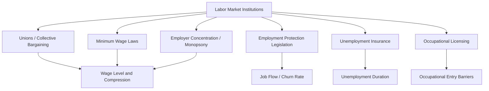

## Institutions Shaping Modern Labor Markets

### Why Institutions Matter for Labor Market Analysis

A purely competitive spot-market model of labor treats wages and employment as determined solely by the intersection of supply and demand curves. In practice, labor markets are heavily mediated by institutions — legal rules, organized collective actors, and social insurance systems — that alter bargaining power, constrain contract terms, and change the incentives facing workers and firms. Institutional analysis is essential both for explaining stylized facts inconsistent with frictionless competitive models (wage rigidity, persistent inter-industry wage differentials) and for evaluating labor policy.

### Labor Unions and Collective Bargaining

**Union wage effects.** Unions raise wages for covered workers relative to comparable non-union workers — the **union wage premium** — primarily by exercising monopoly power in wage negotiation, though the premium varies substantially by country, sector, and time period, and part of it reflects unions' ability to capture rents in less competitive product markets rather than pure bargaining leverage.

**Two theoretical models of union behavior:**

- **Monopoly union model**: the union unilaterally sets the wage (subject to a labor demand constraint imposed by the firm), and the firm then chooses employment along its labor demand curve — producing an outcome on the demand curve but at above-competitive wages and correspondingly reduced employment.
- **Efficient bargaining model** (McDonald-Solow): the union and firm jointly bargain over both wages *and* employment, generating outcomes off the labor demand curve (in general, higher employment for a given wage than the monopoly union model predicts), formalized via Nash bargaining over the joint surplus.

**Union density trends.** Union membership as a share of the workforce has declined substantially across most OECD countries since the 1970s-80s, particularly pronounced in the United States (private-sector union density is now in the single digits), though notably weaker in some European countries with sectoral/multi-employer bargaining systems that maintain high **bargaining coverage** even as formal membership (density) declines — an important distinction, since coverage (which workers' wages are actually set by collective agreements) matters more for wage effects than raw membership counts.

**Spillover and threat effects.** Union wage-setting can influence non-union wages through "threat effects" (non-union firms raising wages to forestall unionization) or through pattern bargaining that becomes a norm-setting benchmark across an industry.

### Minimum Wage Policy

**Competitive prediction vs. empirical challenge.** The textbook competitive model predicts a binding minimum wage above the market-clearing wage reduces employment by moving along the labor demand curve. The Card-Krueger (1994) natural experiment comparing New Jersey and Pennsylvania fast-food employment after a New Jersey minimum wage increase found no significant negative employment effect, launching a large and still-active empirical literature using difference-in-differences and related quasi-experimental designs.

**Monopsony reconciliation.** If employers hold wage-setting (monopsony) power — because of search frictions, limited outside options, or employer concentration — a minimum wage set between the monopsony wage and the competitive wage can *increase* employment while raising wages, since it removes the firm's incentive to restrict hiring to suppress wages. This monopsony framework has become the dominant theoretical lens for reconciling small or null minimum wage employment effects with standard price theory.

[Inference] The magnitude and even sign of minimum wage employment effects remain genuinely contested across studies and methodologies (e.g., the Cengiz et al. bunching-based estimator versus synthetic control approaches used by Neumark and others), so this remains an area where reasonable researchers using different identification strategies reach different conclusions, rather than a fully settled empirical question.

### Employment Protection Legislation (EPL)

Employment protection legislation covers rules governing dismissal procedures, notice periods, and severance pay requirements. The OECD's EPL index is the standard comparative measure, distinguishing protections for regular (permanent) contracts from those for temporary contracts.

- **Theoretical effects are ambiguous on net employment** but relatively clear on **composition**: stricter EPL tends to reduce both hiring and firing (reducing gross worker flows/"churn"), which can increase the duration of unemployment spells for those who do become unemployed while providing greater job security for incumbent workers — a classic "insider-outsider" tension.
- Countries with strict EPL for permanent contracts alongside looser rules for temporary contracts (a pattern common in parts of Southern Europe historically) have been associated with labor market "dualism," concentrating employment instability among younger and temporary workers.

### Unemployment Insurance (UI) and Social Insurance

**Moral hazard vs. consumption smoothing.** UI generates a fundamental policy tradeoff: benefits smooth consumption for unemployed workers (insurance value) but reduce the opportunity cost of continued search, potentially extending unemployment duration (moral hazard/disincentive effect). This tradeoff is the organizing framework for the large empirical literature estimating UI's effect on job-finding hazard rates, benefit generosity elasticities, and optimal benefit design (including time-varying benefit schedules).

**Related programs**: disability insurance, workers' compensation, and (in some countries) short-time work/furlough schemes (e.g., Germany's *Kurzarbeit*), the latter of which subsidize hours reductions rather than layoffs during downturns and received renewed research attention following their widespread use during the COVID-19 pandemic.

### Occupational Licensing and Regulation

Occupational licensing requirements (mandatory certification to legally practice a profession) have expanded substantially in scope across many economies. Licensing can, in principle, correct information asymmetries about service quality, but the empirical literature generally finds it also restricts labor supply into licensed occupations, raises prices for consumers, and creates some wage premium for licensed practitioners relative to comparably skilled unlicensed workers, with limited robust evidence of corresponding quality improvements in many licensed occupations.

### Employer Concentration and Monopsony Power

A growing empirical literature (using measures like labor market concentration indices constructed from vacancy or employment data) finds many local labor markets are considerably more concentrated than standard product-market antitrust thresholds would consider competitive, providing an institutional/structural (rather than purely frictional) source of employer wage-setting power that interacts with — and partly motivates the modern reassessment of — minimum wage and antitrust labor policy.

### Institutional Interaction Overview

### Key Points

- Institutions systematically alter labor market outcomes relative to the competitive spot-market benchmark, primarily by shifting bargaining power between workers and firms.
- Union effects depend on the bargaining model (monopoly union vs. efficient bargaining), and bargaining *coverage* is often more consequential than membership *density*.
- The Card-Krueger minimum wage findings and the monopsony reframing of labor demand jointly reshaped how economists model wage floors.
- Unemployment insurance embodies a core insurance-versus-moral-hazard tradeoff central to optimal social insurance design.
- Rising measured employer concentration provides a structural, non-frictional rationale for monopsony power, linking institutional and market-structure explanations of wage-setting.

**Related Topics**

- Monopsony Models of the Labor Market
- The Insider-Outsider Theory of Employment Protection
- Optimal Unemployment Insurance Design
- Occupational Licensing and Labor Supply Restrictions
- Short-Time Work Schemes and the COVID-19 Labor Market Response
- Employer Concentration Measurement (Herfindahl-Hirschman Index Applications to Labor Markets)