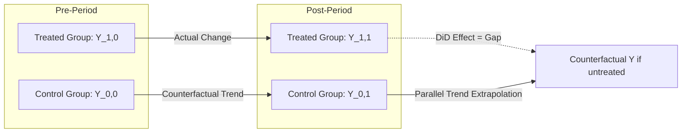

## Difference in Differences Design

### Core Idea and Intuition

Difference-in-differences (DiD) identifies a causal treatment effect by comparing the *change* in outcomes over time for a treated group against the *change* in outcomes over the same period for an untreated (control) group. The design nets out two confounds simultaneously: time-invariant differences between the groups (differenced away by comparing changes rather than levels) and common time trends affecting both groups (differenced away by subtracting the control group's change from the treated group's change).

### The Canonical 2×2 Setup

With two groups (treated $D=1$, control $D=0$) observed in two periods (pre $t=0$, post $t=1$), the DiD estimator is:

$$\hat{\delta}_{DiD} = \left(\bar{Y}_{1,1} - \bar{Y}_{1,0}\right) - \left(\bar{Y}_{0,1} - \bar{Y}_{0,0}\right)$$

where $\bar{Y}_{g,t}$ denotes the mean outcome for group $g$ in period $t$. Equivalently, this is estimated via OLS on the regression:

$$Y_{it} = \beta_0 + \beta_1 \text{Treat}_i + \beta_2 \text{Post}_t + \delta \left(\text{Treat}_i \times \text{Post}_t\right) + \epsilon_{it}$$

where $\delta$, the coefficient on the interaction term, is the DiD estimate of the treatment effect on the treated.

### Identifying Assumption: Parallel Trends

The central identifying assumption is **parallel trends**: in the absence of treatment, the treated and control groups would have followed the same trajectory over time. Formally, letting $Y^0_{it}$ denote the untreated potential outcome:

$$E[Y^0_{i1} - Y^0_{i0} \mid D_i = 1] = E[Y^0_{i1} - Y^0_{i0} \mid D_i = 0]$$

This assumption is fundamentally **untestable** in its exact form (it concerns the counterfactual untreated path of the treated group, which is never observed), though its plausibility is routinely assessed via indirect evidence:

- **Pre-trend testing**: verifying treated and control groups exhibited statistically similar trends in the outcome variable *before* treatment, using an event-study specification (see below). Similar pre-trends are supportive but not dispositive, since they cannot rule out a confound that happens to coincide exactly with treatment timing.
- **Placebo tests**: applying the DiD estimator to periods or outcomes where no true effect should exist.

### Event-Study Specification

The 2×2 design generalizes naturally to an event-study (dynamic DiD) specification that estimates treatment effects separately for each period relative to treatment timing, and directly visualizes pre-trends:

$$Y_{it} = \alpha_i + \gamma_t + \sum_{k \neq -1} \delta_k \cdot \mathbb{1}[t - T_i^* = k] + \epsilon_{it}$$

where $T_i^*$ is unit $i$'s treatment date, $k$ indexes event time (periods relative to treatment), and the period immediately before treatment ($k=-1$) is typically the omitted reference category. The coefficients $\delta_k$ for $k < 0$ (pre-treatment leads) should be statistically indistinguishable from zero under parallel trends; the coefficients for $k \geq 0$ (post-treatment lags) trace out the dynamic treatment effect path.

### Staggered Adoption and the Modern DiD Literature

Many real-world applications involve **staggered treatment timing**, where different units are treated at different dates (e.g., states adopting a policy in different years), rather than the clean single-treatment-date 2×2 case. Applying the standard **two-way fixed effects (TWFE)** estimator,

$$Y_{it} = \alpha_i + \gamma_t + \delta \cdot D_{it} + \epsilon_{it}$$

in staggered settings was long treated as a straightforward generalization of the 2×2 case, but a body of methodological work beginning around 2018-2020 (Goodman-Bacon; Callaway and Sant'Anna; Sun and Abraham; de Chaisemartin and D'Haultfœuille) demonstrated that TWFE in staggered designs implicitly uses **already-treated units as controls for later-treated units**, and when treatment effects vary over time or across cohorts (heterogeneous treatment effects), this can produce badly biased estimates — including, in some configurations, a negatively weighted or even sign-reversed aggregate estimate relative to the true average treatment effect.

**Goodman-Bacon decomposition.** Andrew Goodman-Bacon (2021) showed the TWFE staggered DiD estimator is a weighted average of all possible pairwise 2×2 DiD comparisons between cohorts (including problematic "already-treated vs. later-treated" comparisons), with weights depending on group sizes and treatment timing variance — providing a diagnostic decomposition to identify how much of a TWFE estimate is driven by "forbidden" comparisons.

**Modern robust estimators.** Several estimators have been developed to address this problem by restricting comparisons to clean treated-vs.-never-treated (or not-yet-treated) pairs and aggregating appropriately:

- **Callaway and Sant'Anna (2021)**: estimates group-time average treatment effects $ATT(g,t)$ for each treatment cohort $g$ and time period $t$, aggregated using only valid comparison groups.
- **Sun and Abraham (2021)**: an interaction-weighted event-study estimator correcting the contamination of dynamic TWFE event-study coefficients from heterogeneous effects.
- **de Chaisemartin and D'Haultfœuille (2020)**: proposes an alternative estimator (`did_multiplegt`) robust to heterogeneous and dynamic effects.

[Inference] As of recent practice, applied researchers using staggered DiD designs are generally expected to report at least one heterogeneity-robust estimator alongside or instead of standard TWFE, though which specific estimator has become the field's default varies somewhat by subfield and is still evolving.

### Threats to Identification

- **Anticipation effects**: if treated units change behavior *before* the nominal treatment date (e.g., firms adjusting hiring ahead of a known future minimum wage increase), the "pre-treatment" period is contaminated, biasing standard pre-trend tests and treatment effect estimates.
- **Compositional changes**: if the composition of treated or control groups shifts differentially over time (e.g., migration into/out of a treated state), the estimator can conflate a true treatment effect with a compositional artifact.
- **Non-parallel trends from confounding shocks**: any shock correlated with treatment assignment and affecting the outcome (e.g., a regional economic shock coinciding with a state policy change) violates parallel trends.
- **SUTVA violations / spillovers**: if the control group is indirectly affected by treatment (e.g., cross-border commuting responses to a state minimum wage change), the control group no longer represents a valid counterfactual.

### Standard Errors and Inference

DiD standard errors require clustering at the level of treatment assignment (e.g., at the state level, if treatment is assigned by state) to account for serial correlation in outcomes within a treated unit over time; failing to cluster appropriately (a well-documented issue following Bertrand, Duflo, and Mullainathan, 2004) can produce severely understated standard errors and spurious statistical significance, particularly with few treated clusters and long panels.

### Illustrative Diagram

### Worked Numerical Example

Suppose a state raises its minimum wage; a neighboring state serves as control. Average teen employment-to-population ratios:

|  | Pre-Period | Post-Period | Change |
| --- | --- | --- | --- |
| Treated State | 32% | 30% | −2 pp |
| Control State | 31% | 30.5% | −0.5 pp |

$$\hat{\delta}_{DiD} = (30 - 32) - (30.5 - 31) = -2 - (-0.5) = -1.5 \text{ percentage points}$$

The DiD estimate attributes a 1.5 percentage point decline in teen employment to the minimum wage increase, net of the common downward trend both states experienced.

### Key Points

- DiD identifies causal effects by differencing out both time-invariant group differences and common time trends, relying on the parallel trends assumption.
- Parallel trends is fundamentally untestable but is commonly assessed indirectly via pre-trend/event-study checks and placebo tests.
- Standard TWFE estimation in staggered-adoption settings can be badly biased under treatment effect heterogeneity; Goodman-Bacon decomposition diagnoses this, and estimators like Callaway-Sant'Anna and Sun-Abraham correct for it.
- Standard errors must be clustered at the level of treatment assignment to avoid understating uncertainty.

**Related Topics**

- Goodman-Bacon Decomposition in Detail
- Callaway-Sant'Anna Group-Time ATT Estimation
- Synthetic Control Methods as a DiD Alternative
- Triple-Differences (DDD) Designs
- Clustering and Inference in Panel Data (Bertrand-Duflo-Mullainathan)