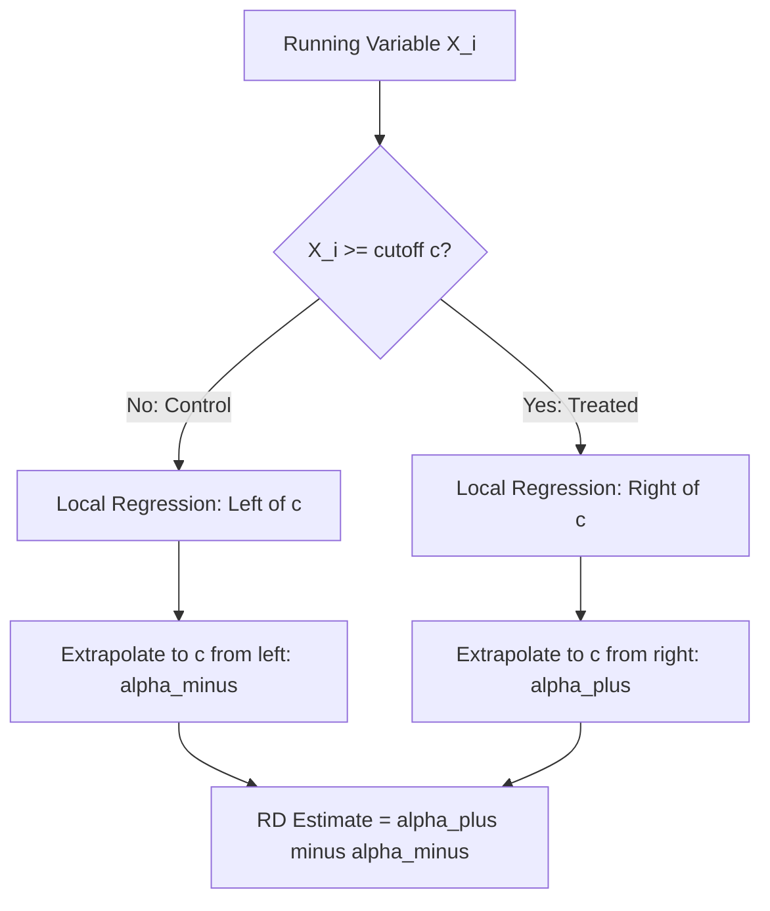

## Regression Discontinuity Design

### Core Idea

Regression discontinuity (RD) design identifies a causal treatment effect by exploiting a known, sharp rule that assigns treatment based on whether a **running variable** (also called a forcing variable) crosses a fixed threshold. Units just above and just below the cutoff are assumed to be nearly identical in all respects except treatment status, so any discontinuous jump in the outcome at the threshold is attributed to the causal effect of treatment. In labor economics, RD is especially well suited to program eligibility rules — unemployment insurance benefit schedules, minimum wage age thresholds, pension eligibility ages — that are administratively defined by sharp numerical cutoffs.

### Sharp RD

In **sharp RD**, treatment is a deterministic function of the running variable $X_i$ crossing threshold $c$:

$$D_i = \mathbb{1}[X_i \geq c]$$

Every unit with $X_i \geq c$ is treated; every unit with $X_i < c$ is not. The treatment effect at the cutoff is identified as the limit of the difference in conditional expectations approaching $c$ from either side:

$$\tau_{SRD} = \lim_{x \downarrow c} E[Y_i \mid X_i = x] - \lim_{x \uparrow c} E[Y_i \mid X_i = x]$$

This is estimated in practice via **local polynomial regression** (most commonly local linear regression) fit separately on each side of the cutoff, typically restricted to a bandwidth $h$ around $c$:

$$\hat{\tau}_{SRD} = \hat{\alpha}_{+} - \hat{\alpha}_{-}$$

where $\hat{\alpha}_+$ and $\hat{\alpha}_-$ are the intercepts from local regressions fit on $[c, c+h]$ and $[c-h, c]$ respectively.

### Fuzzy RD

In **fuzzy RD**, crossing the threshold changes the *probability* of treatment but does not deterministically assign it (e.g., eligibility for a program at a cutoff increases take-up but some eligible units don't enroll and some ineligible units gain access through other channels). The treatment effect is then estimated as a ratio of two sharp-RD-style discontinuities — the discontinuity in the outcome divided by the discontinuity in treatment probability — structurally analogous to an IV/Wald estimator, and interpretable as a Local Average Treatment Effect (LATE) for units whose treatment status is affected by crossing the threshold:

$$\tau_{FRD} = \frac{\lim_{x \downarrow c} E[Y_i \mid X_i = x] - \lim_{x \uparrow c} E[Y_i \mid X_i = x]}{\lim_{x \downarrow c} E[D_i \mid X_i = x] - \lim_{x \uparrow c} E[D_i \mid X_i = x]}$$

### Identifying Assumption: Continuity

RD's key identifying assumption is that, absent treatment, the conditional expectation of potential outcomes as a function of the running variable would be **continuous** at the cutoff:

$$\lim_{x \downarrow c} E[Y_i(0) \mid X_i = x] = \lim_{x \uparrow c} E[Y_i(0) \mid X_i = x]$$

This is a considerably weaker and more locally plausible assumption than the parallel-trends assumption in DiD, since it only requires that units cannot precisely manipulate their position around the threshold — it does not require similarity across the *entire* range of the running variable, only in the immediate neighborhood of $c$.

### Manipulation and the McCrary Density Test

The central threat to RD validity is **manipulation of the running variable** — if units can influence their own value of $X_i$ specifically to gain (or avoid) treatment near the cutoff, the continuity assumption breaks down, since the units just above and below $c$ are no longer comparable (they systematically differ in whatever drove the manipulation). The standard diagnostic is the **McCrary (2008) density test** (or its modern rank-based/manipulation-robust successor, the Cattaneo-Jansson-Ma test), which checks whether the density of the running variable is continuous at the cutoff — a discontinuity (bunching) in the density itself is evidence of manipulation.

Labor applications where manipulation is a live concern include: firm size thresholds that trigger regulatory obligations (e.g., labor law provisions that apply only above a certain employee count, which firms can strategically avoid crossing), and eligibility ages for benefits where individuals might time retirement or job separation around the cutoff.

### Covariate Balance Tests

As a further validity check, researchers test whether **predetermined covariates** (characteristics fixed before treatment assignment, which the treatment cannot causally affect) are continuous across the threshold — analogous to a balance test in a randomized experiment. Discontinuities in predetermined covariates at the cutoff would indicate a violation of the continuity assumption.

### Bandwidth Selection

Because RD estimation relies on local comparisons near the cutoff, the choice of **bandwidth** $h$ (how much data on each side of $c$ to include) governs a bias-variance tradeoff: a narrow bandwidth reduces bias from extrapolating a specified functional form over a wide range but increases variance (less data); a wide bandwidth does the reverse. Modern practice predominantly uses **data-driven, mean-squared-error-optimal bandwidth selectors** (Imbens and Kalyanaraman, 2012; Calonico, Cattaneo, and Titiunik, 2014), with the Calonico-Cattaneo-Titiunik (CCT) approach additionally providing **bias-corrected, robust confidence intervals** that have become close to a default standard in applied RD practice.

### Canonical Labor Applications

- **Unemployment insurance benefit schedules**: many UI systems have discontinuous changes in benefit duration or replacement rate at specific tenure or earnings thresholds, used to estimate the effect of benefit generosity on unemployment duration (e.g., Card, Chetty, and Weber's work on Austrian UI).
- **Minimum working age / school-leaving age discontinuities**: used to study effects of compulsory schooling on later labor market outcomes, complementing IV-based approaches to the same question.
- **Firm-size-based labor regulation thresholds**: used to study effects of regulations (which apply only to firms above a size cutoff) on firm employment decisions and the resulting "missing mass" of firms bunching just below the threshold — connecting RD methodology to **bunching estimator** approaches.
- **Retirement and pension eligibility ages**: discontinuous changes in pension eligibility or Social Security claiming rules at specific ages used to estimate labor supply responses near retirement.

### Illustrative Diagram

### RD Validity Checklist

| Check | Purpose |
| --- | --- |
| McCrary / density (manipulation) test | Detect sorting around the cutoff |
| Covariate balance at cutoff | Detect confounding via predetermined characteristics |
| Placebo cutoffs | Test for spurious discontinuities away from true cutoff |
| Bandwidth sensitivity | Confirm result is not an artifact of bandwidth choice |
| Donut-hole RD | Re-estimate excluding observations immediately at the cutoff, to check sensitivity to precise manipulation near c |

### Key Points

- RD identifies treatment effects from discontinuous jumps in outcomes at a known assignment threshold, relying on the continuity of potential outcomes rather than parallel trends.
- Sharp RD applies when treatment is a deterministic function of the running variable; fuzzy RD applies when the cutoff only shifts treatment probability, yielding a LATE-type estimate.
- The McCrary density test and covariate balance tests are the standard validity diagnostics, targeting manipulation of the running variable as the primary threat to identification.
- CCT bias-corrected robust bandwidth and inference procedures are close to standard practice in modern applied RD work.

**Related Topics**

- Bunching Estimators and Their Relationship to RD
- The McCrary Density Test in Detail
- Calonico-Cattaneo-Titiunik Robust Bias-Corrected Inference
- Regression Kink Design as an RD Extension
- Unemployment Insurance Duration Effects (Card-Chetty-Weber)