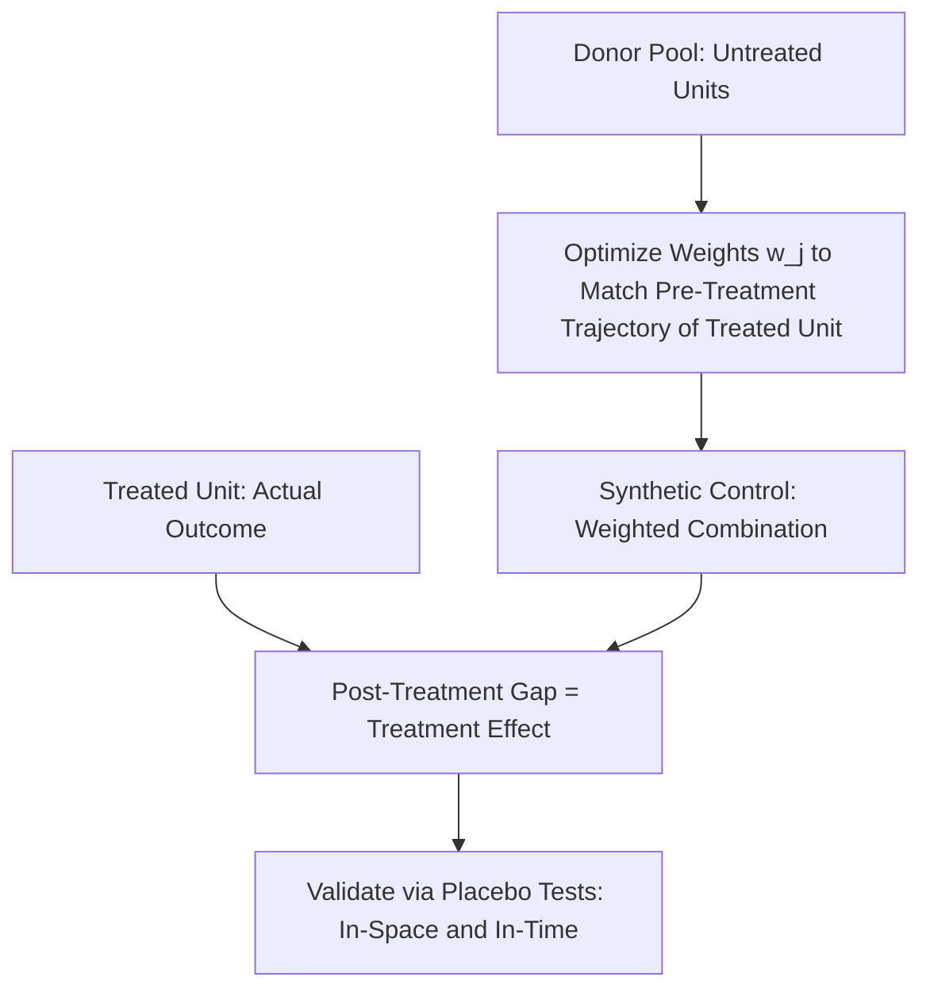

## Synthetic Control Methods

### Motivation

Synthetic control methods (SCM) address a setting common in labor and policy economics: a single treated unit (a state, country, or region) experiences an intervention, and no single comparable untreated unit provides a convincing counterfactual. Rather than choosing one imperfect control (as in a standard two-unit DiD), SCM constructs a **weighted combination of untreated units** — a "synthetic" counterfactual — chosen to closely reproduce the treated unit's pre-intervention outcome trajectory. Developed by Abadie and Gardeazabal (2003) and formalized by Abadie, Diamond, and Hainmueller (2010, 2015), SCM has become a standard tool for single-treated-unit policy evaluation, including several prominent labor economics applications (e.g., state-level minimum wage and employment policy studies).

### Formal Construction

Let unit 1 be the treated unit and units $2, \ldots, J+1$ be the untreated "donor pool." SCM constructs a synthetic control as a weighted average of donor units:

$$\hat{Y}_{1t}^{N} = \sum_{j=2}^{J+1} w_j Y_{jt}$$

The weights $w_j \geq 0$ (with $\sum_j w_j = 1$, a restriction to a convex combination — no negative weights or extrapolation beyond the donor pool's range) are chosen to minimize the discrepancy between the treated unit's pre-treatment characteristics (both pre-treatment outcome values and other predictor covariates $X_1$) and the weighted average of the same characteristics across donors $X_j$:

$$W^* = \arg\min_W \left(X_1 - X_0 W\right)' V \left(X_1 - X_0 W\right)$$

where $V$ is a weighting matrix (often chosen to minimize pre-treatment prediction error) reflecting the relative importance assigned to each predictor in matching pre-treatment trajectories.

### Treatment Effect Estimation

Once weights are determined, the treatment effect at each post-treatment period $t$ is the gap between the treated unit's actual outcome and its synthetic counterfactual:

$$\hat{\tau}_t = Y_{1t} - \hat{Y}_{1t}^N = Y_{1t} - \sum_{j=2}^{J+1} w_j^* Y_{jt}$$

Because the synthetic control is constructed to match the treated unit closely in the *pre*-treatment period by design, the credibility of the post-treatment gap as a causal estimate rests heavily on **how well the pre-treatment fit was achieved** — a large pre-treatment gap between the treated unit and its synthetic control undermines confidence in the post-treatment comparison.

### Inference via Placebo Tests

SCM was developed for the single-treated-unit case, where conventional large-sample standard errors are not well defined (there is, by construction, no sampling variation across treated units). Inference instead relies on **placebo-based permutation tests**:

- **In-space placebos**: apply the identical synthetic control procedure to each *untreated* donor unit in turn (as if it were the treated unit), constructing a distribution of "placebo effects." If the actual treated unit's estimated effect is unusually large relative to this placebo distribution, this supports a causal interpretation.
- **In-time placebos**: apply the SCM procedure using a fake, earlier "treatment date" (before the true intervention) to check whether a spurious discontinuity appears even without any real treatment.
- A commonly reported summary statistic is the ratio of post-treatment to pre-treatment mean squared prediction error (MSPE) for the treated unit relative to the same ratio computed for each placebo unit, providing a permutation-based p-value analog.

### Comparison to Difference-in-Differences

| Dimension | DiD | Synthetic Control |
| --- | --- | --- |
| Number of treated units | Typically many (or one, with judgment-based control) | Designed for one (or very few) treated units |
| Control construction | Single comparison group or fixed-effects-implied average | Data-driven weighted combination of donor pool |
| Key assumption | Parallel trends (untestable) | Good pre-treatment fit as a proxy for counterfactual validity |
| Negative weights | N/A | Explicitly disallowed by construction (unlike some regression-based control approaches) |
| Standard inference | Cluster-robust asymptotic standard errors | Placebo-based permutation inference |

[Inference] SCM is often characterized as imposing a more transparent and data-driven weighting scheme than an analyst's implicit or explicit choice of comparison group in DiD, and as avoiding extrapolation outside the convex hull of the donor pool's characteristics — though this comes at the cost of requiring a reasonably sized and relevant donor pool, and the method's finite-sample inferential properties remain an area of ongoing methodological refinement.

### Extensions

- **Generalized Synthetic Control / Interactive Fixed Effects (Xu, 2017)**: extends SCM to settings with multiple treated units and staggered adoption by combining the synthetic control weighting logic with a factor-model approach to unobserved time-varying confounders, connecting SCM to the broader factor-augmented panel literature.
- **Synthetic Difference-in-Differences (Arkhangelsky et al., 2021)**: combines synthetic-control-style unit weighting with DiD-style time weighting and a two-way fixed effects regression, aiming to combine the robustness properties of both approaches, including improved point-estimate properties even without an exact pre-treatment fit.
- **Penalized/Ridge Synthetic Control (Doudchenko and Imbens, 2016; Abadie and L'Hour, 2021)**: relaxes the strict convex-combination and non-negativity constraints via regularization, allowing sparser or more flexible donor weighting.

### Canonical and Labor-Adjacent Applications

- Abadie and Gardeazabal's original application estimated the economic cost of terrorism in the Basque Country by constructing a synthetic Basque Country from other Spanish regions.
- Abadie, Diamond, and Hainmueller (2010) estimated the effect of California's Proposition 99 tobacco control program on cigarette consumption.
- Labor and public economics applications include state-level minimum wage studies (as an alternative or complement to DiD-based approaches), state tax policy changes, and studies of large-scale regional economic shocks (e.g., plant closures, resource booms) on local labor markets.

### Illustrative Diagram

### Key Points

- Synthetic control constructs a data-driven weighted combination of untreated donor units, chosen to replicate the treated unit's pre-treatment trajectory, addressing settings with a single or few treated units poorly suited to standard DiD.
- Weights are typically constrained to be non-negative and sum to one, avoiding extrapolation beyond the donor pool's characteristic range.
- Inference relies on placebo-based permutation tests rather than conventional asymptotic standard errors.
- Extensions (generalized synthetic control, synthetic DiD) adapt the core logic to multiple-treated-unit and staggered-adoption settings.

**Related Topics**

- Synthetic Difference-in-Differences (Arkhangelsky et al.)
- Generalized Synthetic Control and Interactive Fixed Effects Models
- Placebo and Permutation Inference in Policy Evaluation
- State-Level Minimum Wage Studies Using Synthetic Control
- Panel Data Factor Models in Applied Microeconomics