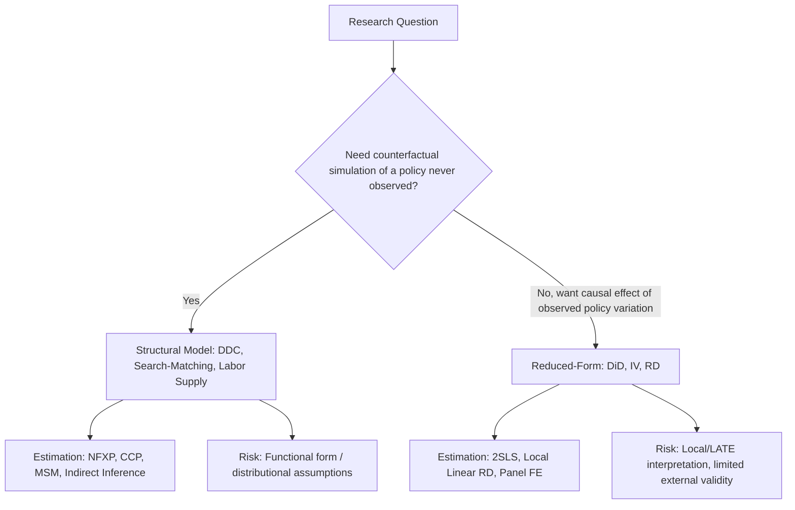

## Structural Estimation of Labor Market Models

### Structural vs. Reduced-Form Approaches

Structural estimation specifies and estimates the full set of parameters governing a formal economic model of behavior (preferences, technology, market frictions), rather than estimating a single treatment-effect parameter from a quasi-experimental design. Where reduced-form methods (DiD, IV, RD) prioritize credible identification of a specific causal contrast at the cost of remaining agnostic about the underlying behavioral mechanism, structural methods prioritize recovering the deep parameters of an explicit optimization or equilibrium model, enabling **counterfactual policy simulation** — predicting outcomes under policies never actually observed in the data, which reduced-form estimates generally cannot do without additional (often implicit) structural assumptions.

[Inference] The relative merits of structural versus reduced-form approaches have been a long-running methodological debate in labor economics (sometimes framed as the "credibility revolution" critique of structural work versus the "external validity" critique of purely reduced-form work), and most active researchers now regard the two approaches as complementary rather than substitutes, though views on the appropriate balance between them continue to vary by subfield and specific research question.

### Dynamic Discrete Choice Models

A large share of structural labor research models individuals as solving **dynamic discrete choice problems** — sequentially choosing among a finite set of alternatives (work, search, retire, invest in training) to maximize expected discounted lifetime utility, subject to uncertainty about future states.

**Bellman equation formulation.** The worker's value function $V(s_t)$ at state $s_t$ satisfies:

$$V(s_t) = \max_{a \in A} \left\{ u(s_t, a) + \beta \, E\left[V(s_{t+1}) \mid s_t, a\right] \right\}$$

where $u(s_t, a)$ is per-period utility from action $a$ in state $s_t$, $\beta$ is the discount factor, and the expectation is taken over the (typically stochastic) transition of the state $s_{t+1}$ given the current state and action.

**Rust-style estimation (Rust, 1987).** The canonical estimation approach adds an additively separable, extreme-value-distributed unobserved state variable (a taste shock) to make the model's implied choice probabilities take a closed-form logit expression, enabling estimation via **nested fixed-point (NFXP)** algorithms: an outer loop searches over structural parameters while an inner loop solves the Bellman equation (dynamic programming) for each candidate parameter vector.

**Computational alternatives.** Because the nested fixed-point approach is computationally intensive (requiring full dynamic programming solution at every parameter guess), several faster estimation approaches have been developed:

- **Conditional Choice Probability (CCP) estimators (Hotz and Miller, 1993)**: exploit the mapping between observed choice probabilities and value function differences to avoid repeatedly solving the full dynamic program.
- **Nested Pseudo-Likelihood (NPL) (Aguirregabiria and Mira, 2002)**: an iterative CCP-based procedure that converges to the full-solution maximum likelihood estimator under regularity conditions.

### Search-and-Matching Models

Structural estimation of **search-and-matching models** (building on the Diamond-Mortensen-Pissarides theoretical framework) estimates the parameters governing the matching function, job destruction rates, and wage-setting mechanism (commonly Nash bargaining between workers and firms) directly from data on unemployment duration, wages, and vacancy rates.

**Matching function**: hires (or new matches) $M_t$ as a function of unemployment $U_t$ and vacancies $V_t$:

$$M_t = A \cdot U_t^{\alpha} V_t^{1-\alpha}$$

**Nash bargained wage**: the equilibrium wage splits the joint surplus of a match between worker and firm according to bargaining power $\beta \in (0,1)$:

$$w = \beta \left(y + \theta c\right) + (1-\beta) b$$

where $y$ is match output, $\theta$ is labor market tightness ($V/U$), $c$ is the vacancy posting cost, and $b$ is the worker's outside option (often calibrated to unemployment benefits plus the value of leisure).

Structural estimation of these models allows counterfactual analysis of policies such as changing unemployment insurance generosity, which alters $b$ and thereby shifts equilibrium wages, vacancy posting, and unemployment duration in ways a reduced-form IV or RD estimate targeting a specific historical policy change cannot directly extrapolate to a differently designed policy.

### Static and Dynamic Labor Supply Structural Models

Structural labor supply estimation specifies a full utility function over consumption and leisure/hours (e.g., a specific functional form permitting corner solutions at zero hours, since a large share of the population does not work), estimated jointly with the budget constraint (including nonlinearities from tax and transfer programs) to recover preference parameters that can then be used to simulate labor supply responses to counterfactual tax or transfer reforms — a common application in the interaction between labor economics and public finance (e.g., simulating the labor supply effects of a hypothetical Earned Income Tax Credit expansion).

### Method of Simulated Moments (MSM) and Indirect Inference

For models too complex for closed-form or tractable maximum likelihood estimation, simulation-based methods are common:

- **Method of Simulated Moments (MSM)**: chooses structural parameters to minimize the distance between moments computed from real data and moments computed from data simulated from the model at candidate parameter values.
- **Indirect Inference**: estimates an auxiliary (often reduced-form, easier-to-estimate) statistical model on both real and simulated data, choosing structural parameters so that the auxiliary model's estimated coefficients match as closely as possible between the two.

### Identification in Structural Models

Structural models are typically identified through a combination of **functional form assumptions** (e.g., distributional assumptions on unobserved heterogeneity or taste shocks) and **exclusion restrictions** analogous to those in IV — variables that shift one part of the model (e.g., a state-specific policy variable affecting only the budget constraint) without directly entering preferences. A recurring methodological critique of structural work is that identification can rest substantially on functional form assumptions that are difficult to independently validate, in contrast to reduced-form designs whose identifying assumption (parallel trends, continuity, exclusion) is often more transparently statable, even if still fundamentally untestable in its own right.

### Structural vs. Reduced-Form Tradeoffs

### Key Points

- Structural estimation recovers deep behavioral parameters from an explicit optimization model, enabling counterfactual policy simulation unavailable from purely reduced-form estimates.
- Dynamic discrete choice models (Rust-style NFXP, and faster CCP/NPL alternatives) are the workhorse framework for structural labor supply, retirement, and job search decisions.
- Structural search-and-matching estimation connects unemployment duration and wage data to the parameters of the Diamond-Mortensen-Pissarides framework, including Nash-bargained wage setting.
- Method of Simulated Moments and indirect inference provide estimation routes for models without tractable likelihoods.
- The central tradeoff versus reduced-form methods is counterfactual flexibility against reliance on functional-form and distributional identifying assumptions.

**Related Topics**

- The Rust (1987) Bus Engine Replacement Model as a DDC Template
- Conditional Choice Probability Estimators (Hotz-Miller)
- Structural Estimation of the DMP Search-and-Matching Model
- Taxable Income Elasticities and Structural Labor Supply
- Method of Simulated Moments: Practical Implementation