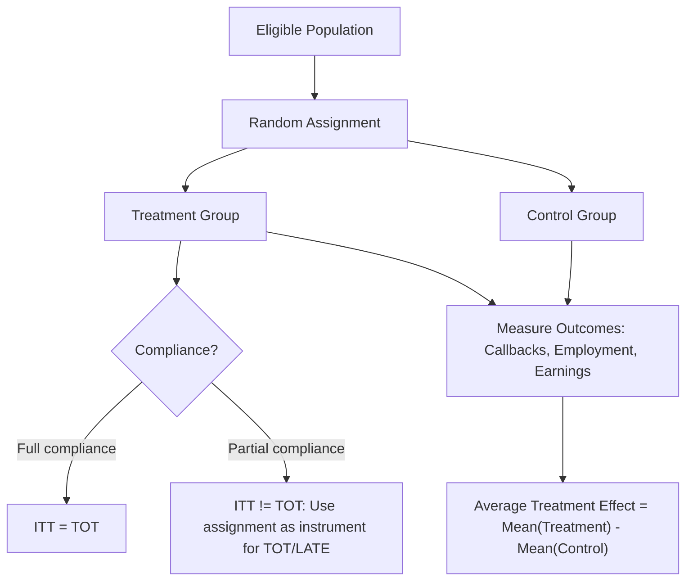

## Field Experiments in Labor Economics

### Rationale for Experimental Methods

Field experiments randomize treatment assignment directly, sidestepping the identifying assumptions required by quasi-experimental designs (parallel trends in DiD, exclusion restrictions in IV, continuity in RD). Because randomization guarantees treatment and control groups are, in expectation, identical on all observed and unobserved characteristics, the difference in mean outcomes between groups is a consistent estimate of the average treatment effect without relying on any of those additional structural assumptions. In labor economics, field experiments have become especially prominent in studying hiring discrimination, active labor market program effectiveness, and information/behavioral frictions in job search.

### Types of Field Experiments in Labor Research

**Audit and correspondence studies.** Researchers submit fictitious job applications (correspondence studies use only written materials; audit studies employ trained in-person testers) that are identical in relevant qualifications but randomly vary a signal of interest — most commonly a racially distinctive name, a gender-identifying name, an indicator of age, or a disability disclosure — and measure differential callback rates. Bertrand and Mullainathan's (2004) study randomizing racially distinctive names on otherwise identical resumes sent to real U.S. job postings is among the most cited designs in this literature, finding substantially lower callback rates for resumes with Black-sounding names.

**Randomized evaluations of active labor market programs (ALMPs).** Job training programs, job search assistance, and wage subsidy programs are evaluated by randomly assigning eligible individuals to program access versus a control group, allowing direct estimation of program impacts on employment and earnings — a design that became particularly influential following experimental evaluations of U.S. job training programs (e.g., the National Supported Work Demonstration, JTPA evaluations) that revealed some quasi-experimental and non-experimental evaluation methods produced systematically biased estimates relative to the experimental benchmark (LaLonde, 1986).

**Information and behavioral nudge experiments.** Randomizing the provision of information (e.g., about job search strategies, wage information, or program eligibility) or behavioral "nudges" (e.g., reminder messages, deadline framing, default options) to study frictions in job search behavior and program take-up — an area heavily influenced by the broader behavioral economics literature on defaults and salience.

**Employer-side experiments.** Randomizing features of job postings, compensation structure, or management practices within partnering firms to study effects on applicant pools, worker productivity, and retention — closely connected to personnel economics.

### Design Considerations Specific to Labor Field Experiments

**Randomization unit and level.** Individual-level randomization is standard in correspondence studies, but ALMP and employer-side experiments often require randomization at a higher level (e.g., by local office, by firm, by classroom) to avoid **spillover contamination** — if control-group individuals compete with treated individuals for the same finite pool of job openings, treatment effects estimated from individual-level randomization can be biased by displacement, since a job filled by a treated worker cannot simultaneously be filled by a control worker (a general equilibrium concern documented prominently by Crépon et al., 2013, in a large-scale French job placement assistance experiment using two-level randomization to separately identify direct and displacement effects).

**External validity.** Because experiments are typically conducted at limited scale, in specific labor markets, and often through partnership with particular firms or agencies, results may not generalize to different labor market conditions (e.g., a tight versus slack labor market), different program scales (general equilibrium effects may emerge only at large scale), or different populations — a standard critique applied to experimental as much as quasi-experimental designs, though the mechanism of the critique differs (external validity concerns for experiments versus both internal and external validity concerns for many quasi-experimental designs).

**Ethical and practical constraints.** Randomizing access to beneficial programs (job training, wage subsidies) raises ethical questions addressed variously through waitlist designs (randomizing the *order* of program access rather than permanent denial), oversubscription designs (randomizing among more eligible applicants than program slots allow, a naturally occurring randomization opportunity), or encouragement designs (randomizing information/encouragement to participate rather than access itself, often paired with fuzzy-RD-style or IV-style analysis of imperfect compliance).

**Hawthorne and experimenter-demand effects.** Participants' awareness of being studied, or of what the researcher hypothesizes, can itself alter behavior independent of the treatment's substantive content — a concern particularly salient in employer-side and behavioral nudge experiments, addressed through design choices such as embedding the experiment within routine institutional processes so participants remain unaware of the study.

### Analysis Considerations

**Intention-to-treat (ITT) vs. treatment-on-the-treated (TOT).** When compliance with randomized assignment is imperfect (e.g., individuals randomized into a job training program offer choose not to enroll), researchers typically report both the **ITT** effect (comparing outcomes by initial random assignment regardless of actual participation) and a **TOT/LATE** estimate (using randomized assignment as an instrument for actual participation, in the same IV/LATE framework used in quasi-experimental designs), since ITT reflects the policy-relevant effect of *offering* a program while TOT better isolates the effect of *actual participation*.

**Multiple hypothesis testing.** Field experiments often measure many outcomes (multiple labor market outcomes, at multiple follow-up horizons, sometimes for multiple subgroups), raising the risk of false positives from testing many hypotheses; standard practice increasingly involves pre-registration of primary outcomes and correction procedures (e.g., the Benjamini-Hochberg false discovery rate procedure, or constructing summary index outcomes as in Kling, Liebman, and Katz, 2007) to guard against this.

### Illustrative Diagram

### Key Labor Field Experiment Landmarks

| Study | Focus | Design |
| --- | --- | --- |
| Bertrand and Mullainathan (2004) | Racial discrimination in hiring | Correspondence study, resume names |
| LaLonde (1986) | Validity of non-experimental methods | Comparison of experimental ALMP benchmark to non-experimental estimators |
| Crépon et al. (2013) | Job placement assistance, displacement | Two-level randomization (individual and local labor market) |
| Kling, Liebman, and Katz (2007) — Moving to Opportunity | Neighborhood effects on labor outcomes | Randomized housing voucher offer |

### Key Points

- Field experiments randomize treatment directly, avoiding reliance on the parallel-trends, exclusion-restriction, or continuity assumptions required by quasi-experimental designs.
- Correspondence/audit studies are the dominant design for measuring hiring discrimination; randomized ALMP evaluations set the credibility benchmark against which non-experimental program evaluation methods have historically been judged.
- Spillover/displacement effects require careful randomization design (e.g., multi-level randomization) in labor market settings with a fixed number of job openings.
- ITT and TOT/LATE estimates serve distinct purposes when compliance with random assignment is imperfect, and both are typically reported.

**Related Topics**

- Correspondence Studies and Measuring Labor Market Discrimination
- General Equilibrium Effects and Displacement in Program Evaluation
- LaLonde's Critique of Non-Experimental Program Evaluation
- Pre-Registration and Multiple Hypothesis Testing in Applied Microeconomics
- Moving to Opportunity and Neighborhood Effects on Labor Outcomes