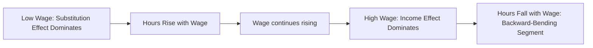

## The Labor Leisure Choice Model

### Setup of the Basic Model

The labor-leisure choice model treats the individual worker as allocating a fixed time endowment $T$ (e.g., 24 hours per day, or 168 hours per week) between hours of market work $h$ and leisure $l$, where leisure is defined broadly to include all non-market time (including home production, in the simplest version of the model):

$$T = h + l$$

The individual maximizes utility over consumption $C$ and leisure $l$:

$$\max_{C,l} \; U(C, l)$$

subject to a budget constraint linking consumption to labor earnings and any non-labor (unearned) income $V$:

$$C = wh + V = w(T - l) + V$$

where $w$ is the (assumed fixed, competitive) hourly wage. Standard assumptions on $U(C,l)$ include that both consumption and leisure are "goods" (positive marginal utility) with diminishing marginal utility, generating convex indifference curves.

### The First-Order Condition and the Reservation Wage

Substituting the budget constraint into the utility function and maximizing yields the standard tangency condition equating the marginal rate of substitution between leisure and consumption to the wage (the relative price of leisure in terms of consumption foregone):

$$\text{MRS}_{l,C} = \frac{\partial U/\partial l}{\partial U/\partial C} = w$$

This condition characterizes an **interior solution** where the individual works a positive but less-than-maximal number of hours. However, because $h \geq 0$ is a nonnegativity constraint (an individual cannot supply negative hours), a **corner solution** at $h=0$ (non-participation) is possible whenever the market wage is below the **reservation wage** $w^*$ — the wage at which the individual's marginal rate of substitution between leisure and consumption, evaluated at $h=0$ (i.e., $l=T$), equals the market wage:

$$w^* = \left.\frac{\partial U/\partial l}{\partial U/\partial C}\right|_{l=T}$$

An individual chooses to participate in the labor force ($h>0$) if and only if $w > w^*$. This reservation wage concept is central to labor supply and job search theory alike, and explains why labor force participation, not merely hours conditional on working, is a first-order margin of adjustment in labor supply analysis.

### Income and Substitution Effects

A wage change has two theoretically distinct effects on hours worked, formalized via the **Slutsky decomposition** applied to labor supply:

- **Substitution effect**: holding utility constant, a wage increase raises the opportunity cost of leisure, inducing the worker to substitute *away* from leisure and *toward* work. The substitution effect on hours is unambiguously positive for a wage increase.
- **Income effect**: a wage increase raises the worker's real income at any given hours level, and if leisure is a normal good (which it typically is assumed to be), higher income leads the worker to consume *more* leisure — reducing hours worked, holding the substitution effect fixed.

The total (Marshallian, uncompensated) effect of a wage change on hours is the sum of these two effects, and the Slutsky equation formalizes the decomposition:

$$\frac{\partial h}{\partial w} = \underbrace{\left.\frac{\partial h}{\partial w}\right|_{U=\bar{U}}}_{\text{substitution effect} \; (+)} - \underbrace{h \cdot \frac{\partial h}{\partial V}}_{\text{income effect}}$$

Because the substitution effect is positive and the income effect (given normal leisure) is negative for a wage increase, **the sign of the total effect of a wage increase on hours worked is theoretically ambiguous** — this ambiguity is the central analytical result of the static labor-leisure model and the reason labor supply elasticities must be estimated empirically rather than signed from theory alone.

### The Backward-Bending Labor Supply Curve

If the income effect dominates the substitution effect at sufficiently high wage levels (a common assumption motivated by the observed long-run decline in average hours worked as real wages have risen over the 20th century), the labor supply curve can be **backward-bending**: hours worked rise with the wage at low wage levels (substitution effect dominates) but eventually fall as the wage continues to rise (income effect dominates).

### Non-Labor Income and the Pure Income Effect

Because non-labor income $V$ enters the budget constraint without any offsetting substitution effect (it does not change the relative price of leisure versus consumption), an increase in $V$ produces a **pure income effect**: for normal leisure, hours worked unambiguously fall as non-labor income rises. This prediction underlies empirical tests of labor supply theory using variation in non-labor income — for example, lottery winnings (Imbens, Rubin, and Sacerdote, 2001) or inheritance receipt — as sources of income variation plausibly uncorrelated with the wage, used to estimate the pure income effect on labor supply separately from the wage (substitution) effect.

### Elasticity Concepts

- **Marshallian (uncompensated) elasticity**: $\varepsilon^M = \frac{\partial h}{\partial w} \cdot \frac{w}{h}$, capturing the total effect of a wage change including both substitution and income effects.
- **Hicksian (compensated) elasticity**: $\varepsilon^H = \left.\frac{\partial h}{\partial w}\right|_{U=\bar{U}} \cdot \frac{w}{h}$, capturing only the substitution effect (holding utility fixed via a hypothetical compensating income adjustment), always non-negative under standard preferences.
- The relationship between the two follows directly from the Slutsky decomposition: $\varepsilon^M = \varepsilon^H - s \cdot \eta$, where $s$ is the share of labor income in total income and $\eta$ is the income elasticity of labor supply.

Empirically, estimated Marshallian labor supply elasticities for prime-age men are typically found to be small (often close to zero, sometimes slightly negative), while elasticities for married women — particularly at the extensive (participation) margin — are typically estimated to be substantially larger, though this gap has narrowed over recent decades as female labor force attachment patterns have converged toward those of men.

### Extensive vs. Intensive Margin

The basic static model as presented captures both the **extensive margin** (the participation decision, $h=0$ vs. $h>0$, governed by the reservation wage comparison) and the **intensive margin** (hours conditional on working, governed by the interior tangency condition). Empirical labor supply research generally finds the extensive margin response to wage and tax changes to be considerably larger than the intensive margin response for many demographic groups, a finding with substantial implications for the design of tax and transfer policy (e.g., the Earned Income Tax Credit's effectiveness has been attributed substantially to extensive-margin labor force participation responses rather than intensive-margin hours adjustments).

### Key Points

- The labor-leisure model characterizes the optimal hours choice via a tangency condition (MRS equals the wage) for interior solutions, and a reservation-wage comparison for the participation (extensive-margin) decision.
- A wage increase generates offsetting substitution (positive) and income (negative, given normal leisure) effects on hours, making the net effect of a wage increase on hours theoretically ambiguous — the model's central analytical result.
- Non-labor income generates a pure (unambiguous) negative income effect on hours, used empirically via lottery and inheritance-based natural experiments.
- Empirical labor supply elasticities vary substantially by demographic group and by margin (extensive versus intensive), with prime-age male elasticities typically small and female/extensive-margin elasticities typically larger.

**Related Topics**

- The Slutsky Equation and Compensated vs. Uncompensated Demand
- Life-Cycle Labor Supply and Intertemporal Substitution (Frisch Elasticity)
- Taxation and Labor Supply: The EITC and Extensive-Margin Responses
- Reservation Wages and Job Search Theory
- Non-Labor Income Natural Experiments (Lottery Winnings, Inheritance)