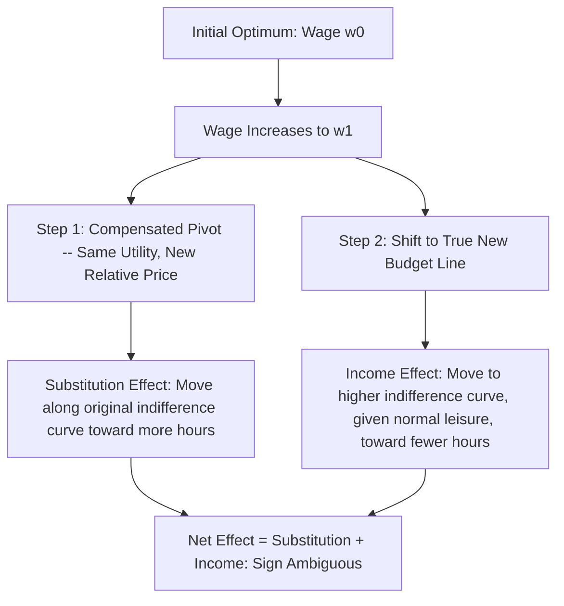

## Income and Substitution Effects

### Purpose of the Decomposition

The income and substitution effect decomposition isolates two conceptually distinct channels through which a price change — here, a wage change, since the wage is the price of leisure in terms of foregone consumption — affects an individual's chosen labor supply. This decomposition, a direct application of Slutsky/Hicksian consumer theory to the labor-leisure choice problem, is the analytical core of static labor supply theory and explains why labor supply's response to wages cannot be signed by theory alone.

### The Substitution Effect

The **substitution effect** isolates the pure relative-price channel: holding the individual's utility level fixed (a hypothetical compensation that keeps them on the same indifference curve), a wage increase raises the relative price of leisure versus consumption, inducing the individual to substitute away from the now-relatively-more-expensive good (leisure) toward the relatively cheaper good (consumption, achieved via work). The substitution effect on hours worked from a wage increase is **unambiguously positive** under standard convex preferences — this sign is a general and theoretically certain implication of utility maximization, not an empirical regularity.

Formally, the substitution effect is captured by the **Hicksian (compensated) labor supply function** $h^H(w, \bar{U})$, which holds utility constant at level $\bar{U}$ rather than holding income constant:

$$\left.\frac{\partial h}{\partial w}\right|_{U = \bar{U}} \geq 0$$

### The Income Effect

The **income effect** isolates the pure purchasing-power channel: a wage increase, holding hours fixed, raises the individual's total income (since existing hours now generate more consumption), and if leisure is a **normal good** — the standard assumption, and one broadly consistent with the empirical decline in average hours worked as real incomes have risen historically — higher income leads the individual to consume more of it, meaning **more leisure and fewer hours worked**.

$$-h \cdot \frac{\partial h}{\partial V} \quad \text{(negative for a wage increase, given leisure is normal)}$$

The negative sign of the income effect (for a wage increase, given normal leisure) is what generates the fundamental ambiguity in the total labor supply response to wages, since it works in the opposite direction from the substitution effect.

### The Slutsky Equation for Labor Supply

The Slutsky equation formally decomposes the total (Marshallian, uncompensated) response of hours to a wage change into the substitution and income components:

$$\frac{\partial h}{\partial w}\bigg|_{\text{Marshallian}} = \underbrace{\frac{\partial h}{\partial w}\bigg|_{U=\bar{U}}}_{\text{Substitution Effect} \; (\geq 0)} \; - \; \underbrace{h \cdot \frac{\partial h}{\partial V}}_{\text{Income Effect Term}}$$

Note the structure of the income effect term: it is the product of current hours $h$ (the "endowment" of labor being sold, analogous to how a price change for a good the consumer also owns generates an endowment income effect) and the marginal propensity to reduce hours out of non-labor income $\partial h/\partial V$. Because $\partial h/\partial V < 0$ for normal leisure, the term $-h \cdot \partial h/\partial V$ is positive when written this way — so the full expression subtracts a negative quantity, meaning the income effect component works to *reduce* the net wage effect on hours relative to the pure substitution effect.

### Elasticity Formulation

Expressing the decomposition in elasticity terms (dividing through by $h/w$) yields the elasticity version of the Slutsky equation:

$$\varepsilon^{\text{Marshallian}} = \varepsilon^{\text{Hicksian}} - s \cdot \eta$$

where:

- $\varepsilon^{\text{Marshallian}} = \frac{\partial h}{\partial w}\frac{w}{h}$ is the uncompensated (total) wage elasticity of hours,
- $\varepsilon^{\text{Hicksian}} = \frac{\partial h}{\partial w}\Big|_{U=\bar{U}} \frac{w}{h}$ is the compensated (substitution-only) wage elasticity, always $\geq 0$,
- $s = wh/(wh+V)$ is the share of labor earnings in total income,
- $\eta = \frac{\partial h}{\partial V} \cdot \frac{V}{h}$ is the income elasticity of labor supply (typically negative, given normal leisure).

### Diagrammatic Decomposition

The standard graphical decomposition (a Hicksian decomposition) proceeds in two conceptual steps following a wage increase: (1) pivot the budget constraint outward around the original consumption bundle's utility level to an artificial, steeper compensated budget line reflecting only the new relative price — this isolates the substitution effect as the movement along the original indifference curve; then (2) shift the compensated budget line out to the true new budget line — this isolates the income effect as the movement between indifference curves at the new relative price.

### Pure Income Effects: Non-Labor Income Variation

Because a change in non-labor income $V$ (with the wage held fixed) generates *only* the income effect, with no accompanying substitution effect, empirical researchers have used exogenous variation in non-labor income as a clean way to estimate the pure income effect in isolation, avoiding the joint identification problem inherent in using wage variation alone:

- **Imbens, Rubin, and Sacerdote (2001)** used random variation in lottery prize amounts among lottery players to estimate the effect of unearned income on subsequent labor supply, finding a negative but economically modest effect on earnings and labor force participation.
- Studies using **inheritance receipt** as a source of non-labor income variation find broadly similar qualitative patterns — a negative but generally small-magnitude income effect on hours and participation.

[Inference] The generally modest estimated magnitude of these pure income effects has been influential in the applied public finance literature's calibration of labor supply models used for tax policy analysis, though the precise magnitude used varies by study and by the specific population and income range under consideration.

### Asymmetry Across the Income Distribution and Demographic Groups

Empirical estimates of the income effect's magnitude vary systematically:

- **Prime-age men** tend to show small income effects and small Hicksian elasticities, consistent with their labor supply behavior being close to a fixed institutional norm (full-time, continuous employment) with limited marginal adjustment.
- **Married women**, particularly historically, have shown larger income effects at both the extensive (participation) and intensive (hours) margins, though this gap has narrowed as female labor force attachment has strengthened over recent decades.
- **Low-income and means-tested-program-eligible populations** face particularly complex, kinked, and sometimes non-convex effective budget constraints (from the interaction of multiple overlapping transfer programs), meaning the simple two-effect decomposition understates the complexity of applied income-and-substitution analysis at the bottom of the income distribution.

### Key Points

- The substitution effect of a wage increase on hours worked is theoretically unambiguous and positive; the income effect (given normal leisure) is theoretically unambiguous and negative — but their sum is theoretically ambiguous.
- The Slutsky equation formalizes this decomposition, distinguishing the Hicksian (compensated, substitution-only) elasticity from the Marshallian (uncompensated, total) elasticity.
- Non-labor income variation (lottery winnings, inheritance) isolates the pure income effect empirically, since it carries no accompanying price/substitution channel.
- Estimated magnitudes of both effects vary substantially across demographic groups, with prime-age men showing comparatively small effects and other groups, particularly at the extensive margin, showing larger responses.

**Related Topics**

- The Reservation Wage and the Participation Margin
- Frisch (Intertemporal) Labor Supply Elasticity
- Effective Marginal Tax Rates and Budget Constraint Kinks
- Empirical Estimates of Labor Supply Elasticities by Demographic Group
- Taxable Income Elasticity as an Alternative Behavioral Sufficient Statistic