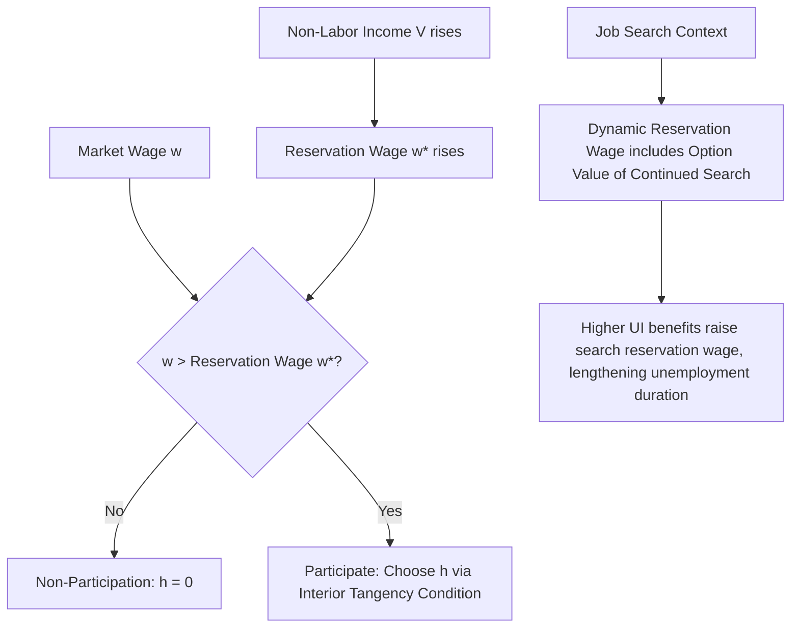

## Reservation Wages and the Participation Decision

### Definition

The **reservation wage** $w^*$ is the wage at which an individual is exactly indifferent between working and not working — the shadow price of the individual's time when evaluated at zero hours of market work. It is derived from the labor-leisure model's tangency condition, evaluated at the corner where leisure equals the full time endowment ($l = T$, $h = 0$):

$$w^* = \left.\frac{\partial U/\partial l}{\partial U/\partial C}\right|_{l=T, \, C=V}$$

That is, the reservation wage equals the marginal rate of substitution between leisure and consumption, evaluated at the individual's non-participation bundle (full leisure, consumption financed entirely by non-labor income $V$). The participation decision follows a simple threshold rule:

$$\text{Participate} \iff w > w^*$$

An individual with market wage $w$ below their reservation wage $w^*$ optimally chooses non-participation, since even the first hour of work would require accepting a wage below what their own valuation of leisure at full-leisure levels demands.

### Determinants of the Reservation Wage

Because $w^*$ is derived from preferences and the non-labor income level, it varies systematically with:

- **Non-labor income $V$**: higher non-labor income (a partner's earnings, unemployment or disability benefits, investment income, inheritance) raises the reservation wage, since it raises the marginal utility of consumption relative to the marginal utility gained from work-financed consumption, holding preferences fixed — this is the labor supply channel behind the well-documented negative relationship between benefit generosity and program recipients' employment propensity.
- **Preferences for leisure/home production**: individuals with a higher marginal utility of non-market time (e.g., due to childcare responsibilities, health limitations, or strong preferences for home production) have higher reservation wages, all else equal.
- **Taxes and transfer program parameters**: means-tested transfer programs that phase out with earnings effectively lower the net wage an individual receives from working, which — combined with the income guarantee itself — raises the effective reservation wage for the marginal potential participant, a central mechanism in analyses of welfare program work disincentives.
- **Household composition and bargaining**: in a household/family labor supply framework, one spouse's non-labor income effectively includes the other spouse's earnings, so the reservation wage of a secondary earner depends on the primary earner's income — the traditional basis for historically observed lower married-women labor force participation at higher household income levels, a pattern that has weakened considerably over recent decades.

### Reservation Wages in Job Search Theory

The reservation wage concept extends naturally from the static participation decision to **dynamic job search theory**, where it characterizes the *minimum wage offer an unemployed searcher will accept*, rather than the minimum wage that induces initial labor force entry. In the canonical McCall (1970) sequential search model, an unemployed individual receives wage offers drawn from a known distribution $F(w)$ and decides in each period whether to accept an offer or continue searching. The reservation wage in this dynamic setting solves:

$$w^*_{\text{search}} = b + \frac{1}{1+r}\int_{w^*_{\text{search}}}^{\infty} (1 - F(w')) \, dw'$$

where $b$ is the flow value of remaining unemployed (unemployment benefits plus the value of leisure/search time) and the integral term captures the option value of continued search — the expected gain from rejecting the current offer in hopes of a better one. This dynamic reservation wage is generally **higher** than the static labor-leisure reservation wage because it incorporates this forward-looking option value, and:

- Rises with unemployment benefit generosity $b$ (a longer or larger safety net raises the bar for an acceptable offer, consistent with the standard moral-hazard channel in unemployment insurance analysis).
- Falls as the individual's remaining benefit duration shrinks (since the option value of continued search declines as the horizon over which to search shrinks), predicting the well-documented empirical pattern of a spike in the job-finding hazard rate just before unemployment benefit exhaustion.
- Falls with the discount rate $r$ (more impatient searchers accept offers sooner) and with the arrival rate of future offers (search frictions).

### Reservation Wages and the Extensive Margin in Tax Policy

The reservation wage concept underlies why the **extensive margin** (whether to work at all) is often found to be the empirically dominant channel through which tax and transfer policy affects aggregate labor supply, particularly for lower-income populations. Because moving from non-participation to any positive hours requires the wage to exceed the reservation wage, policies that alter the effective net-of-tax wage or the level of non-labor/transfer income shift the *location* of the reservation wage relative to the market wage distribution, potentially moving individuals across the participation threshold — a discrete jump — rather than merely adjusting hours marginally along an interior intensive-margin response. This is the standard theoretical rationale offered for the **Earned Income Tax Credit (EITC)**'s observed effectiveness at raising labor force participation, particularly among single mothers, by raising the effective net wage at low hours levels and thereby lowering the wage threshold needed to justify entering the labor force.

### Empirical Measurement Challenges

Reservation wages are not directly observed in most datasets; empirical labor economics infers them through several approaches:

- **Elicited/stated reservation wages**: some household and unemployment surveys directly ask respondents the minimum wage they would accept, providing a direct but potentially imperfect (subject to strategic reporting or imprecise introspection) measure.
- **Duration model inference**: inferring the reservation wage indirectly from the observed distribution of accepted wages and unemployment durations, using the structural search model's implied relationship between the reservation wage, the offer distribution, and the hazard rate of exiting unemployment.
- **Bunching at policy discontinuities**: observing where accepted-wage or hours distributions bunch around notches or kinks in tax and benefit schedules, which can reveal information about the underlying reservation-wage/participation margin's responsiveness (a method connected to the broader bunching-estimator literature).

### Illustrative Diagram

### Key Points

- The reservation wage is the shadow value of non-market time at full leisure, and governs the discrete extensive-margin (participation) decision distinct from the continuous intensive-margin (hours) choice.
- Reservation wages rise with non-labor income and with preferences favoring leisure/home production, and are directly implicated in the labor supply effects of transfer program generosity.
- The job-search extension of the reservation wage concept incorporates forward-looking option value, rises with unemployment benefit generosity, and typically declines as benefit exhaustion approaches — a pattern with direct empirical support in unemployment duration data.
- The extensive margin, governed by the reservation wage threshold, is widely found to dominate the intensive margin in explaining labor supply responses to tax and transfer policy, particularly among lower-income populations.

**Related Topics**

- The McCall Sequential Search Model in Detail
- Unemployment Insurance Benefit Exhaustion and Hazard Rate Spikes
- The Earned Income Tax Credit and Extensive-Margin Labor Supply
- Bunching Estimators at Tax and Benefit Notches
- Household Labor Supply and Secondary-Earner Participation