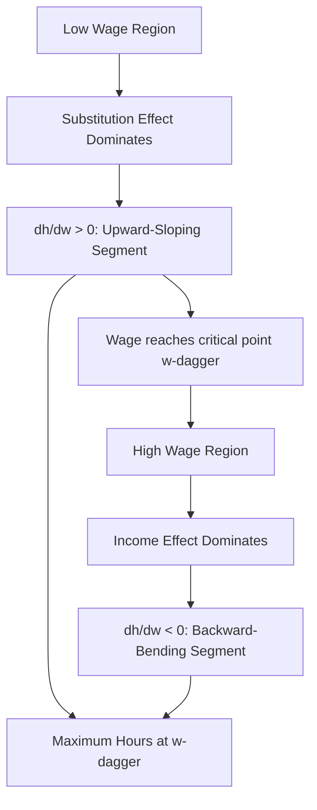

## The Backward Bending Labor Supply Curve

### Definition and Basic Shape

The backward-bending labor supply curve describes an individual labor supply function $h(w)$ in which hours worked initially rise with the wage over some range, then *decline* as the wage continues rising beyond some critical point $w^{\dagger}$, producing a curve that bends backward (leftward) in wage-hours space rather than remaining monotonically upward-sloping across the entire wage range. This is not a separate theoretical model from the standard labor-leisure framework but rather a specific empirical shape that framework permits, arising directly from the income and substitution effect decomposition once the income effect becomes sufficiently strong relative to the substitution effect at high wage/income levels.

### Theoretical Derivation from the Slutsky Decomposition

Recall the Slutsky decomposition of the wage effect on hours:

$$\frac{\partial h}{\partial w} = \underbrace{\frac{\partial h}{\partial w}\bigg|_{U=\bar{U}}}_{\text{Substitution Effect} \geq 0} - \underbrace{h \cdot \frac{\partial h}{\partial V}}_{\text{Income Effect Term} \geq 0 \text{ (in magnitude, for normal leisure)}}$$

The curve bends backward at any wage level where the (negative, for normal leisure) income effect's magnitude exceeds the (positive) substitution effect's magnitude:

$$\frac{\partial h}{\partial w} < 0 \iff \left|h \cdot \frac{\partial h}{\partial V}\right| > \left|\frac{\partial h}{\partial w}\bigg|_{U=\bar{U}}\right|$$

Intuitively, the income-effect term scales with **current hours** $h$ — at low wages, an individual works relatively few hours, so even a wage increase generates a comparatively modest total income gain, keeping the income effect small relative to the substitution effect. At high wages, the same individual is already working many hours, so a further wage increase generates a much larger total income gain (since it applies to a larger base of hours), pushing the income effect's magnitude progressively larger relative to the substitution effect — eventually causing it to dominate.

### Graphical Representation

In wage-hours (w, h) space, the curve traces out an upward-sloping path from low wages, reaches a maximum hours point at the critical wage $w^{\dagger}$ (where the substitution and income effects exactly offset, i.e., $\partial h/\partial w = 0$), and then curves back toward lower hours as the wage rises further — visually resembling the letter "C" rotated, or a backward "S," depending on whether a reservation-wage-driven lower segment is also depicted.

### Historical Motivation and Empirical Basis

The concept is closely tied to the long-run historical pattern of **declining average work hours despite substantially rising real wages** across advanced economies over the 19th and 20th centuries — from workweeks often exceeding 60 hours in the mid-19th century industrial economies to the 35-40 hour standard workweek common in many advanced economies by the mid-to-late 20th century. This long-run co-movement (rising wages, falling hours) is consistent with a labor supply curve along which the income effect has, in the aggregate and over the long run, dominated the substitution effect — though this is a claim about long-run historical trend co-movement rather than a estimate of a single stable underlying labor supply curve, since technology, social norms about the standard workweek, labor regulation, and compositional changes in the workforce have all changed substantially over the same period.

[Inference] Because this long-run pattern reflects many confounded simultaneous changes (technology, norms, household composition, taxation, labor law) rather than a controlled wage variation holding all else fixed, most modern labor economists treat it as suggestive but not dispositive evidence for backward-bending labor supply at the individual level, relying instead on more tightly identified microeconometric wage-elasticity estimates (using tax reforms, natural experiments, or panel variation) to characterize the actual shape of individual labor supply responses in specific contexts.

### Empirical Estimates of the Elasticity Sign

Modern microeconometric estimates of labor supply elasticities are mixed but generally suggest:

- **Prime-age men**: Marshallian wage elasticities are typically estimated to be small in magnitude and are sometimes found to be slightly negative, which — while not definitive evidence of a globally backward-bending curve — is consistent with operating in a wage range where income and substitution effects are close to offsetting, or where the income effect mildly dominates.
- **Married women**: historically larger positive Marshallian elasticities have been estimated, particularly at the extensive margin, suggesting this group has often been observed in a wage range where the substitution effect dominates, though these elasticities have generally declined over recent decades as female labor force attachment has become closer to that of men.
- **High earners / top of the income distribution**: some research on taxable income elasticities among top earners finds meaningfully positive responses to net-of-tax wage changes, which would suggest the substitution effect remains economically important even at high income levels for this population, complicating any simple universal backward-bending narrative.

### Policy Relevance

The backward-bending possibility is directly relevant to tax policy analysis, since it implies that **tax cuts (which raise the net wage) will not necessarily increase labor supply**, and conversely, that a policy raising marginal tax rates on high earners will not necessarily reduce their hours worked if the income effect from the associated loss in after-tax earnings partially offsets the substitution-effect disincentive of a lower net wage — this ambiguity is a standard theoretical caveat raised whenever labor supply responses are invoked in tax policy debate, and is precisely why the sign and magnitude of labor supply elasticities are treated as empirical questions rather than assumed from theory.

### Distinction from Aggregate/Market Labor Supply

The backward-bending curve describes an **individual's** hours-worked response to their own wage, holding preferences and non-labor income fixed at the individual level. It should be distinguished from the **aggregate/market labor supply curve**, which also incorporates **extensive-margin entry and exit** across the population (as market wages rise, more individuals whose reservation wage lies below the new market wage enter the labor force) — a composition effect that can keep aggregate market labor supply upward-sloping in wage-participation space even if individual intensive-margin hours curves bend backward for workers already employed.

### Key Points

- The backward-bending labor supply curve is a direct implication of the Slutsky decomposition when the (negative) income effect of a wage increase comes to dominate the (positive) substitution effect, typically posited to occur at sufficiently high wage/hours levels.
- The historical long-run decline in average hours alongside rising real wages is often cited as illustrative but is confounded by simultaneous changes in technology, norms, and policy, and is not treated as definitive individual-level evidence.
- Modern microeconometric elasticity estimates vary by demographic group, with prime-age men showing small (sometimes near-zero or slightly negative) elasticities and other groups, particularly at the extensive margin, showing more clearly positive elasticities.
- The concept underlies the standard theoretical caveat that tax rate changes do not have an unambiguously signed effect on labor supply, due to offsetting income and substitution channels.

**Related Topics**

- Taxable Income Elasticity and Top-Earner Labor Supply Responses
- Historical Trends in Working Hours Across Advanced Economies
- Extensive vs. Intensive Margin Labor Supply Elasticities
- Optimal Income Taxation and the Labor Supply Elasticity Parameter
- Life-Cycle Labor Supply Models and Intertemporal Substitution