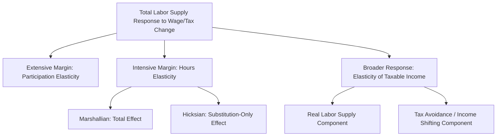

## Labor Supply Elasticities

### Why Elasticities Are the Field's Central Sufficient Statistic

Labor supply elasticities summarize, in a single parameter, how responsive hours worked or labor force participation is to changes in the net wage — the empirical quantity that resolves the theoretical ambiguity left open by the income-substitution decomposition in the static labor-leisure model. Because these elasticities feed directly into tax policy analysis (optimal taxation formulas), welfare program design, and macroeconomic modeling (real business cycle models' calibration of the aggregate labor supply response), estimating them accurately is one of the most consequential empirical exercises in the field.

### Taxonomy of Elasticity Concepts

**Marshallian (uncompensated) elasticity.** The total percentage change in hours from a 1 percent wage increase, holding the tax/transfer schedule and other prices fixed, incorporating both income and substitution effects:

$$\varepsilon^M = \frac{\partial h}{\partial w} \cdot \frac{w}{h}$$

**Hicksian (compensated) elasticity.** The percentage change in hours from a 1 percent wage increase, holding utility (not income) constant — isolating the substitution effect alone, and always non-negative under standard preferences:

$$\varepsilon^H = \frac{\partial h}{\partial w}\bigg|_{U = \bar{U}} \cdot \frac{w}{h}$$

**Income elasticity.** The percentage change in hours from a 1 percent increase in non-labor income $V$, holding the wage fixed:

$$\eta = \frac{\partial h}{\partial V} \cdot \frac{V}{h}$$

These three connect via the elasticity form of the Slutsky equation: $\varepsilon^M = \varepsilon^H - s\eta$, where $s$ is labor's income share.

**Frisch (intertemporal substitution) elasticity.** In a life-cycle/dynamic labor supply setting, the Frisch elasticity holds the marginal utility of wealth (rather than current-period utility or current income) constant, isolating the pure intertemporal substitution response to a temporary, anticipated wage change — the theoretically relevant elasticity for real-business-cycle and other dynamic macro-labor models, and generally the largest in magnitude of the standard elasticity concepts, since a temporary wage change induces workers to shift labor supply across time periods (working more when wages are temporarily high) without much wealth effect.

**Extensive-margin (participation) elasticity vs. intensive-margin (hours-conditional-on-working) elasticity.** Because the reservation-wage-driven participation decision is a discrete margin distinct from the continuous hours-choice margin, the *total* labor supply response to a wage or tax change decomposes into these two separate elasticities, which need not move together and are typically estimated using distinct empirical strategies (participation elasticities from variation affecting the extensive-margin decision, such as EITC eligibility; hours elasticities from variation among those already working).

### Empirical Estimates by Demographic Group

| Group | Marshallian (Hours) Elasticity | Extensive-Margin Elasticity | Notes |
| --- | --- | --- | --- |
| Prime-age men | Small, often near zero (sometimes slightly negative) | Small | Labor supply close to institutional full-time norm |
| Married women (historical) | Moderate to large, often 0.5–1.0+ in older studies | Large | Elasticity has declined over recent decades as attachment strengthened |
| Married women (recent) | Smaller than historical estimates, closer to men's | Smaller than historical estimates | Convergence toward male patterns documented in the literature |
| Single mothers / low-income | Small intensive-margin response | Large extensive-margin response | Central to EITC participation-effect findings |
| Older workers near retirement | N/A (participation-dominated) | Large, tied to pension/Social Security incentives | Retirement timing highly responsive to program rules |

[Inference] The general pattern that the extensive margin dominates the intensive margin, and that female labor supply elasticities have converged toward (historically lower) male estimates over recent decades, is broadly supported across many studies, though specific point estimates vary considerably by country, time period, dataset, and estimation method, so any single numerical elasticity value should be treated as method- and context-specific rather than as a universal constant.

### Identification Strategies for Estimating Elasticities

- **Tax reform natural experiments**: exploiting discrete changes in marginal tax rates or transfer program parameters (e.g., EITC expansions, tax bracket changes) via difference-in-differences or related quasi-experimental designs, comparing labor supply changes for groups differentially affected by the reform.
- **Bunching estimators**: recovering elasticities from the excess mass of the earnings distribution at kinks in the tax schedule (see: Nonlinear Budget Constraints and Taxation), exploiting cross-sectional variation in the schedule itself rather than requiring an observed reform.
- **Panel/life-cycle variation**: using within-individual variation in wages over the life cycle (correlated with age/experience) combined with a fixed-effects or first-differenced specification to estimate Frisch elasticities, controlling for time-invariant individual heterogeneity.
- **Structural life-cycle model estimation**: jointly estimating preference parameters (including the Frisch elasticity) within a fully specified dynamic optimization model using simulated method of moments or maximum likelihood, allowing recovery of elasticities not directly estimable from a single reduced-form design.
- **Natural experiments in non-labor income**: lottery winnings, inheritance, and similar windfalls isolate the income elasticity $\eta$ specifically, as discussed under Income and Substitution Effects.

### The Elasticity of Taxable Income (ETI) as a Broader Sufficient Statistic

Feldstein's (1995, 1999) **elasticity of taxable income** generalizes the hours-based labor supply elasticity to capture *all* behavioral margins through which taxpayers respond to the marginal tax rate — not just hours worked, but also effort intensity, form of compensation (e.g., shifting toward untaxed fringe benefits), tax avoidance, and income reporting/evasion. The ETI is defined analogously:

$$e_{ETI} = -\frac{\partial \ln(\text{taxable income})}{\partial \ln(1-\tau)}$$

where $\tau$ is the marginal tax rate. The ETI has become the standard **sufficient statistic** for optimal top marginal tax rate analysis (via the Saez, 2001, optimal taxation formula), because it captures the *net revenue-relevant* behavioral response without requiring the analyst to separately identify and sum every underlying margin. However, because it bundles together real labor supply responses with tax avoidance/evasion/income-shifting responses, the ETI is not a pure labor supply elasticity, and a high estimated ETI does not necessarily imply a high underlying labor supply (hours) elasticity — a distinction with direct implications for tax policy design, since avoidance-driven ETI responses may be addressable through base-broadening rather than rate changes.

### Illustrative Diagram

### Key Points

- Multiple distinct elasticity concepts — Marshallian, Hicksian, income, Frisch, extensive-margin, and intensive-margin — capture theoretically different behavioral responses and are not interchangeable in policy application.
- Empirical estimates vary substantially by demographic group; prime-age male elasticities are consistently small, while extensive-margin elasticities for other groups (particularly historically for married women, and for low-income single parents in EITC contexts) are typically larger.
- Identification strategies span tax-reform quasi-experiments, bunching estimators, panel/life-cycle variation, structural estimation, and non-labor-income natural experiments, each targeting a different elasticity concept.
- The elasticity of taxable income generalizes the pure hours-based elasticity into the standard sufficient statistic for optimal tax analysis, but conflates real labor supply responses with avoidance and income-shifting behavior.

**Related Topics**

- The Frisch Elasticity in Dynamic Labor Supply and Macro Models
- The Saez Optimal Top Tax Rate Formula and the ETI
- EITC Participation Effects and Extensive-Margin Estimates
- Convergence of Male and Female Labor Supply Elasticities Over Time
- Structural Life-Cycle Labor Supply Model Estimation