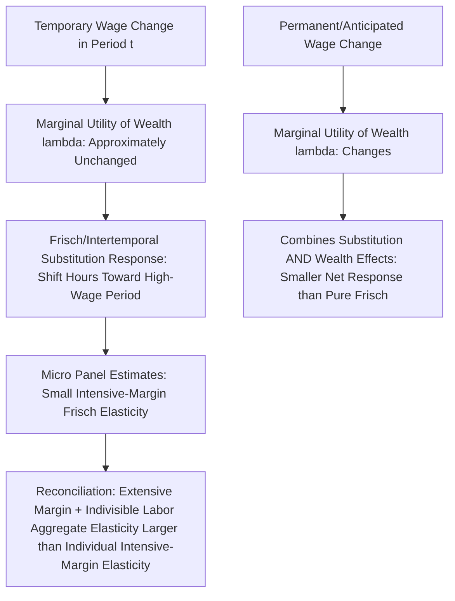

## Intertemporal Substitution in Labor Supply

### Motivation for a Dynamic Framework

The static labor-leisure model treats a single period in isolation, but real labor supply decisions are made over a multi-period (or continuous) life cycle, in which workers can shift labor supply across time in response to wages that vary over the life cycle or across the business cycle. The **intertemporal substitution hypothesis** posits that workers respond to *temporary* wage fluctuations by substituting labor supply across periods — working more in periods when the wage is temporarily high relative to their own expected future or past wage, and less when it is temporarily low — a distinct margin from the static model's response to a *permanent* wage change.

### The Life-Cycle Model Setup

The canonical life-cycle labor supply model has the worker choosing a sequence of consumption and hours $\{C_t, h_t\}_{t=0}^{T}$ to maximize discounted lifetime utility:

$$\max_{\{C_t, h_t\}} \sum_{t=0}^{T} \beta^t U(C_t, h_t)$$

subject to a lifetime (or period-by-period, with borrowing/saving) budget constraint linking consumption to labor earnings, asset returns, and an intertemporal budget/borrowing constraint:

$$A_{t+1} = (1+r)A_t + w_t h_t - C_t$$

where $A_t$ is asset holdings, $r$ is the interest rate, and $\beta$ is the subjective discount factor. This framework separates two conceptually distinct questions: how consumption and labor supply respond to *anticipated, permanent* changes in lifetime wealth (governed by the standard income effect logic), versus how they respond to *temporary, transitory* wage fluctuations around an otherwise-anticipated wage path (governed by intertemporal substitution).

### The Frisch Elasticity

The relevant elasticity concept for intertemporal substitution is the **Frisch elasticity**, which holds the marginal utility of wealth $\lambda$ (rather than current income or current-period utility) constant:

$$\varepsilon^{Frisch} = \frac{\partial h_t}{\partial w_t}\bigg|_{\lambda \; \text{fixed}} \cdot \frac{w_t}{h_t}$$

Because the marginal utility of wealth summarizes the worker's entire lifetime resource constraint in a single sufficient statistic (a standard result from dynamic programming with additively separable utility), holding $\lambda$ fixed isolates the pure substitution response to a *temporary* wage change — a wage change too small or transitory to meaningfully alter lifetime wealth and thus $\lambda$ — from any wealth/income effect. The Frisch elasticity is theoretically the largest of the standard elasticity concepts (Frisch $\geq$ Hicksian $\geq$ Marshallian, under standard conditions), since it isolates pure substitution without any offsetting income effect at all, even the modest one embedded in the Hicksian compensated elasticity.

### The Life-Cycle (Frisch) Labor Supply Equation

Under a common functional form (additively separable, isoelastic period utility), the first-order condition for hours in period $t$ yields a labor supply equation of the form:

$$\ln h_t = \text{const} + \varepsilon^{Frisch} \ln w_t - \varepsilon^{Frisch} \ln \lambda$$

Because $\lambda$ is fixed for a given individual across their life cycle (it is determined once, at the point lifetime resources are effectively "allocated," under perfect capital markets and full information about the wage path), this equation implies that **within-individual** variation in hours over time should track **within-individual** variation in the wage, holding $\lambda$ (proxied empirically by individual fixed effects in a panel regression) fixed — the basis for the standard panel-data estimation approach to the Frisch elasticity (MaCurdy, 1981).

### Empirical Estimates and the "Elasticity Puzzle"

Microeconometric panel-based estimates of the Frisch elasticity, following the MaCurdy approach, have historically tended to be **small** — often in the range of 0 to 0.5 for men — a finding that stood in tension with the calibration values used in much of the **real business cycle (RBC) macroeconomics literature**, which historically required much larger Frisch elasticities (often 2 to 4 or higher) to generate empirically realistic employment volatility from the observed magnitude of productivity/wage shocks in standard RBC models. [Inference] This divergence between microeconometric and macro-calibrated Frisch elasticities is often referred to as the "micro-macro elasticity puzzle" or "Frisch elasticity puzzle," and while several reconciling explanations have been proposed, no single explanation commands full consensus, so the underlying tension is still treated as only partially resolved in the literature.

### Proposed Reconciliations

Several explanations have been advanced for the micro-macro Frisch elasticity gap:

- **Extensive margin vs. intensive margin**: micro studies estimating hours elasticities among continuously employed workers (an intensive-margin measure) may substantially understate the *aggregate* labor supply elasticity relevant to macro models, which includes large extensive-margin (employment/non-employment transitions) responses — a point emphasized by Rogerson and others, since the extensive-margin elasticity relevant for aggregate employment fluctuations can be much larger than the intensive-margin hours elasticity for already-employed workers.
- **Indivisible labor / non-convexities (Hansen, 1985; Rogerson, 1988)**: if individual labor supply is constrained to be indivisible (workers cannot smoothly choose any continuous number of hours, but instead choose between working a fixed full-time schedule or not working at all — a reasonable approximation to many actual labor contracts), aggregate labor supply can exhibit a much higher effective elasticity than any individual's own smooth intensive-margin elasticity, since aggregate hours adjustment then occurs entirely through the number of people employed (each supplying a fixed block of hours) rather than through marginal per-person hours changes.
- **Measurement and estimation issues**: MaCurdy-style panel estimates may be affected by measurement error in wages, the difficulty of isolating truly transitory wage variation from the individual's perspective, and borrowing constraints that violate the frictionless intertemporal budget constraint assumed in the simplest life-cycle model.

### Borrowing Constraints and Deviations from the Frictionless Model

The clean life-cycle framework assumes workers can freely borrow and save at a common interest rate $r$ to smooth consumption independent of the timing of labor income. When workers face **binding borrowing constraints** (unable to borrow against future income), the simple Frisch labor supply equation breaks down, since consumption cannot be smoothed independently of current labor income — in this case, current hours worked respond not just to the wage but also to current liquidity needs, complicating the clean separation between intertemporal substitution and income effects that the unconstrained model delivers.

### Illustrative Diagram

### Relevance to Business Cycle Modeling

The Frisch elasticity is the key structural parameter governing how much aggregate hours/employment respond to productivity or wage shocks in standard RBC and New Keynesian DSGE models — a higher calibrated Frisch elasticity generates larger predicted employment fluctuations from a given-size shock. The tension between micro-estimated and macro-calibrated values remains directly relevant to ongoing debates about the correct calibration of labor supply parameters in quantitative macroeconomic models, with the indivisible-labor and extensive-margin arguments generally cited as the primary theoretical bridge between the two literatures' estimates.

### Key Points

- Intertemporal substitution describes labor supply's response to temporary (as opposed to permanent) wage changes, isolated theoretically by the Frisch elasticity, which holds the marginal utility of wealth fixed.
- The Frisch elasticity is theoretically the largest of the standard elasticity concepts, since it excludes any wealth/income effect entirely.
- Microeconometric panel-based (MaCurdy-style) Frisch elasticity estimates are typically small, in tension with the much larger values used to calibrate real business cycle models — the "micro-macro elasticity puzzle."
- Indivisible labor models and extensive-margin employment responses are the leading proposed reconciliations, since aggregate labor supply adjustment via employment transitions can exceed any individual's smooth intensive-margin hours elasticity.

**Related Topics**

- The MaCurdy (1981) Panel Estimation Approach to the Frisch Elasticity
- Indivisible Labor and the Hansen-Rogerson Model
- Real Business Cycle Models and Labor Supply Calibration
- Borrowing Constraints and Life-Cycle Consumption-Labor Smoothing
- Extensive-Margin Employment Fluctuations Over the Business Cycle