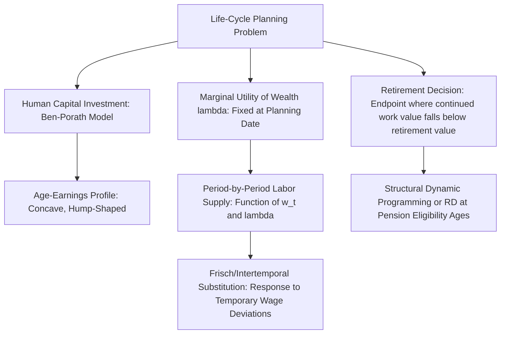

## Life Cycle Models of Labor Supply

### Purpose and Scope

Life-cycle labor supply models extend the static labor-leisure framework into a multi-period (or continuous-time) setting in which a worker plans consumption and hours across an entire working life, subject to a lifetime resource constraint rather than a single-period budget constraint. This framework is necessary to analyze phenomena the static model cannot address: the age-earnings profile, the timing of retirement, the response to anticipated versus unanticipated wage changes, and the joint determination of savings and labor supply over time.

### The Life-Cycle Consumption-Labor Problem

The worker chooses sequences $\{C_t, h_t\}_{t=0}^{T}$ to maximize discounted lifetime utility subject to an intertemporal budget/asset-accumulation constraint:

$$\max_{\{C_t, h_t\}_{t=0}^T} \sum_{t=0}^{T} \beta^t U(C_t, h_t) \quad \text{s.t.} \quad A_{t+1} = (1+r)A_t + w_t h_t - C_t, \quad A_0 \; \text{given}, \; A_{T+1} \geq 0$$

Assuming perfect capital markets (the worker can borrow and lend freely at rate $r$) and full certainty or rational expectations about the future wage path $\{w_t\}$, the model separates cleanly into two components: **consumption smoothing** (governed by the standard Euler equation relating consumption growth to the interest-rate/discount-rate wedge) and **labor supply timing** (governed by the Frisch/intertemporal substitution logic, allocating labor supply toward periods of relatively high wages).

### The Envelope Condition and the Marginal Utility of Wealth

A central technical device in life-cycle labor supply models is the **marginal utility of wealth** $\lambda$ — the Lagrange multiplier on the lifetime budget constraint, which (under additive separability across periods) is determined once at the start of the planning horizon and remains fixed thereafter (up to revision upon receipt of new information, in a stochastic setting). Each period's static first-order condition for hours takes the form:

$$\frac{\partial U(C_t, h_t)}{\partial h_t} = -\lambda \, w_t$$

This structure is what permits the clean decomposition between the *level* of hours (pinned down jointly by $\lambda$, reflecting lifetime resources, and the current wage $w_t$) and the *response* of hours to a wage change holding $\lambda$ fixed (the Frisch elasticity), as detailed under Intertemporal Substitution in Labor Supply.

### Human Capital Accumulation and the Life-Cycle Wage Profile

A defining feature of life-cycle labor supply analysis is that the wage path $\{w_t\}$ is not exogenous to the individual but is shaped by **human capital investment decisions** made earlier in the life cycle (schooling, on-the-job training), producing the characteristic concave, hump-shaped age-earnings profile formalized in the **Ben-Porath (1967) model**: young workers optimally invest more heavily in human capital (accepting lower current earnings in exchange for higher future productivity) because they have a longer remaining horizon over which to earn returns on that investment, with investment intensity declining with age as the remaining payoff horizon shrinks — directly generating the concave, eventually-flattening wage-experience profile captured empirically by the Mincer earnings equation.

### Labor Supply Over the Life Cycle: Stylized Pattern

Life-cycle models, combined with the empirical wage profile, generate testable predictions about how hours and participation should vary with age:

- **Early career**: lower wages (still accumulating human capital) but often high labor supply if young workers are relatively unconstrained by family responsibilities, alongside continued education/training investment that reduces current market hours for some individuals.
- **Prime working years**: wages near their peak, hours typically near their lifetime maximum, family formation and childcare responsibilities introducing substantial heterogeneity (particularly historically for women).
- **Pre-retirement**: wages may plateau or decline (partly reflecting selective retirement of higher earners, and partly true within-person wage patterns), with hours and participation beginning to decline as the retirement decision approaches.

### The Retirement Decision as a Life-Cycle Labor Supply Problem

Retirement is modeled within the life-cycle framework as the endpoint of the labor supply path — the age $T^*$ at which the marginal value of continued work (net wage plus continued human capital/pension accrual) falls below the marginal value of full retirement (leisure plus accumulated wealth and pension income). Because most retirement systems (Social Security, employer pensions) embed strong, often nonlinear or discontinuous incentives tied to specific claiming ages, retirement timing is heavily studied using both:

- **Structural dynamic programming models** (in the Rust-style dynamic discrete choice tradition) explicitly modeling the retirement/continued-work choice each period as a function of accumulated pension wealth, health, and the specific incentive structure of the relevant pension system.
- **Reduced-form/RD approaches** exploiting sharp eligibility age discontinuities (e.g., early and normal Social Security retirement ages) to estimate the causal effect of pension eligibility on labor supply, as discussed under Regression Discontinuity Design.

### Anticipated vs. Unanticipated Shocks

The life-cycle framework sharply distinguishes the labor supply implications of **anticipated** versus **unanticipated** wage or income changes:

- An **anticipated, permanent** wage increase (known in advance, e.g., from a scheduled promotion) is already incorporated into $\lambda$ at the point of full information, so it should generate no additional *surprise* labor supply response when it actually arrives — only the substitution response to any change in the current relative wage matters period-by-period.
- An **unanticipated, permanent** shock (news that revises the entire expected future wage path) triggers a revision to $\lambda$ itself, generating both an intertemporal substitution response *and* a wealth/income effect across the remaining life cycle.
- A **temporary, unanticipated** shock (a one-period wage spike with no revision to future expectations) generates a strong, nearly pure Frisch-elasticity-governed substitution response, since it barely moves $\lambda$ at all — this is the empirically cleanest setting for estimating the Frisch elasticity, and much of the identification strategy in that literature focuses on isolating variation that plausibly approximates this case.

### Illustrative Diagram

### Empirical Challenges Specific to Life-Cycle Estimation

- **Distinguishing age, cohort, and time effects**: because age, birth cohort, and calendar time are linearly related ($\text{time} = \text{cohort} + \text{age}$), separately identifying life-cycle (age) effects from cohort effects (permanent differences across birth cohorts) and time/macroeconomic effects requires either strong functional form assumptions or external identifying variation, a classic age-period-cohort identification problem in life-cycle empirical work.
- **Selective attrition and survivorship**: life-cycle panel data on labor supply and wages is subject to selective attrition (individuals who leave the labor force or the sample may differ systematically from those who remain), complicating estimation of the underlying wage and hours profiles.
- **Borrowing constraints**: as noted under Intertemporal Substitution, binding liquidity constraints break the clean separation between consumption smoothing and labor supply timing central to the frictionless life-cycle model, and their empirical prevalence (particularly among younger and lower-wealth households) is itself a subject of ongoing research.

### Key Points

- Life-cycle labor supply models extend the static framework across time, separating consumption-smoothing decisions (Euler equation) from labor-supply-timing decisions (Frisch elasticity), linked via the fixed marginal utility of wealth.
- The Ben-Porath human capital investment model provides the theoretical microfoundation for the life-cycle wage (age-earnings) profile that in turn shapes optimal labor supply timing.
- Retirement is modeled as the life-cycle labor supply path's endpoint, heavily studied via both structural dynamic programming and RD designs exploiting pension eligibility discontinuities.
- The framework's sharp distinction between anticipated and unanticipated, and permanent versus temporary, wage changes is central to correctly interpreting empirical labor supply responses and to identifying the Frisch elasticity specifically.

**Related Topics**

- The Ben-Porath Model of Human Capital Investment
- Structural Dynamic Programming Models of Retirement
- Age-Period-Cohort Identification Problems in Life-Cycle Data
- Social Security Claiming Age Discontinuities and Labor Supply
- Consumption Euler Equations and Life-Cycle Savings Behavior