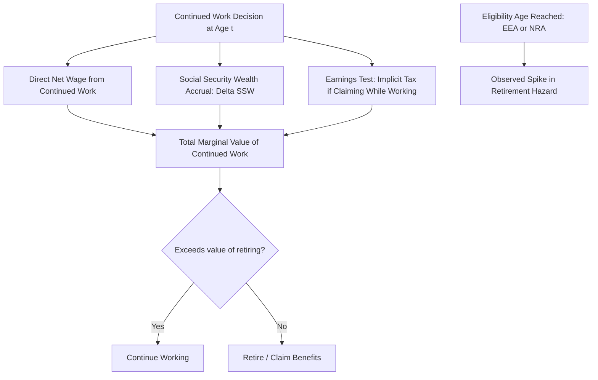

## Retirement and Social Security Incentives

### Retirement as a Life-Cycle Labor Supply Decision

Retirement is the terminal labor supply decision in the life-cycle framework: the age at which continued work's marginal value (net wage, plus continued pension/Social Security benefit accrual, plus employer-provided benefits) falls below the marginal value of full leisure financed by accumulated wealth and pension income. Because most public and private pension systems embed strong, often nonlinear incentives tied to specific ages or years of service, retirement timing is a labor supply margin unusually amenable to careful institutional analysis and quasi-experimental identification.

### Key Social Security Program Parameters (Illustrative, U.S.-Style System)

Public pension systems in most advanced economies (the U.S. Social Security system being the most heavily studied in the labor economics literature) embed several parameters that jointly determine the labor supply incentive at each potential retirement age:

- **Early Eligibility Age (EEA)**: the earliest age at which reduced benefits can be claimed (age 62 in the U.S. system).
- **Full/Normal Retirement Age (NRA)**: the age at which unreduced benefits become available, calculated from a formula based on lifetime covered earnings.
- **Delayed retirement credit**: an increase in the eventual benefit for each year claiming is postponed beyond the NRA (up to a maximum age, typically 70 in the U.S. system), intended to be roughly actuarially fair on average.
- **Earnings test**: in some systems, benefits are reduced (though often later restored via a benefit recalculation) if a claimant continues to earn above a threshold before reaching the NRA — functioning similarly to an implicit marginal tax on continued work while collecting benefits.

### The Concept of Social Security Wealth and Its Accrual

**Social Security Wealth (SSW)** is the present discounted value of the stream of future benefits an individual would receive under a given claiming/retirement age. The key incentive variable for labor supply analysis is not SSW's *level* but its **accrual** — how SSW changes with an additional year of continued work, since this accrual (positive or negative) functions as an implicit tax or subsidy on continued labor supply, added to or subtracted from the direct net wage:

$$\text{Implicit tax/subsidy on working an additional year} = -\Delta SSW + \text{(forgone benefits while still working, if earnings test binds)}$$

If SSW accrual is actuarially unfair at the margin (i.e., an additional year of work and delayed claiming does *not* fully compensate, in expected present value, for the year of forgone benefits), this functions as an implicit tax on continued work, discouraging labor supply beyond that age — a mechanism central to the influential work of Gruber and Wise's cross-country comparative studies attributing much of the cross-country variation in retirement ages to differences in pension system incentive structures.

### Empirical Approaches to Estimating Retirement Responses

**Regression discontinuity at eligibility ages.** Because EEA and NRA are sharp age thresholds, RD designs comparing labor force participation and hours just before and after these ages provide clean estimates of the pure incentive effect of benefit eligibility, net of any confounding health or preference trends that might otherwise correlate with age (see Regression Discontinuity Design for the general methodology).

**Bunching at the earnings test threshold.** Where an earnings test creates a kink or notch in the effective net-of-benefit-tax budget constraint for continued workers, bunching estimator methodology (see Nonlinear Budget Constraints and Taxation) has been applied to estimate labor supply responses to the implicit marginal tax the earnings test creates.

**Structural dynamic programming models.** Because the retirement decision is inherently forward-looking (today's choice affects the entire future benefit stream), and because health, spousal labor supply, and employer-provided pension incentives interact with public pension rules, much of the empirical retirement literature uses Rust-style structural dynamic discrete choice estimation (see Structural Estimation of Labor Market Models) to jointly model the full sequential retirement decision and simulate counterfactual policy reforms (e.g., raising the NRA) that cannot be directly observed in historical data.

**Cross-national comparative studies.** The Gruber-Wise research program compared retirement ages and estimated pension system incentive measures (like SSW accrual) across many OECD countries, finding a strong cross-country correlation between the implicit tax rate on continued work embedded in national pension rules and the observed concentration of retirement around specific ages — widely cited evidence that pension system design, not merely underlying health or preference differences, substantially shapes observed retirement timing.

### Spikes in Retirement at Eligibility Ages

A well-documented empirical pattern is pronounced **bunching (spikes) in retirement hazard rates exactly at EEA and NRA**, considerably sharper than a smoothly declining age-retirement profile would predict from health or preference heterogeneity alone. [Inference] This pattern is generally interpreted as evidence that liquidity constraints (workers who would prefer to retire earlier but cannot afford to before becoming eligible for benefits) and/or reference-point or default effects around salient, round-number eligibility ages contribute to retirement timing beyond what the pure actuarial-incentive calculation implies, though the relative contribution of liquidity constraints versus behavioral/reference-point explanations remains an active area of research rather than a fully settled decomposition.

### Interaction with Private Pensions and Health Insurance

In many countries, employer-provided pensions and retiree health insurance eligibility create additional, often even sharper, age- or tenure-based discontinuities layered on top of public pension incentives — for example, in the U.S. context, eligibility for Medicare at age 65 has been studied as a significant independent driver of retirement timing (and of "job lock" reduction) among workers who previously relied on employer-provided health coverage, since Medicare eligibility removes a major reason to remain employed purely for health insurance access.

### Illustrative Diagram

### Key Points

- Retirement is modeled as the endpoint of life-cycle labor supply, determined by comparing the marginal value of continued work (net wage plus pension wealth accrual) against the value of retiring.
- Social Security Wealth accrual — not SSW's level — is the relevant labor supply incentive variable, functioning as an implicit tax or subsidy on continued work depending on whether accrual is actuarially fair.
- RD designs at sharp eligibility age thresholds, bunching estimators at earnings-test kinks, and structural dynamic programming models are the primary empirical approaches to estimating retirement responses to pension incentives.
- Observed retirement hazard spikes at eligibility ages exceed what smooth incentive/preference heterogeneity alone would predict, implicating liquidity constraints and/or reference-point effects alongside the pure actuarial incentive channel.

**Related Topics**

- The Gruber-Wise Cross-National Comparative Pension Studies
- Structural Dynamic Programming Models of the Retirement Decision
- Medicare Eligibility, Job Lock, and Retirement Timing
- Liquidity Constraints vs. Reference-Point Effects in Retirement Bunching
- Optimal Design of Public Pension Systems and Labor Supply Incentives