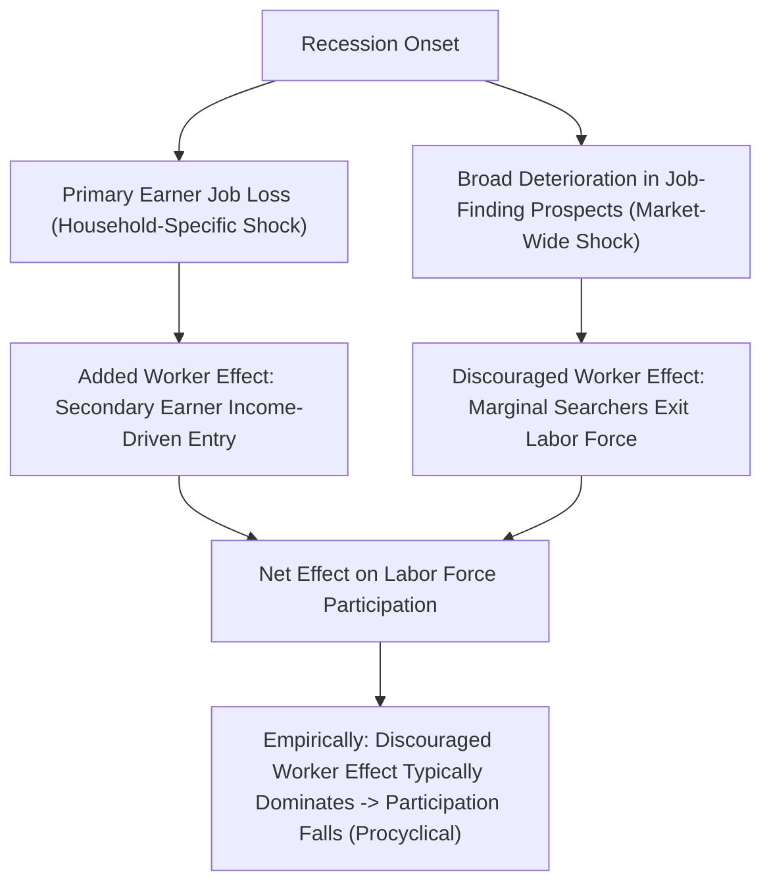

## Added Worker and Discouraged Worker Effects

### Overview: Household Labor Supply Responses to Income Shocks

The added worker and discouraged worker effects describe two distinct household-level labor supply responses to a negative shock — most commonly job loss or a spell of unemployment experienced by one household member — with opposite implications for aggregate labor supply and, therefore, for how measured unemployment behaves over the business cycle. Both effects arise from extending the static labor-leisure and life-cycle frameworks to a **household**, rather than purely individual, decision unit.

### The Added Worker Effect

The **added worker effect** describes the labor supply response of a **secondary earner** (historically, and still disproportionately in much of the literature, framed as the wife in a married-couple household) to a **negative income shock from the primary earner's job loss or reduced hours**. Because a primary earner's job loss reduces total household non-labor/other-member income, the household's remaining resources fall, and — through the standard income effect logic applied at the household level — the secondary earner's reservation wage falls, potentially inducing them to enter the labor force (or increase hours) as insurance against the primary earner's income loss.

Formally, within a household utility framework treating members' labor supplies as jointly chosen subject to a shared household budget constraint, the added worker effect operates through the cross-partial relationship between one member's earnings shock and another member's labor supply:

$$\frac{\partial h_2}{\partial (\text{primary earner's job loss})} > 0$$

reflecting a pure income effect on the secondary earner's participation decision, analogous to the individual-level income effect but transmitted across household members via the shared budget constraint rather than via the individual's own wage.

### The Discouraged Worker Effect

The **discouraged worker effect** describes a different, and typically opposite-signed at the aggregate level, phenomenon: during recessions, when job-finding prospects deteriorate broadly (not merely for one household's primary earner, but market-wide), some individuals — including potential secondary earners, but also unemployed job seekers generally — **withdraw from active job search and exit the labor force entirely**, rather than continuing to search unsuccessfully, because the low expected probability of finding work reduces the expected value of continued search below the value of non-participation. Because official unemployment measures require *active* job search to be classified as unemployed (rather than merely not-employed), discouraged workers who stop searching exit the *measured labor force* entirely, moving from the "unemployed" to the "not in the labor force" (specifically, the "marginally attached" sub-category) status.

### Net Effect on Measured Labor Force Participation Over the Cycle

These two effects operate in **opposite directions** during a recession, and their relative magnitudes determine the net cyclical behavior of aggregate labor force participation:

- **Added worker effect** (income-driven): recession → primary earner job loss more common → secondary earners more likely to enter the labor force → participation rises (or falls less than it otherwise would).
- **Discouraged worker effect** (search-value-driven): recession → poor job-finding prospects broadly → marginal potential entrants and unsuccessful searchers exit the labor force → participation falls.

Empirically, most of the literature finds the **discouraged worker effect dominates** the added worker effect in the aggregate over the modern business cycle, such that measured labor force participation is **procyclical** (falls in recessions, recovers in expansions) rather than countercyclical, implying that official unemployment rate statistics likely **understate** the true cyclical deterioration in labor market conditions during downturns, since some individuals who would prefer to work (and who might be captured by a broader non-employment measure) exit the measured labor force and thus exit the unemployment rate's denominator and numerator alike.

[Inference] The empirical dominance of the discouraged worker effect over the added worker effect is a reasonably well-supported finding across the modern (post-1980s or so) U.S. business cycle literature, though the relative magnitude of the two effects has been found to vary across time periods, demographic groups, and countries, and some earlier historical periods or specific recessions have shown different relative magnitudes — so this should be understood as the dominant modern empirical pattern rather than a theoretically guaranteed universal result.

### Illustrative Diagram

### Measurement and the U-3 vs. U-6 Distinction

The discouraged worker effect is directly connected to the gap between the official U.S. unemployment rate (U-3, requiring active search) and the broader U-6 measure, which includes **marginally attached workers** (those who want a job, are available, and have searched within the past 12 months but not the past 4 weeks — the population most directly capturing discouraged workers) and **involuntary part-time workers**. During and after recessions, U-6 typically rises by more, and falls back more slowly, than U-3, consistent with discouraged-worker dynamics amplifying the gap between the headline and broader unemployment measures during downturns (see Labor Market Data Sources and Measurement for the full definitional detail of these measures).

### Household Labor Supply Modeling Context

Both effects rest on treating the household — not solely the individual — as the relevant decision-making unit for at least the secondary earner's labor supply choice, connecting this topic to the broader household/collective labor supply modeling literature (unitary household models, where a single household utility function governs all members' choices, versus collective/bargaining models, where household members may have distinct preferences reconciled through an intra-household bargaining process). The added worker effect's magnitude, in particular, has been found in some research to depend on intra-household bargaining power and the structure of the household's insurance arrangements, rather than following mechanically from a simple pooled-income unitary model.

### Policy and Business Cycle Implications

- **Unemployment insurance design**: because discouraged workers exit the labor force and are no longer counted as unemployed, some UI eligibility rules (which typically require active job search) systematically exclude precisely the population that has withdrawn from search, complicating the interaction between benefit design and this margin.
- **Interpreting the unemployment rate as a business cycle indicator**: analysts and policymakers increasingly supplement the headline unemployment rate with participation rate trends and broader measures (U-6, the employment-to-population ratio) specifically because the discouraged worker effect can make U-3 understate labor market slack during and immediately after recessions.
- **Household insurance and safety net design**: the added worker effect functions as an informal, household-level insurance mechanism against primary-earner income loss, relevant to debates about the appropriate generosity of formal unemployment insurance (since households with an available secondary earner may have partial self-insurance that single-earner households lack).

### Key Points

- The added worker effect describes secondary earners' entry into the labor force in response to a primary earner's job loss — a household-level income effect.
- The discouraged worker effect describes exit from the labor force by individuals facing poor job-finding prospects during broad downturns, reducing the measured labor force.
- The two effects operate in opposite directions over the business cycle; the discouraged worker effect is generally found to dominate empirically in the modern era, making aggregate labor force participation procyclical.
- This dynamic implies the headline unemployment rate can understate the true cyclical deterioration in labor market conditions, motivating supplementary use of broader measures (U-6, participation rate, employment-to-population ratio).

**Related Topics**

- Unitary vs. Collective Household Labor Supply Models
- The U-3/U-6 Gap and Marginally Attached Workers
- Employment-to-Population Ratio as a Business Cycle Indicator
- Unemployment Insurance Eligibility and Labor Force Exit
- Intra-Household Bargaining and Secondary-Earner Labor Supply