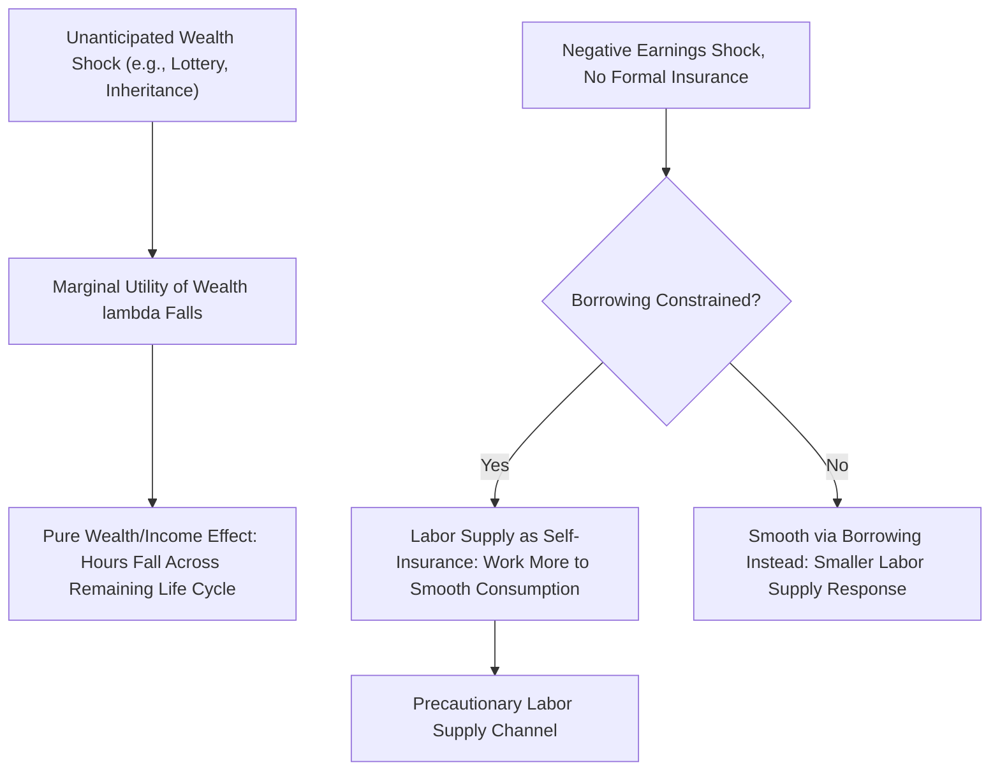

## Savings, Wealth, and Labor Supply Interactions

### The Joint Determination of Savings and Labor Supply

In the life-cycle framework, consumption/savings and labor supply are chosen jointly, not independently, because both draw on the same intertemporal budget constraint and both affect and are affected by the evolving stock of wealth $A_t$. This joint determination means that shocks to one margin (wealth) generically affect the other (labor supply), through channels distinct from the pure intertemporal (Frisch) substitution response to wage variation covered in Intertemporal Substitution in Labor Supply. This topic focuses specifically on how the **level and unanticipated changes in wealth** — as opposed to the timing of wages — affect labor supply.

### Wealth Effects on Labor Supply: Theoretical Channel

Holding the wage path fixed, an increase in initial wealth $A_0$ (or an unanticipated positive wealth shock at any point in the life cycle) raises the marginal utility of wealth's inverse — that is, it lowers $\lambda$, the marginal utility of wealth itself, since the same marginal unit of consumption is now less scarce. Because each period's labor supply first-order condition depends on $\lambda$ (as detailed in Life Cycle Models of Labor Supply), a fall in $\lambda$ reduces optimal hours in every subsequent period, given normal leisure — a pure wealth/income effect operating across the *entire remaining life cycle*, not merely the period in which the wealth shock occurs.

$$\frac{\partial h_t}{\partial A_0} < 0 \quad \text{(for } t \text{ periods following the wealth increase, given normal leisure)}$$

This distinguishes a wealth shock from a temporary wage shock: a wealth shock (holding future wages fixed) generates a pure income effect with no offsetting substitution effect, whereas a temporary wage shock generates a Frisch-type substitution response with only a modest offsetting income effect (since a single period's wage change barely moves lifetime wealth).

### Empirical Evidence: Lottery Winnings and Windfalls

Because unanticipated wealth shocks are rarely observed in isolation from confounding factors in typical economic data, researchers have exploited genuinely random or plausibly exogenous windfalls to isolate the pure wealth effect on labor supply:

- **Imbens, Rubin, and Sacerdote (2001)** studied Massachusetts lottery winners, comparing labor supply outcomes of large-prize winners to small-prize winners (both groups equally likely to play the lottery and thus similar in unobserved characteristics), finding a negative but economically modest effect of prize size on subsequent earnings and labor force participation — consistent with a wealth effect that exists but is far from fully crowding out work.
- **Inheritance-based studies** find broadly similar qualitative results: inheritance receipt reduces labor supply, particularly at the extensive margin, but the estimated magnitude is generally modest relative to the size of the inheritance, implying most inheritance windfalls are not primarily used to finance substantially earlier retirement or major labor supply reductions.

[Inference] The consistent finding across this literature — a statistically real but quantitatively modest negative wealth effect on labor supply — has been influential in calibrating the income-effect parameter in structural life-cycle and macro-labor models, though the precise magnitude used still varies across studies depending on the specific windfall source, population studied, and time horizon over which labor supply is measured.

### Housing Wealth and Labor Supply

A distinct strand of research examines whether fluctuations in **housing wealth** (driven by regional house price cycles, largely orthogonal to an individual homeowner's own labor market outcomes) affect labor supply, particularly retirement timing and older workers' labor force exit decisions. [Unverified] Findings in this literature are more mixed than the lottery/inheritance literature, in part because housing wealth changes are harder to cleanly separate from local labor market conditions (a regional house price boom often coincides with regional labor demand strength, confounding the pure wealth channel with a local labor demand channel) — so this remains a methodologically more contested area than the cleaner lottery-based wealth effect estimates.

### Precautionary Savings and Labor Supply as Self-Insurance

Beyond the pure wealth-level effect, the life-cycle framework with **uninsurable earnings risk** (a standard extension incorporating idiosyncratic, partially persistent wage/employment shocks that cannot be fully insured through formal markets) generates an additional channel: labor supply itself can function as a form of **self-insurance** against income risk, since a worker facing negative shocks to wealth or earnings can partially buffer consumption by working more (an "added worker"-style margin operating at the individual level over time, distinct from the household-level added worker effect covering a *different* household member's response). This precautionary labor supply channel is closely related to, but conceptually distinct from, precautionary *savings* — both serve as buffers against uninsured risk, and models incorporating both margins jointly find that labor supply flexibility can substitute for, and thereby reduce, the precautionary savings that would otherwise be needed purely through asset accumulation.

### Borrowing Constraints and the Wealth-Labor Supply Relationship

When workers face **binding borrowing constraints** — unable to borrow against future income to smooth consumption — the wealth effect on labor supply becomes considerably more pronounced for currently low-wealth, constrained households than the frictionless model would predict, since these households cannot substitute borrowing for additional current labor supply in response to a negative income shock, and thus rely disproportionately on the labor supply margin itself for consumption smoothing. This connects the wealth-labor-supply literature to the broader literature on financial constraints and their labor market implications, and provides a theoretical rationale for why measured labor supply responses to income shocks can differ substantially by a household's baseline wealth or liquidity position (a form of estimated heterogeneous treatment effects along the wealth distribution).

### Illustrative Diagram

### Interaction with Optimal Taxation and Transfer Design

The magnitude of the wealth effect on labor supply is directly relevant to the design of one-time transfer payments (e.g., stimulus checks, universal basic income proposals) as opposed to ongoing wage subsidies, since a policy operating primarily through a wealth/income channel (a lump-sum transfer) is expected — per the theory above — to generate a modest negative labor supply response with no offsetting substitution effect, in contrast to a policy that alters the marginal net wage (such as an EITC-style earnings subsidy), where the substitution effect can offset or reverse the income effect's disincentive, as detailed under Nonlinear Budget Constraints and Taxation and Labor Supply Elasticities.

### Key Points

- Savings and labor supply are jointly determined in the life-cycle model through the shared marginal utility of wealth, meaning wealth shocks affect labor supply across the entire remaining life cycle, not just contemporaneously.
- Lottery- and inheritance-based natural experiments find a real but quantitatively modest negative wealth effect on labor supply, informing calibration of income-effect parameters in structural models.
- Labor supply functions as a self-insurance/precautionary margin against uninsurable earnings risk, particularly for borrowing-constrained households, substituting in part for precautionary asset accumulation.
- The pure wealth-effect channel (no offsetting substitution effect) is a key theoretical distinction motivating why lump-sum transfers and wage-linked subsidies are predicted to have different labor supply consequences.

**Related Topics**

- Precautionary Savings Models with Uninsurable Earnings Risk
- Borrowing Constraints and Consumption-Labor Supply Smoothing
- Housing Wealth Effects on Retirement Timing
- Universal Basic Income and Labor Supply: Theoretical Predictions
- Heterogeneous Agent Models Incorporating Labor Supply Margins