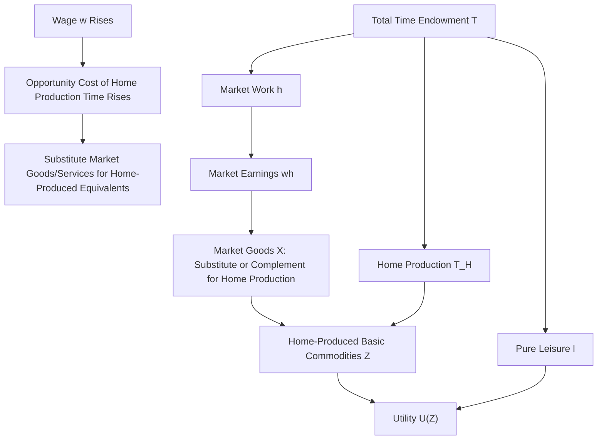

## Household Production Theory

### Motivation: Beyond Market Work and Pure Leisure

The basic labor-leisure model treats all non-market time as undifferentiated "leisure." Household production theory, developed principally by **Gary Becker** (1965, "A Theory of the Allocation of Time") and extended by **Reuben Gronau** (1977), disaggregates non-market time into **home production** — time spent producing goods and services consumed by the household (cooking, childcare, cleaning, home maintenance) — and **pure leisure** in the narrower sense. This distinction matters because home-produced goods are substitutes for market-purchased goods and services, meaning the household's labor supply, consumption, and home-production decisions are jointly determined, not separable.

### The Becker Framework: Households as Producers

Becker's model treats the household as a small firm that combines purchased market goods $X$ and members' time $T_H$ (home production time) via a household production function to generate **basic commodities** $Z$ that directly enter utility, rather than treating market goods themselves as the direct arguments of utility:

$$Z = f(X, T_H)$$

$$U = U(Z_1, Z_2, \ldots, Z_n)$$

The household then maximizes utility over these basic commodities subject to both a **time constraint** (total time allocated across market work $h$, home production $T_H$, and leisure $l$) and a **full income (goods) constraint** (market goods purchased with labor earnings plus non-labor income):

$$T = h + T_H + l, \qquad wh + V = p_X X$$

where $p_X$ is the price of market goods. This structure generates a key theoretical implication distinct from the basic model: an increase in the market wage raises the opportunity cost not only of pure leisure but also of **time spent in home production**, creating an incentive to substitute *market-purchased* goods and services for *home-produced* equivalents (e.g., purchasing prepared meals or paid childcare rather than producing these at home) as the wage rises — a mechanism with no counterpart in the basic two-good (consumption, leisure) model.

### The Gronau Extension: Separating the Non-Market Time Margin

Gronau (1977) formalized the three-way time allocation (market work, home production, leisure) more explicitly, introducing the **shadow price of home-produced time** — the value of an additional unit of home production time, determined by the household production function's marginal product, which need not equal the market wage. This shadow price is central to a refined participation/allocation decision:

- If the market wage exceeds the shadow value of time in home production, the individual optimally shifts time from home production toward market work (and potentially purchases market substitutes for the reduced home production).
- If home production's marginal value exceeds the market wage (e.g., for a parent whose home-produced childcare has high value relative to their potential market wage, particularly if quality childcare substitutes are expensive or imperfect substitutes), the individual optimally allocates more time to home production, holding market work lower — providing a theoretical account of non-participation distinct from simple leisure preference, framing it instead as **specialization in home production** rather than pure leisure consumption.

### Implications for the Gender Division of Labor

Household production theory has historically been applied extensively to explain the gender division of market and home labor, particularly in couples: if one spouse has a comparative advantage in home production (whether due to preferences, human capital specific to home production, wage differentials in the market, or social/institutional factors) and the other has a comparative advantage in market work, **specialization** — one spouse concentrating in market work, the other in home production — can be efficient for the household as a unit, even absent any within-person differences in innate ability, analogous to gains from trade in international trade theory.

[Inference] This specialization framework, while historically influential in explaining observed gender patterns in market and home labor allocation, has drawn substantial critique — including feminist economics critiques questioning whether the "comparative advantage" driving specialization reflects genuine underlying productivity differences or reflects prior discrimination, social norms, and bargaining power asymmetries within the household that are themselves the object requiring economic explanation rather than a exogenous starting point for the model — so the framework is best understood as one influential lens among several competing accounts of the gendered division of household labor, rather than as a settled, uncontested explanation.

### Substitution Between Market Goods and Home Production

A central empirical implication of household production theory is that rising female labor force participation over the 20th century should be accompanied by (and is, empirically, associated with) substitution toward **market substitutes for home-produced goods**: the growth of the prepared/restaurant food industry, paid childcare and eldercare markets, commercial laundry and cleaning services, and household labor-saving durable goods (washing machines, dishwashers, microwave ovens) are commonly analyzed as complementary developments to rising market labor force participation, both as cause (falling relative prices of these substitutes lowering the effective cost of market work) and as effect (rising market work raising demand for time-saving substitutes) — the underlying causal direction is generally treated as running both ways, forming a mutually reinforcing pattern rather than a single one-directional causal story.

### Household Production and Measured GDP

Because national income accounting conventions generally exclude the value of unpaid home production from GDP (with the partial exception of imputed rental value of owner-occupied housing), household production theory underlies methodological critiques of GDP as a welfare measure: a shift of activity from unpaid home production to paid market production of the *same underlying goods and services* (e.g., a household switching from home-cooked meals to restaurant meals) mechanically raises measured GDP without necessarily raising total welfare or total output of the underlying basic commodities, a point with direct relevance to interpreting the long-run rise in measured female labor force participation as a "pure" output/welfare gain versus partly a reallocation from unmeasured to measured production.

### Time-Use Data and Empirical Application

Because household production theory's core predictions concern the allocation of time across market work, home production, and leisure — not merely market work versus an undifferentiated residual — testing the theory empirically requires **time-use survey data** (e.g., the American Time Use Survey, ATUS) that separately measures time spent in these distinct categories, rather than relying solely on standard labor force survey data (CPS-style), which captures market work and non-work but does not distinguish the composition of non-market time.

### Illustrative Diagram

### Key Points

- Household production theory (Becker, Gronau) disaggregates non-market time into home production and pure leisure, treating households as producers of basic commodities from market goods and time inputs.
- A wage increase raises the opportunity cost of home production time, not just leisure, predicting substitution toward market-purchased substitutes for home-produced goods and services as wages rise.
- The framework has been influentially, though also contentiously, applied to explain gendered specialization in market versus home labor via a comparative-advantage/gains-from-trade logic within the household.
- Because GDP excludes unpaid home production, shifts from home to market production of equivalent goods mechanically raise measured GDP, complicating the interpretation of some observed labor supply trends as pure welfare gains.

**Related Topics**

- Time-Use Survey Data and the American Time Use Survey
- Gronau's Shadow Price of Home Production Time
- Feminist Economics Critiques of Household Specialization Models
- The Growth of Market Substitutes for Home Production (Food, Childcare Services)
- GDP as a Welfare Measure: Home Production and Measurement Critiques