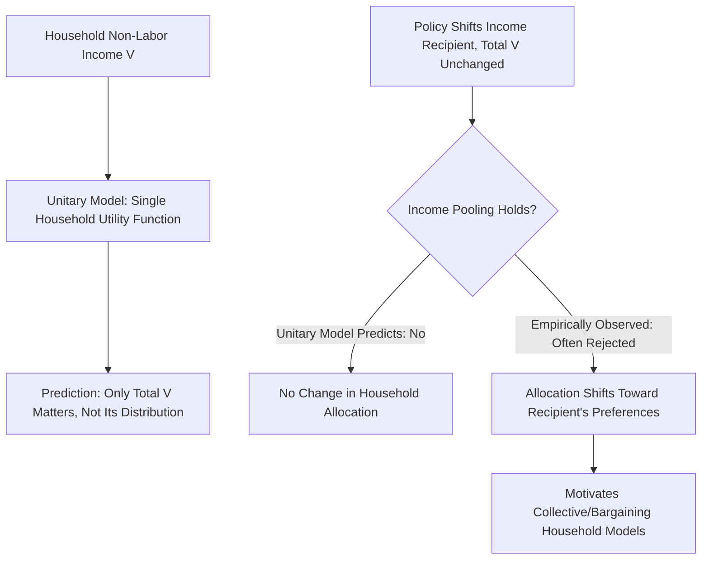

## Unitary Models of the Family

### Core Assumption of the Unitary Framework

The unitary model treats the household as a **single decision-making unit** with a single, well-defined household utility function, as if the household were an individual agent maximizing joint preferences subject to a pooled household budget constraint. This is the framework implicit in the earliest applications of household labor supply theory (including much of Becker's household production work), and it remains the analytically simplest and historically dominant starting point for modeling multi-person household labor supply decisions.

### Formal Structure

A two-member household (indexed 1 and 2) with the unitary model maximizes a single household utility function over both members' consumption and leisure:

$$\max_{C_1, C_2, l_1, l_2} \; U(C_1, C_2, l_1, l_2)$$

subject to a **pooled** household budget constraint:

$$C_1 + C_2 = w_1 h_1 + w_2 h_2 + V$$

where $V$ is total household non-labor income, regardless of which member "owns" or receives it. The defining feature — and the model's key testable implication — is that **only total household income matters** for the household's joint consumption-leisure allocation; the *identity* of which member receives a given dollar of non-labor income (or, in some formulations, even labor income) should be irrelevant to household outcomes, since it is pooled and reallocated according to the single household utility function regardless of source.

### The Income Pooling Hypothesis

This "irrelevance of income source" implication is formalized as the **income pooling hypothesis**: household consumption and labor supply outcomes should depend only on *total* household non-labor income $V = V_1 + V_2$, not on how that income is distributed between the two members' individual incomes $V_1$ and $V_2$ separately. This is a strong and directly testable prediction — if the unitary model is correct, a policy that transfers a fixed amount of non-labor income from one spouse to the other (holding the household total fixed) should have **no effect** on household consumption allocation, labor supply, or spending patterns, since only the total matters.

### Theoretical Justifications for the Unitary Assumption

Two distinct theoretical routes can justify treating the household as a single unitary decision-maker despite consisting of multiple individuals with potentially distinct preferences:

- **Altruism/caring preferences (Becker's "Rotten Kid Theorem")**: if one household member (a sufficiently altruistic "household head") cares about all members' welfare and controls the allocation of resources, that head's optimization can generate outcomes observationally equivalent to unitary maximization, and Becker's Rotten Kid Theorem shows that under specific conditions, even a purely self-interested member will act to maximize total household resources (since the altruistic head will redistribute accordingly), generating unitary-model-consistent behavior without requiring all members to be altruistic themselves.
- **A single decision-maker with full control**: alternatively, if resource allocation decisions are made unilaterally by one household member with unconstrained authority over the pooled budget, the household's behavior is mechanically unitary by construction, though this is a strong assumption about intra-household power distribution rather than a derived equilibrium result.

### Empirical Testing and Rejection of Income Pooling

A substantial empirical literature has directly tested the income pooling hypothesis by examining whether household consumption/expenditure patterns respond to the **distribution**, not just the total, of household income:

- **Lundberg, Pollak, and Wales (1997)** studied a U.K. policy change (the late-1970s shift of child benefit payments from being delivered via the tax system, typically benefiting the primary — usually male — earner's paycheck, to being paid directly to mothers) and found the reform was associated with a shift in household expenditure toward goods more commonly associated with children's and women's consumption (e.g., women's and children's clothing), a shift the unitary model's income pooling hypothesis predicts should not occur, since total household income was unchanged.
- Similar tests using other policy or program changes shifting the identity of the income recipient within couples (various cash transfer and pension program studies across different countries) have generally found broadly similar results: **income pooling is empirically rejected** in most studies that test it directly, with expenditure and, in some studies, labor supply patterns responding to which spouse controls or receives a given increment of income, not merely to the household total.

[Inference] The accumulated weight of this empirical literature is generally regarded as having substantially undermined the unitary model as a literal description of household decision-making, motivating the shift toward collective and bargaining-based household models (discussed as a related topic below), though the unitary model remains in active use as a simplifying benchmark in applied work where full collective modeling is not tractable or where the specific research question does not turn on intra-household distributional issues.

### Why the Unitary Model Remains Analytically Useful Despite Rejection

Despite the accumulated evidence against strict income pooling, the unitary model retains value in applied labor economics for several reasons:

- **Analytical tractability**: unitary models permit direct application of standard single-agent consumer/labor-supply theory (Slutsky decomposition, standard comparative statics) to household-level data without requiring the additional structure (bargaining weights, distribution factors) collective models demand.
- **First-order approximation for many questions**: for research questions concerning aggregate household labor supply responses to a *jointly experienced* shock (e.g., a household-wide tax change, rather than a shock differentially affecting one spouse's income specifically), the unitary model's predictions may closely approximate collective-model predictions, since the key testable divergence (income-source sensitivity) is specifically about differential, not joint, income changes.
- **Data limitations**: many standard household survey datasets lack the individual-level consumption and time-use detail needed to estimate a full collective model, making the unitary framework the practically feasible default in many applied contexts even where its literal validity is doubted.

### Illustrative Diagram

### Relationship to Household Production Theory

The unitary model is a distinct (though often jointly applied) simplifying assumption from Becker's household production framework (see Household Production Theory): household production theory concerns *how* market goods and time combine to produce utility-generating basic commodities, while the unitary assumption concerns *whose* preferences and *whose* resource claims govern the household's joint decision — the two are logically separable, and much of the classic Becker household literature combines both assumptions, but a collective (non-unitary) model can equally incorporate household production technology.

### Key Points

- The unitary model treats the household as maximizing a single joint utility function subject to a pooled budget constraint, implying the strong and directly testable income pooling hypothesis: only total household non-labor income matters, not its distribution across members.
- Becker's Rotten Kid Theorem provides one theoretical justification for unitary-consistent behavior emerging even without full altruism from every member, given sufficient concentrated control by an altruistic household head.
- Empirical tests (notably Lundberg, Pollak, and Wales's U.K. child benefit study) generally reject strict income pooling, finding household expenditure patterns respond to which spouse receives income, not merely to the household total.
- Despite this empirical rejection, the unitary model remains widely used for its tractability and as a reasonable approximation for research questions not centered on intra-household distributional dynamics.

**Related Topics**

- Collective Household Labor Supply Models and Bargaining Power
- Becker's Rotten Kid Theorem in Detail
- The Lundberg-Pollak-Wales Child Benefit Natural Experiment
- Distribution Factors and Intra-Household Resource Allocation
- Time-Use and Consumption Data Requirements for Testing Household Models