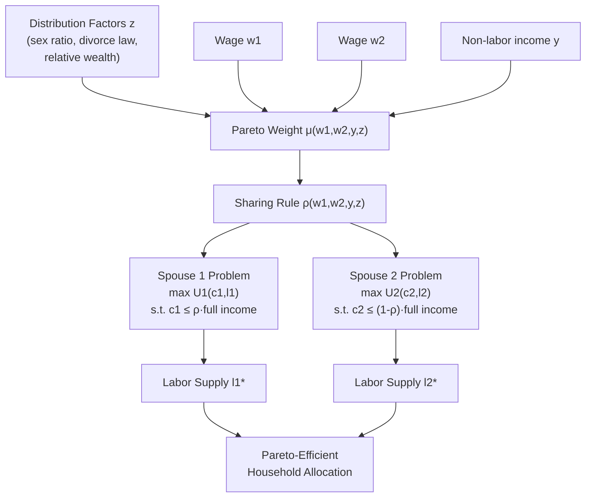

## Collective Household Bargaining Models

### Overview and Motivation

Collective household bargaining models represent a class of theories in labor economics that explain how households composed of multiple decision-makers (typically two adults) allocate time, income, and consumption. These models were developed as a direct response to the theoretical and empirical shortcomings of the **unitary household model**, which treats the household as a single decision-making unit with one pooled budget constraint and one utility function.

The unitary model implies two testable restrictions:

1. **Income pooling**: only total household income matters for demand and labor supply decisions, not which spouse earns it.
2. **Slutsky symmetry**: cross-price effects on labor supply are symmetric across spouses.

Empirical work throughout the 1980s and 1990s (Thomas, 1990; Schultz, 1990; Lundberg, Pollak, and Wales, 1997) repeatedly rejected income pooling — the identity of the income recipient within the household significantly affected expenditure patterns (e.g., child welfare outcomes) even holding total income fixed. This motivated a shift toward models that explicitly represent two agents with potentially different preferences.

---

### Theoretical Foundations

#### The Unitary Model as a Baseline

In the unitary framework, the household maximizes:

$$\max_{c, l_1, l_2} \; U(c, l_1, l_2) \quad \text{s.t.} \quad c = w_1(T - l_1) + w_2(T - l_2) + y$$

where $c$ is household consumption, $l_i$ is leisure of spouse $i$, $w_i$ is the wage, $T$ is the time endowment, and $y$ is non-labor income. This collapses two potentially distinct preference orderings into one, and is the object collective models replace.

#### Collective Model Core Structure

Introduced by **Chiappori (1988, 1992)**, the collective model assumes:

- Each spouse $i$ has an individual, egoistic or caring utility function $U_i(c_1, c_2, l_i)$.
- Household decisions are **Pareto efficient** — this is the model's only structural assumption, not a specific bargaining protocol.
- Efficiency is achieved via a **sharing rule** $\phi(w_1, w_2, y, z)$, where $z$ is a vector of distribution factors.

The household solves a weighted welfare maximization:

$$\max_{c_1, c_2, l_1, l_2} \; \mu \, U_1(c_1, c_2, l_1) + (1-\mu) \, U_2(c_1, c_2, l_2)$$

$$\text{s.t.} \quad c_1 + c_2 = w_1(T-l_1) + w_2(T-l_2) + y$$

Here $\mu = \mu(w_1, w_2, y, z) \in [0,1]$ is the **Pareto weight**, a reduced-form object summarizing each spouse's bargaining power. The key theoretical contribution is that **any Pareto-efficient allocation can be represented this way for some value of $\mu$**, regardless of the underlying bargaining protocol (Nash bargaining, non-cooperative bargaining with an efficient outcome, or any other efficient mechanism).

**[Inference]** The generality of the Pareto-weight representation is often cited as both the model's main strength (it nests many specific bargaining theories) and its main empirical limitation (it does not by itself identify *why* $\mu$ takes a given value without additional structure).

#### Distribution Factors

**Distribution factors** ($z$) are variables that affect the intra-household allocation of bargaining power without entering either spouse's utility function or the budget constraint directly. Standard examples include:

- Relative ages or the ratio of ages at marriage
- Sex ratio in the local marriage market (Chiappori, Fortin, and Lacroix, 2002)
- Divorce law regimes (unilateral vs. mutual consent divorce)
- Relative income shares or non-labor wealth
- Legal/institutional variables affecting outside options (child support enforcement, alimony rules)

**Key Points**

- A valid distribution factor must satisfy an **exclusion restriction**: it shifts $\mu$ but does not enter preferences or the budget set directly.
- Distribution factors are what allow econometric identification of the sharing rule separately from preferences.

---

### Sharing Rule and Identification

Under general conditions (Chiappori, 1992), the collective model is identified using data on **individual labor supplies** ($l_1, l_2$) and a shared consumption good (typically a Hicksian composite or "assignable good"). The household's individual demand for leisure can be shown to satisfy:

$$l_i = f_i(w_1, w_2, \rho(w_1, w_2, y, z))$$

where $\rho$ is the **sharing rule** — the share of full household income effectively allocated to each spouse's control. The derivative $\partial \rho / \partial z$ can be identified (up to scale and an additive constant) from the ratio of cross-derivatives of labor supply with respect to distribution factors, without observing the sharing rule directly. This is the central econometric result that made the model empirically operational.

**[Inference]** Point identification of the *level* of the sharing rule (not just its derivatives) generally requires an additional normalization or an assignable private good whose assignment is directly observable (e.g., clothing expenditure by gender, as in Browning, Bourguignon, Chiappori, and Lechene, 1994).

---

### Testable Restrictions

The collective model generates restrictions on the Slutsky matrix of labor supply functions that are weaker than those of the unitary model but still testable:

1. **Failure of income pooling is expected and consistent** with the model — unlike the unitary model, the collective model predicts that the source of income matters, since it can shift $\mu$.
2. **Generalized (asymmetric) Slutsky-type restriction**: the model implies a specific rank condition on the matrix of derivatives of labor supply with respect to wages, rather than exact symmetry.
3. **Proportionality/Rank restriction**: with one distribution factor, the ratios of the effects of wages and distribution factors on labor supply must be proportional across the two labor supply equations — this is a sharp, falsifiable test unique to the collective framework.

Empirical tests (Chiappori, Fortin, Lacroix 2002 on US data; Browning and Chiappori 1998 on Canadian data) have generally **failed to reject collective rationality** while rejecting the unitary restrictions, lending support to the framework.

---

### Specific Bargaining Protocols Nested Within the Collective Framework

While the general collective model is agnostic about the bargaining process, several specific protocols give structural interpretations to $\mu$:

#### Nash Bargaining Household Models

Following **Manser and Brown (1980)** and **McElroy and Horney (1981)**, spouses bargain over the surplus relative to a **threat point** (disagreement payoff), typically modeled as utility from divorce or non-cooperation:

$$\max_{c_1,c_2,l_1,l_2} \; [U_1(\cdot) - d_1]^{\theta} [U_2(\cdot) - d_2]^{1-\theta}$$

where $d_i$ is spouse $i$'s **threat point utility** and $\theta$ is the bargaining power parameter. Two main threat-point specifications exist:

- **Divorce-threat model**: $d_i$ = utility from unilateral divorce, which is why divorce law (unilateral vs. mutual consent) functions as a distribution factor.
- **Separate-spheres model** (Lundberg and Pollak, 1993): $d_i$ = utility from a non-cooperative equilibrium *within* marriage (e.g., traditional gender-role provision of public goods), which need not require actual divorce.

#### Non-Cooperative Bargaining Models

An alternative to axiomatic Nash bargaining models households as playing a **non-cooperative game** (e.g., voluntary contribution to public goods, as in Lundberg and Pollak, 1993, or Konrad and Lommerud, 1995). These models do not assume Pareto efficiency a priori — a testable distinction from the collective model — and can generate **inefficient outcomes** relative to cooperative solutions, particularly in the provision of household public goods.

**[Inference]** Non-cooperative and collective (efficient) models are, in principle, distinguishable empirically because inefficiency implies violations of the collective model's Slutsky-type restrictions, but disentangling inefficiency from misspecification of the sharing rule in practice can be econometrically delicate.

---

### Comparison of Household Bargaining Frameworks

| Feature | Unitary Model | Collective (General) | Nash Bargaining | Non-Cooperative |
| --- | --- | --- | --- | --- |
| Number of agents | 1 (pooled) | 2 | 2 | 2 |
| Pareto efficiency assumed | Yes (trivially) | Yes (axiom) | Yes | Not necessarily |
| Income pooling holds | Yes | No | No | No |
| Requires threat points | No | No | Yes | No (uses reaction functions) |
| Identifies sharing rule | N/A | Up to derivatives | Levels (given $d_i$) | N/A |
| Divorce law as distribution factor | Irrelevant | Yes | Yes (directly) | Possible |

---

### Empirical Applications

- **Collective labor supply estimation**: Estimating spouses' wage and cross-wage elasticities using panel or cross-sectional data, recovering the sign and magnitude of $\partial \mu/\partial z$.
- **Intra-household resource allocation and child outcomes**: Using policy-induced income shifts (e.g., the UK Child Benefit reform studied by Lundberg, Pollak, and Wales, 1997, which shifted a cash transfer from fathers to mothers) as **natural experiments** in distribution factors — child-related expenditure share rose after the reform, rejecting income pooling.
- **Marriage market sex ratios**: Chiappori, Fortin, and Lacroix (2002) use variation in the sex ratio and divorce legislation across US states as distribution factors affecting male and female labor supply.
- **Collective consumption models**: Extending the framework beyond labor supply to full demand systems using assignable goods (e.g., Browning et al., 1994, using individual clothing expenditure).

---

### Formal Example: Two-Distribution-Factor Sharing Rule Test

Consider a stylized empirical labor supply system:

$$l_1 = \alpha_0 + \alpha_1 w_1 + \alpha_2 w_2 + \alpha_3 z + \varepsilon_1$$

$$l_2 = \beta_0 + \beta_1 w_1 + \beta_2 w_2 + \beta_3 z + \varepsilon_2$$

The collective model with a single distribution factor $z$ predicts the **proportionality (rank-one) restriction**:

$$\frac{\partial l_1/\partial w_2}{\partial l_1/\partial z} = \frac{\partial l_2/\partial w_1}{\partial l_2/\partial z} \quad \Longrightarrow \quad \frac{\alpha_2}{\alpha_3} = \frac{\beta_1}{\beta_3}$$

This restriction arises because both spouses' cross-effects operate *only* through their common dependence on the same sharing rule $\rho(w_1, w_2, y, z)$. Rejecting this ratio equality would reject the collective model in favor of either a richer (multiple sharing-rule shifters) or fundamentally different (non-cooperative) specification.

---

### Diagram: Structure of the Collective Household Model (svg_diagram)

---

### Limitations and Extensions

- **Public goods**: The baseline model above assumes fully private, egoistic consumption. Extensions (Blundell, Chiappori, and Meghir, 2005) incorporate **household public goods** (e.g., housing, children's welfare as a public good to both parents), which complicates but does not destroy identification, provided assignable private goods still exist.
- **Collective model with children**: Treats children's welfare as an argument valued (with possibly different weights) by both parents — relevant for studying child investment and custody/divorce outcomes.
- **Limited commitment**: Relaxes the assumption that the Pareto weight is renegotiated at every period versus **fixed at marriage** (full commitment) — an active area distinguishing "renegotiation-proof" models from static efficiency (Mazzocco, 2007). Mazzocco's contribution shows that under **limited commitment**, the Pareto weight $\mu$ becomes a state variable evolving over time in response to shocks to outside options, generating testable dynamic restrictions absent from the static model.
- **Collective vs. unitary as nested hypothesis**: The unitary model is the special case $\partial \mu/\partial z = 0$ for all $z$ — a formal nesting that clarifies why unitary tests are a strict subset of collective ones.

---

**Related Topics**

- Unitary vs. Collective Models: Formal Nesting and Hypothesis Testing
- Nash Bargaining Theory and the Threat-Point Specification
- Non-Cooperative Household Models and Separate Spheres
- Assignable Goods and Point Identification of the Sharing Rule
- Limited Commitment Models and Renegotiation of Pareto Weights (Mazzocco, 2007)
- Marriage Market Matching and Sex Ratios as Distribution Factors
- Intra-Household Allocation and Child Welfare Outcomes
- Divorce Law Regimes as Natural Experiments in Bargaining Power