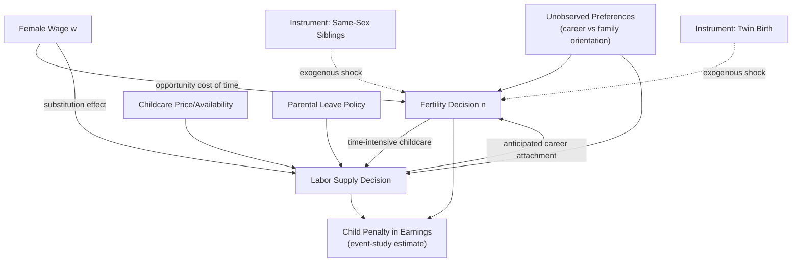

## Fertility and Female Labor Force Participation

### Overview and Motivation

The relationship between fertility and female labor force participation (FLFP) is one of the most extensively studied topics in labor economics, combining household production theory, dynamic life-cycle labor supply, and identification strategies for jointly determined outcomes. The central empirical puzzle is the changing sign and magnitude of the fertility-FLFP correlation:

- **Cross-sectional/historical correlation**: negative — women with more children work less.
- **Cross-country correlation (post-1980s, OECD)**: **[Unverified]** the correlation across developed countries reportedly flipped sign, becoming positive in some periods (Ahn and Mira, 2002) — countries with higher FLFP (Scandinavia) also exhibit higher fertility than low-FLFP countries (Southern Europe/Japan), a reversal from earlier decades.
- **Time-series within countries**: both fertility and FLFP can rise or fall together depending on institutional context (childcare availability, part-time work norms, family policy).

This makes the topic a canonical case study in distinguishing **correlation from causation** when two outcomes (fertility, labor supply) are jointly and endogenously determined by the same underlying constraints and preferences.

---

### Theoretical Framework: Becker's Quantity-Quality Model

The foundational framework is Gary Becker's household production model of fertility (Becker, 1960; Becker and Lewis, 1973), which treats children as a durable good with both a "quantity" and "quality" dimension.

The household maximizes utility over a composite good, child quantity $n$, and child quality $q$:

$$\max_{c, n, q, l} \; U(c, n, q, l) \quad \text{s.t.} \quad c + \pi_n n + \pi_q q \, n = w(T - l) + y$$

where:

- $\pi_n$ = the "price" per child, decomposed into direct costs and the mother's foregone earnings (opportunity cost of time)
- $\pi_q$ = the marginal cost of quality per child, which interacts multiplicatively with quantity
- $l$ = leisure/non-market time

**Key Points**

- The wage $w$ enters the price of children *both* directly (as the shadow price of time inputs into childrearing) and indirectly. A rise in the female wage raises the opportunity cost of children, generating the classic prediction: **higher female wages reduce desired fertility** (a substitution effect dominating any income effect).
- The **quantity-quality interaction** ($\pi_q n$ term) implies that an exogenous increase in the cost of quality (e.g., compulsory schooling, rising education costs) can *reduce* quantity even without a change in the price of quantity alone — because quality and quantity are technically substitutes in the household's cost function despite being complements in utility.

---

### The Household Production and Time-Allocation Model

Following Mincer (1962) and Willis (1973), children are treated as **time-intensive** relative to market goods. This generates the central mechanical link between fertility and FLFP:

$$Z = f(x, t_c ; n)$$

where $Z$ is "child services," $x$ is market goods input, $t_c$ is time input, and the time-intensity of childrearing (especially for young children) means that a birth generates a large, discrete shock to the mother's time constraint. This is the theoretical basis for treating fertility and FLFP as **jointly determined** rather than one causing the other in a simple sense — both are choice variables responding to wages, prices, and preferences simultaneously.

---

### The Endogeneity Problem

The central econometric challenge: regressing FLFP on fertility (number of children, or a fertility indicator) suffers from **simultaneity/reverse causality** and **omitted variable bias**:

1. **Reverse causality**: a woman's (anticipated) labor market attachment affects her fertility decisions, not just the reverse.
2. **Unobserved heterogeneity**: preferences for career vs. family (unobserved to the econometrician) jointly determine both fertility and labor supply, biasing OLS estimates of the fertility coefficient.
3. **Selection**: women who work may systematically differ in fecundity, family background, or unobserved productivity.

**[Inference]** The direction of OLS bias is theoretically ambiguous a priori (it depends on whether the dominant unobserved heterogeneity is "career-oriented" vs. "family-oriented" preference variation), which is precisely why this literature relies heavily on instrumental variables and natural experiments rather than a single presumed bias direction.

---

### Identification Strategies

#### Instrumental Variables: Sibling-Sex Composition

**Angrist and Evans (1998)** is the canonical instrument: parents with two children of the **same sex** (both boys or both girls) are more likely to have a third child than parents with one of each sex, due to a stated preference for a "mixed" sibling composition. Sibling-sex composition is plausibly random with respect to unobserved labor-supply preferences, satisfying the exclusion restriction (conditional on having ≥2 children already).

$$\text{Instrument: } \mathbb{1}[\text{first two children same sex}] \longrightarrow \text{Third birth} \longrightarrow \text{FLFP}$$

Using this instrument, Angrist and Evans find that having a third child causally **reduces maternal labor supply**, but the effect is smaller than the naive OLS correlation would suggest — indicating that a meaningful portion of the raw correlation reflects selection, not causation.

#### Instrumental Variables: Twin Births

A second widely used instrument exploits **multiple (twin) births** as a quasi-random shock to family size holding parity (birth order) constant (Rosenzweig and Wolpin, 1980). A woman who has twins on her second birth "involuntarily" ends up with three children instead of two, isolating the fertility margin from planned family size.

**Key Points**

- Twin-birth IV and same-sex IV estimates are broadly consistent in finding negative but moderate effects of additional children on FLFP, smaller than OLS.
- **[Inference]** Both instruments identify a **Local Average Treatment Effect (LATE)** specific to parents at the margin of having a third child, which may not generalize to the effect of a first birth — a first birth's effect on FLFP is typically identified through entirely different variation (e.g., IVF/miscarriage-based designs, or event-study methods around child arrival).

#### Event-Study / "Child Penalty" Designs

A more recent literature (Kleven, Landais, and Søgaard, 2019 for Denmark; extended cross-nationally by Kleven et al. in subsequent work) uses **event-study designs around the first childbirth**, comparing earnings/employment trajectories of mothers and fathers before and after birth, using individuals' own pre-birth trends as the counterfactual:

$$Y_{it} = \sum_{k \neq -1} \beta_k \cdot \mathbb{1}[t = k] + \alpha_i + \gamma_t + \varepsilon_{it}$$

where $k$ indexes event time relative to first birth, and $k=-1$ is the omitted reference period. This isolates the **"child penalty"**: the percentage gap between a mother's post-birth earnings/employment and her counterfactual (no-birth) trajectory, holding fixed unobserved individual heterogeneity via person fixed effects $\alpha_i$.

**[Unverified]** Cross-country comparisons using this design (the "Child Penalty Atlas" literature) reportedly find long-run child penalties in female earnings ranging from roughly 20% (Scandinavia) to over 60% (some Anglo-Saxon and Southern European countries) a decade after first birth, with fathers' earnings trajectories largely unaffected — figures should be verified against the specific country/year in question.

---

### Comparison of Identification Strategies

| Method | Source of Variation | Identifies | Key Limitation |
| --- | --- | --- | --- |
| OLS | None (observational) | Biased correlation | Simultaneity + omitted heterogeneity |
| Same-sex sibling IV | Sibling-sex composition | LATE at 2→3 child margin | Only informative on higher-parity births |
| Twin births IV | Multiple birth at given parity | LATE for "surprise" extra child | Twin births may differ in health costs |
| Event-study (child penalty) | Own pre/post-birth trends | Average dynamic effect of 1st birth | Assumes no confounding trend break at birth |
| IVF/miscarriage designs | Exogenous variation in birth timing | Effect of birth timing/occurrence | Sample selection into IVF treatment |

---

### The Role of Childcare Costs and Policy

A parallel literature examines FLFP responses to the **price and availability of childcare** as the policy-relevant margin connecting fertility and labor supply:

- **Childcare price elasticity of maternal labor supply**: studies typically find negative and economically meaningful, though estimates vary substantially by country, method, and time period.
- **Universal childcare experiments**: Quebec's introduction of heavily subsidized childcare (Baker, Gruber, and Milligan, 2008) is a widely cited natural experiment showing a significant increase in maternal labor supply following the subsidy, alongside some evidence of adverse effects on child outcomes in that particular setting — an important caveat against treating labor supply gains as costless.
- **Parental leave policy**: the length and generosity of paid leave has a theoretically ambiguous and empirically mixed effect on long-run FLFP — short-to-moderate leave supports job continuity, while very long leave can weaken labor market attachment and human capital accumulation (Ruhm, 1998).

---

### Diagram: Causal Pathways Between Fertility and FLFP (svg_diagram)

---

### Life-Cycle Considerations

Fertility timing interacts with human capital accumulation in a dynamic life-cycle labor supply framework (Mincer and Polachek, 1974; Weiss and Gronau, 1981):

- **Depreciation of human capital**: time out of the labor force for childbearing causes skill atrophy, particularly in occupations with steep returns to continuous experience, generating a **motherhood wage penalty** distinct from the pure labor-supply/hours effect.
- **Anticipation effects**: women anticipating future childbearing may select into occupations or education with lower human-capital depreciation rates or greater flexibility ("mommy track" occupational sorting), a decision made *before* fertility is realized — reinforcing the simultaneity problem discussed above.
- **Timing/spacing of births**: delaying first birth is associated with higher subsequent earnings, but selection (career-oriented women delay births) confounds simple correlations; quasi-experimental estimates using miscarriage or fertility-treatment timing attempt to isolate a causal delay effect. **[Speculation]** The magnitude of this "timing premium" net of selection remains an area of active and not fully settled research.

---

**Related Topics**

- Becker–Lewis Quantity-Quality Model of Fertility
- The Motherhood Wage Penalty and Human Capital Depreciation
- Child Penalty Event-Study Methodology (Kleven et al.)
- Instrumental Variables in Family Economics (Sibling Sex, Twin Births)
- Childcare Subsidies and Universal Pre-K Policy Evaluation
- Parental Leave Design and Labor Market Attachment
- Occupational Sorting and the "Mommy Track"
- Cross-Country Divergence in the Fertility-FLFP Correlation