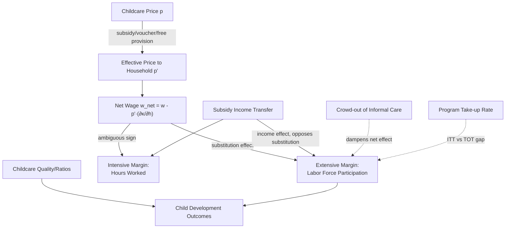

## Childcare Policy and Parental Labor Supply

### Overview and Motivation

Childcare policy operates as a direct price and time-constraint intervention in the household labor supply model: subsidizing or providing childcare lowers the effective price of market work for the parent who would otherwise perform childcare at home (typically the mother), shifting the labor supply decision along both the **extensive margin** (whether to work) and the **intensive margin** (hours worked). This chapter item synthesizes the theoretical channels, the main policy instruments, and the identification strategies used to estimate their causal effects — a literature closely linked to, but distinct from, the fertility-FLFP nexus, since childcare policy takes fertility as a given constraint and targets the *labor supply* response conditional on having children.

---

### Theoretical Channel: Childcare Price in the Labor Supply Model

In the standard household time-allocation framework, childcare functions as a **market substitute for the mother's own time input** into child-rearing. Consider a mother choosing hours of market work $h$ subject to a childcare cost function:

$$\max_{c, h} \; U(c, l, Z) \quad \text{s.t.} \quad c + p \cdot \kappa(h) = w h + y, \quad l = T - h - t_c(h)$$

where $\kappa(h)$ is childcare hours purchased (increasing in $h$), $p$ is the childcare price per unit, $Z$ is child quality/welfare, and $t_c(h)$ is any residual own-time childcare not substituted by the market. The **effective (net) wage** for market work becomes:

$$w^{net} = w - p \cdot \frac{\partial \kappa}{\partial h}$$

**Key Points**

- A fall in $p$ (a childcare subsidy) raises $w^{net}$, generating a standard **substitution effect toward market work** and an **income effect** (subsidy income raises overall resources, which — for leisure as a normal good — can partially offset the substitution effect).
- For **non-working mothers**, the reservation wage condition is $w^{net}_{reservation} = $ marginal value of home time; a childcare subsidy lowers this reservation wage floor, pulling women from non-participation into the labor force — this is the primary **extensive-margin** mechanism policy targets.
- The net effect on hours (intensive margin) among *already-working* mothers is theoretically ambiguous and empirically often found to be small relative to the extensive-margin response.

---

### Types of Childcare Policy Instruments

| Instrument | Mechanism | Primary Margin Affected | Typical Fiscal Cost Profile |
| --- | --- | --- | --- |
| Universal public childcare provision | Direct supply of slots at low/zero price | Extensive (participation) | High, broad-based |
| Means-tested subsidies/vouchers | Price reduction conditional on income | Extensive, targeted to low-income | Moderate, targeted |
| Childcare tax credits (e.g., US CDCTC) | Tax rebate on childcare expenditure | Intensive (marginal hours) | Moderate, back-loaded |
| Employer-mandated/provided childcare | Shifts cost to firms | Extensive, firm-specific | Borne by employer |
| Universal Pre-K / school-hour extension | Free provision during school hours | Extensive + hours alignment | High, age-specific (3-5) |
| Parental leave (contrast case) | Delays return to work | Extensive (short-run), timing | Moderate, wage-replacement based |

---

### Landmark Empirical Studies

#### Quebec's Universal Low-Fee Childcare (Canada)

**Baker, Gruber, and Milligan (2008)** study Quebec's 1997 introduction of $5-per-day childcare (a large, discrete price drop relative to market rates), using a **difference-in-differences** design comparing Quebec to the rest of Canada before/after the reform:

$$Y_{ipt} = \beta_1 \cdot \text{Quebec}_p \times \text{Post}_t + \alpha_p + \gamma_t + X_{ipt}'\delta + \varepsilon_{ipt}$$

Findings: a significant increase in maternal labor force participation attributable to the subsidy, but with concurrent evidence of **negative effects on measured child behavioral/health outcomes** in that specific context — a widely cited caution that labor supply gains from subsidized childcare are not necessarily welfare-neutral for children, and that findings from one institutional setting (quality, group size regulation) may not generalize.

**[Inference]** The Quebec child-outcome findings have been the subject of ongoing debate regarding the specific mechanism (e.g., childcare quality/ratios at the time of rapid expansion vs. the price subsidy per se); subsequent work has revisited both the magnitude and interpretation of these effects.

#### US Child and Dependent Care Tax Credit (CDCTC) and State-Level Subsidies

US studies (e.g., **Gelbach, 2002**, using kindergarten-eligibility age cutoffs as a source of free public schooling variation; **Herbst, 2010** reviewing CDCTC effects) generally find:

- Positive but moderate elasticities of maternal labor supply with respect to childcare price/subsidy generosity.
- **[Unverified]** Reported elasticity magnitudes in the US literature commonly cluster in a range that should be checked against the specific paper and time period, as estimates vary considerably by identification strategy, sample (married vs. single mothers), and time period.

#### Universal Pre-K Programs

Studies of Universal Pre-K rollouts (e.g., Georgia, Oklahoma in the US) generally find **positive extensive-margin effects on maternal employment** concentrated in the pre-K-eligible child's age year, consistent with the free-provision-during-school-hours mechanism reducing the effective childcare price to near zero for that specific age group.

#### German and Nordic Evidence

**[Inference]** Studies of the German legal entitlement to subsidized childcare from age one (post-2013 reform) and various Nordic universal childcare systems are frequently cited as showing more modest labor supply effects than the Quebec case, plausibly reflecting already-high baseline FLFP and generous parental leave systems reducing the marginal impact of additional childcare subsidies — this comparative claim should be verified against the specific studies referenced in a given syllabus.

---

### Identification Challenges Specific to Childcare Policy Evaluation

1. **Non-random program placement/timing**: universal programs are often rolled out in specific jurisdictions or times correlated with local labor market conditions, threatening the parallel-trends assumption in difference-in-differences designs.
2. **Anticipation and pre-trend effects**: parents may adjust labor supply plans in anticipation of an announced future subsidy, biasing event-study estimates around the implementation date if not properly modeled.
3. **General equilibrium/crowd-out effects**: public provision can **crowd out informal or private childcare arrangements** without a net increase in effective childcare capacity, muting the estimated labor supply response relative to a naive "new slots" calculation.
4. **Take-up margins**: subsidy programs with imperfect take-up (due to administrative burden or lack of awareness) generate a distinction between the **intent-to-treat (ITT)** effect of policy availability and the **treatment-on-treated (TOT)** effect of actual subsidy receipt — most policy evaluations must instrument take-up using eligibility rules to recover a credible causal estimate.

---

### Elasticity Summary and Policy Design Implications

**Key Points**

- The **extensive-margin labor supply elasticity with respect to childcare price** is generally found to be larger in magnitude than the intensive-margin (hours) elasticity across the literature — consistent with the reservation-wage mechanism described above.
- Elasticities are **not homogeneous across the income distribution**: lower-income mothers with lower reservation wages tend to show larger participation responses to price changes near the relevant margin, motivating means-tested subsidy design over untargeted universal free provision on pure labor-supply-maximization grounds — though universal programs may be preferred on other grounds (equity, political sustainability, avoiding stigma/administrative burden of means-testing).
- **[Speculation]** The optimal targeting design (universal vs. means-tested) ultimately depends on a social welfare function trading off labor supply efficiency, child development externalities, and horizontal equity considerations that are not resolved by labor supply elasticities alone.

---

### Diagram: Childcare Policy Transmission Mechanism (svg_diagram)

---

### Interaction with Parental Leave and Related Policies

Childcare policy does not operate in isolation; its labor supply effects are conditioned by the surrounding policy environment:

- **Leave-to-childcare transition gap**: in countries where paid parental leave ends before subsidized childcare eligibility begins, mothers face a "coverage gap" that can depress labor supply regardless of childcare price at the eligible age — a design failure distinct from the pure price elasticity question.
- **Part-time work norms**: in countries with strong part-time labor market institutions (e.g., the Netherlands), childcare subsidies interact with part-time hour constraints, such that the "intensive margin" response is partly institutionally capped rather than purely price-determined.
- **Interaction with tax system**: joint taxation of spousal income (as opposed to individual taxation) raises the effective marginal tax rate on a secondary earner's return to work, which can mute the labor-supply response to a childcare subsidy — the two policies are **complements** in determining net work incentives, not independent margins.

---

**Related Topics**

- Extensive vs. Intensive Margin Labor Supply Elasticities
- Difference-in-Differences Design for Policy Rollout Evaluation
- Quebec Universal Childcare: Labor Supply and Child Outcome Trade-offs
- Universal Pre-K Programs and Maternal Employment
- Joint vs. Individual Taxation and Secondary Earner Labor Supply
- Take-up Rates and Intent-to-Treat vs. Treatment-on-Treated Estimation
- Parental Leave Design and the Leave-to-Childcare Coverage Gap
- Optimal Targeting: Universal vs. Means-Tested Childcare Subsidy Design