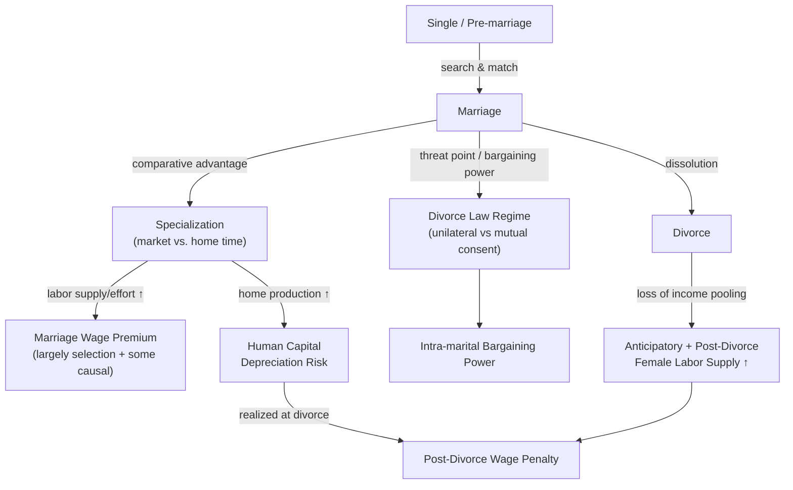

## Marriage, Divorce, and Labor Market Outcomes

### Overview and Motivation

This topic examines the bidirectional relationship between marital status transitions (marriage formation, marital dissolution) and labor market outcomes (wages, hours, participation, occupational choice). Unlike the collective bargaining framework, which takes the existence of the household as given and studies allocation *within* it, this literature studies the **selection into and out of marriage itself** as a labor-market-relevant event, along with the causal wage and labor supply consequences of that transition. It draws on specialization theory, human capital theory, and search-theoretic models of the marriage market.

---

### Theoretical Foundations

#### Gains from Marriage: Specialization and Becker's Theory of Marriage

Becker's (1973, 1974) **Treatise on the Family** models marriage as a partnership generating gains from trade via **comparative advantage and specialization**, formally analogous to gains from trade between countries. If spouse 1 has comparative advantage in market work and spouse 2 in home production, joint household output exceeds the sum of what each could produce single:

$$Y_{married} = f(t_{m1}, t_{h1}, t_{m2}, t_{h2}) > Y_1^{single} + Y_2^{single}$$

where $t_{mi}, t_{hi}$ denote market and home time of spouse $i$. This generates the classic prediction that marriage induces **specialization**: the spouse with comparative advantage in market work increases market hours/wages (often the husband, historically), while the other specializes further in home production.

**Key Points**

- The specialization prediction implies a **marriage wage premium for men** operating through increased labor supply, effort, and possibly employer statistical discrimination favoring perceived "stable" married men — a much-debated causal claim (see below).
- The theory implies a **marriage wage penalty or reduced labor force attachment for women** to the extent they specialize toward home production, though this prediction has weakened empirically as female labor force attachment has risen and gender gaps in specialization have narrowed.
- **[Inference]** The classical Becker specialization model is often criticized as descriptively less applicable to modern dual-earner households where within-marriage comparative advantage differentials have narrowed; more recent theoretical work incorporates bargaining and career-timing considerations (see Collective Household Bargaining Models) rather than pure Beckerian specialization.

#### Search-Theoretic Marriage Market Models

An alternative framework models marriage formation as a **two-sided search process** analogous to labor market search (Mortensen, 1988; Shimer and Smith, 2000), where individuals sample potential partners, incur search costs, and accept a match if the surplus exceeds a reservation threshold. Key implications:

- Higher labor market earnings raise an individual's "value" in the marriage market, affecting both the probability and timing of marriage and the quality/assortativeness of the eventual match.
- **Assortative mating** on education and earnings potential has been rising over recent decades in many high-income countries, with implications for household income inequality (since high earners increasingly match with other high earners) — this is a distinct empirical literature (Greenwood, Guner, Kocharkov, and Santos, 2014) connecting marriage market sorting to the household income distribution.

---

### The Marriage Wage Premium: Causal Identification

#### The Empirical Puzzle

A robust cross-sectional finding across many countries and time periods: married men earn systematically more than unmarried (never-married or divorced) men, controlling for age, education, and experience — the **marriage wage premium**. The corresponding premium for women is typically smaller and less consistently signed **[Unverified]**, varying by country, cohort, and specification.

#### Competing Explanations

1. **Causal specialization effect**: marriage causally increases male productivity/effort via household specialization (Becker's mechanism above), or increases labor supply hours directly.
2. **Selection**: men with higher (unobserved) earnings potential, stability, or "marriageability" traits are more likely to marry in the first place — the correlation reflects selection, not treatment.
3. **Employer statistical discrimination/signaling**: employers may use marital status as a (possibly discriminatory or productivity-uninformative) signal of stability, reliability, or reduced job turnover risk.
4. **Household specialization increasing effective labor supply**: a spouse handling home production frees the other's time and reduces work-life friction, raising realized market hours/effort.

#### Identification Strategies

- **Fixed-effects (panel) models**: comparing the same individual's wages before and after marriage nets out time-invariant unobserved heterogeneity (e.g., Korenman and Neumark, 1991; Cornwell and Rupert, 1997), generally finding the premium **shrinks substantially but does not fully disappear** once individual fixed effects are included — consistent with a mix of selection and a smaller residual causal effect.
- **Twin studies**: comparing wage outcomes of monozygotic twins with different marital statuses (Antonovics and Town, 2004) attempts to net out shared genetic/family-background confounds, generally finding a **[Unverified]** reduced but still statistically detectable premium.
- **Event-study designs around marriage**: tracking wage trajectories in the years immediately before and after marriage; a wage premium that appears to *begin rising before* the marriage date itself is suggestive evidence of anticipatory selection (higher-earning-trajectory men selecting into marriage) rather than a pure treatment effect of marriage per se.

**[Inference]** The consensus in the more recent identification-focused literature leans toward attributing a **majority share of the raw premium to selection**, with a smaller but non-zero causal component plausibly operating through specialization/labor supply channels — though the precise causal/selection split remains an active research question without full consensus.

---

### Divorce and Labor Market Outcomes

#### Anticipatory and Contemporaneous Effects on Female Labor Supply

Divorce (or anticipated divorce) has well-documented labor supply effects, primarily for women, operating through several channels:

- **Loss of spousal income/insurance**: divorce removes the income-pooling/insurance benefit of marriage, mechanically raising the reservation wage constraint and inducing increased labor force participation — an **added-worker-type effect** at the household dissolution margin.
- **Anticipatory labor supply increases**: women who anticipate divorce (measurable via subsequent divorce as an outcome) often show **rising labor supply in the years *before* the divorce is finalized** — evidence this is partly a preparatory/insurance response rather than a pure post-divorce income shock (Johnson and Skinner, 1986).
- **Human capital depreciation during marriage**: to the extent a woman specialized in home production during marriage (per Becker's model), she faces a **post-divorce wage penalty** reflecting foregone experience accumulation — the mirror image of the marriage wage premium mechanism.

#### Divorce Law as a Distribution Factor (Cross-Reference)

As introduced under Collective Household Bargaining Models, the legal divorce regime (**unilateral** vs. **mutual-consent divorce**) affects intra-marital bargaining power by altering each spouse's **threat point** (the utility available from unilateral exit). Empirical findings include:

- Adoption of unilateral divorce laws in US states (staggered across the 1970s) has been used as a **natural experiment / distribution factor** in numerous studies (Stevenson, 2007; Gray, 1998) to test income-pooling and bargaining-power predictions.
- **[Unverified]** Findings on whether unilateral divorce law adoption increased or decreased married women's labor supply are mixed across studies and identification strategies, plausibly reflecting offsetting effects: reduced bargaining power within an unhappy marriage might raise a woman's insurance-motivated labor supply, while an improved outside option (fallback utility) could reduce the need for such precautionary behavior — a genuinely theoretically ambiguous prediction that different empirical designs have resolved differently.

---

### Diagram: Marriage/Divorce Transitions and Labor Market Channels (svg_diagram)

---

### Assortative Mating and Household Income Inequality

A distinct but related strand connects marriage market sorting to aggregate income inequality:

- **Rising educational assortative mating**: the tendency of high-education/high-earnings individuals to marry similarly high-earning partners has increased in many high-income countries in recent decades, mechanically raising household income inequality even absent any change in the individual (pre-marriage) earnings distribution (Greenwood, Guner, Kocharkov, and Santos, 2014).
- **[Inference]** This channel is typically estimated to account for a meaningful but partial share of the rise in household income inequality (as opposed to individual wage inequality) since the mid-20th century; the exact quantitative contribution is sensitive to the counterfactual matching distribution used (e.g., random matching vs. matching under earlier decades' assortativeness).

---

### Comparative Summary Table

| Transition | Primary Channel | Predicted Labor Supply/Wage Effect | Main Identification Challenge |
| --- | --- | --- | --- |
| Entry into marriage (men) | Specialization + selection | Wage premium | Separating selection from treatment |
| Entry into marriage (women) | Specialization | Ambiguous/smaller premium, historically negative | Cohort change in specialization norms |
| Anticipated divorce | Insurance motive | Labor supply ↑ (pre-divorce) | Timing of anticipation vs. realization |
| Realized divorce | Loss of income pooling | Labor supply ↑, wage penalty if specialized | Reverse causality (bad marriages → less specialization ex ante) |
| Divorce law reform | Threat-point shift | Theoretically ambiguous bargaining response | Ambiguous sign, staggered adoption confounds |

---

**Related Topics**

- Becker's Theory of Marriage and Household Specialization
- Search-Theoretic Models of the Marriage Market
- Marriage Wage Premium: Selection vs. Causation Debate
- Divorce Law Regimes as Distribution Factors (link to Collective Household Bargaining Models)
- Assortative Mating and Household Income Inequality
- Anticipatory Labor Supply Responses to Marital Instability
- Human Capital Depreciation from Household Specialization
- Twin Studies and Fixed-Effects Designs in Family Economics