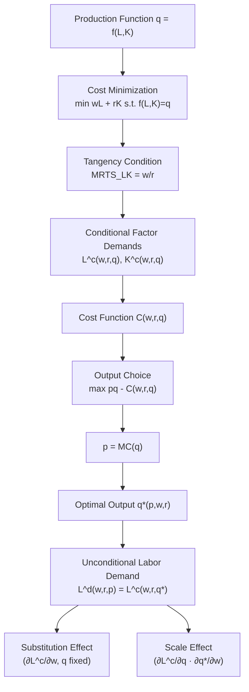

## The Firm's Profit Maximization Problem

### Overview and Motivation

The firm's profit maximization problem is the foundational building block of labor demand theory, providing the theoretical basis from which labor demand curves, the marginal productivity theory of factor pricing, and comparative statics predictions (e.g., minimum wage effects, payroll tax incidence) are derived. In contrast to household labor supply theory (which takes preferences and constraints of workers as primitives), this framework takes the firm's production technology and market prices as primitives and derives optimal input demands — including labor — as a function of those prices.

---

### Short-Run Profit Maximization: Single Variable Input

#### Setup

Consider a competitive firm with a production function $q = f(L, \bar{K})$, where $L$ is labor (variable in the short run), $\bar{K}$ is capital (fixed in the short run), output price is $p$ (taken as given — the firm is a price-taker in the output market), and the wage is $w$ (taken as given — the firm is also a price-taker in the labor market, i.e., operates in a competitive labor market).

The firm's problem:

$$\max_{L} \; \pi = p \cdot f(L, \bar{K}) - wL - r\bar{K}$$

where $r$ is the (sunk, in the short run) rental rate of capital.

#### First-Order Condition

Differentiating with respect to $L$ and setting equal to zero:

$$p \cdot \frac{\partial f}{\partial L} - w = 0 \quad \Longrightarrow \quad p \cdot MP_L = w$$

This is the central result of static labor demand theory: **a competitive, profit-maximizing firm hires labor up to the point where the value of the marginal product of labor ($VMP_L = p \cdot MP_L$) equals the wage.**

**Key Points**

- $MP_L = \partial f / \partial L$ is the **marginal product of labor** — the additional output from one more unit of labor, holding capital fixed.
- $VMP_L = p \cdot MP_L$ converts the marginal product into money terms using the output price.
- The condition $VMP_L = w$ implicitly defines the firm's **labor demand function** $L^d(w, p, \bar{K})$.

#### Second-Order Condition and Diminishing Marginal Product

For the first-order condition to identify a maximum (not a minimum or saddle point), the second-order condition requires:

$$p \cdot \frac{\partial^2 f}{\partial L^2} < 0 \quad \Longleftrightarrow \quad \frac{\partial MP_L}{\partial L} < 0$$

This is the **law of diminishing marginal product**: as more labor is added to a fixed capital stock, each additional worker contributes less additional output than the last. This diminishing-returns property is what gives the labor demand curve its standard **downward slope** with respect to the wage — a rise in $w$ requires $MP_L$ to rise to restore equality, which (given diminishing returns) requires $L$ to fall.

---

### The Labor Demand Curve as the VMP Curve

**[Inference]** A standard and widely used simplification in introductory treatments is that, in the short run with one variable factor, the firm's labor demand curve *is* its downward-sloping portion of the $VMP_L$ curve (the portion where marginal product is diminishing) — this identity is a direct restatement of the first-order condition above rather than a separate empirical claim.

### Diagram: Short-Run Labor Demand from VMP (svg_diagram)

<svg xmlns="http://www.w3.org/2000/svg" viewBox="0 0 620 380">
<text x="310" y="24" text-anchor="middle" font-size="15" font-weight="bold" fill="#1a1a1a">Short-Run Labor Demand from VMP_L (svg_diagram)</text>
<line x1="70" y1="330" x2="580" y2="330" stroke="#333" stroke-width="1.5" />
<line x1="70" y1="330" x2="70" y2="50" stroke="#333" stroke-width="1.5" />
<text x="580" y="352" text-anchor="middle" font-size="12" fill="#333">Labor (L)</text>
<text x="35" y="190" text-anchor="middle" font-size="12" fill="#333" transform="rotate(-90 35 190)">Wage (w) / VMP_L</text>
<path d="M 90 70 Q 250 90 400 220 Q 480 280 560 320" fill="none" stroke="#2563eb" stroke-width="2.5" />
<text x="565" y="315" font-size="12" fill="#2563eb" font-weight="bold">VMP_L = Labor Demand</text>
<line x1="70" y1="180" x2="330" y2="180" stroke="#dc2626" stroke-width="1.5" stroke-dasharray="5,4" />
<line x1="330" y1="180" x2="330" y2="330" stroke="#dc2626" stroke-width="1.5" stroke-dasharray="5,4" />
<circle cx="330" cy="180" r="4" fill="#dc2626" />
<text x="60" y="175" text-anchor="end" font-size="12" fill="#dc2626">w*</text>
<text x="330" y="345" text-anchor="middle" font-size="12" fill="#dc2626">L*</text>
<text x="120" y="120" font-size="11" fill="#555">Region of diminishing MP_L</text>
<text x="120" y="135" font-size="11" fill="#555">(downward-sloping, economically relevant)</text>
</svg>

---

### Long-Run Profit Maximization: Two Variable Inputs

#### Setup

In the long run, both labor and capital are variable. The firm solves:

$$\max_{L, K} \; \pi = p \cdot f(L, K) - wL - rK$$

#### First-Order Conditions

$$p \cdot \frac{\partial f}{\partial L} = w \qquad \text{and} \qquad p \cdot \frac{\partial f}{\partial K} = r$$

Equivalently, at the optimum, the **marginal rate of technical substitution (MRTS)** equals the input price ratio:

$$MRTS_{LK} = \frac{MP_L}{MP_K} = \frac{w}{r}$$

**Key Points**

- This is the standard **tangency condition**: the firm's isoquant is tangent to its isocost line at the cost-minimizing (and, given the output-choice condition below, profit-maximizing) input bundle.
- Long-run labor demand $L^d(w, r, p)$ now depends on **both** factor prices, not just $w$ — a critical distinction from the short-run case.

#### Decomposition: Cost Minimization + Output Choice

The long-run problem is often decomposed into two stages for analytical clarity:

1. **Cost minimization** (for a given output level $q$): find the least-cost combination of $L, K$ to produce $q$, yielding the **conditional factor demands** $L^c(w, r, q)$ and the cost function $C(w, r, q)$.
2. **Output choice**: choose $q$ to maximize $p \cdot q - C(w, r, q)$, i.e., set $p = MC(q)$ (price equals marginal cost).

Substituting the optimal $q^*(p, w, r)$ back into the conditional factor demand yields the **unconditional (long-run) labor demand function** $L^d(w, r, p) = L^c(w, r, q^*(p,w,r))$.

---

### Comparative Statics: Own-Price and Cross-Price Effects

Differentiating the long-run labor demand function with respect to factor prices decomposes the total effect of a wage change into a **scale effect** and a **substitution effect** — directly paralleling (and economically analogous to, though derived from cost minimization rather than utility maximization) the Slutsky decomposition in consumer theory:

$$\frac{\partial L^d}{\partial w} = \underbrace{\frac{\partial L^c}{\partial w}\bigg|_{q \text{ fixed}}}_{\text{substitution effect} \; (\leq 0)} + \underbrace{\frac{\partial L^c}{\partial q} \cdot \frac{\partial q^*}{\partial w}}_{\text{scale effect} \; (\leq 0 \text{ for normal case})}$$

**Key Points**

- The **substitution effect** is unambiguously non-positive: a rise in $w$ (holding output fixed) induces the firm to substitute toward the now-relatively-cheaper capital, by the convexity of isoquants (an application of the envelope theorem / Shephard's lemma-type result to production theory).
- The **scale effect** captures how a rise in marginal cost (driven by the higher wage) reduces the profit-maximizing output level, which — for a normal input — further reduces labor demand.
- Both effects reinforce each other for labor's own-price effect, guaranteeing $\partial L^d/\partial w \leq 0$ — the long-run labor demand curve is unambiguously (weakly) downward sloping, a stronger and more general result than the short-run VMP argument alone.
- The **cross-price effect** ($\partial L^d / \partial r$) is ambiguous in sign in general and depends on whether labor and capital are **gross substitutes** or **gross complements** in the cross-price sense — this ambiguity is the basis for debates over whether capital and labor are complements or substitutes in specific industries (relevant to automation and capital-skill complementarity discussions).

---

### The Elasticity of Labor Demand: Hicks-Marshall Laws

The magnitude of the own-wage elasticity of labor demand, $\eta_{LL} = \frac{\partial L}{\partial w} \cdot \frac{w}{L}$, is characterized by the **Hicks-Marshall laws of derived demand**, which state that (holding other factors constant) the elasticity of labor demand is **larger in absolute value** when:

1. The **elasticity of substitution** between labor and other inputs is higher (easier to substitute capital for labor).
2. The **elasticity of demand for the output** is higher (a wage-driven price increase more strongly reduces output demand, amplifying the scale effect).
3. The **supply of other inputs** (e.g., capital) is more elastic (cheaper to expand the substitute input in response to relatively more expensive labor).
4. **Labor's share of total cost** is larger (a given percentage wage increase has a larger effect on marginal/total cost, and thus a larger scale effect) — this fourth law can be non-monotonic in some formal treatments and is sometimes stated as a qualified/conditional result.

**[Inference]** The fourth Hicks-Marshall law (cost-share) is the one most frequently noted in the literature as holding only under additional restrictions (e.g., specific functional form assumptions or when combined with a sufficiently high substitution elasticity); it is commonly taught as a rule of thumb rather than a fully general theorem.

---

### Functional Form: Constant Elasticity of Substitution (CES) Production

A standard workhorse functional form used to parameterize the substitution elasticity in applied labor demand estimation is the **CES production function**:

$$q = A \left[ \alpha L^{\frac{\sigma-1}{\sigma}} + (1-\alpha) K^{\frac{\sigma-1}{\sigma}} \right]^{\frac{\sigma}{\sigma-1}}$$

where $\sigma$ is the **elasticity of substitution** between labor and capital, $\alpha$ is a distribution parameter, and $A$ is total factor productivity. Special cases:

- $\sigma \to \infty$: perfect substitutes (linear production function)
- $\sigma \to 0$: perfect complements (Leontief/fixed-proportions production function)
- $\sigma = 1$: Cobb-Douglas production function, $q = A L^{\alpha} K^{1-\alpha}$

The Cobb-Douglas case yields a particularly tractable labor demand relationship: profit maximization with $q = AL^\alpha K^{1-\alpha}$ implies a **constant labor cost share** of output, $wL/pq = \alpha$, independent of factor prices — a strong and empirically restrictive implication that motivates the use of more flexible functional forms (translog, CES with $\sigma \neq 1$) in applied work when cost shares are found to vary with relative factor prices.

---

### Comparison: Short-Run vs. Long-Run Labor Demand

| Feature | Short Run | Long Run |
| --- | --- | --- |
| Variable inputs | Labor only | Labor and capital |
| Fixed inputs | Capital | None |
| Optimality condition | $VMP_L = w$ | $MRTS_{LK} = w/r$; $p = MC$ |
| Source of downward slope | Diminishing $MP_L$ | Substitution + scale effects |
| Own-wage elasticity | Smaller in magnitude (fewer margins of adjustment) | Larger in magnitude (capital can adjust too) |
| Cross-price effect of $r$ | N/A (capital fixed) | Ambiguous sign (substitutes/complements) |

**[Inference]** The general finding that long-run labor demand is more elastic than short-run labor demand follows directly from the **Le Chatelier principle** applied to firm optimization: with more margins of adjustment available (capital can also respond), the firm's optimal response to any given price change is at least as large in the long run as in the short run.

---

### Diagram: Firm's Cost-Minimization / Profit-Maximization Structure (svg_diagram)

---

### Extensions and Caveats

- **Imperfect competition in output market**: if the firm has market power (faces a downward-sloping demand curve rather than being a price-taker), the profit-maximization condition becomes $MR \cdot MP_L = w$, where $MR < p$ — this is the **marginal revenue product of labor ($MRP_L$)** framework, generating lower labor demand than the competitive $VMP_L$ benchmark at any given wage.
- **Monopsony in the labor market**: if the firm faces an upward-sloping labor supply curve (is a wage-setter rather than wage-taker), the relevant marginal cost of labor exceeds the wage ($MFC_L > w$), and the profit-maximizing condition becomes $VMP_L = MFC_L$ rather than $VMP_L = w$ — this is foundational to modern minimum-wage and monopsony power literature (a separate syllabus item).
- **Dynamic/adjustment cost considerations**: the static framework presented here ignores hiring and firing costs; dynamic labor demand models incorporating adjustment costs (relevant to labor demand persistence and employment volatility) build on this static optimality condition as their steady-state benchmark.

---

**Related Topics**

- Marginal Productivity Theory of Factor Demand
- Elasticity of Substitution and CES Production Functions
- Hicks-Marshall Laws of Derived Demand
- Monopsony Power and Labor Market Wage-Setting
- Imperfect Competition and Marginal Revenue Product of Labor
- Dynamic Labor Demand and Adjustment Costs
- Capital-Skill Complementarity and Automation
- Cost Minimization and Conditional Factor Demand Functions