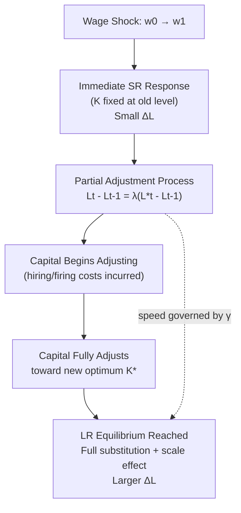

## Short Run and Long Run Labor Demand

### Overview and Motivation

This item deepens and extends the short-run/long-run distinction introduced under The Firm's Profit Maximization Problem, focusing specifically on the **time-horizon dependence of labor demand elasticity, adjustment dynamics, and the underlying economic mechanisms** that make labor demand a fundamentally different object depending on which inputs are treated as fixed versus variable. While the profit-maximization item establishes the optimality conditions, this item focuses on the **comparative statics, elasticity decomposition, and dynamic adjustment process** connecting the two horizons.

---

### Defining the Time Horizons

The short run and long run in labor demand theory are defined **not by calendar time** but by which inputs are variable:

- **Short run (SR)**: at least one input (conventionally capital, $K$) is fixed at a predetermined level $\bar{K}$. Only labor adjusts.
- **Long run (LR)**: all inputs, including capital, are variable. The firm can fully reoptimize its entire input bundle.

**Key Points**

- The distinction is a modeling convenience representing **different speeds of adjustment costs** across inputs — capital (plant, equipment, structures) is costly and slow to adjust, while labor hours (and to some extent headcount) can adjust more quickly, though not instantaneously.
- **[Inference]** In richer dynamic models, this binary SR/LR distinction is a simplification of a continuous spectrum of adjustment speeds across different input types (e.g., overtime hours adjust fastest, headcount next, structures/plant slowest) — the two-period framework is a tractable abstraction rather than a literal claim that capital is perfectly fixed up to some date and perfectly flexible thereafter.

---

### Short-Run Labor Demand: Recap and Elasticity

From the profit-maximization condition $p \cdot MP_L(L, \bar{K}) = w$, short-run labor demand $L^{SR}(w; p, \bar{K})$ is characterized by:

$$\frac{\partial L^{SR}}{\partial w} = \frac{1}{p \cdot \frac{\partial MP_L}{\partial L}} < 0$$

by the second-order condition (diminishing $MP_L$). The **short-run own-wage elasticity of labor demand**:

$$\eta^{SR}_{LL} = \frac{\partial L^{SR}}{\partial w} \cdot \frac{w}{L}$$

reflects only the firm's ability to substitute along the given production function with fixed capital — there is **no capital-adjustment margin** available.

---

### Long-Run Labor Demand: Recap and Elasticity Decomposition

As derived under the profit-maximization framework, long-run labor demand incorporates both the substitution and scale effects:

$$\frac{\partial L^{LR}}{\partial w} = \underbrace{\frac{\partial L^c}{\partial w}\bigg|_{q}}_{\text{substitution}} + \underbrace{\frac{\partial L^c}{\partial q}\frac{\partial q^*}{\partial w}}_{\text{scale}}$$

Because the substitution effect is available **only** in the long run (capital cannot adjust in the short run to substitute for the now-relatively-expensive labor), this additional margin is precisely what makes long-run labor demand more elastic.

---

### The Le Chatelier Principle Applied to Labor Demand

The formal reason $|\eta^{LR}_{LL}| \geq |\eta^{SR}_{LL}|$ always holds is the **Le Chatelier principle** (Samuelson, 1947), a general result from constrained optimization theory: a value function's response to a parameter change is at least as large in magnitude when more choice variables are free to adjust, evaluated at the same starting point.

Formally, if $\hat{K}$ denotes the long-run optimal capital level *before* the wage change, then the short-run demand curve (holding $K = \hat{K}$ fixed) is **tangent to** the long-run demand curve at the initial wage $w_0$, and lies **everywhere flatter (less elastic)** than the long-run curve at any other wage — because holding $K$ fixed at its old optimum is a *constrained* version of the long-run problem, and constrained optima can never respond more than unconstrained ones.

**Key Points**

- This tangency result means the short-run and long-run labor demand curves **intersect exactly at the pre-shock equilibrium point** and diverge (long-run flatter/more elastic) moving away from that point in either direction.
- This is a purely mathematical/optimization-theoretic result, not an empirical claim — it holds by revealed preference/envelope-type logic regardless of the specific functional form of production technology, provided the firm is optimizing.

### Diagram: Le Chatelier Tangency of SR and LR Labor Demand (svg_diagram)

<svg xmlns="http://www.w3.org/2000/svg" viewBox="0 0 620 380">
<text x="310" y="24" text-anchor="middle" font-size="15" font-weight="bold" fill="#1a1a1a">SR vs LR Labor Demand: Le Chatelier Tangency (svg_diagram)</text>
<line x1="70" y1="330" x2="580" y2="330" stroke="#333" stroke-width="1.5" />
<line x1="70" y1="330" x2="70" y2="50" stroke="#333" stroke-width="1.5" />
<text x="580" y="352" text-anchor="middle" font-size="12" fill="#333">Labor (L)</text>
<text x="35" y="190" text-anchor="middle" font-size="12" fill="#333" transform="rotate(-90 35 190)">Wage (w)</text>
<line x1="130" y1="90" x2="430" y2="290" stroke="#dc2626" stroke-width="2.5" />
<text x="440" y="295" font-size="12" fill="#dc2626" font-weight="bold">Short-Run L^d (K fixed)</text>
<path d="M 90 60 Q 250 175 300 180 Q 350 185 550 300" fill="none" stroke="#2563eb" stroke-width="2.5" />
<text x="440" y="255" font-size="12" fill="#2563eb" font-weight="bold">Long-Run L^d</text>
<circle cx="300" cy="180" r="5" fill="#16a34a" />
<text x="310" y="170" font-size="12" fill="#16a34a">Tangency at (w0, L0)</text>
<line x1="70" y1="180" x2="300" y2="180" stroke="#888" stroke-width="1" stroke-dasharray="4,3" />
<line x1="300" y1="180" x2="300" y2="330" stroke="#888" stroke-width="1" stroke-dasharray="4,3" />
<text x="60" y="184" text-anchor="end" font-size="11" fill="#555">w0</text>
<text x="300" y="345" text-anchor="middle" font-size="11" fill="#555">L0</text>
</svg>

---

### Dynamic Adjustment: From Short Run to Long Run

The transition from short-run to long-run labor demand following a wage shock is not instantaneous. Dynamic labor demand models incorporate **adjustment costs** to capture this transition path explicitly.

#### Quadratic Adjustment Cost Model

A standard formalization (Nickell, 1986; Hamermesh, 1993) adds a cost of *changing* labor to the firm's problem:

$$\max_{\{L_t\}} \; \sum_{t=0}^{\infty} \beta^t \left[ p_t f(L_t, K_t) - w_t L_t - \frac{\gamma}{2}(L_t - L_{t-1})^2 \right]$$

where $\gamma > 0$ parameterizes the cost of adjusting employment (hiring/firing costs, training, disruption). Solving this dynamic optimization yields a **partial adjustment** rule:

$$L_t - L_{t-1} = \lambda \left( L_t^{*} - L_{t-1} \right), \quad 0 < \lambda < 1$$

where $L_t^*$ is the frictionless (static) optimal labor level and $\lambda$ is the speed of adjustment, decreasing in $\gamma$. This generates **employment persistence/smoothing**: actual employment converges gradually toward its long-run target rather than jumping immediately, explaining why estimated short-run wage elasticities (from higher-frequency data) are systematically smaller than long-run elasticities (from lower-frequency or long-difference data) even *within a single firm*, independent of the capital-fixity story.

**Key Points**

- The **quadratic adjustment cost model** is a workhorse because it yields a linear, easily estimable Euler equation, but is criticized for implying that hiring and firing costs are **symmetric** and smooth, whereas real-world adjustment costs (severance pay, hiring/screening costs) are often better characterized as having a **fixed-cost or lumpy component**.
- **Asymmetric adjustment cost models** (allowing firing costs to differ from hiring costs) generate additional empirical predictions, such as employment responding more sluggishly to negative demand shocks than positive ones in economies with strong employment protection legislation — relevant to comparative labor market institution literature.

---

### Empirical Estimation Approaches

| Approach | Data Requirement | Identifies | Key Challenge |
| --- | --- | --- | --- |
| Cross-sectional VMP regression | Firm-level output, wage, labor data | Static elasticity (mixed SR/LR) | Simultaneity: wages and labor jointly determined |
| Panel fixed-effects, short differences | Firm/plant panel, high frequency | Closer to short-run elasticity | Capital not fully fixed even at high frequency |
| Long-difference / cross-industry | Panel over long horizons or cross-industry variation | Closer to long-run elasticity | Confounding trends over long horizons |
| Quasi-experimental (minimum wage, payroll tax changes) | Policy-induced wage variation | Local elasticity around the policy change | External validity to other wage ranges |
| Dynamic panel Euler equation estimation | Firm panel with lagged employment | Adjustment speed $\lambda$, along with $L^*$ | Nickell bias in dynamic panels; instrument validity |

**[Inference]** A well-known stylized empirical regularity across many studies is that estimated own-wage elasticities of labor demand tend to be **larger (in absolute value) using data over longer horizons or aggregated across industries with more room for capital substitution**, consistent with both the Le Chatelier prediction and the partial-adjustment dynamics described above — though a specific numeric range should be sourced to a particular meta-analysis (e.g., Hamermesh's 1993 survey) rather than treated as universally fixed across time periods and countries.

---

### Diagram: Dynamic Adjustment Path from SR to LR Equilibrium (svg_diagram)

---

### Policy Relevance: Minimum Wage and Payroll Tax Incidence

The SR/LR distinction is central to interpreting empirical minimum-wage and payroll-tax-incidence studies:

- Studies using **short post-treatment windows** (e.g., Card and Krueger's original fast-food restaurant comparisons using data shortly after a minimum wage increase) primarily capture **short-run adjustment**, when capital substitution and firm entry/exit margins have not yet fully operated.
- **[Speculation]** Critics of using short-run natural experiments to draw long-run policy conclusions argue that even a minimum wage increase found to have negligible short-run disemployment effects could still generate larger long-run effects once firms fully adjust capital, automation, and store-location decisions — though whether this theoretical concern is quantitatively important in specific empirical contexts remains genuinely debated in the literature rather than settled.
- Similarly, the **long-run incidence of a payroll tax** (who ultimately bears the burden — firm or worker, via wage adjustment) depends on relative long-run elasticities of labor supply and labor demand, per standard tax-incidence theory, whereas short-run incidence calculations using immediate post-tax wage changes may not reflect the eventual long-run equilibrium incidence.

---

### Summary Comparison

| Dimension | Short Run | Long Run |
| --- | --- | --- |
| Capital | Fixed | Variable |
| Adjustment margin | Labor hours/intensity only | Labor + capital + scale |
| Elasticity magnitude | Smaller | Larger (Le Chatelier) |
| Curve shape relative to LR | Steeper, tangent at initial point | Flatter, encompasses SR curve |
| Relevant adjustment cost | Primarily labor-side (hiring/firing) | Both labor- and capital-side |
| Empirical estimation window | High-frequency/short panels | Long-difference/cross-industry |

---

**Related Topics**

- The Firm's Profit Maximization Problem (foundational optimality conditions)
- Le Chatelier Principle in Constrained Optimization
- Dynamic Labor Demand and Partial Adjustment Models
- Asymmetric Hiring and Firing Costs
- Minimum Wage Empirical Literature and Time-Horizon Effects
- Payroll Tax Incidence and Elasticity-Based Tax Burden Sharing
- Employment Protection Legislation and Labor Market Rigidity
- Elasticity of Substitution and the CES Production Function