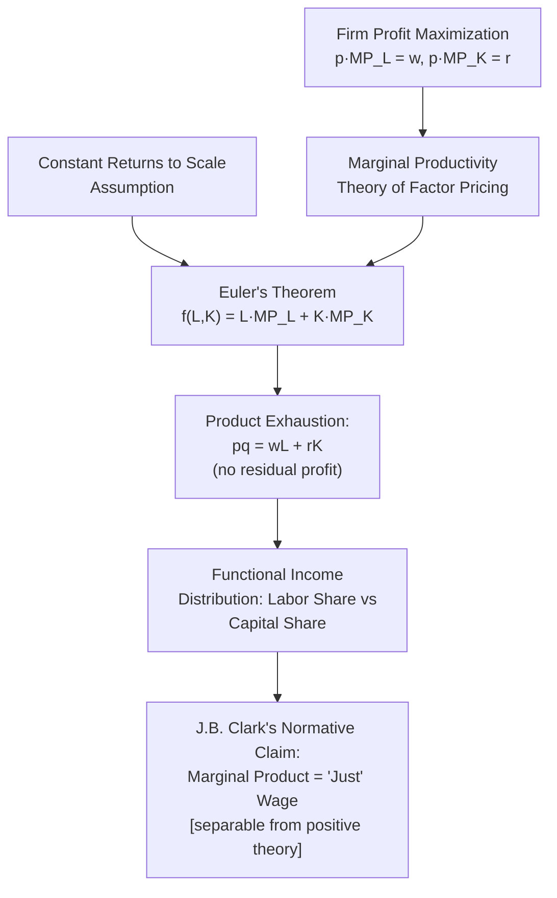

## Marginal Productivity Theory of Wages

### Overview and Motivation

The marginal productivity theory of wages is the normative and positive core of neoclassical labor demand theory: it asserts that, under competitive conditions, each factor of production (including labor) is paid a wage equal to the value of its marginal contribution to output. This item builds directly on The Firm's Profit Maximization Problem, extracting and examining the **theory of factor pricing** implication of the first-order condition, its historical development, its distributive implications, and the well-known theoretical and empirical critiques it has faced (most notably the Cambridge Capital Controversy and the efficiency-wage/monopsony departures).

---

### Formal Statement

From firm profit maximization under perfect competition in both output and labor markets, the first-order condition for labor:

$$p \cdot MP_L = w$$

is reinterpreted as a **theory of wage determination**: in competitive equilibrium, the observed market wage $w$ must equal the value of the marginal product of the *marginal* worker, $VMP_L$. Rearranged:

$$w = p \cdot \frac{\partial f(L,K)}{\partial L}$$

**Key Points**

- This is simultaneously (a) a statement about optimal firm behavior (a positive prediction about how a profit-maximizing firm sets employment given the wage) and (b) — when aggregated across firms and combined with labor market clearing — a **theory of what determines the equilibrium wage level itself**.
- The theory extends naturally to **all factors of production**: capital earns $r = p \cdot MP_K$, land earns its marginal product, etc. — the **general marginal productivity theory of distribution**, historically associated with John Bates Clark (1899).

---

### Historical Development

- **John Bates Clark (1899, *The Distribution of Wealth*)**: first systematic statement that under competition, each factor's income share equals its marginal product's contribution, and — crucially for Clark's normative argument — this distribution is "just" because each factor receives exactly what it contributes at the margin. This normative claim (marginal product = fair/ethical compensation) is analytically separable from the positive claim (marginal product = equilibrium market wage) and has been extensively criticized on both grounds.
- **Marshall and Wicksteed**: contributed the formal mathematical apparatus, including the **product exhaustion theorem** (Euler's theorem result, below).
- **Hicks (1932, *The Theory of Wages*)**: formalized the elasticity of substitution and derived the comparative statics (Hicks-Marshall laws) governing how factor demand and thus factor income shares respond to relative price changes.

---

### The Product Exhaustion Theorem (Euler's Theorem)

A mathematically elegant and historically important result: if the production function $f(L,K)$ exhibits **constant returns to scale (CRS)**, then Euler's theorem for homogeneous functions of degree 1 guarantees:

$$f(L,K) = L \cdot \frac{\partial f}{\partial L} + K \cdot \frac{\partial f}{\partial K} = L \cdot MP_L + K \cdot MP_K$$

Multiplying through by price $p$ and substituting the marginal-productivity factor prices $w = p \cdot MP_L$, $r = p \cdot MP_K$:

$$p \cdot q = wL + rK$$

**Key Points**

- This shows that under CRS and competitive factor pricing, **paying every factor its marginal product exactly exhausts total output** — there is no residual profit or loss left over, resolving what was historically called the **"adding-up problem."**
- **[Inference]** This result is frequently cited as a key reason CRS became the default assumption in much of neoclassical distribution theory: it delivers an internally consistent accounting identity connecting factor payments to output, which does *not* hold in general (without residual profit/loss) under increasing or decreasing returns to scale.
- Under **increasing returns to scale**, marginal-product factor payments would *exceed* total output (a logical inconsistency for a competitive equilibrium, which is one reason increasing returns are typically associated with imperfect competition in this theoretical tradition); under decreasing returns, factor payments fall short, leaving a residual attributable to a fixed factor (e.g., entrepreneurship or a scarce fixed input) not explicitly modeled.

---

### Diagram: From Profit Maximization to Distribution Theory (svg_diagram)

---

### Functional Income Distribution and Factor Shares

A direct application of the theory concerns the **labor share of income**, $\text{LS} = wL / pq$. Under a Cobb-Douglas production function $q = AL^\alpha K^{1-\alpha}$, the marginal productivity condition implies:

$$\text{LS} = \frac{wL}{pq} = \frac{p \cdot \alpha A L^{\alpha-1}K^{1-\alpha} \cdot L}{pq} = \alpha$$

i.e., the labor share is **constant and equal to the Cobb-Douglas exponent** $\alpha$, independent of relative factor prices — a strong prediction historically viewed as broadly consistent with the long-run stability of labor's share observed in mid-20th-century US data (**Kaldor's stylized facts**, 1961).

**[Unverified]** More recent data covering the past several decades in the US and other advanced economies has been widely discussed as showing a **decline in the labor share** — a pattern inconsistent with a pure, stable Cobb-Douglas world, and this has motivated a body of applied research (e.g., on markups, automation/capital-skill complementarity, and globalization) exploring whether $\sigma \neq 1$ (departure from Cobb-Douglas via CES with an elasticity of substitution above one) or changes in market structure/markups better explain the pattern; the precise magnitude and primary cause of any labor share decline should be checked against the specific dataset and time period referenced in a given course.

---

### Theoretical and Empirical Critiques

#### The Cambridge Capital Controversy

The most fundamental theoretical challenge to marginal productivity theory emerged from the **Cambridge Capital Controversy** (Cambridge, UK vs. Cambridge, MA, 1950s-1970s), centered on the difficulty of **aggregating heterogeneous capital goods** into a single scalar "capital" $K$ whose marginal product could be well-defined independent of the rate of return itself (a circularity problem, since capital's value depends on discounting future returns at a rate that is itself what the theory purports to determine).

- **Joan Robinson, Piero Sraffa** (Cambridge, UK) argued that this circularity undermines the theoretical coherence of treating "capital" as a single factor with a well-defined marginal product in the way the theory requires, and demonstrated the possibility of **"reswitching"** (a given production technique being cost-minimizing at both high and low interest rates, but not at intermediate rates) and **capital reversing**, phenomena inconsistent with simple monotonic capital-demand curves assumed in the aggregate theory.
- **Paul Samuelson** (Cambridge, MA) conceded, in his famous 1966 "summing up," that the theoretical critique regarding aggregate capital was valid in the general case.
- **[Inference]** Despite the theoretical concession, the practical/applied use of marginal productivity theory in labor economics has continued largely unabated, on the pragmatic grounds that (a) many applied labor-demand questions can be posed without invoking an aggregate capital stock at all (e.g., using disaggregated capital types or focusing purely on labor-labor substitution across skill groups), and (b) the reswitching/capital-reversing phenomena, while theoretically possible, are widely treated in applied work as empirically rare or second-order — this remains a point of genuine and unresolved methodological disagreement between heterodox and mainstream traditions rather than a settled matter.

#### Monopsony and Imperfect Competition

As introduced under The Firm's Profit Maximization Problem, if the labor market is **not perfectly competitive** (firms have wage-setting power, i.e., monopsony), the marginal productivity condition becomes $VMP_L = MFC_L > w$ — **the wage no longer equals the marginal product**, but instead lies below it, with the wedge reflecting the firm's monopsony markdown. This is a major departure explored extensively in modern labor economics (particularly post-2010 monopsony literature) and directly contradicts the textbook competitive marginal productivity prediction that $w = VMP_L$ exactly.

#### Efficiency Wage Theories

Efficiency wage models (Shapiro and Stiglitz, 1984, and related) argue that firms may **deliberately pay above the competitive market-clearing wage** to elicit effort, reduce turnover, or improve worker selection — implying that the observed wage reflects not just $MP_L$ at the *current* effort level but an endogenous relationship between wage and effort/productivity itself, complicating the simple causal direction (wage → productivity, not purely productivity → wage) assumed in the basic theory.

#### Rent-Sharing and Bargaining

Empirical evidence of **rent-sharing** — wages responding to firm-specific profitability shocks even for observably identical workers — is difficult to reconcile with a strict competitive marginal productivity theory (where the wage should depend only on the economy-wide marginal product for a given worker type, not on the idiosyncratic profitability of the specific employer). This evidence is more naturally interpreted through models incorporating **bargaining** (e.g., search-and-matching models with Nash bargaining over match surplus) — a departure toward a "marginal product **as an upper bound** on the wage, with the exact wage determined by bargaining power" framework rather than an exact equality.

---

### Comparison: Competing Wage-Setting Frameworks

| Framework | Wage-Productivity Relationship | Key Departure from Basic MPT |
| --- | --- | --- |
| Perfect competition (basic MPT) | $w = VMP_L$ exactly | None — this is the baseline |
| Monopsony | $w < VMP_L$ (markdown) | Firm wage-setting power |
| Efficiency wage | $w$ set above market-clearing to induce effort | Reverse causality: wage affects $MP_L$ |
| Search/bargaining models | $w \in [\text{reservation value}, VMP_L]$, split by bargaining power | Wage indeterminate without a bargaining rule |
| Cambridge critique (theoretical) | Aggregate $MP_K$ (and derivatively $MP_L$ via factor substitution) ill-defined | Capital aggregation circularity |

---

### Contemporary Relevance

**[Speculation]** The modern labor economics literature increasingly treats the strict competitive marginal productivity theory as a useful **limiting benchmark case** rather than a literal description of most labor markets, with monopsony, search frictions, and bargaining models viewed as more empirically realistic departures for many contexts (particularly local/thin labor markets, low-wage sectors, and markets with substantial employer concentration) — though the marginal product concept itself remains foundational even within these richer models, typically appearing as the upper bound or reference point against which actual wages (and the resulting "markdown" or "wedge") are measured.

---

**Related Topics**

- The Firm's Profit Maximization Problem (source of the core first-order condition)
- Cambridge Capital Controversy and Capital Aggregation
- Monopsony Power and the Wage Markdown
- Efficiency Wage Theory and the Shapiro-Stiglitz Model
- Rent-Sharing and Bargaining Models of Wage Determination
- Functional Income Distribution and the Labor Share of Income
- Euler's Theorem and Constant Returns to Scale
- CES Production Functions and the Elasticity of Substitution