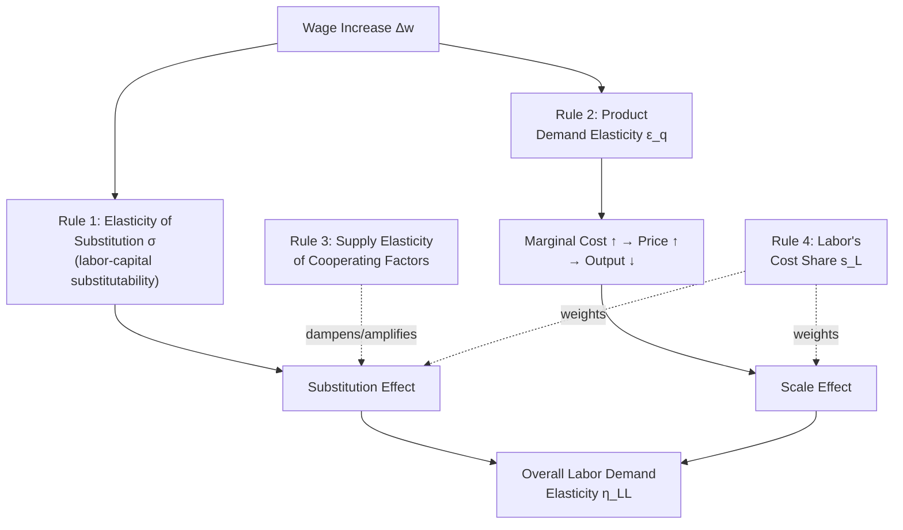

## Marshall's Rules of Derived Demand

### Overview and Motivation

Marshall's rules of derived demand (later extended and formalized by Hicks, giving rise to the joint label "Hicks-Marshall laws," briefly introduced under The Firm's Profit Maximization Problem) constitute the classical qualitative theory predicting **when the elasticity of labor demand will be large versus small**. This item provides the dedicated, in-depth treatment: the economic logic behind each rule, their formal derivation from the substitution/scale decomposition, historical origin, exceptions, and applied relevance to policy questions such as minimum wage effects and union bargaining strategy.

---

### Historical Origin

Alfred Marshall (*Principles of Economics*, 1890) first articulated the proposition that the demand for a factor of production is a **derived demand** — it exists only because of the demand for the final good it helps produce — and that this derived nature implies systematic, identifiable determinants of its elasticity. Marshall's original four rules concerned the general demand for any productive factor. **J.R. Hicks** (*The Theory of Wages*, 1932) later reformulated the rules with greater mathematical rigor using the elasticity of substitution concept, and today the rules are frequently cited jointly as the **Hicks-Marshall laws of derived demand**.

---

### The Four Rules

#### Rule 1: The Elasticity of Substitution

**The elasticity of demand for labor is higher, the greater the elasticity of substitution between labor and other factors of production (typically capital).**

Formally, using the substitution-effect term from the long-run labor demand decomposition:

$$\left.\frac{\partial L^c}{\partial w}\right|_{q} \propto -\sigma$$

where $\sigma$ is the elasticity of substitution (as parameterized, e.g., in the CES production function). If capital and labor are easily substitutable ($\sigma$ large), a wage increase induces a large shift toward capital, producing a large reduction in labor demand. If they are near-perfect complements ($\sigma \to 0$, Leontief technology), no substitution is possible regardless of the wage change, and this channel of demand response disappears entirely.

**Key Points**

- This is the most direct and least controversial of the four rules, following immediately from the substitution-effect term in the cost-minimization decomposition.
- **Empirical relevance**: routine, codifiable tasks (assembly-line manufacturing) tend to have higher $\sigma$ with capital/automation than complex, tacit-knowledge tasks, implying more elastic labor demand (and thus greater vulnerability to wage-induced automation) for the former — a link to the routine-biased technical change literature.

#### Rule 2: The Elasticity of Product Demand

**The elasticity of demand for labor is higher, the greater the elasticity of demand for the final product the labor helps produce.**

This operates through the **scale effect**: a wage increase raises marginal cost, which (via the profit-maximizing output condition $p = MC(q)$) raises price and reduces the profit-maximizing output level $q^*$. The magnitude of the resulting output contraction — and hence the scale-effect-driven reduction in labor demand — is governed directly by the price elasticity of product demand, $\epsilon_q$:

$$\frac{\partial q^*}{\partial w} \propto -\epsilon_q$$

**Key Points**

- If the product faces highly elastic demand (many close substitutes, competitive product market), a wage-driven price increase causes a large sales decline, amplifying job losses.
- If the product faces inelastic demand (necessity goods, limited substitutes, or the firm has market power insulating it from competitive pressure), the same wage increase causes a smaller output contraction and thus a smaller scale-effect job loss.
- **Applied relevance**: this rule is frequently invoked in union bargaining strategy — unions in industries facing less product-market competition (e.g., historically regulated utilities, or firms with substantial market power) can extract wage gains with a smaller associated scale-effect employment cost, all else equal.

#### Rule 3: The Elasticity of Supply of Other Factors (Cooperating Factors)

**The elasticity of demand for labor is higher, the more elastic the supply of cooperating factors of production (chiefly capital).**

If the supply of capital is highly elastic (capital can be acquired or expanded cheaply and without bidding up its own price, e.g., in a small open economy that is a price-taker in global capital markets), then substituting toward capital in response to a wage increase does not itself raise the price of capital — the full substitution effect from Rule 1 operates without a dampening feedback. If capital supply is inelastic (e.g., capital is scarce, or supplying more requires substantially higher $r$), attempting to substitute toward capital bids up its rental price, partially choking off the very substitution that would otherwise reduce labor demand.

**Key Points**

- This rule is conceptually the "supply-side mirror" of Rule 1: Rule 1 asks whether substitution is *technologically* possible; Rule 3 asks whether substitution is *economically* cheap to execute given the supply conditions of the substitute factor.
- **[Inference]** This rule is sometimes considered less empirically salient in modern applied contexts involving capital (given highly elastic global capital markets in most contexts), but remains directly and importantly relevant when the "cooperating factor" in question is a *specific type of labor* rather than capital — e.g., the elasticity of labor demand for low-skill workers depends on the elasticity of supply of the high-skill or immigrant labor with which they are complementary or substitutable inputs.

#### Rule 4: Labor's Share of Total Cost

**The elasticity of demand for labor is higher, the larger labor's share of total production cost.**

The intuition: if labor costs are a large fraction of total cost, a given percentage wage increase translates into a larger percentage increase in marginal/total cost, generating a proportionally larger scale-effect output contraction (via Rule 2's mechanism) than the same percentage wage increase would if labor were a small cost share.

**Key Points**

- **[Inference]** This is the rule most frequently flagged in the literature as holding only **conditionally** rather than as a fully general theorem — its validity can depend on the relationship between labor's cost share and the elasticity of substitution $\sigma$ relative to the product demand elasticity $\epsilon_q$. Specifically, in some formal derivations, Rule 4 is shown to hold unambiguously only when $\sigma < \epsilon_q$ (substitution possibilities are more limited than product-market substitutability) — a qualification often omitted in introductory presentations but noted in more rigorous treatments (e.g., Hamermesh, 1993).
- Despite this technical caveat, Rule 4 remains widely taught as a standard rule of thumb and is broadly consistent with common intuitions (e.g., labor-intensive service industries with low product-substitutability sometimes exhibiting a mix of predictions depending on which of the two competing forces dominates).

---

### Formal Synthesis: Elasticity Decomposition Formula

The four rules can be synthesized into a single formal elasticity expression (a standard result in the Hicks-Marshall tradition) for the case of two inputs (labor and capital) and a competitive output market:

$$\eta_{LL} = -\left[ s_K \sigma + s_L \epsilon_q \right]$$

**[Unverified]** — exact functional form and coefficients vary across textbook derivations depending on assumptions (e.g., whether the product market is treated as competitive or the firm faces a residual demand curve, and whether capital supply is perfectly elastic); this expression should be treated as an illustrative synthesis rather than a single universally standard formula, where:

- $s_L, s_K$ are the cost shares of labor and capital ($s_L + s_K = 1$),
- $\sigma$ is the elasticity of substitution (Rule 1),
- $\epsilon_q$ is the product demand elasticity (Rule 2).

This expression makes transparent that: a higher $\sigma$ (Rule 1) or $\epsilon_q$ (Rule 2) raises $|\eta_{LL}|$; and the weight $s_K$ vs. $s_L$ on each term shows why Rule 4 (cost share) has an ambiguous net direction — a rising $s_L$ raises the weight on $\epsilon_q$ but lowers the weight on $\sigma$, so the overall effect on $|\eta_{LL}|$ depends on whether $\sigma \gtrless \epsilon_q$.

---

### Diagram: The Four Rules and Their Channels (svg_diagram)

---

### Applied Example: Union Wage Strategy Under the Four Rules

**Example**

Consider two unionized sectors:

1. **Airline pilots**: capital (aircraft) and pilot labor are poor substitutes in the short-to-medium run (low $\sigma$, Rule 1 favors inelastic demand); air travel demand is moderately elastic ($\epsilon_q$ moderate, Rule 2); pilot labor cost share of total airline operating cost is relatively small (Rule 4 favors inelastic demand, mitigating Rule 2's effect). **Net prediction**: relatively inelastic labor demand — favorable conditions for a union to extract wage gains with limited employment loss.
2. **Low-skill assembly-line manufacturing facing import competition**: labor and capital/automation are highly substitutable (high $\sigma$, Rule 1 favors elastic demand); the product faces intense global competition, implying high $\epsilon_q$ (Rule 2 favors elastic demand); labor cost share is often substantial in labor-intensive manufacturing (Rule 4 reinforces elastic demand given high $\sigma$ and $\epsilon_q$ both already high). **Net prediction**: highly elastic labor demand — a much weaker position for a union or unilateral wage-floor policy to raise wages without significant employment consequences.

---

### Relevance to Modern Policy Debates

**Key Points**

- **Minimum wage debates**: the Hicks-Marshall rules provide the theoretical prior for *where* to expect larger or smaller minimum-wage disemployment effects — e.g., low-skill food service (historically argued to have relatively low product-market substitutability and low capital-labor substitutability in the very short run) versus manufacturing sectors more exposed to automation substitution.
- **Immigration and labor demand**: Rule 3 (elasticity of supply of cooperating labor) is directly invoked in debates over whether immigrant labor and native labor are complements or substitutes — if immigrant labor supply is highly elastic and complementary to native labor in certain tasks, the theory predicts smaller wage effects on natives than a simple substitutes-only framework would suggest.
- **Automation and routine-biased technical change**: Rule 1 is the direct theoretical antecedent of the modern task-based automation literature (Autor, Levy, and Murnane, 2003; Acemoglu and Restrepo, 2018), which formalizes "routine" tasks as those with especially high $\sigma$ between labor and machine/software capital.

---

### Caveats and Limitations

- **[Inference]** The rules are comparative-static predictions holding "other things equal" — in practice, multiple rules often move in the same or opposing directions simultaneously for a real-world sector (as in the manufacturing example above), so applying the rules to predict a *net* elasticity requires either a formal model (as in the synthesis formula) or careful qualitative judgment about which forces dominate.
- The rules describe **long-run** derived demand elasticities; as established under Short Run and Long Run Labor Demand, short-run elasticities are systematically smaller due to adjustment costs and capital fixity, so the Hicks-Marshall predictions are most directly applicable to long-run comparative statics rather than immediate post-shock responses.
- The rules assume a **competitive product market** in their classical formulation (price-taking firm); extensions to imperfect competition require replacing the product demand elasticity with the elasticity of the firm's *residual* demand curve, which depends additionally on market structure and the number of competing firms.

---

**Related Topics**

- The Firm's Profit Maximization Problem (source of substitution/scale decomposition)
- Short Run and Long Run Labor Demand (time-horizon interaction with elasticity)
- Elasticity of Substitution and CES Production Functions
- Routine-Biased Technical Change and Task-Based Automation Models
- Union Wage Bargaining and Strike Threat Models
- Minimum Wage Policy and Sectoral Elasticity Heterogeneity
- Immigration's Effect on Native Wages: Complements vs. Substitutes
- Monopsony and Imperfect Competition in Product/Labor Markets