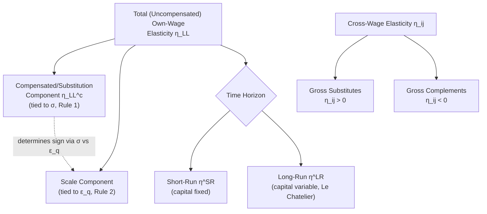

## Elasticities of Labor Demand

### Overview and Motivation

This item consolidates and extends the elasticity concepts introduced piecemeal under The Firm's Profit Maximization Problem, Short Run and Long Run Labor Demand, and Marshall's Rules of Derived Demand into a unified, comprehensive treatment of **how labor demand elasticities are formally defined, decomposed, estimated, and applied**. Where prior items focused on specific theoretical results (the SR/LR distinction, the Hicks-Marshall qualitative rules), this item serves as the systematic reference for the full taxonomy of labor demand elasticity concepts — own-price, cross-price, compensated/uncompensated, and constant-output — along with econometric estimation approaches and a survey of empirical magnitudes.

---

### Taxonomy of Labor Demand Elasticities

#### Own-Wage Elasticity of Demand

The most basic concept, measuring the percentage change in labor demand for a percentage change in the wage of that same labor type:

$$\eta_{LL} = \frac{\partial L}{\partial w} \cdot \frac{w}{L} = \frac{\partial \ln L}{\partial \ln w}$$

By the theory developed under the profit-maximization and derived-demand items, $\eta_{LL} \leq 0$ always (in the long run, strictly by the Slutsky-analog substitution+scale decomposition; in the short run, by diminishing marginal product).

#### Cross-Wage Elasticity of Demand

Measures the percentage change in demand for labor type $i$ (or capital) resulting from a percentage change in the wage of a *different* factor $j$:

$$\eta_{ij} = \frac{\partial L_i}{\partial w_j} \cdot \frac{w_j}{L_i}$$

**Key Points**

- $\eta_{ij} > 0$: factors $i$ and $j$ are **gross substitutes** (a wage increase for factor $j$ raises demand for factor $i$, e.g., a rise in the minimum wage for low-skill labor increasing demand for automation capital or for higher-skill labor as a substitute).
- $\eta_{ij} < 0$: factors $i$ and $j$ are **gross complements** (a wage increase for factor $j$ reduces demand for factor $i$ as well, typically because the dominant scale effect outweighs any substitution effect).
- The sign of $\eta_{ij}$ is theoretically ambiguous in general, as established under the profit-maximization item's comparative statics — determining it empirically is a central task in applied labor demand estimation (e.g., the capital-skill complementarity literature).

#### Compensated (Constant-Output) vs. Uncompensated (Total) Elasticities

Paralleling the Hicksian/Marshallian distinction in consumer demand theory, labor demand elasticities can be decomposed into:

$$\eta_{LL}^{uncompensated} = \underbrace{\eta_{LL}^{compensated}}_{\text{substitution effect, holding } q \text{ fixed}} + \underbrace{s_L \cdot \eta_q^{scale}}_{\text{scale effect}}$$

where $\eta_{LL}^{compensated}$ (also called the **constant-output elasticity**) isolates pure input substitution (analogous to the Hicksian/compensated demand elasticity in consumer theory), and the scale term captures the output-adjustment channel — this is the same decomposition introduced under the profit-maximization item, restated here in elasticity (rather than derivative) notation for direct comparability with the compensated/uncompensated terminology used in applied econometric work.

**Key Points**

- The **compensated own-elasticity** relates directly to the **elasticity of substitution** $\sigma$ via $\eta_{LL}^{compensated} = -s_K \sigma$ (for the two-factor case), making it the empirical object most directly estimable when researchers want to isolate "pure" substitution possibilities net of scale effects (e.g., holding industry output fixed via output controls in a regression).

#### Marshallian (Total, Long-Run) Elasticity

The **Marshallian elasticity of derived demand** is the "full" elasticity incorporating both substitution and scale effects with output free to adjust — this is the object governed jointly by all four Hicks-Marshall rules and is the elasticity relevant for most policy applications (e.g., predicting total employment effects of a wage floor, inclusive of any output/sales contraction).

---

### Comparison Table: Elasticity Concepts

| Elasticity Type | Symbol | What Varies | Captures | Relevant Prior Item |
| --- | --- | --- | --- | --- |
| Own-wage (uncompensated) | $\eta_{LL}$ | $L$ w.r.t. own $w$ | Full response (sub + scale) | Profit Maximization |
| Cross-wage | $\eta_{ij}$ | $L_i$ w.r.t. $w_j$, $j \neq i$ | Substitute/complement relationship | Profit Maximization |
| Compensated (constant-output) | $\eta^{c}_{LL}$ | $L$ w.r.t. $w$, output held fixed | Pure substitution, tied to $\sigma$ | Marshall's Rules (Rule 1) |
| Short-run | $\eta^{SR}_{LL}$ | $L$ w.r.t. $w$, capital fixed | No capital-substitution margin | SR/LR Labor Demand |
| Long-run | $\eta^{LR}_{LR}$ | $L$ w.r.t. $w$, all inputs free | Full Le Chatelier-maximal response | SR/LR Labor Demand |
| Marshallian (total derived demand) | $\eta^{M}_{LL}$ | $L$ w.r.t. $w$, output responds via product market | All four Hicks-Marshall rules combined | Marshall's Rules |

---

### Diagram: Elasticity Concept Hierarchy (svg_diagram)

---

### Econometric Estimation of Labor Demand Elasticities

#### Structural Approach: Translog and CES Cost Functions

Because the Cobb-Douglas functional form imposes a unitary and constant elasticity of substitution (an empirically restrictive assumption, per the discussion under Marginal Productivity Theory of Wages regarding labor share stability), applied researchers typically estimate more **flexible functional forms**:

- **Translog cost function**: a second-order (flexible) approximation to an arbitrary cost function, allowing the elasticity of substitution to vary with factor price ratios rather than being constant, at the cost of additional parameters to estimate.
- **CES production/cost function**: directly parameterizes $\sigma$ as a single structural parameter, more parsimonious but imposing constancy of $\sigma$ across the observed data range.

**Key Points**

- Structural estimation typically requires **share equations** derived from Shephard's lemma (the cost-minimizing input cost share as a function of relative prices), estimated as a system (often via Seemingly Unrelated Regression or GMM) jointly with the cost function itself, to improve efficiency and impose cross-equation parameter restrictions implied by the theory.

#### Reduced-Form / Quasi-Experimental Approach

Given the well-known **simultaneity problem** (wages and employment are jointly determined in market equilibrium, so a simple regression of employment on wages conflates demand and supply), applied labor demand elasticity estimation increasingly relies on **quasi-experimental variation** in wages that plausibly shifts labor supply without directly shifting labor demand (an instrument), or vice versa:

- **Minimum wage changes**: widely used as a source of wage variation for low-skill labor demand elasticity estimation (Card and Krueger, 1994, and the subsequent extensive literature); identifies a *local* elasticity around the minimum wage level, not necessarily generalizable to the full wage distribution.
- **Payroll tax changes**: used to estimate labor demand elasticity via the tax-incidence relationship, since a payroll tax change shifts the wedge between what the firm pays and what the worker receives.
- **Trade shocks / import competition**: used as an instrument for output-price/product-demand shifts to identify the scale-effect channel specifically (relevant to Rule 2).
- **Firm-level demand shocks (e.g., export demand shocks)**: used in recent literature to estimate firm-level labor demand elasticities with respect to idiosyncratic output-price variation, cleanly isolating firm-specific scale effects from economy-wide wage movements.

---

### Survey of Empirical Magnitudes

**[Unverified]** — the labor demand elasticity literature spans several decades, many countries, and diverse identification strategies, so any single numeric range should be treated as illustrative and verified against a specific, recent meta-analysis rather than taken as a precise consensus estimate:

- Aggregate/economy-wide long-run own-wage labor demand elasticities are commonly reported in survey work (e.g., Hamermesh's influential 1993 survey, *Labor Demand*) as clustering in a **moderate, inelastic-to-unit-elastic range** in absolute value, though considerable heterogeneity exists across studies, countries, and time periods.
- Elasticities for **low-skill/low-wage labor** are often found to be somewhat larger in magnitude than for high-skill labor, consistent with Rule 1 (greater ease of automating routine, low-skill tasks) — though the specific quantitative gap varies substantially by study.
- **Short-run** elasticities from firm/establishment panel data are consistently found to be smaller in magnitude than long-run/cross-sectional estimates, consistent with both the Le Chatelier principle and dynamic adjustment costs.

---

### Example: Computing an Elasticity from a CES Cost Share Regression

**Example**

Suppose a researcher estimates the following log cost-share regression (implied by a CES cost function) across manufacturing establishments:

$$\ln\left(\frac{w L}{r K}\right) = \beta_0 + (\sigma - 1) \ln\left(\frac{w}{r}\right) + \varepsilon$$

If the estimated coefficient on $\ln(w/r)$ is $\hat{\gamma} = -0.4$, then $\hat{\sigma} - 1 = -0.4 \Rightarrow \hat{\sigma} = 0.6$. Since $\hat{\sigma} < 1$, this indicates capital and labor are **estimated to be complements in the CES sense** (relative to the Cobb-Douglas benchmark of $\sigma=1$) for this sample — a rise in the wage-rental ratio is associated with a *smaller* proportional shift of the cost share toward capital than Cobb-Douglas would predict, implying more limited substitution possibilities than the unitary-elasticity benchmark.

---

### Policy Applications Requiring Elasticity Estimates

| Application | Elasticity Needed | Typical Data Source |
| --- | --- | --- |
| Minimum wage disemployment prediction | Own-wage, low-skill, local range | Establishment-level panel around minimum wage changes |
| Payroll tax incidence | Own-wage (demand) vs. labor supply elasticity | Administrative tax/payroll data |
| Immigration wage-effect prediction | Cross-wage (native-immigrant) | Cross-area/cross-cohort variation (e.g., Card's "supply shock" approach) |
| Automation/capital-skill complementarity assessment | Cross-wage (labor-capital), by skill group | Industry/firm panel with capital investment data |
| Union bargaining outcome prediction | Full Marshallian elasticity (all 4 rules) | Industry-level cost share and demand elasticity data |

---

### Caveats on Elasticity Estimation

- **[Inference]** A persistent methodological challenge across this literature is that "the" labor demand elasticity is not a single universal constant even for a given labor type — it varies by time horizon (SR vs. LR), by the specific wage-variation margin exploited (minimum wage vs. payroll tax vs. general equilibrium wage growth), and by local market structure (competitive vs. monopsonistic), so applied researchers and policymakers should treat any single reported elasticity as conditional on its specific empirical context rather than as a universal structural parameter.
- Elasticities estimated from a **local** policy change (e.g., a modest minimum wage increase) may not extrapolate reliably to predict the effects of a much larger wage change, if the underlying substitution possibilities are non-linear over the relevant wage range (a general concern with using any locally-identified elasticity for out-of-sample policy simulation).

---

**Related Topics**

- The Firm's Profit Maximization Problem (foundational substitution/scale decomposition)
- Short Run and Long Run Labor Demand (time-horizon elasticity differences)
- Marshall's Rules of Derived Demand (qualitative determinants of elasticity magnitude)
- CES and Translog Functional Forms in Applied Labor Demand Estimation
- Capital-Skill Complementarity and Cross-Wage Elasticities
- Minimum Wage Elasticity Estimation and Quasi-Experimental Design
- Monopsony Power and Labor Supply Elasticity to the Firm
- Immigration and the Cross-Elasticity of Native/Immigrant Labor Demand