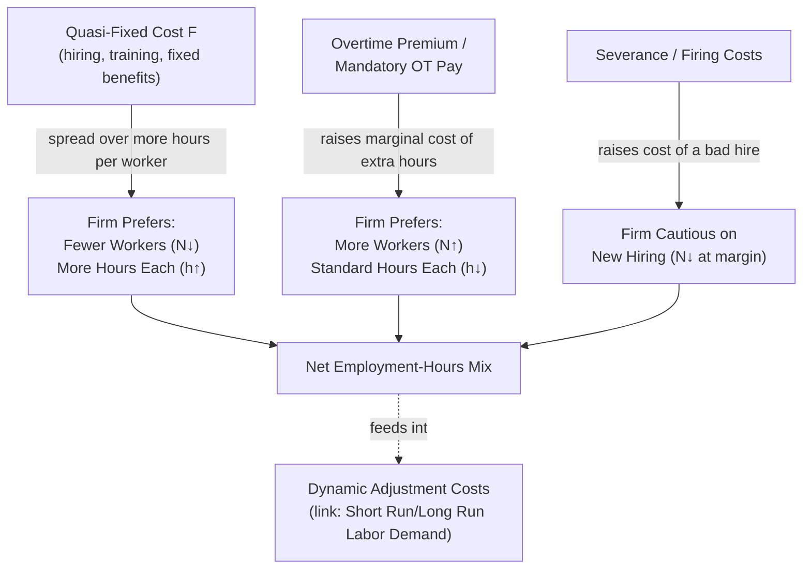

## Quasi Fixed Labor Costs and Adjustment

### Overview and Motivation

Quasi-fixed labor costs are costs of employing a worker that do **not** vary with the number of hours that worker works, in contrast to wage costs which scale directly with hours. This distinction — introduced by **Walter Oi (1962)** in his seminal paper characterizing "labor as a quasi-fixed factor" — is foundational to understanding why firms make discrete choices between hiring more workers versus extending the hours of existing workers, why layoffs (rather than proportional hours reductions) are common during downturns, and why the dynamic adjustment costs referenced under Short Run and Long Run Labor Demand exist in the first place. This item provides the dedicated treatment of quasi-fixed costs: their sources, their implications for the hours/employment margin, and their role in modern dynamic and search-based labor demand theory.

---

### Defining Quasi-Fixed Costs

Total labor cost for a firm employing $N$ workers for $h$ hours each can be decomposed as:

$$TC_L = N \cdot \left[ F + w \cdot h \right]$$

where:

- $w \cdot h$ is the **variable (per-hour) cost** — the wage payment proportional to hours worked.
- $F$ is the **quasi-fixed cost per worker** — a cost incurred once a worker is hired, **independent of how many hours that worker subsequently works.**

**Key Points**

- The term "quasi"-fixed distinguishes these costs from truly fixed costs of the firm (like a factory lease); quasi-fixed costs are fixed *per worker* but still vary with the *number* of workers ($N$) — they are fixed with respect to the **hours margin** specifically, not fixed in an absolute sense.
- This decomposition creates two economically distinct margins of labor input: the **employment margin** ($N$, the number of workers) and the **hours margin** ($h$, hours per worker) — a distinction absent from the simpler models in prior labor demand items, which typically treated "$L$" as a single homogeneous quantity of labor input.

---

### Sources of Quasi-Fixed Costs

| Category | Examples | Timing |
| --- | --- | --- |
| Hiring costs | Recruiting, screening, interviewing, background checks | One-time, at hire |
| Training costs | Firm-specific human capital investment, onboarding | Front-loaded, at/near hire |
| Fixed benefit costs | Health insurance premiums (flat per-employee in many systems), retirement plan administration | Per-period, but invariant to hours |
| Statutory/payroll costs with caps or flat components | Certain payroll taxes with a fixed component or a cap (making the *marginal* cost of extra hours zero above the cap) | Per-period |
| Firing/severance costs | Severance pay, unemployment insurance experience-rating costs, litigation risk | One-time, at separation |
| Workspace/equipment setup | Providing a desk, computer, uniform, or specialized equipment per worker | One-time, at hire |

**[Inference]** The relative importance of each category varies substantially by institutional context — health-insurance-linked quasi-fixed costs are particularly emphasized in the US labor economics literature given the historically employer-based health insurance system, whereas hiring/firing and severance-related quasi-fixed costs are more central to the European labor economics literature on employment protection legislation.

---

### Implications for the Employment-Hours Margin

#### The Firm's Joint Choice of N and h

The firm's cost-minimization problem for a given total labor input (in efficiency units, e.g., total hours $H = N \cdot h$) becomes:

$$\min_{N, h} \; N \left[ F + w(h) \cdot h \right] \quad \text{s.t.} \quad N \cdot g(h) = \bar{H}^{eff}$$

where $w(h)$ may itself be a function of hours (e.g., overtime premiums raise the marginal wage above some threshold) and $g(h)$ allows for the possibility that effective labor input per hour is not necessarily linear in $h$ (e.g., fatigue effects at very long hours).

**Key Points**

- A **higher quasi-fixed cost $F$** shifts the firm's cost-minimizing input mix toward **fewer workers working more hours each** — since $F$ is now spread over more hours per worker, reducing the effective per-hour cost of the fixed component. This is the standard explanation for why rising health-insurance costs (a quasi-fixed cost in the US context) are associated with firms preferring longer hours per employee (or more overtime) over expanding headcount.
- Conversely, **overtime premium regulations** (e.g., mandated 1.5x pay beyond a threshold, as under the US Fair Labor Standards Act) raise the marginal cost of additional hours beyond the threshold, pushing the optimal mix toward **more workers working standard hours** rather than fewer workers working overtime — the opposite direction from the quasi-fixed-cost effect, illustrating that policy can be used to counteract or reinforce the underlying quasi-fixed-cost incentive depending on the policy goal.

#### Comparison: Effects on Employment vs. Hours Margin

| Cost Change | Effect on N (Employment) | Effect on h (Hours per Worker) |
| --- | --- | --- |
| ↑ Quasi-fixed cost $F$ (e.g., rising health premiums) | Downward pressure | Upward pressure |
| ↑ Overtime premium / mandatory OT pay | Upward pressure (favors more workers, standard hours) | Downward pressure (discourages OT) |
| ↑ Straight-time wage $w$ (no change to $F$) | Downward pressure (standard scale/substitution effect) | Ambiguous (own-wage effect on hours is theoretically indeterminate) |
| ↑ Firing/severance cost | Downward pressure on *gross* hiring (raises expected cost of a bad match); ambiguous net employment effect | Upward pressure (existing workers' hours favored over new hires) |

---

### Diagram: Quasi-Fixed Costs and the Employment-Hours Trade-off (svg_diagram)

---

### Role in Dynamic Labor Demand and Adjustment Costs

Quasi-fixed costs are the **microeconomic foundation** of the adjustment-cost models introduced under Short Run and Long Run Labor Demand. Because hiring and firing each worker incurs a discrete, per-worker quasi-fixed cost, firms face a genuine economic incentive to **smooth employment changes over time** rather than adjusting headcount instantaneously and continuously in response to every demand fluctuation:

$$\text{Adjustment cost} \approx F \cdot |N_t - N_{t-1}|$$

or, in the quadratic form used in dynamic models, $\frac{\gamma}{2}(N_t - N_{t-1})^2$ — the quasi-fixed cost per hire/fire event is the underlying structural parameter that the reduced-form adjustment-cost coefficient $\gamma$ is meant to proxy for.

**Key Points**

- This provides a **microfoundation** for "labor hoarding" during temporary downturns: if the quasi-fixed cost of laying off and later re-hiring a worker exceeds the short-run cost of retaining an underutilized worker, firms will rationally retain workers even at temporarily reduced effective output — a phenomenon extensively documented in business-cycle labor market research and connected to observed **procyclical labor productivity** (measured output per worker rises in booms partly because firms retain workers through downturns and reap the productivity benefit of not having re-hired and retrained when demand recovers).
- Quasi-fixed costs also help explain the empirical prevalence of **temporary employment contracts, staffing agencies, and probationary periods** as institutional mechanisms firms use to reduce the effective quasi-fixed cost of testing a new employment match before committing to the full hiring/training/benefits cost bundle.

---

### Search and Matching Theory Connection

**[Inference]** In modern search-and-matching models of the labor market (the Diamond-Mortensen-Pissarides framework, typically covered as a distinct syllabus item under labor market frictions/unemployment theory), the quasi-fixed **hiring cost** concept is formalized directly as a **vacancy-posting cost**, which firms incur before a match is realized and which is central to determining the equilibrium job-finding and job-filling rates — this represents a direct theoretical lineage from Oi's original quasi-fixed cost concept into the dominant modern framework for unemployment and labor market flow analysis.

---

### Example: Health Insurance as a Quasi-Fixed Cost

**Example**

Suppose a firm faces a flat health insurance premium of $8,000 per year per full-time-equivalent employee, regardless of whether that employee works 30 or 40 hours per week, alongside a straight-time wage of $25/hour with no overtime obligation below 40 hours. Consider two staffing configurations to cover 80 weekly hours of labor needs:

- **Configuration A** (2 workers at 40 hours each): Total cost = $2 \times (\$8{,}000/52 + \$25 \times 40) \approx 2 \times (\$153.85 + \$1{,}000) = \$2{,}307.70$ per week.
- **Configuration B** (1 worker at 80 hours, ignoring any overtime/labor-law constraints for illustration): Total cost = $1 \times (\$153.85 + \$25 \times 80) = \$2{,}153.85$ per week.

Configuration B is cheaper by roughly $154 per week — precisely the quasi-fixed benefit cost saved by not incurring a second employee's flat premium — illustrating concretely why a rising quasi-fixed benefit cost pushes firms toward fewer, longer-hours employees, before accounting for any overtime premium or hours-based labor regulation that would push back in the opposite direction (per the comparison table above).

---

### Policy and Institutional Relevance

- **Health insurance reform**: policy debates over decoupling health insurance provision from employment (or capping/subsidizing premiums) are directly informed by the quasi-fixed cost framework's prediction that flat per-employee benefit costs distort the employment/hours margin, potentially reducing overall employment (particularly at the low-wage margin, where $F$ is large relative to total compensation) in favor of longer hours for a smaller workforce.
- **Employment protection legislation (EPL)**: severance pay mandates and dismissal restrictions function as a quasi-fixed cost incurred at the *firing* margin rather than the hiring margin; comparative labor economics research on EPL and its effects on employment volatility, average job tenure, and youth/entry-level hiring rates builds directly on this cost-category analysis.
- **The Affordable Care Act's employer mandate threshold** ([Unverified] — specific US policy design details and thresholds should be verified against current documentation) is frequently cited as a real-world example of a policy-created quasi-fixed cost threshold effect, where employer obligations that activate at a specific employee-count or hours threshold can create discontinuous incentives around that threshold — a canonical application of the quasi-fixed cost concept to bunching/threshold analysis in applied labor economics.

---

**Related Topics**

- Oi's Theory of Labor as a Quasi-Fixed Factor (foundational 1962 paper)
- Short Run and Long Run Labor Demand: Dynamic Adjustment Costs
- Labor Hoarding and Procyclical Productivity
- Overtime Regulation and the Fair Labor Standards Act
- Employment Protection Legislation and Severance Pay Mandates
- Search and Matching Theory: Vacancy Posting Costs (Diamond-Mortensen-Pissarides)
- Temporary Employment Contracts and Staffing Agency Arrangements
- Employer-Sponsored Health Insurance and Labor Market Distortions