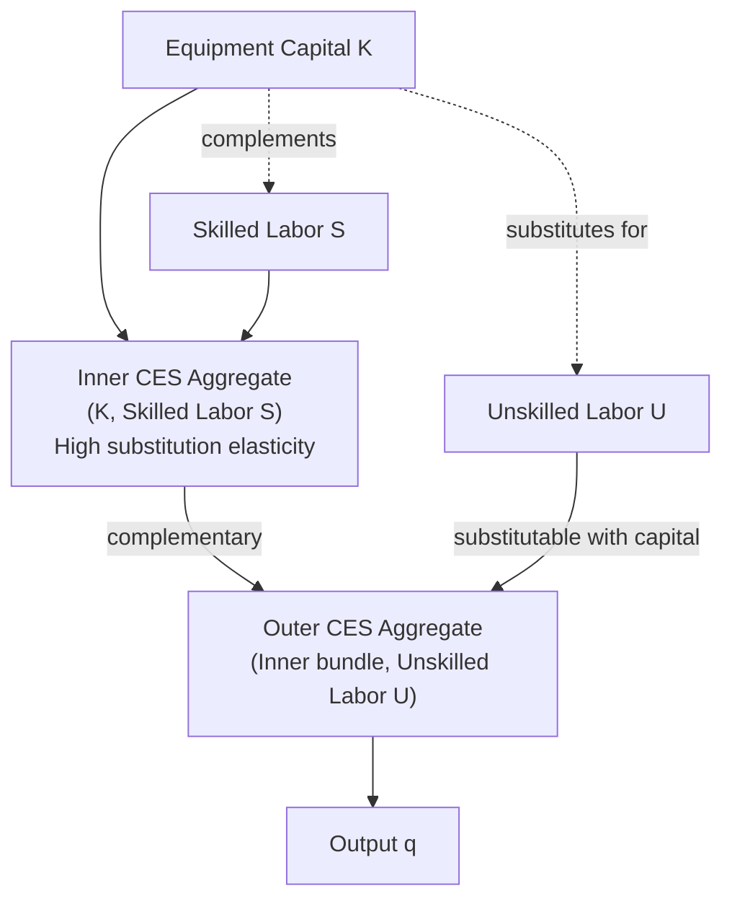

## Capital Labor Substitution

### Overview and Motivation

Capital-labor substitution is the technological and economic phenomenon whereby firms adjust the relative proportions of capital and labor employed in production in response to changes in their relative prices, subject to the constraints of available production technology. This item unifies and formalizes concepts introduced across multiple prior items in this chapter — the elasticity of substitution referenced under The Firm's Profit Maximization Problem and Marshall's Rules of Derived Demand, and the CES functional form introduced under Elasticities of Labor Demand — into a dedicated treatment of the isoquant-based theory, the elasticity of substitution as a formal measure, its econometric estimation, and its centrality to the modern automation and capital-skill complementarity literatures.

---

### The Isoquant Framework

Capital-labor substitution is most intuitively represented via **isoquants**: curves in $(L, K)$ space showing all combinations of labor and capital that produce a given output level $\bar{q} = f(L, K)$.

**Key Points**

- The **slope of the isoquant** at any point is the **marginal rate of technical substitution (MRTS)**, $MRTS_{LK} = -\frac{dK}{dL}\Big|_{\bar{q}} = \frac{MP_L}{MP_K}$ — the rate at which capital can be reduced per additional unit of labor while holding output constant.
- **Convexity of isoquants** (diminishing MRTS as $L$ increases along an isoquant) is the standard curvature assumption ensuring a well-defined, unique cost-minimizing input combination for any given factor price ratio — this is the same convexity property invoked under the profit-maximization item to guarantee the substitution effect is non-positive.
- The **curvature** of the isoquant directly encodes the degree of substitutability: a nearly straight-line isoquant implies near-perfect substitutes; a right-angle (L-shaped) isoquant implies no substitutability (fixed proportions).

### Diagram: Isoquant Curvature and Substitutability (svg_diagram)

<svg xmlns="http://www.w3.org/2000/svg" viewBox="0 0 640 380">
<text x="320" y="24" text-anchor="middle" font-size="15" font-weight="bold" fill="#1a1a1a">Isoquant Curvature and Substitutability (svg_diagram)</text>
<line x1="60" y1="330" x2="600" y2="330" stroke="#333" stroke-width="1.5" />
<line x1="60" y1="330" x2="60" y2="50" stroke="#333" stroke-width="1.5" />
<text x="600" y="352" text-anchor="middle" font-size="12" fill="#333">Labor (L)</text>
<text x="25" y="190" text-anchor="middle" font-size="12" fill="#333" transform="rotate(-90 25 190)">Capital (K)</text>
<line x1="90" y1="80" x2="300" y2="300" stroke="#dc2626" stroke-width="2.5" />
<text x="250" y="70" font-size="11" fill="#dc2626" font-weight="bold">σ → ∞ (perfect substitutes)</text>
<path d="M 130 90 Q 200 130 240 200 Q 280 270 400 300" fill="none" stroke="#2563eb" stroke-width="2.5" />
<text x="330" y="255" font-size="11" fill="#2563eb" font-weight="bold">σ = 1 (Cobb-Douglas)</text>
<path d="M 180 90 L 180 220 L 480 220" fill="none" stroke="#16a34a" stroke-width="2.5" />
<text x="440" y="235" font-size="11" fill="#16a34a" font-weight="bold">σ → 0 (Leontief, no substitution)</text>
</svg>

---

### The Elasticity of Substitution: Formal Definition

The **elasticity of substitution** $\sigma$ (Hicks, 1932) formally measures the curvature of the isoquant — specifically, the percentage change in the capital-labor ratio for a percentage change in the MRTS (equivalently, the marginal rate of technical substitution, which equals the factor price ratio at a cost-minimizing optimum):

$$\sigma = \frac{d\ln(K/L)}{d\ln(MRTS_{LK})} = \frac{d\ln(K/L)}{d\ln(w/r)}$$

using the cost-minimization equality $MRTS_{LK} = w/r$ to express $\sigma$ directly in terms of observable factor prices.

**Key Points**

- $\sigma$ is a **pure technology parameter** measuring substitutability holding output fixed — it corresponds exactly to the "compensated" or "constant-output" elasticity concept introduced under Elasticities of Labor Demand, distinct from the full Marshallian labor demand elasticity which also incorporates the scale effect.
- $\sigma \to \infty$: labor and capital are **perfect substitutes** (linear isoquants; the two inputs are interchangeable at a fixed rate regardless of the price ratio).
- $\sigma = 1$: the **Cobb-Douglas** case, where cost shares are invariant to the factor price ratio (as derived under Marginal Productivity Theory of Wages).
- $\sigma \to 0$: **Leontief/fixed-proportions** technology — no substitution possible at any price ratio; the isoquant is L-shaped, and the cost-minimizing input ratio is fixed by the technology alone.
- $0 < \sigma < 1$: capital and labor are relatively poor substitutes (cost share moves in the *same* direction as the price of the now-relatively-scarcer factor — i.e., a higher wage-rental ratio $w/r$ *raises* labor's cost share, since the quantity response is proportionally smaller than the price response).
- $\sigma > 1$: capital and labor are relatively easy substitutes (cost share moves in the *opposite* direction from the relatively higher-priced factor, since the quantity response dominates).

---

### Relationship to Cost Shares

A key testable implication distinguishing $\sigma \gtrless 1$: differentiate the labor cost share $s_L = wL/(wL+rK)$ with respect to $\ln(w/r)$. It can be shown that:

$$\frac{d s_L}{d\ln(w/r)} \; \text{has the same sign as} \; (1 - \sigma)$$

**Key Points**

- If $\sigma < 1$: a rising wage-rental ratio is associated with a **rising** labor cost share (labor becomes relatively more expensive but the firm cannot substitute away proportionally, so total labor expenditure rises as a fraction of cost).
- If $\sigma > 1$: a rising wage-rental ratio is associated with a **falling** labor cost share (the firm substitutes toward capital more than proportionally, reducing labor's expenditure share despite the higher wage).
- This relationship is the direct analytical link to the **labor share of income literature** referenced under Marginal Productivity Theory of Wages: some accounts of a secularly declining labor share attribute the pattern in part to $\sigma > 1$ combined with a rising relative price/declining relative cost of capital equipment (particularly information and automation technology) over recent decades — though, as previously noted, markup/market-power explanations are a competing and actively debated account, and the relative contribution of each is not fully settled.

---

### CES Production Function: Full Specification and Properties

As introduced under Elasticities of Labor Demand, the CES form is the standard workhorse for empirically parameterizing $\sigma$:

$$q = A\left[\alpha L^{\frac{\sigma-1}{\sigma}} + (1-\alpha) K^{\frac{\sigma-1}{\sigma}}\right]^{\frac{\sigma}{\sigma-1}}$$

**Key Points**

- This functional form is constructed specifically so that $\sigma$ is **constant** across all input ratios and price ratios — a convenient but restrictive property (constancy of $\sigma$ is itself a testable and sometimes rejected assumption, motivating flexible forms like translog for applied work, as noted under Elasticities of Labor Demand).
- **Nested CES** extensions allow $\sigma$ to differ across different labor types (e.g., skilled vs. unskilled) and capital, enabling richer models such as the capital-skill complementarity framework below.

---

### Capital-Skill Complementarity

A highly influential extension (**Griliches, 1969**; formalized in general equilibrium by **Krusell, Ohanian, Ríos-Rull, and Violante, 2000**) posits a **nested CES** structure in which capital (particularly equipment capital) is a stronger substitute for **unskilled** labor but a complement to **skilled** labor:

$$q = \left[ \mu \left( \lambda K^{\rho} + (1-\lambda) S^{\rho} \right)^{\phi/\rho} + (1-\mu) U^{\phi} \right]^{1/\phi}$$

where $K$ is (equipment) capital, $S$ is skilled labor, $U$ is unskilled labor, and the nesting structure ($K$ and $S$ combined first, in an inner CES aggregator, before being combined with $U$) allows the capital-skilled-labor substitution elasticity to differ from the capital-unskilled-labor substitution elasticity.

**Key Points**

- **[Inference]** This framework is the leading theoretical explanation, in much of the labor economics literature, for the observed co-movement of rising capital equipment investment (especially computerization) with rising skill premia (the widening wage gap between skilled and unskilled workers) since roughly the 1980s — the mechanism being that capital deepening, given complementarity with skilled labor, directly raises skilled workers' marginal product and hence their relative wage, while simultaneously substituting for and displacing unskilled labor.
- This framework is a direct ancestor of the modern **task-based / routine-biased technical change** literature (Autor, Levy, and Murnane, 2003; Acemoglu and Autor, 2011), which further disaggregates "skill" into task categories (routine vs. non-routine, cognitive vs. manual) to better match the empirically observed **polarization** of the wage/employment distribution (growth at both the high and low ends, hollowing out of the middle) rather than a simple monotonic skill-premium prediction.

---

### Diagram: Capital-Skill Complementarity Nested Structure (svg_diagram)

---

### Econometric Estimation of σ

**Key Points**

- **Direct CES estimation**: estimating the log input-ratio equation $\ln(K/L) = c - \sigma \ln(w/r) + \varepsilon$ (or the equivalent cost-share equation from Shephard's lemma) via regression, using cross-sectional or panel variation in relative factor prices — subject to the same simultaneity concerns discussed under Elasticities of Labor Demand (relative factor prices and input ratios are jointly determined in equilibrium), motivating instrumental-variable approaches using plausibly exogenous cost shifters (e.g., regional energy prices affecting capital costs, or state-level policy variation).
- **Normalized CES estimation**: a technical refinement (León-Ledesma, McAdam, and Willman, 2010) addressing the tendency of naive nonlinear CES estimation to be highly sensitive to starting values and to conflate $\sigma$ with technology-level/bias parameters; normalizing the CES function around a reference point improves estimation stability.
- **[Unverified]** Point estimates of the aggregate capital-labor elasticity of substitution reported across the macro/labor literature commonly cluster **below unity** (consistent with capital and labor being relatively poor aggregate substitutes, i.e., $\sigma < 1$), though this is sensitive to level of aggregation (industry vs. economy-wide), capital type (equipment vs. structures), time period, and estimation method — a specific numeric estimate should be sourced to a particular study rather than treated as a fixed, universally agreed value.

---

### Comparison Table: σ Regimes and Their Implications

| Regime | Isoquant Shape | Cost Share Response to ↑(w/r) | Labor Share Trend Implication | Canonical Technology |
| --- | --- | --- | --- | --- |
| $\sigma \to \infty$ | Straight line | Extreme: full switch to cheaper input | Highly volatile with relative prices | Perfect substitutes |
| $\sigma > 1$ | Relatively flat/convex | Labor share falls | Automation/equipment-driven decline plausible | Easy substitution (e.g., routine tasks) |
| $\sigma = 1$ | Standard Cobb-Douglas | Constant (no change) | Stable labor share | Cobb-Douglas |
| $0 < \sigma < 1$ | Relatively sharply curved | Labor share rises | Labor share resilient/rising with automation | Limited substitution |
| $\sigma \to 0$ | Right angle (L-shaped) | Fixed regardless of price ratio | Labor share moves only via price levels, not substitution | Leontief/fixed proportions |

---

### Applied Example: Automation Policy Analysis

**Example**

Consider a policy debate over a tax on robots/automation capital intended to protect employment. The predicted employment effect depends critically on the estimated $\sigma$ between labor and automation capital for the relevant task category:

- If $\sigma$ is estimated to be **high** (e.g., for routine manufacturing tasks), a robot tax that raises the effective price of automation capital ($r$) would induce substantial substitution back toward labor ($L/K$ rises sharply) — supporting the policy's employment-protective goal, though at an efficiency cost (higher production costs, reduced competitiveness).
- If $\sigma$ is estimated to be **low** (e.g., for tasks where capital and labor are complementary, or fixed-proportions technology dominates), the same robot tax would have **little employment effect** but would still raise costs — undermining the policy rationale while still imposing a deadweight efficiency loss, illustrating why credible elasticity estimation is a prerequisite for well-targeted automation policy.

---

**Related Topics**

- The Firm's Profit Maximization Problem (MRTS and cost-minimization foundations)
- Marshall's Rules of Derived Demand (Rule 1: elasticity of substitution)
- Elasticities of Labor Demand (compensated elasticity and CES/translog estimation)
- Marginal Productivity Theory of Wages (labor share and Cobb-Douglas benchmark)
- Capital-Skill Complementarity and the Skill Premium
- Task-Based Models and Routine-Biased Technical Change
- Automation Policy and Robot Taxation
- Nested CES Functional Forms in Applied Macro-Labor Models