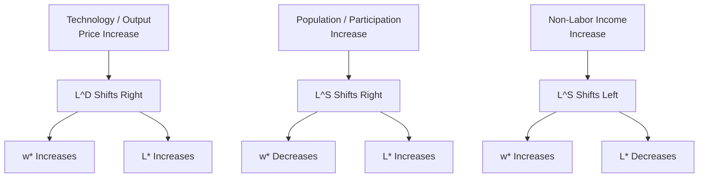

## Equilibrium Wage and Employment Determination

### Overview and Motivation

This item establishes the core general-equilibrium framework of the competitive labor market: how the market wage and aggregate employment level are jointly determined by the intersection of aggregate labor supply and aggregate labor demand. It synthesizes the labor demand theory developed across the preceding chapter (rooted in firm profit maximization and marginal productivity theory) with the labor supply theory implicit in household decision-making, and formalizes the welfare properties, comparative statics, and adjustment dynamics of the resulting competitive equilibrium — serving as the reference benchmark against which subsequent departures (monopsony, minimum wages, unions, search frictions) in this chapter will be measured.

---

### The Basic Competitive Equilibrium Model

#### Aggregate Labor Demand

Aggregate (market) labor demand $L^D(w)$ is the horizontal summation of individual firms' labor demand curves, each derived from profit maximization as established under The Firm's Profit Maximization Problem:

$$L^D(w) = \sum_{j=1}^{J} L_j^d(w)$$

where each $L_j^d(w)$ satisfies $p \cdot MP_{L,j} = w$ for firm $j$. As established under Short Run and Long Run Labor Demand and Marshall's Rules of Derived Demand, $L^D(w)$ is downward sloping, with its slope magnitude governed by the elasticity of substitution, product demand elasticity, cost shares, and time horizon.

#### Aggregate Labor Supply

Aggregate labor supply $L^S(w)$ is the horizontal summation of individual labor supply decisions, each derived from household utility maximization over consumption and leisure subject to a time and budget constraint (the standard neoclassical labor-leisure model):

$$L^S(w) = \sum_{i=1}^{I} L_i^s(w)$$

**Key Points**

- Individual labor supply reflects the balance of the **substitution effect** (higher $w$ raises the opportunity cost of leisure, inducing more work) and the **income effect** (higher $w$ raises full income, and if leisure is a normal good, induces less work) — the same Slutsky-type decomposition logic used on the demand side, applied here to the household's problem.
- **[Inference]** Aggregate labor supply is conventionally assumed upward-sloping over the empirically relevant wage range (substitution effect dominating), though the individual-level **backward-bending labor supply curve** (income effect dominating at high wages) remains a standard theoretical possibility discussed in household labor supply theory; the aggregate market-level curve is typically modeled as upward-sloping for tractability in this equilibrium framework.

---

### Market Equilibrium

Equilibrium wage $w^*$ and employment $L^*$ are determined where aggregate supply equals aggregate demand:

$$L^D(w^*) = L^S(w^*) = L^*$$

**Key Points**

- At $w^*$, every firm is simultaneously satisfying its own profit-maximizing condition $VMP_{L,j} = w^*$, and every worker is simultaneously satisfying their own labor supply optimality condition (marginal rate of substitution between consumption and leisure equals the real wage) — equilibrium is a **mutual consistency condition** across all decentralized optimizing agents, not an additional behavioral assumption of its own.
- This is a **static, single-market partial equilibrium** representation; it does not model cross-market feedback (e.g., wage changes affecting product prices which feed back into labor demand) — such feedbacks are the subject of general equilibrium extensions.

### Diagram: Competitive Labor Market Equilibrium (svg_diagram)

<svg xmlns="http://www.w3.org/2000/svg" viewBox="0 0 620 400">
<text x="310" y="24" text-anchor="middle" font-size="15" font-weight="bold" fill="#1a1a1a">Competitive Labor Market Equilibrium (svg_diagram)</text>
<line x1="70" y1="340" x2="580" y2="340" stroke="#333" stroke-width="1.5" />
<line x1="70" y1="340" x2="70" y2="50" stroke="#333" stroke-width="1.5" />
<text x="580" y="362" text-anchor="middle" font-size="12" fill="#333">Employment (L)</text>
<text x="35" y="195" text-anchor="middle" font-size="12" fill="#333" transform="rotate(-90 35 195)">Wage (w)</text>
<line x1="100" y1="90" x2="500" y2="310" stroke="#dc2626" stroke-width="2.5" />
<text x="440" y="300" font-size="12" fill="#dc2626" font-weight="bold">L^D(w)</text>
<line x1="140" y1="310" x2="460" y2="90" stroke="#2563eb" stroke-width="2.5" />
<text x="440" y="105" font-size="12" fill="#2563eb" font-weight="bold">L^S(w)</text>
<circle cx="310" cy="197" r="5" fill="#16a34a" />
<line x1="70" y1="197" x2="310" y2="197" stroke="#888" stroke-width="1" stroke-dasharray="4,3" />
<line x1="310" y1="197" x2="310" y2="340" stroke="#888" stroke-width="1" stroke-dasharray="4,3" />
<text x="60" y="201" text-anchor="end" font-size="11" fill="#555">w*</text>
<text x="310" y="355" text-anchor="middle" font-size="11" fill="#555">L*</text>
</svg>

---

### Welfare Properties: The First Welfare Theorem in Labor Markets

Under standard competitive assumptions (price-taking firms and workers, no externalities, no informational asymmetries, complete markets), the competitive labor market equilibrium is **Pareto efficient**: no reallocation of labor across firms could raise output/utility for some agent without lowering it for another.

**Key Points**

- This efficiency result underlies the standard **deadweight loss** analysis of labor market interventions (minimum wages, payroll taxes, quantity restrictions): any policy that moves employment away from $L^*$ in a genuinely competitive market reduces total surplus, illustrated by the standard triangle loss in a supply-demand diagram.
- **Producer surplus** in the labor market context corresponds to firm profit accruing from employing labor (the area between the wage line and the labor demand curve, up to $L^*$); **worker surplus** (an analog of consumer surplus) corresponds to the area between the wage line and the labor supply curve, representing the gain to workers from being paid $w^*$ rather than their reservation wage for each unit of labor supplied.
- **[Inference]** This efficiency conclusion is conditional on the competitive assumptions holding; the remainder of this chapter (monopsony, minimum wage effects, search frictions, discrimination) is substantially concerned with documenting and analyzing real-world departures from these conditions, precisely because the efficiency benchmark established here does not hold unconditionally in practice.

---

### Comparative Statics: Shifts in Supply and Demand

| Shock | Effect on $L^D$ or $L^S$ | Effect on $w^*$ | Effect on $L^*$ |
| --- | --- | --- | --- |
| Increase in output price $p$ | $L^D$ shifts right | Increases | Increases |
| Technological improvement raising $MP_L$ | $L^D$ shifts right | Increases | Increases |
| Fall in capital price $r$ (if L,K complements) | $L^D$ shifts right | Increases | Increases |
| Fall in capital price $r$ (if L,K substitutes) | $L^D$ shifts left | Decreases | Decreases |
| Rise in population/labor force participation | $L^S$ shifts right | Decreases | Increases |
| Rise in non-labor income (income effect) | $L^S$ shifts left | Increases | Decreases |
| Rise in value of home production/leisure | $L^S$ shifts left | Increases | Decreases |

**[Inference]** The sign of the capital-price effect on labor demand depends on whether capital and labor are gross substitutes or complements at the relevant margin, as established under Capital Labor Substitution and the profit-maximization comparative statics — this ambiguity is a direct carry-over from the firm-level theory to the market-level equilibrium comparative statics.

---

### Diagram: Comparative Statics — Demand Shift vs. Supply Shift (svg_diagram)

---

### Long-Run Adjustment: Entry, Exit, and Human Capital Response

**Key Points**

- In the **short run**, labor supply may be relatively inelastic (workers cannot instantly retrain or relocate), while in the **long run**, supply becomes more elastic as workers can acquire new skills, relocate geographically, or new entrants respond to persistently higher wages in a given occupation/sector — an application of the same short-run/long-run elasticity logic developed on the demand side (Short Run and Long Run Labor Demand) to the supply side of the market.
- **Firm entry and exit** in the long run further affects the demand side: persistently high sector-specific wages (relative to the value of output) can induce **firm exit** (reducing $L^D$) or, if driven by strong product demand, attract **new firm entry** (increasing $L^D$) — a general equilibrium feedback not present in the single-firm partial equilibrium analysis of prior chapter items.
- **[Inference]** These long-run adjustment margins imply that observed short-run equilibrium wage/employment responses to a given shock (e.g., a regional demand shift) will generally understate the eventual long-run response, mirroring the Le Chatelier logic introduced under Short Run and Long Run Labor Demand but now applied at the market rather than firm level.

---

### Example: Numerical Equilibrium Calculation

**Example**

Suppose aggregate labor demand and supply in a local market are given by:

$$L^D(w) = 1000 - 20w \qquad L^S(w) = 200 + 10w$$

Setting $L^D(w) = L^S(w)$:

$$1000 - 20w = 200 + 10w \quad \Longrightarrow \quad 800 = 30w \quad \Longrightarrow \quad w^* = 26.67$$

Substituting back: $L^* = 200 + 10(26.67) = 466.7$. At this equilibrium, both the marginal firm's value of marginal product and the marginal worker's reservation wage equal $26.67, confirming mutual optimality.

---

### Relation to Subsequent Chapter Topics

**Key Points**

- This competitive benchmark is the reference point against which **monopsony power** (where a single or few firms face an upward-sloping labor supply curve and set $w < VMP_L$) represents a specific, modelable departure.
- It is also the benchmark against which **minimum wage** analysis is conducted: a binding minimum wage $w_{min} > w^*$ in this competitive framework unambiguously creates a surplus of labor (unemployment) equal to $L^S(w_{min}) - L^D(w_{min})$ — a prediction that itself depends critically on the competitive (as opposed to monopsonistic) market structure assumption, motivating the extensive empirical minimum-wage literature's interest in distinguishing which model better describes actual low-wage labor markets.
- **Compensating wage differentials**, **union bargaining models**, and **discrimination models** covered later in this chapter all represent specific mechanisms generating wage variation *around* or *departures from* this basic single-market equilibrium concept.

---

**Related Topics**

- The Firm's Profit Maximization Problem (microfoundation of $L^D$)
- Household Labor Supply Theory (microfoundation of $L^S$; link to Household and Family Labor Supply chapter)
- Monopsony Power and Wage-Setting Departures from Competition
- Minimum Wage Theory Under Competitive vs. Monopsonistic Assumptions
- Deadweight Loss and Surplus Analysis in Factor Markets
- Compensating Wage Differentials
- Regional Labor Market Adjustment and Migration Responses
- General Equilibrium Feedback Between Product and Labor Markets