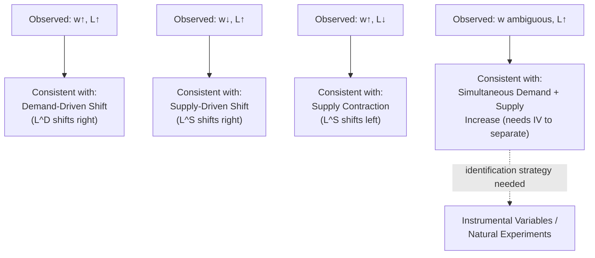

## Comparative Statics of Labor Market Shocks

### Overview and Motivation

This item provides the systematic, in-depth treatment of comparative statics analysis in the competitive labor market model — extending the brief comparative statics summary introduced under Equilibrium Wage and Employment Determination into a full methodological and applied framework. Comparative statics is the technique of analyzing how the equilibrium wage and employment level respond to shifts in the underlying supply and demand curves, and — critically — how the **relative elasticities of supply and demand** govern the magnitude and *incidence* (who bears the burden or receives the benefit) of any given shock. This framework is the analytical backbone for interpreting real-world labor market events: technology shocks, demographic shifts, trade exposure, and policy interventions such as payroll taxes.

---

### The General Comparative Statics Method

Given an equilibrium condition $L^D(w; \mathbf{x}) = L^S(w; \mathbf{z})$, where $\mathbf{x}$ and $\mathbf{z}$ are vectors of exogenous demand- and supply-shifting variables respectively, totally differentiating the equilibrium condition yields:

$$\frac{\partial L^D}{\partial w} dw + \frac{\partial L^D}{\partial \mathbf{x}} d\mathbf{x} = \frac{\partial L^S}{\partial w} dw + \frac{\partial L^S}{\partial \mathbf{z}} d\mathbf{z}$$

Solving for $dw$ in response to a demand shifter $dx$ (holding $d\mathbf{z} = 0$):

$$\frac{dw}{dx} = \frac{\partial L^D/\partial x}{\partial L^S/\partial w - \partial L^D/\partial w} > 0$$

(positive because $\partial L^S/\partial w > 0$ and $\partial L^D/\partial w < 0$ in the standard case, and $\partial L^D/\partial x > 0$ for a rightward demand shift).

**Key Points**

- This is the formal general method underlying every comparative-statics claim in this chapter and the preceding demand-theory chapter — it reduces to simple supply-and-demand-diagram intuition but provides the rigorous basis for signing and (given elasticity estimates) quantifying the response.
- The **magnitude** of $dw/dx$ and the corresponding employment response $dL/dx$ depend directly on the **relative slopes (elasticities) of $L^D$ and $L^S$** — steeper (more inelastic) curves imply that a given shift translates into a larger price (wage) response and a smaller quantity (employment) response, and vice versa.

---

### Elasticity-Based Determination of Shock Incidence

#### The General Principle

**The more inelastic side of the market bears more of the incidence of a shock or tax, and captures more of the benefit of a favorable shock.** This is a direct extension of the standard tax-incidence principle from price theory to the labor market context, and follows immediately from the comparative statics formula above.

**Key Points**

- If labor supply is highly **inelastic** (workers cannot easily exit the labor force or switch sectors) relative to labor demand, a negative demand shock (e.g., a decline in product demand) will primarily manifest as a **large wage decline with relatively little employment loss**.
- If labor supply is highly **elastic** relative to demand, the same negative demand shock will primarily manifest as a **large employment decline with relatively little wage decline** — because workers exit the sector/labor force readily rather than accepting lower wages.
- This elasticity-incidence logic is symmetric for favorable shocks: a positive demand shock benefits inelastic-supply workers primarily through **higher wages**, whereas elastic-supply workers see the benefit split more toward **increased employment** with smaller wage gains.

---

### Diagram: Elasticity and Shock Incidence (svg_diagram)

<svg xmlns="http://www.w3.org/2000/svg" viewBox="0 0 660 420">
<text x="330" y="24" text-anchor="middle" font-size="15" font-weight="bold" fill="#1a1a1a">Demand Shock Incidence: Inelastic vs Elastic Supply (svg_diagram)</text>
<line x1="60" y1="190" x2="300" y2="190" stroke="#333" stroke-width="1.5" />
<line x1="60" y1="190" x2="60" y2="50" stroke="#333" stroke-width="1.5" />
<text x="180" y="205" text-anchor="middle" font-size="11" fill="#333">L (inelastic supply case)</text>
<line x1="150" y1="60" x2="150" y2="180" stroke="#2563eb" stroke-width="2.5" />
<text x="155" y="70" font-size="10" fill="#2563eb">L^S (steep)</text>
<line x1="90" y1="160" x2="270" y2="80" stroke="#dc2626" stroke-width="2" stroke-dasharray="3,2" />
<line x1="90" y1="130" x2="270" y2="50" stroke="#f87171" stroke-width="2" />
<text x="230" y="60" font-size="10" fill="#dc2626">L^D shifts down</text>
<circle cx="150" cy="150" r="4" fill="#16a34a" />
<circle cx="150" cy="95" r="4" fill="#16a34a" />
<text x="30" y="98" text-anchor="end" font-size="10" fill="#16a34a">Large Δw</text>
<text x="330" y="215" text-anchor="middle" font-size="11" fill="#555">Small ΔL, Large Δw</text>
<line x1="380" y1="190" x2="620" y2="190" stroke="#333" stroke-width="1.5" />
<line x1="380" y1="190" x2="380" y2="50" stroke="#333" stroke-width="1.5" />
<text x="500" y="205" text-anchor="middle" font-size="11" fill="#333">L (elastic supply case)</text>
<line x1="410" y1="170" x2="590" y2="70" stroke="#2563eb" stroke-width="2.5" />
<text x="560" y="80" font-size="10" fill="#2563eb">L^S (flat)</text>
<line x1="410" y1="160" x2="590" y2="80" stroke="#dc2626" stroke-width="2" stroke-dasharray="3,2" />
<line x1="410" y1="130" x2="590" y2="50" stroke="#f87171" stroke-width="2" />
<circle cx="450" cy="153" r="4" fill="#16a34a" />
<circle cx="530" cy="118" r="4" fill="#16a34a" />
<text x="500" y="215" text-anchor="middle" font-size="11" fill="#555">Large ΔL, Small Δw</text>
<line x1="60" y1="270" x2="300" y2="270" stroke="#333" stroke-width="1.5" />
<line x1="60" y1="270" x2="60" y2="380" stroke="#333" stroke-width="1.5" />
</svg>

---

### Application 1: Payroll Tax Incidence

Consider a payroll tax $\tau$ levied on employers, driving a wedge between the wage the firm pays, $w_{gross} = w_{net} + \tau$, and the wage the worker receives, $w_{net}$. Equilibrium requires:

$$L^D(w_{net} + \tau) = L^S(w_{net})$$

The share of the tax burden borne by workers (via a lower net wage) versus firms (via a higher gross labor cost) is given by the standard elasticity-ratio formula:

$$\text{Worker's share of tax burden} = \frac{\eta_{D}}{\eta_D - \eta_S}$$

where $\eta_D < 0$ is the labor demand elasticity and $\eta_S > 0$ is the labor supply elasticity (using absolute-value or signed convention consistently).

**Key Points**

- A widely cited and empirically influential result in public/labor economics: because **aggregate labor supply is often estimated to be considerably less elastic than labor demand** at the market level (particularly for prime-age workers with limited extensive-margin responses), the **statutory incidence** of a payroll tax (who is legally required to remit it) is largely **irrelevant to economic incidence** — most of the burden falls on workers via lower net wages regardless of whether the tax is nominally levied on the employer or the employee, a canonical application of the elasticity-incidence principle.
- **[Inference]** This conclusion is sensitive to the specific labor supply elasticity assumed/estimated for the population in question — for populations with more elastic labor supply (e.g., secondary earners, some studies of low-income or younger workers), the theoretical framework would predict relatively more of the burden shifted toward firms (via reduced employment) rather than workers (via reduced net wages), illustrating why the "who really pays payroll taxes" question does not have a single universal answer independent of the population and margin studied.

---

### Application 2: Trade and Technology Shocks (Labor Demand Shifts)

**Trade exposure shocks** (e.g., the "China shock" literature, Autor, Dorn, and Hanson, 2013) and **technology shocks** (automation, as connected to Capital Labor Substitution) are typically modeled as **shifts in labor demand** for specific worker/industry/regional cells.

**Key Points**

- The comparative-statics framework predicts that the employment vs. wage split of the response to an adverse trade or automation shock depends on the elasticity of labor supply *at the relevant margin* — for **geographically immobile** workers (low migration elasticity in the short-to-medium run, a well-documented empirical finding in the regional trade-shock literature), the burden of an adverse local demand shock falls disproportionately on **local wages and employment** rather than being smoothed away via out-migration, generating persistent regional divergence.
- **[Unverified]** The empirical finding that US regional labor markets exhibited unexpectedly limited out-migration in response to the China trade shock (relative to earlier historical episodes of regional adjustment) is a well-known and influential result in this literature, though the precise causes of this reduced migration responsiveness (housing costs, social ties, changes in migration elasticity over time) remain an area of ongoing research rather than fully resolved.

---

### Application 3: Demographic and Labor Force Participation Shocks

**Key Points**

- A **labor supply shock** — e.g., a large cohort entering the labor force (baby boom effects), rising female labor force participation (link to Fertility and Female Labor Force Participation), or an immigration inflow — shifts $L^S$ rightward. The comparative-statics prediction is unambiguous in direction (wages fall, employment rises) but the **magnitude** of the wage effect depends on the elasticity of labor demand for the relevant skill/occupation group, per Marshall's Rules of Derived Demand.
- The **immigration wage-effect debate** is a direct application: if immigrant labor is a strong substitute for a specific native skill group (implying a relatively inelastic *relevant* labor demand segment for that narrowly defined group), the model predicts larger native wage effects; if immigrant labor is more complementary to native labor overall (broader demand elasticity, cross-wage effects positive), predicted wage effects on natives are smaller or even positive — a debate that hinges empirically on exactly this comparative-statics/cross-elasticity structure (link to Elasticities of Labor Demand cross-wage elasticity concept).

---

### Combined Shocks: Simultaneous Supply and Demand Shifts

**Key Points**

- Many real-world labor market episodes involve **simultaneous shifts in both supply and demand**, which can generate observationally ambiguous wage-employment co-movements unless the underlying shocks are separately identified:
  - Demand-driven booms: wages and employment move in the **same direction**.
  - Supply-driven shifts (e.g., pure demographic inflow with unchanged demand): wages and employment move in **opposite directions**.
  - Simultaneous positive demand and supply shocks: employment rises unambiguously, but the **net wage effect is ambiguous** and depends on the relative magnitude of each shift — this ambiguity is precisely why applied labor economists rely on instrumental variables or natural experiments (isolating variation in one curve while holding the other fixed) rather than simply observing aggregate wage-employment co-movements, a methodological point connecting back to the identification challenges discussed under Elasticities of Labor Demand.

### Diagram: Signature Patterns of Combined Shocks (svg_diagram)

---

### Summary Table: Elasticity Regimes and Shock Outcomes

| Relative Elasticity | Demand Shock Impact | Supply Shock Impact | Tax Incidence |
| --- | --- | --- | --- |
| $L^S$ inelastic, $L^D$ elastic | Large Δw, small ΔL | Large Δw, small ΔL | Workers bear most of tax |
| $L^S$ elastic, $L^D$ inelastic | Small Δw, large ΔL | Small Δw, large ΔL | Firms bear most of tax (via reduced employment / higher gross wage) |
| Both moderately elastic | Moderate Δw and ΔL | Moderate Δw and ΔL | Burden split roughly by relative elasticities |

---

**Related Topics**

- Equilibrium Wage and Employment Determination (baseline model extended here)
- Tax Incidence Theory and the Elasticity-Ratio Formula
- Marshall's Rules of Derived Demand (elasticity determinants underlying incidence)
- Trade Shocks and Regional Labor Market Adjustment (China Shock Literature)
- Immigration and Native Wage Effects: Substitutes vs. Complements
- Instrumental Variables and Natural Experiments in Labor Market Identification
- Capital Labor Substitution and Technology-Driven Demand Shifts
- Regional Migration Elasticity and Labor Market Adjustment Frictions