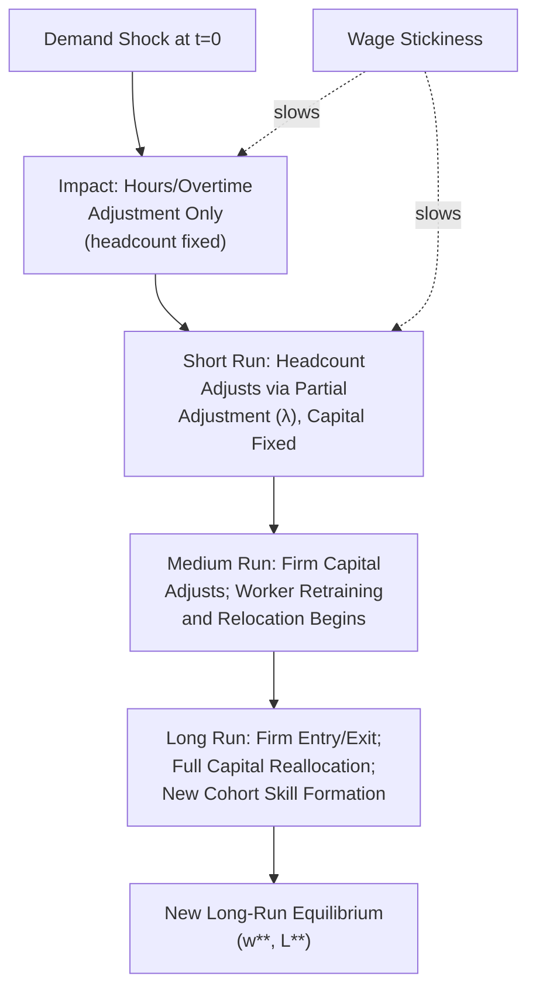

## Short Run Versus Long Run Equilibrium Adjustment

### Overview and Motivation

This item extends the short-run/long-run distinction — previously developed at the **firm level** under Short Run and Long Run Labor Demand — to the **market equilibrium level**, examining how the entire competitive labor market's adjustment path from an initial to a new equilibrium unfolds over time as successive constraints are relaxed: first the firm's capital stock, then worker mobility and retraining, then firm entry/exit, and finally capital reallocation across the broader economy. This provides the dynamic-adjustment complement to the static comparative-statics results developed under Comparative Statics of Labor Market Shocks, addressing not just *where* the new equilibrium will be but *how* the market gets there and *how fast*.

---

### The Multi-Stage Adjustment Hierarchy

Labor market adjustment to a shock unfolds across several distinct time horizons, each defined by which margins have become variable:

| Stage | Time Horizon | Variable Margins | Fixed Margins |
| --- | --- | --- | --- |
| Impact (very short run) | Days to weeks | Hours, overtime, existing worker effort | Headcount, capital, worker location/skills |
| Short run | Months to ~1-2 years | Firm headcount (within existing capital/technology) | Firm capital stock, worker skill mix, firm entry/exit |
| Medium run | 2-5 years | Firm capital stock, worker retraining/skill acquisition, worker relocation | Number of firms in the market (limited entry/exit), industry structure |
| Long run | 5+ years | Firm entry/exit, industry structure, full capital reallocation, new worker cohort skill formation | None (all margins variable) |

**Key Points**

- This hierarchy is a direct market-level extension of the firm-level SR/LR distinction: at the firm level, capital was the single fixed factor separating SR from LR; at the market level, the relevant "fixed factors" additionally include worker geographic/occupational immobility and the fixed number of incumbent firms, each relaxing on a different (progressively longer) timescale.
- **[Inference]** This staged decomposition is a stylized simplification of what is, in reality, a continuum of adjustment speeds across different margins — similar to the caveat noted for the firm-level SR/LR distinction — but it remains analytically useful for organizing empirical evidence collected at different post-shock time horizons.

---

### Impact and Short-Run Adjustment

Immediately following a shock (e.g., a demand shift), the **very short-run response** operates almost entirely through the **hours/effort margin** rather than headcount, reflecting the quasi-fixed cost structure established under Quasi Fixed Labor Costs and Adjustment: since hiring and firing each carry a quasi-fixed cost, firms initially prefer to adjust existing workers' hours (including overtime or short-time work) before altering headcount.

As the **short run** proceeds, firms begin adjusting headcount within their existing capital stock, following the dynamic partial-adjustment process introduced under Short Run and Long Run Labor Demand:

$$N_t - N_{t-1} = \lambda(N_t^* - N_{t-1})$$

**Key Points**

- At the market level, this generates a **gradual, sluggish approach** of aggregate employment toward its new equilibrium level, rather than an instantaneous jump — the empirical counterpart is the commonly observed pattern of employment continuing to adjust for multiple quarters or years following a demand shock, well documented in business-cycle and regional labor market studies.
- **Wage stickiness** — a related but analytically distinct phenomenon from quantity (employment) adjustment sluggishness — further slows the *price* side of short-run adjustment; nominal or real wage rigidities (efficiency wages, implicit contracts, menu-cost-type frictions, or institutional wage-setting mechanisms) can mean that even the short-run wage response to a demand shock is muted relative to the frictionless comparative-statics prediction, with more of the short-run adjustment burden falling on quantities (employment/hours) than the basic static model would predict.

---

### Diagram: Adjustment Path from Impact to Long-Run Equilibrium (svg_diagram)

---

### Medium-Run Adjustment: Capital Reallocation and Worker Mobility

Once the medium-run horizon is reached, two previously fixed margins become variable:

1. **Firm-level capital adjustment**: firms begin adjusting their capital stock toward the new cost-minimizing input mix, following the tangency condition $MRTS_{LK} = w/r$ established under The Firm's Profit Maximization Problem and Capital Labor Substitution — this is precisely the mechanism generating the larger long-run (relative to short-run) elasticity of firm-level labor demand.
2. **Worker mobility and human capital adjustment**: workers begin responding to the new wage structure via geographic relocation (migrating toward higher-wage regions/sectors), occupational switching, or acquiring new skills/retraining — increasing the elasticity of *labor supply* to the specific market or sector experiencing the shock, even if aggregate economy-wide labor supply is relatively fixed.

**Key Points**

- **[Inference]** The empirical literature on worker mobility responses to regional or sectoral labor demand shocks (e.g., displaced-worker studies, the regional trade-shock literature referenced under Comparative Statics of Labor Market Shocks) has found mobility responses to be considerably **slower and smaller** than earlier theoretical models often assumed, implying that the "medium run" for the mobility margin specifically may in practice extend well beyond the timeframes classical models anticipated — a finding with significant implications for the persistence of regional wage and employment disparities following adverse shocks.
- **Retraining and human capital acquisition** as an adjustment margin faces its own quasi-fixed-cost-like frictions (time cost, foregone earnings during retraining, uncertainty about which new skills will be valuable) that can further slow this stage of adjustment relative to a frictionless benchmark.

---

### Long-Run Adjustment: Firm Entry, Exit, and Industry Restructuring

In the full long run, the **number and composition of firms in the market** becomes variable:

- **Firm entry**: attracted by above-normal profits (in a sector experiencing a favorable demand shock), new firms enter, shifting aggregate labor demand further rightward beyond what existing-firm capital adjustment alone would generate — this is the standard long-run competitive market entry mechanism from price theory, applied here to a factor market context.
- **Firm exit**: in a sector experiencing a persistent adverse shock, firms operating at a loss (given the new, lower output price or higher input costs) exit, shifting labor demand further leftward — releasing capital and, eventually, workers for reallocation to expanding sectors.
- **Industry restructuring**: the combination of differential entry/exit rates across firms/sub-sectors within a broader industry generates compositional shifts (e.g., toward more capital-intensive or higher-productivity surviving firms) that further affect the aggregate labor demand curve facing the industry's workforce.

**Key Points**

- This long-run entry/exit margin is the mechanism by which the **Le Chatelier principle** (introduced at the firm level under Short Run and Long Run Labor Demand) extends most powerfully to the market level: with firm entry/exit as an additional adjustment margin unavailable in the short-to-medium run, the **long-run market-level labor demand elasticity substantially exceeds even the long-run firm-level elasticity** computed holding the number of firms fixed.
- **[Speculation]** Whether the full long-run equilibrium is ever actually "reached" in practice, given the possibility of repeated overlapping shocks arriving faster than the adjustment process completes, is a genuinely open empirical and theoretical question — much observed real-world labor market data may reflect a market perpetually in transition between successive short/medium-run equilibria rather than settled long-run states, a consideration relevant to interpreting cross-sectional wage/employment data as if it represented a clean long-run equilibrium snapshot.

---

### Implications for Empirical Interpretation

**Key Points**

- Researchers estimating labor market comparative statics must be explicit about **which adjustment horizon their data and identification strategy capture** — an estimate using data from immediately after a shock (e.g., the initial post-treatment window in many quasi-experimental minimum wage or trade-shock studies) captures primarily the short-run/impact margins, while an estimate using data from many years after the shock captures progressively more of the medium- and long-run margins.
- This horizon-dependence directly explains why studies of the **same underlying shock** (e.g., minimum wage increases, trade liberalization episodes) using different observation windows can report seemingly conflicting elasticity magnitudes without necessarily being in tension — they may simply be measuring different points along the same underlying dynamic adjustment path rather than contradicting one another about the "true" elasticity.
- This consideration directly parallels, and extends to the market level, the caution raised under Short Run and Long Run Labor Demand regarding the use of short-run natural experiments (e.g., Card-Krueger-style minimum wage studies) to draw firm long-run conclusions — the market-level entry/exit and mobility margins add yet further layers of potential long-run divergence from short-run estimated effects.

---

### Comparison Table: What Changes at Each Horizon

| Margin | Impact | Short Run | Medium Run | Long Run |
| --- | --- | --- | --- | --- |
| Hours/overtime | Variable | Variable | Variable | Variable |
| Headcount (given capital) | Fixed | Variable (partial adjustment) | Variable | Variable |
| Firm capital stock | Fixed | Fixed | Variable | Variable |
| Worker relocation/retraining | Fixed | Fixed | Variable (slow) | Variable |
| Number of firms (entry/exit) | Fixed | Fixed | Largely fixed | Variable |
| Implied labor demand elasticity | Minimal | Small | Moderate | Largest (Le Chatelier-maximal) |

---

**Related Topics**

- Short Run and Long Run Labor Demand (firm-level foundation of this market-level extension)
- Comparative Statics of Labor Market Shocks (static predictions this item adds dynamics to)
- Quasi Fixed Labor Costs and Adjustment (microfoundation of headcount adjustment sluggishness)
- Wage Stickiness and Efficiency Wage Theories
- Regional Labor Market Adjustment and Worker Mobility Frictions
- Firm Entry, Exit, and Industry Dynamics in Factor Markets
- Displaced Worker Studies and Long-Run Earnings Losses
- Le Chatelier Principle at the Market versus Firm Level