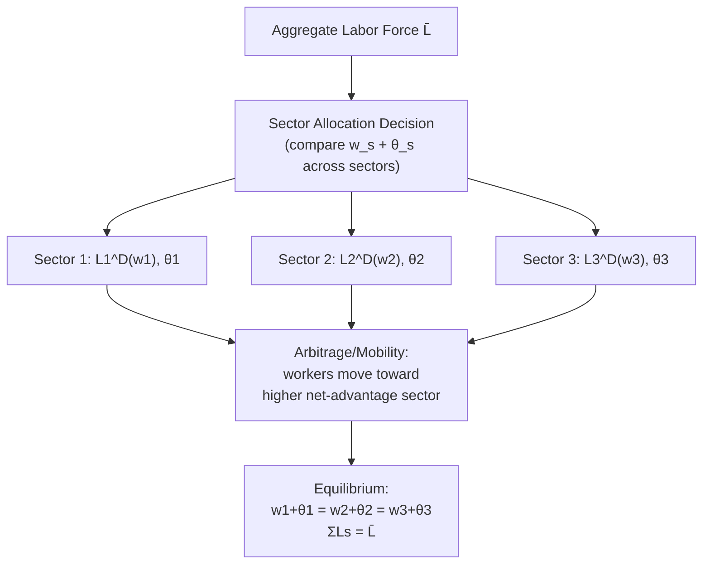

## Labor Market Clearing Across Sectors

### Overview and Motivation

This item extends the single-market equilibrium framework established under Equilibrium Wage and Employment Determination to a **multi-sector general equilibrium** setting, examining how labor markets clear simultaneously across multiple industries, occupations, or regions connected by worker mobility. Where the preceding items in this chapter analyzed a single labor market in isolation, real economies feature many distinct labor markets linked by workers' ability to move between them — the central question here is how equilibrium is characterized when this **inter-sectoral mobility** is incorporated, and what conditions must hold for a multi-sector allocation to be an equilibrium at all.

---

### The Multi-Sector Framework

Consider an economy with $S$ sectors, each with its own labor demand curve $L_s^D(w_s)$ derived from sector-specific production technology and output price (as in The Firm's Profit Maximization Problem), and a total labor force $\bar{L}$ that can, subject to mobility costs and preferences, allocate itself across sectors:

$$\sum_{s=1}^{S} L_s = \bar{L}$$

**Key Points**

- Unlike the single-market model, workers here face a **discrete or continuous choice of which sector to supply labor to**, in addition to the standard labor-leisure choice within any given sector.
- This framework nests the single-market model as the special case $S=1$, and nests general equilibrium trade and development models (where "sectors" may represent tradable vs. non-tradable industries, or agriculture vs. manufacturing, as in structural transformation theory) as a special case with additional product-market linkages.

---

### The Equal Net Advantage Condition (Compensating Differentials Preview)

In the frictionless, full-information, homogeneous-worker benchmark, labor market clearing across sectors requires that **no worker have an incentive to switch sectors** in equilibrium — implying that, absent non-wage differences across sectors, wages must **equalize across sectors** in equilibrium:

$$w_1^* = w_2^* = \ldots = w_S^*$$

If sectors differ in **non-pecuniary attributes** (job amenities, risk, working conditions), the equilibrium condition generalizes to **equality of the full compensating differential-adjusted net advantage**:

$$w_s + \theta_s = w_{s'} + \theta_{s'} \quad \text{for all } s, s'$$

where $\theta_s$ is the monetized value of sector $s$'s non-wage attributes (positive for pleasant conditions, negative for unpleasant/risky conditions) — this is the multi-sector labor market clearing condition that directly foreshadows and provides the equilibrium foundation for the full **theory of compensating wage differentials** (a related but distinct syllabus item), which formalizes $\theta_s$ and its determinants in depth.

**Key Points**

- This "**law of one net price**" for labor is the direct labor-market analog of the law of one price in goods markets — arbitrage (worker mobility) drives out any purely wage-based advantage of one sector over another, given costless mobility and homogeneous workers.
- **[Inference]** Observed persistent wage differentials across sectors/industries for observably similar workers (the well-documented **inter-industry wage differential** literature, e.g., Krueger and Summers, 1988) are, in this framework's terms, evidence either of unmeasured compensating differentials, of mobility frictions preventing full arbitrage, of unmeasured worker heterogeneity/sorting across sectors, or of genuine departures from the competitive model (e.g., rent-sharing, discussed under Marginal Productivity Theory of Wages) — disentangling these explanations empirically remains an active and only partially resolved area of the literature.

---

### Diagram: Multi-Sector Labor Market Clearing (svg_diagram)

---

### General Equilibrium with a Two-Sector Model

A canonical formalization uses a **two-sector general equilibrium model** (the specific-factors or Heckscher-Ohlin-style structure, more fully developed in international/development trade theory but foundational here for labor market clearing intuition), with sectors 1 and 2 each producing a distinct good using labor and a sector-specific fixed factor:

$$q_1 = f_1(L_1, \bar{K}_1), \qquad q_2 = f_2(L_2, \bar{K}_2), \qquad L_1 + L_2 = \bar{L}$$

Labor market clearing requires the common wage $w$ to satisfy both sectors' marginal productivity conditions simultaneously:

$$p_1 \cdot MP_{L,1}(L_1, \bar{K}_1) = w = p_2 \cdot MP_{L,2}(L_2, \bar{K}_2)$$

**Key Points**

- This system, together with the labor force constraint, jointly determines $(w^*, L_1^*, L_2^*)$ — the **common economy-wide wage** and the **equilibrium sectoral allocation of labor**.
- A relative price shock (e.g., $p_1$ rising due to a demand or trade shock) raises sector 1's labor demand at any given wage, drawing labor away from sector 2 (raising $w$ economy-wide and reducing $L_2$) until the two marginal-value-product conditions are re-equalized — this is the general-equilibrium mechanism underlying the **Stolper-Samuelson**-adjacent intuition connecting sectoral price shocks to economy-wide factor returns, a bridge to international trade theory's treatment of labor markets.

---

### Sectoral Mobility Frictions and Partial Equilibrium Persistence

**Key Points**

- The frictionless "law of one net price" is a long-run benchmark; in practice, **sector-specific human capital** (skills valuable in one industry but not perfectly transferable to another) creates a wedge between sectors even in long-run equilibrium, since a worker's *effective* wage in an unfamiliar sector may be permanently lower due to a loss of sector-specific human capital upon switching — this connects directly to the displaced-worker and long-run earnings-loss literature referenced under Short Run Versus Long Run Equilibrium Adjustment.
- **Search and information frictions**: workers may not have complete information about wages and conditions in all sectors, and switching sectors typically requires a costly job search process (formalized in search-and-matching models, a related topic under labor market frictions) — meaning that even absent sector-specific human capital, full wage equalization across sectors is not instantaneous and may not fully obtain even in a long-run steady state with ongoing turnover.
- **[Inference]** The empirical persistence of measurable inter-sectoral/inter-industry wage differentials, even after controlling extensively for observable worker characteristics, is generally interpreted in the modern literature as reflecting some combination of all of the above frictions plus rent-sharing, rather than being fully attributable to any single mechanism — the relative quantitative importance of each channel remains genuinely disputed.

---

### Dynamic Sectoral Reallocation: The Adjustment Path

Connecting to the multi-stage adjustment hierarchy introduced under Short Run Versus Long Run Equilibrium Adjustment, sectoral labor market clearing following a shock (e.g., a sector-specific demand or trade shock) unfolds gradually:

1. **Impact**: wage divergence emerges immediately between the negatively and positively affected sectors, since workers cannot instantaneously relocate.
2. **Short-to-medium run**: gradual worker outflow from the contracting sector and inflow to the expanding sector, partially closing the wage gap, at a rate governed by mobility frictions and sector-specific human capital loss.
3. **Long run**: full re-equalization of net advantage across sectors *if* mobility frictions are eventually overcome (e.g., through new-cohort entry into the expanding sector rather than requiring incumbent worker reallocation) — or **persistent divergence** if frictions (age, sector-specific skills, geographic ties) prevent full incumbent-worker reallocation, a pattern well-documented in specific historical episodes of sectoral decline (e.g., manufacturing employment decline in specific regions).

**[Speculation]** Whether long-run sectoral wage convergence is ultimately achieved primarily through incumbent worker reallocation or through demographic/cohort turnover (new labor market entrants choosing the higher-net-advantage sector while incumbents remain in the declining sector until retirement) is likely to vary by context and is not resolved by the theory alone — it is fundamentally an empirical question requiring sector- and episode-specific evidence.

---

### Example: Sectoral Reallocation from a Trade Shock

**Example**

Suppose an economy has a tradable manufacturing sector and a non-tradable services sector, initially in equilibrium with $w_{mfg} = w_{svc} = \$20$/hour (assuming, for simplicity, no compensating differential, $\theta_{mfg} = \theta_{svc} = 0$). A trade shock reduces the world price of the manufactured good, shifting $L_{mfg}^D$ leftward. In the immediate aftermath, the manufacturing wage falls to $16/hour (or employment falls sharply if wages are sticky) while the services wage remains near $20/hour, since manufacturing workers cannot instantly retrain or relocate to services jobs. Over the medium-to-long run, worker outflow from manufacturing (via displaced-worker transitions, retirement of manufacturing incumbents, and new entrants choosing services) drives wages back toward equalization — but empirical evidence on displaced manufacturing workers frequently finds **persistent, incomplete convergence**, with displaced workers experiencing long-run earnings losses even after formally "reallocating" to a new sector, consistent with a genuine (not merely transitional) loss of sector-specific human capital.

---

### Comparison Table: Single-Sector vs. Multi-Sector Clearing

| Feature | Single-Sector Model (prior items) | Multi-Sector Model (this item) |
| --- | --- | --- |
| Equilibrium condition | $L^D(w) = L^S(w)$ | $w_s + \theta_s$ equalized across $s$; $\sum L_s = \bar{L}$ |
| Wage determination | Single market-clearing wage | Common (frictionless) or divergent (frictional) wages across sectors |
| Mobility | Not modeled explicitly (already "one market") | Central mechanism; frictions determine convergence speed |
| Relevant shock transmission | Direct demand/supply shift in the one market | Sector-specific shock + spillover via reallocation to other sectors |
| Empirical puzzle addressed | Overall wage/employment level | Persistent inter-sectoral/inter-industry wage differentials |

---

**Related Topics**

- Equilibrium Wage and Employment Determination (single-market foundation)
- Short Run Versus Long Run Equilibrium Adjustment (dynamic adjustment hierarchy applied here across sectors)
- Compensating Wage Differentials (formalizes θ_s introduced here)
- Inter-Industry Wage Differentials and Rent-Sharing
- Sector-Specific Human Capital and Displaced Worker Earnings Losses
- Search and Matching Frictions in Labor Reallocation
- Structural Transformation and Two-Sector General Equilibrium Models
- Trade Shocks and Regional/Sectoral Labor Market Adjustment