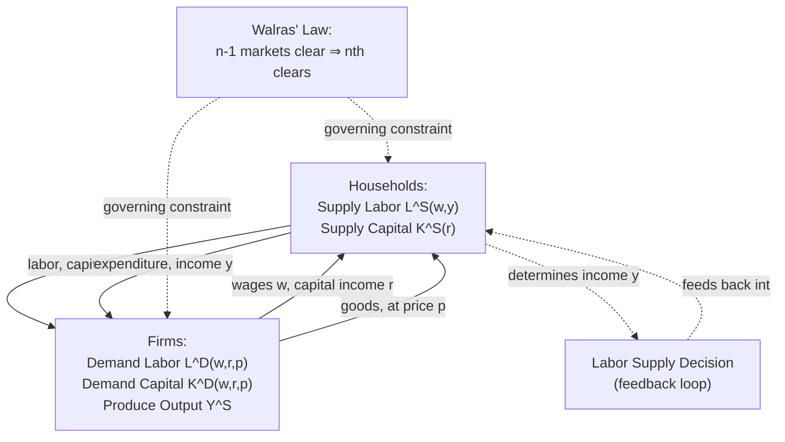

## General Equilibrium Extensions

### Overview and Motivation

This item closes out the Competitive Labor Market Equilibrium chapter by relaxing the **partial equilibrium** assumption maintained throughout the preceding items — where the labor market was analyzed either in isolation (Equilibrium Wage and Employment Determination) or across sectors while holding product prices and other markets' equilibria fixed (Labor Market Clearing Across Sectors) — and instead embedding the labor market within a **full general equilibrium** system where labor, capital, and product markets clear **simultaneously**. This provides the theoretical scaffolding connecting competitive labor market theory to macroeconomics, international trade theory, and public finance's general equilibrium tax-incidence tradition.

---

### From Partial to General Equilibrium: What Changes

**Key Points**

- In **partial equilibrium** (as in all prior items in this chapter), the analysis holds fixed: (a) the output price $p$ facing firms, (b) income/wealth levels determining labor supply via non-labor income, and (c) prices in all other factor and product markets — allowing clean, tractable comparative statics of a single market in response to an exogenous shock.
- In **general equilibrium (GE)**, these are all treated as **endogenous**, jointly determined along with the labor market outcome — meaning a labor market shock can feed back into product prices, which feed back into labor demand, which feeds back into household income and thus labor supply, and so on, potentially **amplifying, dampening, or even reversing** the sign of partial-equilibrium comparative statics predictions.
- **[Inference]** Whether GE feedback effects are quantitatively important for a given labor market question is context-dependent: for questions where the labor market shock is small relative to the overall economy (e.g., a minor local demand shift), partial equilibrium analysis is often considered an adequate approximation; for large, economy-wide shocks (e.g., a national minimum wage change, mass immigration, or major trade liberalization), GE feedback is more likely to be first-order important and is the primary justification for using computable general equilibrium (CGE) or other structural GE modeling approaches in applied policy analysis.

---

### The Circular Flow: Labor, Product, and Capital Market Interdependence

A full general equilibrium of the economy requires **simultaneous market clearing** across all three major market types:

$$L^D(w, r, p) = L^S(w, y) \quad \text{[labor market]}$$

$$K^D(w, r, p) = K^S(r) \quad \text{[capital market]}$$

$$Y^D(p, y) = Y^S(w, r) \quad \text{[product market]}$$

where $y$ denotes household income (itself determined by $w$ and capital income, closing the loop back into labor supply), and by **Walras' Law**, if any $n-1$ of these $n$ markets clear, the remaining market clears automatically — a standard general equilibrium theorem that reduces the effective dimensionality of the system.

### Diagram: The Circular Flow of General Equilibrium (svg_diagram)

---

### Application 1: General Equilibrium Tax Incidence

The partial-equilibrium payroll tax incidence analysis developed under Comparative Statics of Labor Market Shocks (the elasticity-ratio formula) assumes the tax's effects are confined to the labor market. **Harberger's general equilibrium tax incidence model** (Harberger, 1962) extends this by allowing a tax on labor in one sector to affect capital returns and labor demand economy-wide, as capital and labor reallocate across sectors in response to the sector-specific tax wedge.

**Key Points**

- **[Inference]** A central and often counterintuitive result of the Harberger-style GE framework is that a tax nominally levied on labor **in one sector only** can end up being borne partly by **capital owners economy-wide** (via capital flight out of the taxed sector, depressing returns to capital in the sectors capital flows into) rather than exclusively by workers in the taxed sector — a conclusion invisible to partial-equilibrium analysis of the single taxed labor market alone, and a foundational result in public finance's approach to tax incidence.
- This GE framework is the theoretical basis for the standard caution in public finance that **statutory and even partial-equilibrium economic incidence can diverge substantially from full general-equilibrium incidence**, especially for large or broad-based taxes affecting a significant share of the economy.

---

### Application 2: Immigration in General Equilibrium

Partial equilibrium analysis of immigration (as touched on under Comparative Statics of Labor Market Shocks) treats immigration as a pure labor supply shift in a single labor market segment, holding capital and product markets fixed. A general equilibrium treatment relaxes this:

**Key Points**

- If **capital adjusts** in response to an immigration-induced increase in labor supply (firms invest more, drawn by the larger available workforce and correspondingly lower wages, restoring the capital-labor ratio toward its pre-immigration level over time), the **long-run GE wage effect of immigration on the native capital-labor ratio can be substantially smaller** than the partial-equilibrium, fixed-capital-stock prediction — this is a standard finding in the open-economy immigration literature and connects to the broader small-open-economy assumption that capital is highly internationally mobile and elastically supplied at a roughly fixed world rate of return (a link to Rule 3 of Marshall's Rules of Derived Demand, now applied at the economy-wide GE level).
- If immigrants are complementary to (rather than substitutes for) native labor in specific tasks (per the capital-skill complementarity/task-based framework introduced under Capital Labor Substitution), GE feedback through product demand (immigrants also consume goods and services, raising aggregate product demand and thus, indirectly, labor demand) can further offset any direct wage-depressing effect — a channel entirely absent from a narrow partial-equilibrium labor-supply-shift analysis.
- **[Speculation]** The empirical magnitude of these GE offsetting channels relative to the direct partial-equilibrium labor-supply effect remains genuinely disputed in the immigration economics literature, with some studies finding capital adjustment sufficiently rapid and complete to leave long-run wage effects close to zero, and others finding more persistent wage effects — this is an area where the theoretical GE mechanism is well-established but its empirical quantitative importance is not fully settled.

---

### Application 3: Stolper-Samuelson and Trade-Labor Market Linkages

Connecting to the two-sector model introduced under Labor Market Clearing Across Sectors, embedding that model in a full **general equilibrium trade framework** (the Heckscher-Ohlin model, more fully developed in international economics) yields the **Stolper-Samuelson theorem**: a change in the relative price of a good (e.g., due to trade liberalization) changes the real return to the factor used **intensively** in that good's production in the **same** direction, and the return to the other factor in the **opposite** direction — a sharper and more general prediction than the simple sectoral-reallocation intuition of the partial two-sector model, because it accounts for the simultaneous product-market price and factor-market clearing.

**[Inference]** This theorem is frequently invoked as a theoretical rationale for the prediction that trade liberalization in a labor-abundant developing economy should raise the real return to labor relative to capital (and the reverse in a capital-abundant advanced economy) — a prediction that has motivated substantial empirical trade-and-wages research, though as with the immigration case, the real-world quantitative match between this clean theoretical prediction and observed wage/inequality trends following specific trade liberalization episodes has been a subject of extensive and only partially resolved empirical debate.

---

### Application 4: Computable General Equilibrium (CGE) Modeling

For applied policy analysis requiring quantitative (not just qualitative/directional) predictions incorporating full GE feedback, researchers and policy institutions frequently employ **computable general equilibrium (CGE) models** — large-scale numerical simulations that specify functional forms (often CES, per Capital Labor Substitution) for production and utility across many sectors and factor markets, calibrate them to observed data (e.g., a Social Accounting Matrix), and solve for the full set of simultaneous market-clearing prices and quantities.

**Key Points**

- CGE models are the standard applied tool for policy questions where GE feedback is likely to be quantitatively important and cannot be credibly captured by the simple 2-3 market partial or semi-GE frameworks discussed above — e.g., large-scale trade agreement impact assessments, major tax reform analysis, and economy-wide labor market policy simulations (minimum wage increases affecting a large share of the workforce, broad-based immigration reform).
- **[Inference]** A commonly noted limitation of CGE modeling in the applied literature is that results can be highly sensitive to the specific functional form and elasticity parameter assumptions imposed (e.g., the assumed elasticity of substitution $\sigma$ in each nested CES production block), meaning CGE results are often best interpreted as **conditional on the calibration** rather than as model-free empirical estimates — a distinct epistemic status from the reduced-form quasi-experimental estimates discussed under Elasticities of Labor Demand and Comparative Statics of Labor Market Shocks.

---

### Comparison Table: Partial vs. General Equilibrium Analysis

| Feature | Partial Equilibrium (prior chapter items) | General Equilibrium (this item) |
| --- | --- | --- |
| Output price $p$ | Fixed/exogenous | Endogenous, jointly determined |
| Capital market | Often held fixed or ignored | Explicitly cleared alongside labor |
| Cross-market feedback | Absent by construction | Central mechanism |
| Tax incidence conclusion | Elasticity-ratio formula within one market | Can shift across factors/sectors economy-wide (Harberger) |
| Typical tool | Supply-demand diagram, elasticity formulas | CGE models, Heckscher-Ohlin-type structural models |
| Best suited for | Small, localized shocks | Large, economy-wide shocks and policy reforms |

---

### Synthesis: Closing the Chapter

**Key Points**

- The progression across this chapter — single-market equilibrium (Equilibrium Wage and Employment Determination) → comparative statics and incidence (Comparative Statics of Labor Market Shocks) → dynamic adjustment (Short Run Versus Long Run Equilibrium Adjustment) → multi-sector clearing (Labor Market Clearing Across Sectors) → full general equilibrium (this item) — represents a systematic relaxation of simplifying assumptions, each stage revealing additional channels through which labor market outcomes are determined and additional caveats to the clean predictions of the most basic single-market model.
- This general equilibrium perspective is the natural bridge to the subsequent departures from perfect competition (monopsony, unions, search frictions, discrimination) that occupy later chapters — those topics can each be understood as relaxing a *specific* competitive assumption (single wage-setter, collective wage-setting, costly matching, taste-based or statistical discrimination) while this chapter's GE extension relaxes the *market-isolation* assumption, and the two sets of extensions are complementary rather than mutually exclusive lenses on real-world labor market complexity.

---

**Related Topics**

- Equilibrium Wage and Employment Determination (partial equilibrium baseline)
- Comparative Statics of Labor Market Shocks (partial-equilibrium incidence, extended here to GE)
- Labor Market Clearing Across Sectors (semi-GE two-sector model, extended to full GE here)
- Harberger General Equilibrium Tax Incidence Model
- Stolper-Samuelson Theorem and Trade-Factor Price Linkages
- Computable General Equilibrium (CGE) Modeling in Applied Policy Analysis
- Immigration's General Equilibrium Effects via Capital Adjustment
- Walras' Law and Multi-Market Clearing Conditions