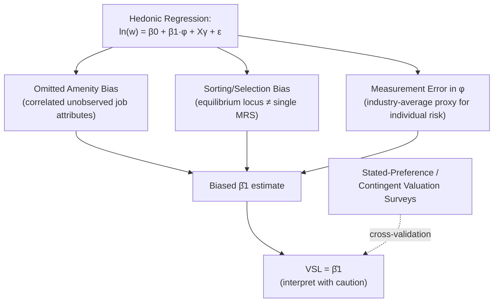

## Theory of Compensating Differentials

### Overview and Motivation

The theory of compensating wage differentials formalizes the equilibrium condition previewed under Labor Market Clearing Across Sectors: that in a competitive labor market with worker mobility, jobs with **undesirable non-wage attributes** (risk, unpleasantness, inconvenient hours, low status) must offer **higher wages** to attract workers, while jobs with **desirable non-wage attributes** (safety, prestige, flexibility, pleasant conditions) can pay **lower wages** and still attract the same quality of applicants, in equilibrium. This is one of the oldest ideas in labor economics — dating to Adam Smith's *Wealth of Nations* (1776), where Smith identified the "five principal circumstances" generating wage differences across employments — and remains foundational to modern applied work valuing non-market goods, particularly the value of statistical life.

---

### Historical Origin: Adam Smith's Theory of Equalizing Differences

Smith's original insight was that **net advantage** — not just the wage — must equalize across occupations for workers to be indifferent between them in a competitive labor market with free occupational choice. Smith identified several sources of compensating differentials, including the agreeableness/disagreeableness of the work, the cost and difficulty of learning the trade, the constancy or inconstancy of employment, the degree of trust required, and the probability of success — several of which remain the organizing categories of the modern theory.

---

### Formal Model: The Hedonic Wage Equation

#### Worker's Side: Indifference Curves in Wage-Risk Space

Consider a worker choosing among jobs differing in a single non-wage attribute, risk of injury/death $\phi$ (probability per period), and wage $w$. The worker's utility depends on income and survival/health:

$$U = U(w, \phi)$$

with $\partial U/\partial w > 0$ and $\partial U/\partial \phi < 0$ (risk is a "bad"). Holding utility constant, the worker's **indifference curve** in $(\phi, w)$ space is upward sloping — the worker requires additional wage compensation to accept additional risk:

$$\frac{dw}{d\phi}\bigg|_{U=\bar{U}} = -\frac{\partial U/\partial \phi}{\partial U/\partial w} > 0$$

This slope is the worker's **marginal rate of substitution between risk and wage**, and represents the minimum additional compensation the worker requires for an additional unit of risk — this MRS is the theoretical basis for the **Value of a Statistical Life (VSL)** concept developed below.

**Key Points**

- Indifference curves are **convex** (increasingly steep) in $(\phi, w)$ space under standard assumptions, reflecting diminishing marginal utility of wage relative to risk and/or increasing marginal disutility of risk.
- **Heterogeneous risk preferences** across workers generate a *family* of indifference curves with different slopes — more risk-averse workers have steeper indifference curves (requiring more compensation per unit of risk), and this heterogeneity is central to the sorting mechanism described below.

#### Firm's Side: Isoprofit Curves in Wage-Risk Space

Firms face a technologically determined **cost of risk reduction**: reducing workplace risk $\phi$ typically requires costly safety investment, so firms offering safer jobs must, for a given profit level, pay a lower wage than firms offering riskier jobs (or must be less profitable at the same wage). This generates an **isoprofit curve** — combinations of $(\phi, w)$ yielding equal profit — that is **upward sloping** in $(\phi, w)$ space (firms can pay higher wages at higher risk levels because they save on safety expenditure) but **concave** (increasingly flat), reflecting diminishing returns to risk reduction — the cost of shaving off the last increment of risk rises steeply as risk approaches zero.

**Key Points**

- Different firms face different technologies of risk reduction — firms with a cheap technology for reducing risk can offer safer jobs at a smaller wage discount than firms for whom safety is technologically expensive to provide, generating **heterogeneous isoprofit curves** across firms, analogous to the heterogeneous indifference curves across workers.

---

### Diagram: Hedonic Equilibrium — Worker Indifference and Firm Isoprofit Curves (svg_diagram)

<svg xmlns="http://www.w3.org/2000/svg" viewBox="0 0 620 400">
<text x="310" y="24" text-anchor="middle" font-size="15" font-weight="bold" fill="#1a1a1a">Hedonic Wage-Risk Equilibrium (svg_diagram)</text>
<line x1="70" y1="340" x2="580" y2="340" stroke="#333" stroke-width="1.5" />
<line x1="70" y1="340" x2="70" y2="50" stroke="#333" stroke-width="1.5" />
<text x="580" y="362" text-anchor="middle" font-size="12" fill="#333">Risk (φ)</text>
<text x="35" y="195" text-anchor="middle" font-size="12" fill="#333" transform="rotate(-90 35 195)">Wage (w)</text>
<path d="M 100 320 Q 250 220 450 100" fill="none" stroke="#2563eb" stroke-width="2.5" />
<text x="440" y="90" font-size="11" fill="#2563eb" font-weight="bold">Worker Indifference Curve U̅ (convex)</text>
<path d="M 100 250 Q 300 130 500 90" fill="none" stroke="#dc2626" stroke-width="2.5" />
<text x="380" y="120" font-size="11" fill="#dc2626" font-weight="bold">Firm Isoprofit Curve π̅ (concave)</text>
<circle cx="290" cy="165" r="5" fill="#16a34a" />
<text x="300" y="155" font-size="12" fill="#16a34a">Tangency: Hedonic Equilibrium</text>
<path d="M 130 340 Q 260 200 470 60" fill="none" stroke="#94a3b8" stroke-width="2" stroke-dasharray="4,3" />
<text x="480" y="65" font-size="10" fill="#64748b">Market Hedonic Wage-Risk Locus</text>
</svg>

---

### Sorting/Matching in Hedonic Equilibrium

**Key Points**

- The **market hedonic wage-risk locus** (the outer envelope of tangency points between workers' indifference curves and firms' isoprofit curves across the whole market) is **not** any single individual's indifference curve or firm's isoprofit curve — it is an equilibrium object that emerges from the matching of heterogeneous workers to heterogeneous firms.
- **Sorting prediction**: more risk-tolerant workers (flatter indifference curves, requiring less compensation per unit of risk) sort into riskier jobs at firms for which risk reduction is technologically expensive, while more risk-averse workers sort into safer jobs at firms for which safety is cheap to provide — this endogenous sorting is a well-known **[Inference]** source of potential bias in naive empirical estimation of the wage-risk tradeoff (discussed further below), since observed wage-risk combinations reflect the *equilibrium matching outcome*, not a single underlying preference or technology parameter.

---

### The Value of a Statistical Life (VSL)

The slope of the market hedonic wage-risk locus at any point, $\partial w/\partial \phi$, when interpreted as the wage compensation required for a marginal change in the *annual probability* of a fatal injury, is used to construct the **Value of a Statistical Life (VSL)**:

$$VSL = \frac{\partial w}{\partial \phi}$$

**Example**

If workers require, on average, an additional $700 in annual wages to accept a job with a 1-in-10,000 higher annual risk of death, the implied VSL is:

$$VSL = \frac{\$700}{1/10{,}000} = \$7{,}000{,}000$$

This is *not* an estimate of what any individual's life is "worth" in a philosophical sense, but rather the aggregate, market-revealed rate at which the population trades off small risk changes for money — the standard concept used to monetize mortality risk reductions in cost-benefit analysis of health, safety, and environmental regulation.

**Key Points**

- **[Unverified]** VSL estimates used in US regulatory cost-benefit analysis (e.g., by the EPA, DOT) commonly fall in a range on the order of several million to over ten million dollars depending on the study, agency, and time period, with meaningful variation across studies using different data, time periods, and estimation methods — a specific current figure should be verified against the relevant agency's current guidance rather than treated as a fixed constant.
- VSL is **not the same as the "value of a life"** in aggregate (i.e., it should not be multiplied by expected remaining lifespan or interpreted as compensation an actual identified individual would accept for certain death) — it is specifically a small-risk, population-level marginal rate of substitution, and using it to value large or certain risks is a well-recognized extrapolation error.

---

### Econometric Estimation of Hedonic Wage Equations

A standard hedonic wage regression:

$$\ln w_i = \beta_0 + \beta_1 \phi_i + X_i'\gamma + \varepsilon_i$$

where $\phi_i$ is a job-specific risk measure (e.g., industry/occupation fatality rate) and $X_i$ is a vector of worker and job controls (education, experience, industry, occupation, region).

**Key Points**

- **Omitted variable bias**: unobserved job amenities correlated with risk (e.g., riskier jobs might also have worse hours, lower status, or be disproportionately unionized with wage-setting effects unrelated to risk compensation) can bias $\hat{\beta}_1$ in either direction, a persistent and well-documented challenge in this literature.
- **Sorting/selection bias**: as noted above, the equilibrium hedonic locus reflects matching between heterogeneous workers and firms, meaning the estimated $\hat{\beta}_1$ from a single cross-sectional regression is, strictly, an estimate of the *equilibrium locus slope* at the observed data points, not a single individual's or firm's underlying preference/technology parameter — a subtlety sometimes lost in applied VSL estimation.
- **Measurement error in risk**: using industry- or occupation-average fatality rates as a proxy for the individual worker's actual job-specific risk introduces attenuation bias, since workers' true risk exposure varies substantially within any given industry/occupation code — a widely acknowledged data limitation in this literature.
- **[Inference]** Despite these well-documented empirical challenges, hedonic wage-risk estimation remains the dominant methodology for VSL estimation used in regulatory practice, generally supplemented or cross-validated against **stated-preference (contingent valuation) survey methods** that ask respondents directly about their willingness to pay for risk reductions — the two methods sometimes yield divergent estimates, and reconciling them is an ongoing area of applied research.

---

### Diagram: Sources of Bias in Hedonic Wage-Risk Estimation (svg_diagram)

---

### Beyond Risk: Other Sources of Compensating Differentials

The theory extends naturally beyond mortality risk to any non-wage job attribute:

| Attribute | Predicted Wage Effect | Example Application |
| --- | --- | --- |
| Physical injury risk (non-fatal) | Positive compensating differential | Construction, mining wage premia |
| Job security/employment stability | Negative differential for stable jobs | Public sector wage discounts (job security as amenity) |
| Unpleasant/undesirable hours (night shifts) | Positive differential | Shift-work pay premiums |
| Geographic undesirability (remote/harsh climate) | Positive differential | Remote-location pay premiums (e.g., extraction industries) |
| Workplace flexibility/autonomy | Negative differential for flexible jobs | Gig economy / telework wage discounts (debated) |
| Job prestige/status | Negative differential for high-status jobs | Academic/nonprofit sector wage discounts relative to comparable private-sector skill |
| Health insurance/benefits generosity | Negative wage differential (total compensation may still be higher) | Public sector total compensation studies |

**[Inference]** The theoretical prediction of a compensating differential for a given attribute is frequently harder to detect empirically than the risk-based VSL literature would suggest, in part because many of these attributes are even more severely subject to the omitted-variable and sorting biases described above, and in part because attributes like job security or prestige may be correlated with unobserved worker quality in ways that confound the simple compensating-differential prediction — the theory's clean directional prediction should accordingly be treated as a testable hypothesis for each specific attribute rather than an empirically settled universal finding.

---

### Policy and Applied Relevance

**Key Points**

- **Regulatory cost-benefit analysis**: VSL estimates derived from this framework are the standard tool used by government agencies to monetize the mortality-risk-reduction benefits of proposed health, safety, and environmental regulations, making the theory of compensating differentials directly load-bearing for a large volume of applied public policy analysis.
- **Public sector total compensation debates**: the compensating-differential framework is frequently invoked in debates over whether public-sector workers are under- or over-compensated relative to private-sector counterparts, since a simple wage comparison omitting job security, benefit generosity, and other non-wage attributes can be systematically misleading in either direction depending on which unmeasured attributes dominate.
- **[Speculation]** The rise of remote work and gig-economy platform work has generated renewed interest in re-estimating compensating differentials for flexibility and autonomy, though the underlying sorting and omitted-variable challenges affecting this newer literature are, if anything, more severe than in the classical risk-based literature, given the difficulty of measuring "flexibility" as cleanly as an industry fatality rate.

---

**Related Topics**

- Labor Market Clearing Across Sectors (net-advantage equalization foundation)
- Value of a Statistical Life: Estimation Methods and Regulatory Use
- Hedonic Pricing Models Beyond Labor Markets (housing, environmental economics)
- Sorting and Matching in Heterogeneous Labor Markets
- Public Sector vs. Private Sector Total Compensation Comparisons
- Stated-Preference and Contingent Valuation Methods
- Job Amenities, Flexibility, and the Gig Economy Wage Discount Debate
- Occupational Safety Regulation and Workers' Compensation Systems