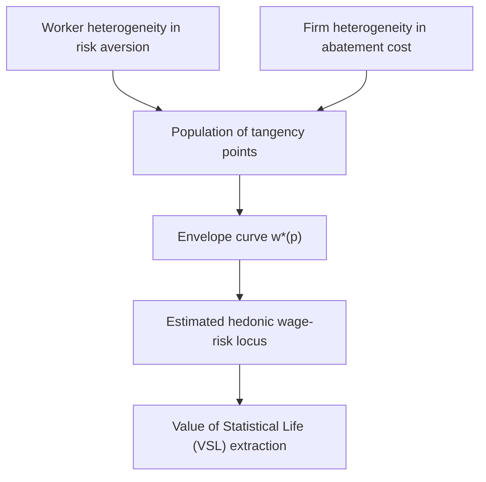
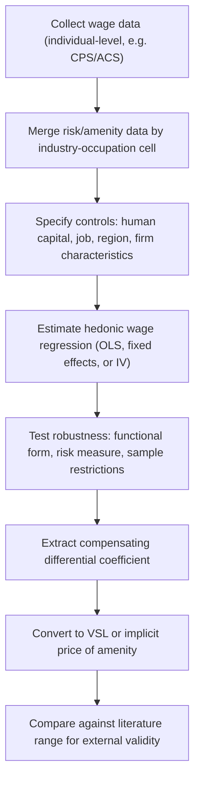

## Hedonic Wage Models

### Overview

Hedonic wage models are the formal econometric and theoretical apparatus used to estimate compensating wage differentials — the extra pay (or pay discount) workers receive for accepting jobs with undesirable (or desirable) non-wage characteristics. The term "hedonic" derives from hedonic price theory, which posits that a good (here, a job) can be decomposed into a bundle of characteristics, each of which is implicitly priced through the observed market wage.

The hedonic wage model is the labor-market counterpart to Rosen's hedonic pricing framework, originally developed for differentiated product markets and adapted to job attributes such as risk of injury or death, physical unpleasantness, work schedule flexibility, commuting distance, and workplace amenities.

### Theoretical Foundations

**Key Points**

- Jobs are treated as bundles of attributes: wage $w$, risk $p$, and other characteristics $x_1, x_2, ..., x_n$
- Workers have heterogeneous preferences (risk tolerance, disutility of unpleasant conditions)
- Firms have heterogeneous costs of reducing risk or improving conditions
- Market equilibrium is a locus of tangencies between worker indifference curves and firm isoprofit curves
- The hedonic wage function $w(p)$ is the envelope of these tangencies — it is generally nonlinear even though individual choices are optimized locally

#### Worker Side: Offer Curves and Indifference Curves

A worker chooses among jobs to maximize utility $U(w, p)$, where $w$ is the wage and $p$ is a disamenity (e.g., fatality risk). Utility is increasing in $w$ and decreasing in $p$:

$$U = U(w, p), \quad U_w > 0, \quad U_p < 0$$

Along an indifference curve, utility is held constant, so the worker's marginal rate of substitution between wage and risk defines the **offer curve** (also called the worker's indifference locus in wage-risk space):

$$\frac{dw}{dp}\bigg|_{U = \bar{U}} = -\frac{U_p}{U_w} > 0$$

This slope is the worker's reservation price for risk — the minimum extra compensation required to accept one more unit of risk. More risk-averse workers have steeper indifference curves.

#### Firm Side: Isoprofit Curves

Firms choose the risk level $p$ to offer, subject to a cost function $C(p)$ for risk reduction, where $C'(p) < 0$ (reducing risk is costly). Zero-profit conditions (in competitive equilibrium) generate an **isoprofit curve**:

$$\pi = R - w - C(p) = 0 \implies w = R - C(p)$$

The firm's offer locus slopes upward in $(p, w)$ space at a decreasing rate — firms with lower marginal costs of reducing risk can offer safer jobs at a smaller wage discount, and vice versa.

#### Market Equilibrium: The Hedonic Wage Locus

The observed hedonic wage function $w^*(p)$ is the outer envelope of tangency points between the population of worker indifference curves and firm isoprofit curves:

$$w^*(p) = \max_{\text{firms}} \{w : \pi(w, p) = 0\}$$

At each tangency point:

$$\frac{\partial U/\partial p}{\partial U/\partial w} = \frac{dw^*}{dp} = -C'(p)$$

This is the fundamental hedonic equilibrium condition: the **marginal wage-risk tradeoff equals both the worker's marginal rate of substitution and the firm's marginal cost of risk reduction** at the equilibrium point. Critically, this equality holds only *locally*, at each worker-firm match — it does not imply that all workers face the same $dw/dp$, since the envelope curve is generally nonlinear (convex).

### The Hedonic Wage Equation (Empirical Specification)

The estimable version of the model regresses wages on job/worker characteristics:

$$\ln(w_i) = \beta_0 + \beta_1 p_i + \mathbf{X}_i \boldsymbol{\gamma} + \varepsilon_i$$

where:

- $w_i$ = wage of individual $i$ (log form is standard, reduces heteroskedasticity, gives percentage interpretation)
- $p_i$ = risk measure (e.g., industry/occupation fatality rate per 100,000 workers, often merged from BLS Census of Fatal Occupational Injuries in the U.S.)
- $\mathbf{X}_i$ = vector of human capital and job controls (education, experience, tenure, union status, industry, occupation, region, firm size)
- $\beta_1$ = the coefficient of primary interest — the compensating differential per unit of risk

**Key Points on Interpretation**

- $\beta_1 > 0$ implies a positive compensating differential — riskier jobs pay more, controlling for other factors
- $\beta_1$ is used to back out the **Value of Statistical Life (VSL)**: if $p$ is annual fatality risk per worker, then $VSL \approx \beta_1 \times w \times (\text{scaling factor for risk units})$

#### Value of Statistical Life (VSL) Derivation

If risk $p$ is measured as deaths per 100,000 workers per year, and the semi-log wage equation gives $\partial \ln w / \partial p = \beta_1$, then:

$$\frac{\partial w}{\partial p} = \beta_1 \cdot w$$

This is the **implicit price of a marginal unit of risk** — the annual compensation for a 1-in-100,000 increase in fatality risk. To convert to VSL (compensation for one statistical life, scaling up from 1/100,000 to a whole life):

$$VSL = \frac{\partial w}{\partial p} \times 100{,}000 = \beta_1 \times w \times 100{,}000$$

**Example**

Suppose $w = \$50{,}000$ (annual wage), and the regression yields $\beta_1 = 0.0002$ per unit of fatality risk (risk measured as deaths per 10,000 workers). Then:

$$\frac{\partial w}{\partial p} = 0.0002 \times 50{,}000 = \$10 \text{ per unit of risk (per 10,000 risk)}$$

$$VSL = \$10 \times 10{,}000 = \$100{,}000 \times \text{[if risk units were per 100,000, VSL} \approx \$1{,}000{,}000]$$

*Note: actual empirical VSL estimates in labor market studies typically range from $4 million to $12 million (2020s USD), varying substantially by dataset, risk measure, and estimation method. [Unverified — figures vary by study, country, time period, and methodology; cited ranges should be checked against current literature for any applied use.]*

### Identification Problems and Empirical Challenges

**Key Points**

1. **Omitted Variable Bias**: Unobserved worker ability, unobserved job amenities correlated with risk, and unobserved firm quality can bias $\beta_1$. If risky jobs also tend to have other unmeasured disamenities (e.g., poor supervision), $\beta_1$ is biased upward; if risky jobs are concentrated in high-wage union sectors for unrelated reasons, bias can go either direction.
2. **Sorting on Unobserved Risk Preferences**: Workers self-select into risk categories based on unobserved risk tolerance, which is also correlated with unobserved productivity — a classic selection problem.
3. **Measurement Error in Risk Variables**: Aggregate industry/occupation-level risk measures (rather than job-specific or firm-specific risk) introduce attenuation bias, since actual risk varies substantially within industry-occupation cells.
4. **Compensating Differentials May Be Confounded with Efficiency Wages**: Firms may pay risk premiums not purely as compensation but to reduce turnover/increase effort in hazardous settings, complicating a clean hedonic interpretation.
5. **Simultaneity/Endogeneity of Both Wage and Risk**: Both $w$ and $p$ are jointly determined in equilibrium, making the linear hedonic regression a reduced-form outcome rather than a structural estimate of either the worker's MRS or the firm's marginal cost function alone (the classic Rosen two-step critique).

#### Rosen's Two-Step Critique

Rosen (1974) demonstrated that estimating $w^*(p)$ alone (first stage) only recovers points on the *envelope* — it does not directly recover individual-level marginal willingness to pay (MRS) or marginal cost functions. A widely discussed "second stage" approach attempts to estimate structural preference/cost parameters by regressing the *estimated marginal price* ($\partial w^*/\partial p$, from the first-stage hedonic regression) on individual/firm characteristics. This second-stage regression is econometrically problematic because:

- The dependent variable is a generated regressor (estimated, not observed), inducing errors-in-variables bias
- $\partial w^*/\partial p$ is mechanically correlated with the very characteristics used to explain it, since the envelope was estimated using those characteristics
- Simultaneity between the generated marginal price and the covariates violates standard exogeneity assumptions

**[Inference-adjacent methodological point, but well established in the literature]**: This critique (often called the "Rosen two-step problem," formalized further by Bartik 1987, Epple 1987, and Ekeland, Heckman & Nesheim 2004) has led most applied VSL researchers to rely on the *first-stage* hedonic coefficient directly as the object of interest, rather than attempting full structural recovery of preference/cost parameters.

### Functional Form Considerations

**Key Points**

- **Linear**: $w = \beta_0 + \beta_1 p$ — simplest, but imposes constant marginal price of risk across the risk distribution, which contradicts the theoretical prediction of a nonlinear (typically convex) envelope
- **Semi-log**: $\ln w = \beta_0 + \beta_1 p$ — most common in practice; implies marginal price of risk *increases* with the wage level (percentage interpretation)
- **Quadratic in risk**: $w = \beta_0 + \beta_1 p + \beta_2 p^2$ — allows the marginal price of risk to vary over the risk range, better approximating the theoretical envelope's curvature
- **Box-Cox transformations**: used to let the data determine functional form flexibly rather than imposing linear or log-linear structure a priori

### Compensating Differentials Beyond Fatality Risk

While the canonical application is job fatality/injury risk, hedonic wage models are applied to a wide range of job attributes:

| Attribute | Expected Sign on Wage | Notes |
| --- | --- | --- |
| Fatality/injury risk | Positive | Most-studied application; basis for VSL |
| Night/shift work | Positive | Compensates for disrupted circadian rhythm and social costs |
| Job security (layoff risk) | Positive (for risk) | Higher wages for jobs with higher separation probability |
| Unpleasant physical conditions (heat, noise, dirt) | Positive | Documented but harder to measure objectively |
| Flexible scheduling / telework | Negative | Workers accept lower pay for flexibility (documented in Mas & Pallais 2017, and expanded post-2020 remote work literature) |
| Health insurance / fringe benefits | Negative | Total compensation theory — wage-benefit tradeoff |
| Long commute | Positive | Compensates for time and monetary commuting costs |
| Union coverage | Ambiguous/positive | Confounds compensating differential with rent-sharing |

### Empirical Estimation Workflow

### Common Econometric Extensions

**Key Points**

- **Fixed Effects Models**: Industry or occupation fixed effects absorb time-invariant unobserved heterogeneity correlated with risk
- **Individual Fixed Effects / Panel Data**: Following the same worker across jobs with different risk levels controls for unobserved worker-specific risk preference and ability (used by Kniesner, Viscusi, and coauthors in several studies)
- **Instrumental Variables**: Attempts to instrument for risk using variables correlated with firm safety technology but uncorrelated with worker ability (difficult to find credible instruments in practice)
- **Quantile Regression**: Since risk premiums may vary across the wage distribution (heterogeneous risk preferences by income), quantile regression estimates $\beta_1$ at different points of the conditional wage distribution rather than just the mean

### Worked Numerical Example

Suppose a labor economist estimates the following semi-log hedonic wage regression using industry-level fatality risk data ($p$ measured as annual deaths per 100,000 workers):

$$\ln(w_i) = 2.85 + 0.00015\, p_i + 0.08\, educ_i + 0.02\, exper_i - 0.10\, union_i + \varepsilon_i$$

**Interpretation:**

- A one-unit increase in fatality risk (one additional death per 100,000 workers annually) is associated with a $0.015\%$ increase in wages, holding education, experience, and union status constant
- For a worker earning $\$60{,}000$ annually, this implies $\partial w/\partial p = 0.00015 \times 60{,}000 = \$9$ per unit of risk
- Scaling to VSL: $VSL = \$9 \times 100{,}000 = \$900{,}000$

*[Unverified/illustrative]: This numerical example is constructed for pedagogical purposes and does not represent a specific published study's actual coefficients; real-world VSL estimates from the literature are typically higher, in the multi-million dollar range, and sensitive to sample and specification.*

### Policy Applications

**Key Points**

- **Regulatory Cost-Benefit Analysis**: Government agencies (e.g., U.S. EPA, OSHA, DOT) use VSL estimates derived from hedonic wage studies to monetize the benefits of life-saving regulations
- **Workers' Compensation Design**: Understanding baseline compensating differentials informs whether workers' comp systems under- or over-compensate relative to market-revealed preferences
- **International Comparisons**: VSL estimates vary substantially by country income level, used in benefit-transfer methods for developing-country policy analysis, though this practice is methodologically contested
- **Discrimination Detection**: Deviations from predicted hedonic wage patterns (e.g., risk premiums not paid to certain demographic groups) have been used as indirect evidence in labor market discrimination studies

### Illustrative Diagram: Hedonic Equilibrium (svg_diagram)

<svg xmlns="http://www.w3.org/2000/svg" viewBox="0 0 700 450">
<rect width="700" height="450" fill="#ffffff" />
<text x="350" y="25" font-size="16" font-weight="bold" text-anchor="middle" fill="#1a1a1a">Hedonic Wage Equilibrium (svg_diagram)</text>

<line x1="80" y1="400" x2="650" y2="400" stroke="#333" stroke-width="2" />
<line x1="80" y1="400" x2="80" y2="50" stroke="#333" stroke-width="2" />
<text x="360" y="430" font-size="13" text-anchor="middle" fill="#333">Risk (p)</text>
<text x="30" y="225" font-size="13" text-anchor="middle" fill="#333" transform="rotate(-90 30 225)">Wage (w)</text>

<path d="M 100 380 Q 300 340 500 260" stroke="#2563eb" stroke-width="2" fill="none" />
<path d="M 130 390 Q 330 300 550 180" stroke="#2563eb" stroke-width="2" fill="none" />
<text x="520" y="255" font-size="11" fill="#2563eb">Firm A (low-cost abater)</text>
<text x="555" y="175" font-size="11" fill="#2563eb">Firm B (high-cost abater)</text>

<path d="M 150 390 Q 350 350 550 200" stroke="#dc2626" stroke-width="2" fill="none" stroke-dasharray="5,3" />
<path d="M 180 395 Q 380 370 580 260" stroke="#dc2626" stroke-width="2" fill="none" stroke-dasharray="5,3" />
<text x="500" y="345" font-size="11" fill="#dc2626">Worker 1 (risk-averse)</text>
<text x="560" y="255" font-size="11" fill="#dc2626">Worker 2 (less risk-averse)</text>

<circle cx="300" cy="340" r="5" fill="#059669" />
<circle cx="450" cy="235" r="5" fill="#059669" />

<path d="M 200 380 Q 350 320 550 190" stroke="#059669" stroke-width="3" fill="none" />
<text x="420" y="185" font-size="12" font-weight="bold" fill="#059669">Envelope: w*(p)</text>

<text x="90" y="45" font-size="11" fill="#666">Tangency points trace the observed hedonic wage function</text>

</svg>

### Key Empirical Studies (Selected Literature)

**Key Points**

- **Thaler & Rosen (1976)**: One of the earliest empirical hedonic wage-risk studies
- **Viscusi (1978, 1993, 2004)**: Extensive body of work estimating VSL from labor market data, surveying methodological issues
- **Kniesner, Viscusi, Woock & Ziliak (2012)**: Panel data approach controlling for individual heterogeneity, addressing endogeneity via fixed effects
- **Mas & Pallais (2017)**: Uses a field experiment (not purely observational hedonic regression) to estimate willingness to pay for workplace flexibility, providing an experimental complement to hedonic estimates
- **Ashenfelter & Greenstone (2004)**: Uses speed limit policy variation to estimate VSL via a quasi-experimental variant of the compensating differentials logic

*[Note: Specific numerical findings from these studies are not reproduced verbatim here; consult primary sources for exact coefficient estimates, as values vary by data vintage and specification.]*

### Limitations and Critiques of the Hedonic Wage Approach

**Key Points**

- Requires a **competitive, well-informed labor market** assumption — workers must accurately perceive risk and be free to sort across jobs, which is questionable for low-information workers or monopsonistic markets
- **Compensating differentials may be small or undetectable** in the presence of minimum wage floors, union wage compression, or search frictions that prevent full price adjustment
- **Publication and specification variance**: VSL estimates in the literature span a wide range (roughly $1 million to over $20 million depending on study), reflecting genuine sensitivity to methodology rather than a single "true" value [Unverified — this range is illustrative of literature dispersion, not a precise meta-analytic figure]
- **Ex ante vs. ex post risk perception**: Hedonic models estimate compensation for *perceived* risk, which may diverge from objective/statistical risk, especially for low-probability, high-severity outcomes

**Next Steps**

- Rosen's Hedonic Price Theory (general framework, non-labor applications)
- Value of Statistical Life (VSL): Methodology and Policy Use
- Compensating Differentials for Job Amenities (non-fatality risk applications)
- Labor Market Search and Matching Frictions
- Efficiency Wage Theory (contrast with pure compensating differential models)
- Discrimination and Wage Differentials (Oaxaca-Blinder decomposition)
- Quasi-Experimental Methods in Labor Economics (instrumental variables, natural experiments)
- Total Compensation Theory (wage-benefit tradeoffs)