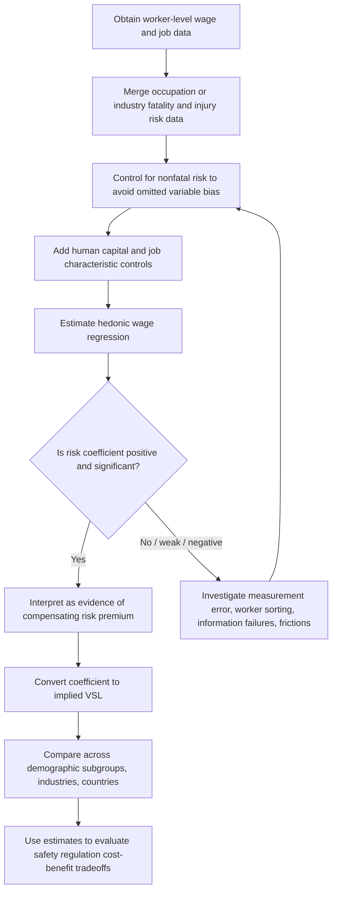

## Workplace Safety and Risk Premiums

### Definition and Conceptual Foundation

A **risk premium** (also called a compensating wage differential for risk) is the additional wage a worker requires to accept employment involving elevated probability of injury or death, relative to an otherwise identical job with lower risk. Risk premiums are a specific application of the broader theory of compensating wage differentials, in which equilibrium wage differences across jobs compensate workers for non-wage job characteristics that affect utility.

The theory rests on two behavioral premises:

- Workers dislike risk of injury or death, holding wages constant (risk enters the utility function negatively)
- Workers are willing to trade off income for reduced risk, and firms are willing to trade off profit for reduced risk, at rates that differ across workers and firms

**Key Points**

- The risk premium is *not* compensation paid after an injury occurs; it is an ex ante wage adjustment reflecting probabilistic risk
- Risk premiums exist only if labor markets allow sorting — workers must be able to choose among jobs with different risk-wage combinations
- The premium is the market's revealed price of risk, from which the Value of a Statistical Life is derived (see prior chapter item)

### The Theoretical Model: Dual-Sided Market for Risk

**Worker Side: Indifference Curves**

Each worker has preferences over the wage-risk bundle $(w, q)$, where $q$ is the probability of a workplace injury or fatality. Utility is:

$$U = U(w, q), \quad U_w > 0, \quad U_q < 0$$

Indifference curves in wage-risk space slope upward: to remain equally well off after accepting higher risk, a worker must receive higher wages.

$$\frac{dw}{dq}\bigg|_{U=\bar{U}} = -\frac{U_q}{U_w} > 0$$

Because different workers have different risk aversion, indifference curve slopes vary across the population — some workers require large wage increases for small risk increases (risk-averse), others require little (risk-tolerant).

**Firm Side: Isoprofit Curves**

Firms face a technological tradeoff: reducing workplace risk (via safety equipment, slower production processes, additional supervision, better equipment maintenance) is costly. A firm's isoprofit curve traces wage-risk combinations that yield the same profit level. Firms that can reduce risk cheaply have flatter isoprofit curves; firms for which safety is expensive to provide have steeper isoprofit curves.

$$\frac{dw}{dq}\bigg|_{\pi=\bar{\pi}} = -\frac{\partial(\text{cost of risk reduction})}{\partial q}$$

Along the isoprofit curve, a firm offering lower risk (achieved at a cost) must pay a lower wage to break even; a firm offering higher risk can pay a higher wage and remain equally profitable, since it saves on safety expenditures.

**Market Equilibrium**

The **hedonic wage function** $w(q)$ is the envelope of tangencies between worker indifference curves and firm isoprofit curves across the whole market — it is generated by matching (sorting): risk-tolerant workers match with firms for which safety is costly to provide, and risk-averse workers match with firms for which safety is cheap to provide. Each worker-firm pair locates at a point of tangency, and the market-level curve traced through all these tangency points is upward sloping.

**Key Points**

- No single worker or firm faces the entire hedonic curve — each is at one tangency point
- The slope of the hedonic wage curve *at the equilibrium point* equals both the worker's MRS and the firm's marginal cost of risk reduction — this equality is the compensating differential
- Sorting implies that observed risk premiums reflect a mix of worker preferences and firm technology, not preferences alone

### Diagram: Market Sorting Across Firms and Workers (svg_diagram)

<svg xmlns="http://www.w3.org/2000/svg" viewBox="0 0 640 420" font-family="Helvetica, Arial, sans-serif">
<text x="320" y="24" text-anchor="middle" font-size="16" font-weight="bold">Market Sorting Across Firms and Workers (svg_diagram)</text>
<line x1="80" y1="360" x2="600" y2="360" stroke="black" stroke-width="1.5" />
<line x1="80" y1="360" x2="80" y2="50" stroke="black" stroke-width="1.5" />
<text x="340" y="395" text-anchor="middle" font-size="13">Risk (q)</text>
<text x="30" y="200" text-anchor="middle" font-size="13" transform="rotate(-90 30 200)">Wage (w)</text>

<path d="M 100 330 Q 300 230 560 90" stroke="#1f77b4" stroke-width="2.5" fill="none" />
<text x="450" y="105" font-size="12" fill="#1f77b4">Hedonic wage locus w(q)</text>

<path d="M 100 200 Q 250 260 400 340" stroke="#d62728" stroke-width="2" fill="none" stroke-dasharray="6,3" />
<text x="180" y="195" font-size="11" fill="#d62728">Firm A isoprofit (low-risk producer)</text>

<path d="M 350 100 Q 460 190 550 330" stroke="#9467bd" stroke-width="2" fill="none" stroke-dasharray="6,3" />
<text x="440" y="95" font-size="11" fill="#9467bd">Firm B isoprofit (high-risk producer)</text>

<path d="M 140 340 Q 220 220 260 130" stroke="#2ca02c" stroke-width="2" fill="none" stroke-dasharray="2,3" />
<text x="150" y="120" font-size="11" fill="#2ca02c">Risk-averse worker indiff. curve</text>

<path d="M 300 340 Q 420 280 540 200" stroke="#ff7f0e" stroke-width="2" fill="none" stroke-dasharray="2,3" />
<text x="420" y="290" font-size="11" fill="#ff7f0e">Risk-tolerant worker indiff. curve</text>

<circle cx="200" cy="255" r="5" fill="black" />
<text x="205" y="248" font-size="11" font-weight="bold">Match 1: low-risk firm + risk-averse worker</text>
<circle cx="440" cy="150" r="5" fill="black" />
<text x="330" y="140" font-size="11" font-weight="bold">Match 2: high-risk firm + risk-tolerant worker</text>
</svg>

### Empirical Measurement of Risk Premiums

**Standard Hedonic Wage Regression**

$$\ln(w_i) = \beta_0 + \beta_1 q_i + \beta_2 NF_i + \beta_3 X_i + \beta_4 Z_i + \varepsilon_i$$

Where:

- $q_i$ = fatal injury risk (e.g., BLS Census of Fatal Occupational Injuries rate, deaths per 100,000 full-time equivalent workers)
- $NF_i$ = nonfatal injury/illness risk (must be included separately, or its correlation with $q_i$ biases $\beta_1$)
- $X_i$ = human capital variables (education, tenure, experience)
- $Z_i$ = job/firm characteristics (union status, firm size, industry fixed effects, region)

$\beta_1 > 0$ and statistically significant is interpreted as evidence of a compensating risk premium.

**Key Points**

- Risk data is typically measured at the industry or occupation level, not matched to individual workers, introducing classical measurement error that biases $\beta_1$ toward zero (attenuation bias)
- Nonfatal and fatal risk are often positively correlated across occupations, so omitting nonfatal risk can bias the fatal-risk coefficient
- Unobserved worker heterogeneity is a persistent identification problem: if risk-tolerant workers with generally lower reservation wages sort into risky jobs for reasons unrelated to risk compensation (e.g., lower outside options), naive OLS estimates of $\beta_1$ can be biased in either direction [Inference: the direction of bias depends on the correlation structure assumed, and is disputed across studies]

**Example**

A regression finds $\beta_1 = 0.00030$ on a risk variable measured as annual deaths per 10,000 workers, with mean annual wage $50,000. A one-unit increase in the risk variable (1 more death per 10,000 workers, i.e., $\Delta q = 0.0001$) is associated with:

$$\Delta w = \beta_1 \times \bar{w} = 0.00030 \times \$50{,}000 = \$15 \text{ per year}$$

This $15 annual wage premium compensates for a 0.0001 increase in fatality probability. Scaled to a full statistical life:

$$VSL = \frac{15}{0.0001} = \$150{,}000$$

*(Note: real-world hedonic estimates of VSL typically fall in the range of several million to over ten million dollars; this stylized example uses simplified numbers for illustration of mechanics, not a realistic point estimate.)*

### Sources of Risk Premium Variation

**Key Points**

- **Union status**: Unionized workers often receive different (frequently larger) risk premiums than non-union workers, potentially reflecting union bargaining power over safety-related compensation, or worker sorting into unionized high-risk industries [Unverified: the union-risk premium relationship is mixed across studies and sensitive to specification]
- **Information and risk perception**: If workers underestimate objective occupational risk (due to limited information, optimism bias, or employer non-disclosure), the compensating differential will be smaller than a fully-informed model predicts — this is one of the leading explanations for why some hedonic wage studies find small or statistically insignificant risk premiums
- **Labor market frictions**: Search costs, limited job mobility (geographic, skill-specific), and thin local labor markets weaken the sorting mechanism the theory relies on, muting the observed premium
- **Firm size and monitoring**: Larger firms are more likely to be subject to regulatory inspection (e.g., OSHA in the U.S.) and may have both lower risk and different premium structures than small firms
- **Occupational licensing and internal labor markets**: Where entry into risky occupations is restricted (licensing, apprenticeship requirements, seniority systems), risk premiums may reflect rents from restricted entry as much as pure risk compensation

### Institutional and Regulatory Context

Workplace safety regulation interacts with the compensating differentials model in two competing ways:

1. **Substitution view**: Government-mandated safety standards (e.g., OSHA regulations in the U.S.) substitute for market-based risk premiums by directly reducing $q$, which — if the market already priced risk efficiently — may simply shift equilibrium down along the hedonic curve rather than producing a "free" improvement in worker welfare, since compliance costs are ultimately borne partly through lower wages
2. **Market failure view**: If workers systematically misperceive risk or if labor market frictions prevent full compensating adjustment, mandated safety standards can produce a net welfare gain by correcting an information or bargaining failure that the pure hedonic model does not capture

**Key Points**

- Workers' compensation systems (mandatory insurance for workplace injuries) interact with wage premiums: since workers' compensation provides a defined ex post payment for injury, it can substitute for ex ante wage premiums, lowering the observed wage-risk relationship in regulated industries relative to what an unregulated market would generate
- Employer moral hazard: if workers' compensation premiums paid by firms are imperfectly experience-rated (i.e., don't fully reflect a specific firm's injury history), firms have muted incentive to invest in safety, which can affect the equilibrium risk level offered in the market

### Empirical Estimation Workflow

### Distributional and Equity Considerations

**Key Points**

- Workers with fewer outside labor market options (lower education, limited geographic mobility, weaker bargaining position) may be observed accepting high-risk jobs at lower wage premiums than the theory predicts, which raises equity concerns about whether "compensation" is genuinely adequate rather than a reflection of constrained choice sets [Inference: this is a standard critique of applying the compensating differentials framework normatively, though it does not overturn the framework's positive/descriptive validity]
- Immigrant workers and workers in informal or weakly-regulated labor markets are frequently found in academic literature to receive smaller measured risk premiums, consistent with either weaker bargaining power, information gaps, or more limited job alternatives [Unverified: findings vary by country and dataset, and causal interpretation is contested]
- Using average market-derived risk premiums (or VSL) in regulatory cost-benefit analysis implicitly treats the revealed preferences of the studied worker population as representative, which can be normatively contested if that population's choices reflect constrained rather than fully free preferences

### Critiques and Limitations

**Key Points**

- **Weak or unstable coefficient estimates.** A substantial share of the hedonic wage literature reports fragile, sometimes insignificant, or even negative risk coefficients once fuller controls are added, casting doubt on how cleanly labor markets price risk in practice
- **Compensating differentials require perfectly competitive, frictionless assumptions** (full information, costless mobility, risk-neutral firms optimizing over safety costs) that are strong relative to real labor market conditions
- **Publication and specification sensitivity**: estimated premiums (and derived VSLs) vary substantially with choice of risk data source, control variables, functional form, and sample restrictions, complicating their direct policy use [Speculation: whether this reflects genuine underlying heterogeneity in risk premiums versus specification/measurement noise remains actively debated in the literature]

### Related Topics

- The Value of a Statistical Life (VSL) and its derivation from risk premiums
- Hedonic wage theory and general compensating differentials framework
- Workers' compensation insurance and ex post injury compensation systems
- OSHA regulation and cost-benefit analysis of safety standards
- Risk perception, information asymmetry, and behavioral economics of low-probability events
- Labor market frictions, search theory, and imperfect worker mobility
- Union bargaining and workplace safety outcomes
- Occupational licensing and restricted entry into hazardous occupations