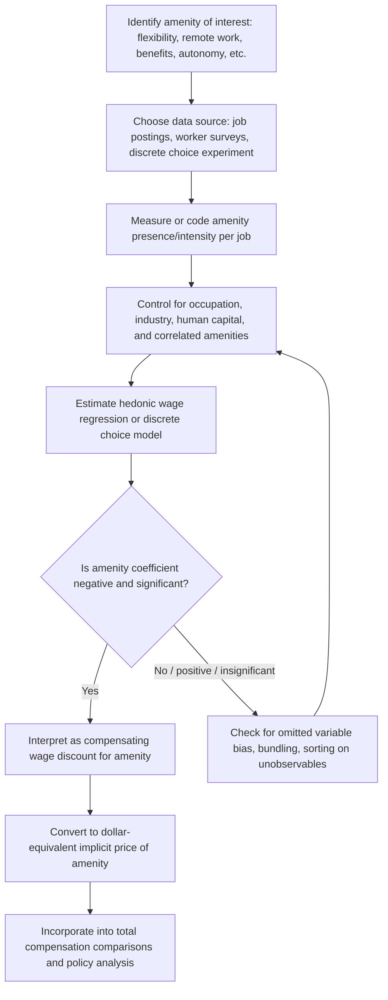

## Nonwage Job Amenities

### Definition and Conceptual Foundation

**Nonwage job amenities** are non-pecuniary attributes of a job that affect worker utility independently of the wage rate — flexibility, working conditions, status, autonomy, benefits, commute, workplace culture, job security, and similar characteristics. In the compensating wage differentials framework, amenities are the general case of which workplace risk (covered separately) is one specific, negative example. Where risk is a "bad" that requires positive wage compensation, amenities are typically "goods" that workers are willing to *accept lower wages* to obtain.

The unifying theoretical claim is symmetric to the risk-premium case: in a competitive labor market with full information and worker mobility, equilibrium wage differences across jobs compensate for differences in the *total* utility firms provide, not merely the cash wage. A job with attractive amenities can pay less and still attract workers, because total compensation (wage plus amenity value) equalizes at the margin.

**Key Points**

- Amenities are compensated *negatively* in wages: better amenities → lower equilibrium wage, holding utility constant
- The same hedonic equilibrium logic used for risk premiums (worker indifference curves tangent to firm isoprofit curves) applies directly, just with the sign of the tradeoff reversed
- Amenities are heterogeneous across workers in value (a preference for flexibility varies by life stage, caregiving responsibilities, etc.), producing sorting patterns analogous to risk-tolerant vs. risk-averse sorting

### General Theoretical Model

Extend the basic compensating differentials framework to a vector of job characteristics. Let $w$ be the wage and $\mathbf{a} = (a_1, a_2, \ldots, a_k)$ be a vector of amenities (e.g., $a_1$ = schedule flexibility, $a_2$ = job security, $a_3$ = workplace autonomy). Worker utility is:

$$U = U(w, \mathbf{a}), \quad U_w > 0, \quad U_{a_j} > 0 \ \forall j$$

For any individual amenity $a_j$, holding other amenities fixed, the compensating wage differential along an indifference curve is:

$$\frac{dw}{da_j}\bigg|_{U=\bar{U}} = -\frac{U_{a_j}}{U_w} < 0$$

This is negative: more of a valued amenity permits a lower wage at constant utility. The **hedonic wage function** $w(\mathbf{a})$ is the equilibrium locus of wage-amenity combinations across the labor market, generated — exactly as with risk — by the tangency of worker indifference curves and firm isoprofit (or isocost) curves, where firms that can provide the amenity cheaply pair with workers who value it highly.

$$\frac{\partial w}{\partial a_j}\bigg|_{\text{equilibrium}} = MRS_{a_j, w} = MC_{a_j}(\text{firm's marginal cost of providing } a_j)$$

**Key Points**

- Multiple amenities can be analyzed simultaneously in a multivariate hedonic regression, but multicollinearity among correlated amenities (e.g., flexible schedule and remote work) complicates isolating each amenity's independent price
- The theory implies an **amenity-wage tradeoff frontier**: workers can be "paid" in wages or in amenities, and firms optimize the mix based on relative costs

### Diagram: Wage-Amenity Tradeoff (svg_diagram)

<svg xmlns="http://www.w3.org/2000/svg" viewBox="0 0 640 420" font-family="Helvetica, Arial, sans-serif">
<text x="320" y="24" text-anchor="middle" font-size="16" font-weight="bold">Wage-Amenity Tradeoff (svg_diagram)</text>
<line x1="80" y1="360" x2="600" y2="360" stroke="black" stroke-width="1.5" />
<line x1="80" y1="360" x2="80" y2="50" stroke="black" stroke-width="1.5" />
<text x="340" y="395" text-anchor="middle" font-size="13">Amenity Level (a)</text>
<text x="30" y="200" text-anchor="middle" font-size="13" transform="rotate(-90 30 200)">Wage (w)</text>

<path d="M 120 100 Q 320 220 560 330" stroke="#1f77b4" stroke-width="2.5" fill="none" />
<text x="380" y="230" font-size="12" fill="#1f77b4">Hedonic wage locus w(a)</text>

<path d="M 140 150 Q 320 250 540 300" stroke="#d62728" stroke-width="2" fill="none" stroke-dasharray="6,3" />
<text x="150" y="140" font-size="11" fill="#d62728">Firm isoprofit curve</text>

<path d="M 160 320 Q 320 200 500 130" stroke="#2ca02c" stroke-width="2" fill="none" stroke-dasharray="2,3" />
<text x="420" y="120" font-size="11" fill="#2ca02c">Worker indifference curve</text>

<circle cx="330" cy="222" r="5" fill="black" />
<text x="335" y="215" font-size="12" font-weight="bold">Equilibrium (w*, a*)</text>
</svg>

### Taxonomy of Nonwage Amenities

**Key Points**

- **Schedule flexibility**: control over start/end times, ability to set own hours, predictability of shifts
- **Remote/hybrid work arrangements**: reduced commute burden, autonomy over physical work location
- **Job security**: probability of continued employment, layoff risk, contract vs. permanent status
- **Fringe benefits**: health insurance, retirement contributions, paid leave — often analyzed as a distinct category because they have direct dollar value but are frequently tax-advantaged relative to cash wages
- **Workplace autonomy and job control**: discretion over how tasks are performed, participation in decision-making
- **Physical work environment**: comfort, noise, temperature, aesthetic quality (distinct from safety/injury risk, though related)
- **Status and prestige**: occupational or firm-level prestige as a consumption good in itself
- **Commute distance/time**: often modeled as a negative amenity requiring compensation, or conversely, remote work as a positive amenity substituting for wage
- **Interpersonal factors**: management quality, coworker relationships, workplace culture

### Empirical Estimation

**Hedonic Wage Regression with Amenities**

$$\ln(w_i) = \beta_0 + \sum_{j=1}^{k} \beta_j a_{ij} + \beta_{k+1} X_i + \beta_{k+2} Z_i + \varepsilon_i$$

Where $a_{ij}$ represents amenity $j$ for worker/job $i$ (can be binary — e.g., offers remote work — or continuous — e.g., hours of schedule flexibility per week), $X_i$ is human capital controls, and $Z_i$ is other job/firm characteristics. The predicted sign for each $\beta_j$ (amenity coefficient) is **negative** if the characteristic is a genuine amenity (workers accept lower pay for more of it).

**Example**

A regression on job posting and wage data finds that jobs explicitly offering remote work options pay, on average, 8% lower wages than otherwise identical in-office jobs, controlling for occupation, experience, and industry:

$$\beta_{remote} = -0.08$$

This is interpreted as workers' revealed willingness to accept an 8% wage discount in exchange for remote work flexibility — a compensating differential in the amenity direction. [Inference: the specific coefficient of -0.08 is illustrative, not drawn from a specific cited study; actual magnitudes vary substantially by occupation, time period, and labor market tightness.]

**Discrete Choice / Stated Preference Methods**

Amenity valuation is also estimated via discrete choice experiments, where workers or job-seekers choose among hypothetical job packages varying in wage and amenity bundles. This allows estimation of implicit prices for amenities that are rare or hard to observe varying naturally in real labor market data (e.g., novel benefits, hypothetical policy changes like a four-day workweek).

**Revealed Preference from Job Search/Application Data**

Analyzing which job postings attract more applications at a given wage, or how quickly positions with certain amenities fill, provides revealed-preference evidence on amenity value without needing wage variance to be driven purely by amenities.

### Key Empirical Challenges

**Key Points**

- **Omitted variable bias**: unobserved worker ability or unobserved job quality dimensions correlate with both wages and amenities, confounding the amenity coefficient (e.g., higher-skill jobs may offer both higher pay *and* more autonomy, biasing $\beta_{autonomy}$ upward, masking the true negative compensating relationship)
- **Sorting on unobservables**: workers who value flexibility highly may also differ systematically in unobserved productivity or career priorities, making it difficult to separate a pure amenity price from selection effects
- **Amenity bundling**: amenities are rarely offered independently (flexible schedule often bundles with remote work, autonomy, and salaried rather than hourly pay), producing multicollinearity that limits precision on any single amenity's estimated price
- **Measurement difficulty**: many amenities (culture, autonomy, management quality) are inherently hard to quantify objectively and are often proxied imperfectly by job posting text, survey self-report, or firm-level indices

### The Amenity-Wage Tradeoff in Modern Labor Markets

**Key Points**

- Remote work valuation surged in empirical prominence following the expansion of remote work arrangements in the early 2020s; multiple survey-based studies have found workers willing to accept measurable pay reductions for remote or hybrid options, though estimated magnitudes vary widely by occupation, income level, and caregiving responsibilities [Unverified: precise current-market magnitudes are time-sensitive and evolve with labor market tightness]
- The COVID-19 period is frequently cited in the literature as a natural experiment shifting the *relative price* of remote-work amenities, since it altered both worker preferences (more value on flexibility) and firm technology/costs of providing remote arrangements simultaneously — complicating clean identification of a stable long-run price
- Amenity valuation differs systematically by demographic group: workers with young children, workers with long commutes, and workers with disabilities have been found in various studies to place higher value on schedule flexibility and remote options specifically, which is theoretically consistent with heterogeneous MRS driving amenity sorting

### Nonwage Amenities and Total Compensation Analysis

Economists distinguish **money wages** from **total compensation**, where total compensation conceptually includes the dollar-equivalent value of all amenities:

$$\text{Total Compensation} = w + \sum_{j} v(a_j)$$

Where $v(a_j)$ is the dollar-equivalent value of amenity $j$ to the marginal worker. This matters for cross-job and cross-country wage comparisons: jobs with seemingly lower wages may offer equivalent or superior *total* compensation once amenities (especially benefits like health insurance or pension contributions, which have direct market prices) are incorporated.

**Example**

Two job offers: Job A pays $70,000 with no employer health insurance contribution; Job B pays $64,000 with a $7,500 annual employer health insurance contribution. In pure wage terms, Job A appears higher-paying, but in total compensation terms:

- Job A total compensation ≈ $70,000
- Job B total compensation ≈ $64,000 + $7,500 = $71,500

Job B provides higher total compensation despite the lower stated wage — a direct illustration of why nonwage amenities must be incorporated into any accurate compensating differential analysis.

### Estimation Workflow

### Policy and Firm-Level Applications

**Key Points**

- **Compensation strategy design**: firms use amenity valuation estimates to optimize benefits packages, deciding whether to offer higher wages or better amenities based on relative cost of provision versus worker valuation
- **Labor market policy**: mandated benefits (e.g., required paid leave) can be analyzed within this framework — if workers value the benefit at or above its cost, mandates may have minimal net wage effect (workers effectively "pay" for the benefit via forgone wage growth); if valuation is below cost, mandates can reduce employment or total compensation growth [Inference: this "benit-mandate passthrough" prediction follows standard compensating differentials logic, though empirical passthrough magnitudes are contested and vary by context]
- **Total compensation reporting and transparency**: growing use of total compensation statements by employers reflects recognition that amenity/benefit value is a meaningful, quantifiable part of the wage-setting process, relevant to worker decision-making and public policy debates about wage stagnation (which can understate total compensation growth if benefits/amenities have expanded)

### Critiques and Limitations

**Key Points**

- **Identification remains the central empirical challenge** across nearly all amenity valuation work — unlike physical injury risk, which has relatively objective, third-party-verified data (e.g., government fatality statistics), most amenities lack a clean, exogenous, objectively measured variable, making credible causal estimation harder
- **Worker information and negotiation constraints**: workers may not have full information about the amenity packages of alternative jobs, or may lack bargaining power to actually realize their preferred wage-amenity tradeoff, weakening the mapping from revealed employment choices to a clean compensating differential
- **The amenity-value framework assumes a competitive spot market for jobs**, but internal labor markets, firm-specific human capital, and switching costs mean many workers face a more limited effective choice set than the frictionless model assumes, potentially distorting the observed amenity-wage relationship away from the underlying preference-based tradeoff

### Related Topics

- Workplace safety and risk premiums (the negative-amenity case)
- The Value of a Statistical Life
- Hedonic wage theory: general model and estimation methods
- Fringe benefits and total compensation analysis
- Remote work economics and geographic wage differentials
- Mandated benefits and labor market passthrough effects
- Discrete choice experiments in labor economics
- Job search theory and labor market frictions
- Gender and demographic differences in amenity valuation