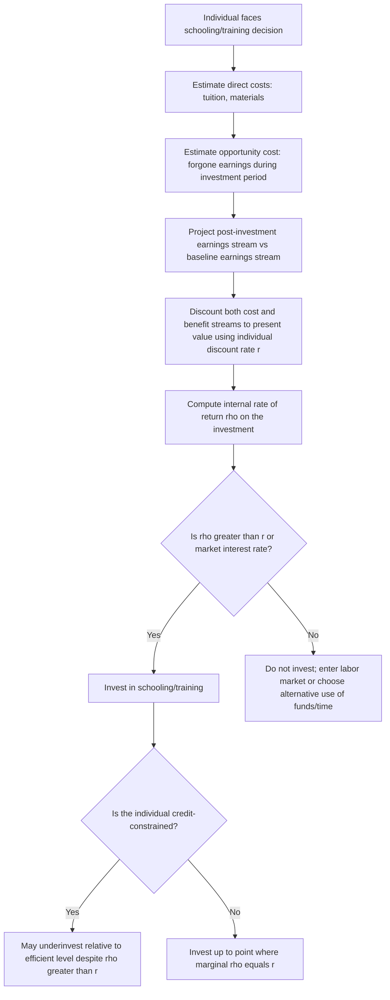

## Becker's Model of Human Capital Investment

### Definition and Conceptual Foundation

Becker's model of human capital investment, developed principally by Gary Becker in *Human Capital* (1964), treats education, training, and skill acquisition as **investment decisions** analogous to a firm's decision to invest in physical capital. Individuals incur present costs (direct expenses plus forgone earnings) in exchange for a stream of future benefits (higher future earnings, non-pecuniary returns), and rational individuals invest up to the point where the marginal return on human capital equals the marginal return available on alternative investments.

The model reframes education from a consumption good (valued only for its immediate utility) into a productive asset that raises an individual's future marginal product of labor, and therefore future wages, in a competitive labor market where wages equal marginal product.

**Key Points**

- Human capital is embodied *in the person* — unlike physical capital, it cannot be separated from its owner, sold outright, or transferred, which has distinct implications for financing (see credit constraints below)
- The model applies broadly: formal schooling, on-the-job training, migration, job search, and health investments are all analyzed as human capital investments under the same framework
- Becker's framework generates the foundational prediction economists test empirically: the observed *return to schooling* is interpretable as the market rate of return on this investment

### The Basic Investment Decision

Consider an individual choosing between entering the labor market immediately (with earnings stream $Y_0$) or investing $s$ additional years in schooling, which raises future earnings to $Y_s > Y_0$ but requires forgoing earnings during the investment period and possibly incurring direct costs (tuition, books, materials).

**Costs of Human Capital Investment**

- **Direct costs**: tuition, fees, materials — out-of-pocket expenditure
- **Opportunity costs (forgone earnings)**: the wages the individual could have earned had they worked instead of studying — for most schooling decisions past a certain level, this dominates direct costs
- **Psychic costs**: effort, stress, and disutility of studying (harder to quantify, sometimes included as an implicit cost)

**Benefits of Human Capital Investment**

- A higher lifetime earnings stream, realized from the end of the investment period onward
- Non-pecuniary returns (job satisfaction, improved health, social status) — often set aside in the base pecuniary model but acknowledged as relevant to actual decision-making

### The Present Value Framework

The individual compares the present discounted value of the earnings stream under each schooling choice. For a decision to invest in one additional year of schooling, the investment is worthwhile if:

$$PV(\text{benefits}) > PV(\text{costs})$$

Formally, comparing a baseline earnings path $Y_0(t)$ (no additional schooling) against an alternative path $Y_1(t)$ (one more year of schooling), where the investment year is year 0 and working life extends to year $T$:

$$PV_1 = \sum_{t=1}^{T} \frac{Y_1(t)}{(1+r)^t} - C_0$$

$$PV_0 = \sum_{t=0}^{T} \frac{Y_0(t)}{(1+r)^t}$$

The individual invests in additional schooling if $PV_1 > PV_0$, where $r$ is the individual's discount rate and $C_0$ is direct costs incurred in the investment year. Since $Y_1(t) > Y_0(t)$ for $t \geq 1$ (schooling raises subsequent earnings) but $Y_1(0) = 0$ or reduced relative to $Y_0(0)$ during the investment year (forgone earnings), the decision hinges on whether the discounted future wage gain outweighs the discounted forgone earnings plus direct costs.

**Key Points**

- Higher individual discount rates $r$ reduce the present value of future benefits relative to near-term costs, predicting that more impatient individuals (or those facing higher borrowing costs) invest less in schooling, all else equal
- The framework implies schooling investment should decline with age (fewer remaining years to earn a return on the investment), consistent with observed lower enrollment rates in formal schooling among older individuals
- The model treats the earnings streams $Y_0(t)$ and $Y_1(t)$ as known with certainty in its simplest form; extensions incorporate earnings uncertainty and risk aversion

### The Internal Rate of Return Formulation

An equivalent and more commonly estimated version of the decision rule uses the **internal rate of return (IRR)** to schooling, $\rho$, defined as the discount rate that equates the present value of costs and benefits:

$$\sum_{t=1}^{T} \frac{Y_1(t) - Y_0(t)}{(1+\rho)^t} = C_0 + \sum_{t=0}^{0}[Y_0(t) - Y_1(t)]$$

The individual invests in schooling if $\rho > r$, i.e., if the internal rate of return on the schooling investment exceeds the individual's discount rate (or the market interest rate, under credit market access assumptions). This is directly parallel to the net present value rule used in physical capital investment: **invest if and only if the rate of return exceeds the cost of capital.**

**Example**

Suppose forgoing one year of earnings ($40,000) plus direct costs ($10,000) totals a $50,000 investment in an additional year of schooling, which raises annual earnings by $5,000 per year for the remaining 30 years of working life. Ignoring discounting for a first pass:

$$\text{Total undiscounted benefit} = 30 \times \$5{,}000 = \$150{,}000 \gg \$50{,}000 \text{ cost}$$

Solving for the discount rate $\rho$ that equates the $50,000 cost to the present value of a 30-year, $5,000 annuity:

$$50{,}000 = 5{,}000 \times \left[\frac{1 - (1+\rho)^{-30}}{\rho}\right]$$

This yields an implied internal rate of return around 9–10% [Inference: exact solution requires numerical methods; the approximate range is illustrative of the order of magnitude typical in empirical schooling-return estimates, not derived from a specific closed-form solution here]. Since observed market interest rates or individual discount rates are typically well below this figure, the investment is worthwhile.

### Diagram: Age-Earnings Profiles With and Without Additional Schooling (svg_diagram)

<svg xmlns="http://www.w3.org/2000/svg" viewBox="0 0 640 420" font-family="Helvetica, Arial, sans-serif">
<text x="320" y="24" text-anchor="middle" font-size="16" font-weight="bold">Age-Earnings Profiles: Schooling Investment (svg_diagram)</text>
<line x1="80" y1="360" x2="600" y2="360" stroke="black" stroke-width="1.5" />
<line x1="80" y1="360" x2="80" y2="50" stroke="black" stroke-width="1.5" />
<text x="340" y="395" text-anchor="middle" font-size="13">Age</text>
<text x="30" y="200" text-anchor="middle" font-size="13" transform="rotate(-90 30 200)">Earnings</text>

<path d="M 120 300 L 200 260 Q 350 220 560 190" stroke="#1f77b4" stroke-width="2.5" fill="none" />
<text x="420" y="205" font-size="12" fill="#1f77b4">Earnings path: no additional schooling Y0(t)</text>

<path d="M 120 300 L 180 340 L 220 320 Q 380 150 560 90" stroke="#d62728" stroke-width="2.5" fill="none" />
<text x="380" y="80" font-size="12" fill="#d62728">Earnings path: with schooling Y1(t)</text>

<rect x="180" y="260" width="40" height="80" fill="#d62728" opacity="0.15" />
<text x="150" y="355" font-size="10" fill="#d62728">Forgone earnings + direct costs</text>

<circle cx="300" cy="255" r="4" fill="black" />
<text x="305" y="250" font-size="10">Crossover: schooling path overtakes baseline</text>
</svg>

### Determinants of Investment Levels: Comparative Statics

The model generates clear, testable comparative-static predictions about who invests more in human capital:

**Key Points**

- **Ability**: Individuals with higher innate learning ability face a lower cost of acquiring a given amount of human capital (or achieve a larger earnings gain per year of schooling), predicting positive selection into schooling by ability — this is the theoretical basis for the "ability bias" concern in empirical returns-to-schooling estimation
- **Discount rates**: Individuals with lower discount rates (more patient, or facing lower borrowing costs) invest more in schooling, since they weight future benefits more heavily relative to near-term costs
- **Age at investment**: Younger individuals have a longer remaining horizon over which to collect returns, predicting declining human capital investment with age — consistent with the empirical concentration of formal schooling early in the life cycle
- **Length of expected working life**: Factors that shorten expected years in the labor force (e.g., historically, gender-based labor force withdrawal patterns) reduce the expected payoff period and thus predicted investment, a mechanism Becker's original work used to help explain historical gender gaps in schooling investment [Inference: this application is a direct model implication; whether it explains the *majority* of historical gender gaps versus other social and institutional factors is a matter of ongoing empirical and historical debate]
- **Credit constraints**: Because human capital cannot be used as collateral (it is embodied in the person and cannot be repossessed), credit-constrained individuals may underinvest relative to the efficient level even when their true IRR exceeds market interest rates — this is one of the most important frictions layered onto the base Becker model in subsequent literature

### On-the-Job Training: General vs. Specific Human Capital

Becker's framework extends beyond formal schooling to **on-the-job training**, distinguishing two types with sharply different wage and turnover implications:

**General Human Capital**

Training that raises a worker's productivity equally at the current firm and at all other firms (e.g., general literacy, widely-used software skills). Under perfect competition:

- Firms will not pay for general training, because a firm bearing the cost cannot capture the return — trained workers can costlessly move to competing firms offering wages reflecting their now-higher general productivity, competing away any return to the firm's investment
- **Prediction**: workers themselves bear the cost of general training, typically via accepting a lower wage *during* the training period (below their current marginal product), in exchange for the higher wage afterward. This produces an age-earnings profile with a temporary wage dip during training followed by a steeper post-training earnings slope

**Firm-Specific Human Capital**

Training that raises productivity only at the current firm (e.g., knowledge of firm-specific processes, proprietary systems, internal relationships) and has no value if the worker moves elsewhere.

- Since specific human capital has no value outside the firm, neither the firm nor the worker can unilaterally capture the full return by threatening to leave/fire — this creates a **bilateral monopoly** situation
- **Prediction**: firm and worker typically **share** the costs and returns of specific training, since both have an incentive to maintain the employment relationship (worker loses specific capital value if they quit; firm loses if it fires the worker and must retrain a replacement) — this shared-investment structure is a leading explanation in the literature for reduced turnover and long-tenure employment relationships wherever firm-specific skills are important [Inference: the specific-capital explanation for tenure/turnover patterns is a standard result in personnel economics, though it competes with alternative explanations such as efficiency wages and implicit contracts]

**Key Points**

- The general/specific distinction is a continuum in practice, not a strict dichotomy — most real skills have elements of both
- This distinction underpins later theories of internal labor markets, wage-tenure profiles, and firm investment in training programs

### Diagram: General vs. Specific Training and Wage-Cost Sharing (svg_diagram)

<svg xmlns="http://www.w3.org/2000/svg" viewBox="0 0 640 300" font-family="Helvetica, Arial, sans-serif">
<text x="320" y="24" text-anchor="middle" font-size="16" font-weight="bold">General vs. Specific Training: Who Pays? (svg_diagram)</text>
<rect x="60" y="60" width="240" height="180" fill="none" stroke="black" stroke-width="1.5" />
<text x="180" y="85" text-anchor="middle" font-size="13" font-weight="bold">General Training</text>
<text x="180" y="110" text-anchor="middle" font-size="11">Productivity gain transfers</text>
<text x="180" y="126" text-anchor="middle" font-size="11">to any employer</text>
<text x="180" y="155" text-anchor="middle" font-size="11" fill="#1f77b4">Worker bears full cost</text>
<text x="180" y="172" text-anchor="middle" font-size="11" fill="#1f77b4">(lower wage during training)</text>
<text x="180" y="200" text-anchor="middle" font-size="11">Firm captures no surplus</text>
<text x="180" y="216" text-anchor="middle" font-size="11">→ has no incentive to fund it</text>
<rect x="340" y="60" width="240" height="180" fill="none" stroke="black" stroke-width="1.5" />
<text x="460" y="85" text-anchor="middle" font-size="13" font-weight="bold">Firm-Specific Training</text>
<text x="460" y="110" text-anchor="middle" font-size="11">Productivity gain has no value</text>
<text x="460" y="126" text-anchor="middle" font-size="11">outside current firm</text>
<text x="460" y="155" text-anchor="middle" font-size="11" fill="#d62728">Firm and worker share cost</text>
<text x="460" y="172" text-anchor="middle" font-size="11" fill="#d62728">and share returns</text>
<text x="460" y="200" text-anchor="middle" font-size="11">Mutual incentive to retain</text>
<text x="460" y="216" text-anchor="middle" font-size="11">relationship → lower turnover</text>
</svg>

### Empirical Implementation: The Mincer Earnings Equation

Becker's theoretical framework is most commonly operationalized empirically via the **Mincer earnings equation** (Jacob Mincer, building directly on Becker's investment logic), which derives a log-linear relationship between earnings, schooling, and experience from the present-value optimization:

$$\ln(Y_i) = \beta_0 + \beta_1 S_i + \beta_2 X_i + \beta_3 X_i^2 + \varepsilon_i$$

Where $S_i$ = years of schooling, $X_i$ = years of labor market experience (often approximated as age minus schooling minus 6). Under the model's derivation, $\beta_1$ is interpreted directly as the **rate of return to one additional year of schooling** — a direct empirical bridge from Becker's theoretical IRR concept to an estimable regression coefficient.

**Key Points**

- The quadratic experience term ($X_i^2$, with expected negative $\beta_3$) captures the theoretical prediction of concave, then declining, on-the-job human capital accumulation over the life cycle — consistent with the general/specific training framework's implication that training investment (and thus earnings growth) is concentrated early in a career and tapers with age
- $\beta_1$ is subject to well-known identification concerns: **ability bias** (unobserved ability correlates with both schooling attainment and earnings, inflating naive OLS estimates of $\beta_1$) and **selection/comparative advantage** effects, motivating instrumental variables approaches (e.g., using compulsory schooling law changes, distance to college, or quarter-of-birth as instruments in the empirical literature)
- Estimated Mincerian returns to schooling in the empirical literature commonly cluster in the range of roughly 5–15% per year of schooling across countries and time periods, though the wide range across the literature reflects genuine underlying heterogeneity as well as methodological differences [Unverified: precise magnitudes are highly context- and method-dependent, and citing a single "true" number would misrepresent the literature's actual range of findings]

### Decision Workflow

### Extensions and Refinements

**Key Points**

- **Signaling/screening critique (Spence)**: an influential alternative interpretation holds that schooling may raise earnings not by building productive skill but by *signaling* pre-existing unobserved ability to employers, since more able individuals find schooling less costly to complete — this competes with, rather than strictly refutes, Becker's human capital interpretation, and the two mechanisms are difficult to fully disentangle empirically [Inference: most empirical work suggests both signaling and genuine skill-building elements are present, but decomposing the relative magnitude of each is unresolved]
- **Uncertainty and risk**: later extensions incorporate earnings uncertainty and individual risk aversion, predicting that risk-averse individuals may underinvest relative to the risk-neutral baseline case if returns to schooling are uncertain
- **Family and intergenerational human capital investment**: Becker's broader body of work extends the framework to parental investment in children's human capital, treating it as an intergenerational transfer subject to the same cost-benefit logic
- **Health as human capital (Grossman model)**: a parallel and directly related extension (Michael Grossman) applies the same investment logic to health, treating health as a durable capital stock that individuals invest in and that depreciates over time

### Critiques and Limitations

**Key Points**

- **Ability bias remains a persistent empirical challenge**: cross-sectional Mincerian estimates likely overstate the causal return to schooling to the extent that unobserved ability is positively correlated with schooling attainment; instrumental variable estimates sometimes find similar or even larger returns than OLS, complicating simple bias-direction stories [Unverified: the ability-bias literature has produced genuinely mixed findings on both direction and magnitude, and this remains actively debated]
- **The perfect capital markets assumption is empirically strong**: credit constraints, especially for lower-income households, mean observed schooling choices may reflect financing frictions as much as underlying preferences or ability, undermining a purely optimization-based interpretation of observed schooling gaps across income groups
- **Treats schooling as a homogeneous, quality-invariant input** in its simplest form; quality differences across schools/institutions are not directly captured by a single "years of schooling" variable, though extensions incorporate school quality measures
- **Assumes earnings differences reflect productivity differences transmitted via competitive labor markets**; to the extent labor markets have monopsony power, discrimination, or other imperfections, observed wage-schooling relationships may not cleanly map to the marginal-product-based return the model assumes

### Related Topics

- The Mincer earnings equation and empirical returns to schooling
- General versus firm-specific human capital and internal labor markets
- Signaling and screening theories of education (Spence model)
- Ability bias and instrumental variable identification strategies in returns-to-schooling estimation
- The Grossman model of health as human capital
- Credit constraints and underinvestment in human capital
- Age-earnings profiles and life-cycle labor supply
- Intergenerational transmission of human capital and family investment models