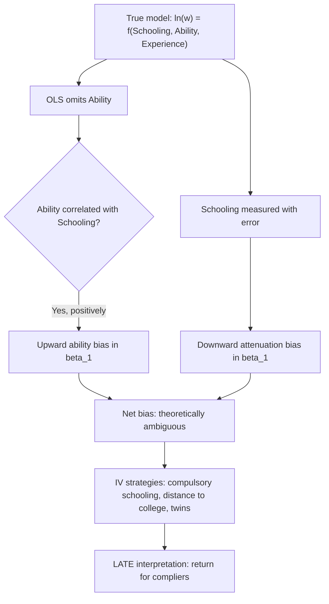

## The Mincer Earnings Function

### Overview

The Mincer earnings function, developed by Jacob Mincer (1958, 1974), is the foundational empirical and theoretical model relating an individual's earnings to their investment in human capital — principally schooling and post-school on-the-job training (experience). It is among the most widely estimated equations in applied economics, serving as the standard specification for estimating the **rate of return to education** and as a workhorse control specification in labor economics more broadly.

### Theoretical Derivation

**Key Points**

- Built on the human capital investment model: individuals forgo current earnings to invest in schooling and training, expecting a compensating return in the form of higher future earnings
- Derived from a present-value equalization condition across schooling levels (the "compensating differences" logic applied to human capital)
- Experience-earnings profile is derived from a separate model of post-school investment that declines over the life cycle

#### Step 1: The Schooling Model

Consider an individual choosing years of schooling $S$. Under the simplifying assumption that all earnings differences across schooling levels are due solely to the opportunity cost of forgone earnings during schooling (no direct costs, no ability differences), the **no-arbitrage condition** requires that the present value of earnings streams be equalized across schooling choices at the margin. This yields:

$$\ln E(S) = \ln E(0) + rS$$

where $E(S)$ is the annual earning of someone with $S$ years of schooling, $E(0)$ is the earning of someone with no schooling, and $r$ is the interest/discount rate, which under this derivation equals the **rate of return to schooling**.

This is the origin of the famous **semi-logarithmic** functional form: log earnings is linear in years of schooling, and the coefficient on schooling has a direct rate-of-return interpretation.

#### Step 2: Adding Post-School Human Capital Investment (Experience)

Mincer extended the model to incorporate on-the-job training, which continues to build human capital after formal schooling ends. Let $k(t)$ be the fraction of earnings potential invested in on-the-job training at experience level $t$, with $k(t)$ declining over the life cycle (workers invest heavily early in their careers and taper off). Earnings at experience level $t$ are:

$$E(t) = E_0 [1 - k(t)]$$

where $E_0$ is the potential (full) earning capacity absent any training investment. Integrating the investment process over the career and assuming $k(t)$ declines linearly with experience, Mincer derived a **quadratic-in-experience** approximation:

$$\ln E(S, t) = \ln E_0 + rS + \beta_1 t + \beta_2 t^2$$

with $\beta_1 > 0$ and $\beta_2 < 0$, producing the well-known **concave, inverted-U-shaped experience-earnings profile**.

### The Canonical Mincer Equation

Combining both components yields the standard estimating equation:

$$\ln(w_i) = \beta_0 + \beta_1 S_i + \beta_2 X_i + \beta_3 X_i^2 + \varepsilon_i$$

where:

- $w_i$ = hourly or annual wage/earnings of individual $i$
- $S_i$ = years of completed schooling
- $X_i$ = years of potential labor market experience, conventionally proxied as $X_i = Age_i - S_i - 6$ (assuming school starts at age 6 and continuous full-time work thereafter)
- $\beta_1$ = the **rate of return to one additional year of schooling** (the central parameter of interest)
- $\beta_2, \beta_3$ = experience profile parameters ($\beta_2 > 0$, $\beta_3 < 0$, producing concavity)
- $\varepsilon_i$ = error term capturing unobserved ability, luck, measurement error, etc.

**Key Points on Interpretation**

- $\beta_1$ is interpreted as the percentage increase in earnings for one additional year of schooling, holding experience constant
- Because $X_i$ is *potential* experience (not actual/observed labor market experience), this specification implicitly assumes continuous labor force attachment since leaving school — a significant limitation for populations with labor force interruptions (notably relevant in studies of women's earnings, where actual experience diverges substantially from potential experience)
- The turning point of the experience-earnings profile (where earnings peak) is at $X^* = -\beta_2 / (2\beta_3)$, typically found empirically to fall between 25 and 35 years of experience depending on cohort and dataset [Inference: exact peak varies by dataset/period and is not a fixed universal value]

### Mathematical Properties of the Experience Profile

Taking the derivative of log earnings with respect to experience:

$$\frac{\partial \ln w}{\partial X} = \beta_2 + 2\beta_3 X$$

Setting this to zero and solving for the experience level at peak earnings:

$$X^* = -\frac{\beta_2}{2\beta_3}$$

Since $\beta_2 > 0$ and $\beta_3 < 0$, $X^*$ is positive, confirming the concave (inverted-U) shape — earnings grow at a decreasing rate early in the career, peak at $X^*$, and decline thereafter (reflecting the human capital depreciation and declining training investment predicted by the theory).

### Worked Numerical Example

Suppose OLS estimation on a cross-sectional labor force survey yields:

$$\widehat{\ln w_i} = 1.20 + 0.085\, S_i + 0.041\, X_i - 0.0006\, X_i^2$$

**Interpretation:**

- $\hat{\beta}_1 = 0.085$: each additional year of schooling is associated with an $8.5\%$ increase in earnings, holding experience constant
- Peak-earnings experience: $X^* = -0.041 / (2 \times -0.0006) = 34.2$ years
- For a worker with $S = 16$ (college graduate) and $X = 10$:

$$\ln w = 1.20 + 0.085(16) + 0.041(10) - 0.0006(100) = 1.20 + 1.36 + 0.41 - 0.06 = 2.91$$

$$w = e^{2.91} \approx \$18.36 \text{ per hour (illustrative units)}$$

*[Unverified/illustrative]: Coefficients here are constructed for pedagogical demonstration and do not represent a specific published dataset's actual estimates.*

### Estimation Issues and Econometric Critiques

**Key Points**

1. **Ability Bias**: Individuals with higher innate ability may select into more schooling *and* independently earn higher wages, biasing $\hat{\beta}_1$ upward if ability is omitted and positively correlated with schooling
2. **Selection/Endogeneity of Schooling**: Schooling is a choice variable correlated with unobserved factors (motivation, family background, credit constraints), violating the exogeneity assumption of OLS
3. **Measurement Error in Schooling**: Self-reported years of schooling contain classical measurement error, which biases $\hat{\beta}_1$ *downward* (attenuation bias) — this works in the opposite direction of ability bias, and the net bias in OLS estimates is theoretically ambiguous
4. **Instrumental Variables Solutions**: A large literature has used instruments for schooling to address ability bias, including:
   - Compulsory schooling laws and school-leaving age changes (Angrist & Krueger 1991)
   - Distance to nearest college (Card 1995)
   - Quarter of birth interacted with compulsory attendance laws (Angrist & Krueger 1991)
   - Twin studies comparing schooling differences within identical twin pairs (Ashenfelter & Krueger 1994)
5. **Local Average Treatment Effect (LATE) Interpretation**: IV estimates of the schooling coefficient identify the return for the subpopulation whose schooling was affected by the instrument (compliers), not necessarily the population-average return — IV and OLS estimates are not directly comparable, and IV estimates are frequently found to be similar to or larger than OLS estimates, contrary to the naive ability-bias prediction [documented empirical regularity, extensively discussed in the IV-returns-to-schooling literature]

### Extended and Augmented Specifications

**Key Points**

- **Mincer with quadratic experience and additional controls**: modern applications add controls for gender, race, region, union status, occupation, and industry
- **Quartic/spline specifications**: relax the strict quadratic functional form to allow more flexible experience profiles, motivated by evidence that the quadratic form fits poorly for very high experience levels (some studies find earnings continue rising or plateau rather than sharply declining) [Inference: functional form adequacy is an empirical question debated in the literature, e.g., Murphy & Welch 1990 critique of the quadratic specification]
- **Schooling-experience interaction terms**: allow the return to schooling to vary with experience level, capturing potential complementarities or divergences in human capital accumulation paths
- **Separate schooling-level dummies** (rather than linear years of schooling): relaxes the assumption of a constant per-year return, allowing sheepskin effects (discontinuous jumps in earnings at degree-completion years, e.g., 12th grade diploma, 16th year bachelor's degree)

#### Sheepskin Effects

$$\ln w_i = \beta_0 + \sum_j \delta_j D_{ij} + \beta_2 X_i + \beta_3 X_i^2 + \varepsilon_i$$

where $D_{ij}$ are dummy variables for specific credential levels (high school diploma, associate's, bachelor's, etc.). Empirical findings generally show earnings jumps disproportionately concentrated at credential-completion years relative to non-completion years of equivalent schooling, suggesting **signaling/credentialism effects** operate alongside pure human capital accumulation — a point of ongoing theoretical debate between human capital theory and signaling theory (Spence 1973).

### Mincer Equation and the Human Capital Earnings Function Family

| Specification | Functional Form | Key Assumption Relaxed |
| --- | --- | --- |
| Basic schooling model | $\ln w = \beta_0 + rS$ | None (baseline) |
| Standard Mincer | $\ln w = \beta_0 + \beta_1 S + \beta_2 X + \beta_3 X^2$ | Adds post-school investment |
| Mincer + controls | Adds $\mathbf{Z}_i \boldsymbol{\gamma}$ | Controls for observed heterogeneity |
| Sheepskin/credential model | Dummy variables for degree levels | Relaxes linearity in years of schooling |
| Quantile Mincer | Estimated at different wage quantiles | Relaxes homogeneous returns assumption |
| Mincer with selection correction (Heckman) | Adds inverse Mills ratio | Corrects for labor force participation selection |

### The Heckman Selection Correction

Since the Mincer equation is estimated only on the sample of employed individuals with observed wages, and labor force participation is itself a choice correlated with unobserved wage-relevant characteristics, Heckman (1979) proposed a two-step correction:

**Step 1**: Estimate a participation probit:

$$P(participate_i = 1) = \Phi(\mathbf{Z}_i \boldsymbol{\gamma})$$

**Step 2**: Include the inverse Mills ratio $\lambda_i$ (computed from Step 1) as an additional regressor in the wage equation:

$$\ln w_i = \beta_0 + \beta_1 S_i + \beta_2 X_i + \beta_3 X_i^2 + \rho\sigma_\varepsilon \lambda_i + \varepsilon_i$$

This is particularly important in studies of women's wages, where non-participation is common and non-random.

### Diagram: Experience-Earnings Profile (svg_diagram)

<svg xmlns="http://www.w3.org/2000/svg" viewBox="0 0 700 400">
<rect width="700" height="400" fill="#ffffff" />
<text x="350" y="25" font-size="16" font-weight="bold" text-anchor="middle" fill="#1a1a1a">Concave Experience-Earnings Profile (svg_diagram)</text>
<line x1="80" y1="350" x2="650" y2="350" stroke="#333" stroke-width="2" />
<line x1="80" y1="350" x2="80" y2="50" stroke="#333" stroke-width="2" />
<text x="360" y="380" font-size="13" text-anchor="middle" fill="#333">Years of Experience (X)</text>
<text x="30" y="200" font-size="13" text-anchor="middle" fill="#333" transform="rotate(-90 30 200)">ln(Wage)</text>
<path d="M 100 320 Q 250 100 400 90 Q 500 90 600 200" stroke="#2563eb" stroke-width="3" fill="none" />
<line x1="400" y1="90" x2="400" y2="350" stroke="#999" stroke-width="1" stroke-dasharray="4,4" />
<circle cx="400" cy="90" r="5" fill="#dc2626" />
<text x="410" y="80" font-size="12" fill="#dc2626">Peak: X* = -beta2 / (2*beta3)</text>

<text x="90" y="330" font-size="11" fill="#666">S=12 (HS)</text>

<path d="M 100 340 Q 250 160 400 150 Q 500 150 600 260" stroke="`#059669`" stroke-width="2" fill="none" stroke-dasharray="3,3" />

<text x="90" y="345" font-size="11" fill="`#059669`">S=16 (College) — parallel shift upward under standard Mincer specification</text>

</svg>

### Applications and Policy Relevance

**Key Points**

- **Basis for education policy cost-benefit analysis**: government investment in schooling programs is often justified via estimated Mincerian returns
- **International comparisons of returns to schooling**: Psacharopoulos and colleagues compiled cross-country Mincerian return estimates for decades of World Bank education policy work, generally finding higher returns in lower-income countries [documented pattern, though methodology and comparability across studies has been critiqued]
- **Gender wage gap decomposition**: Mincer equations estimated separately by gender are a standard input into Oaxaca-Blinder decompositions of the gender pay gap
- **College wage premium tracking**: time-series estimation of $\beta_1$ is the standard method for tracking the evolution of the "college wage premium" in inequality research (e.g., work by Autor, Katz, Goldin)

### Limitations

**Key Points**

- Assumes a single, homogeneous rate of return across the population (relaxed in extensions like quantile regression and heterogeneous-returns models)
- Potential experience proxy is a poor measure of actual experience for workers with career interruptions
- The quadratic experience specification is a functional-form approximation, not a structural derivation, and its adequacy has been empirically questioned for later-career and more recent cohort data [Inference: this is an active area of methodological debate, not a settled consensus]
- Does not, in its basic form, account for school quality, field of study, or non-cognitive skills, all of which have been shown in subsequent literature to affect returns independently of years of schooling
- Cross-sectional estimation conflates cohort effects with pure experience effects unless panel or repeated cross-section data with cohort controls are used

**Next Steps**

- Human Capital Theory (Becker, Schultz foundations)
- Ability Bias and Instrumental Variable Strategies in Returns to Schooling
- Sheepskin Effects and Credentialism vs. Signaling Theory
- Heckman Selection Model (full derivation and application)
- Quantile Regression Approaches to Wage Equations
- The College Wage Premium and Skill-Biased Technical Change
- Oaxaca-Blinder Decomposition (gender/racial wage gaps)
- International Returns to Schooling Comparisons (Psacharopoulos-style meta-analyses)