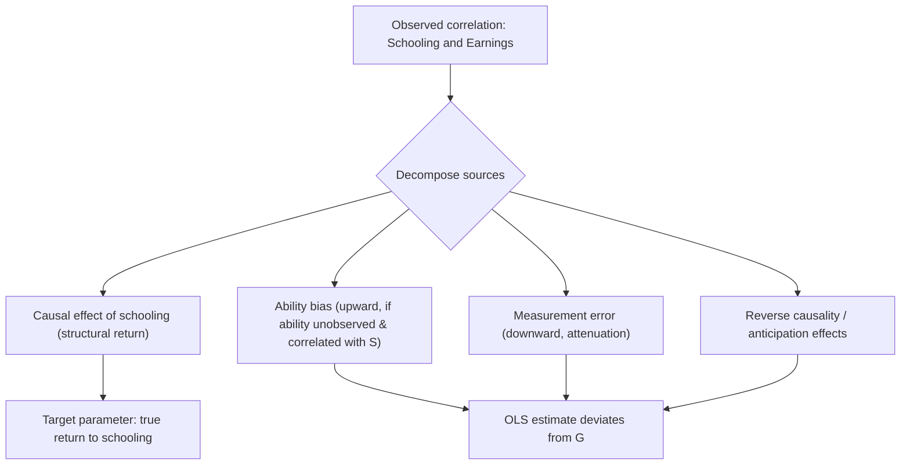
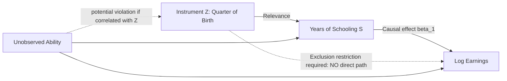

## Estimating Returns to Schooling

### Overview

Estimating the causal return to an additional year of schooling is one of the most heavily researched problems in empirical labor economics. While the Mincer earnings function provides the standard *specification*, the central methodological challenge across the literature is **identification**: isolating the causal effect of schooling on earnings from confounding factors such as unobserved ability, family background, and measurement error. This chapter item surveys the full toolkit of estimation strategies developed to address this challenge, spanning OLS, instrumental variables, natural experiments, twin studies, and structural/selection models.

### The Core Identification Problem

**Key Points**

- The naive OLS regression $\ln w_i = \beta_0 + \beta_1 S_i + \varepsilon_i$ conflates the causal return to schooling with selection effects
- Schooling is a **choice variable**, correlated with unobserved ability, motivation, family resources, and discount rates — all of which independently affect earnings
- The **ability bias** problem: if $Cov(S_i, ability_i) > 0$ and ability independently raises earnings, $\hat{\beta}_1^{OLS}$ is biased upward relative to the true causal parameter
- The **measurement error** problem: self-reported schooling is measured with classical error, biasing $\hat{\beta}_1^{OLS}$ downward (attenuation bias)
- Net bias direction in OLS is theoretically ambiguous — the empirical returns-to-schooling literature is largely organized around resolving this ambiguity

$$\text{plim}(\hat{\beta}_1^{OLS}) = \beta_1 + \underbrace{\frac{Cov(S, ability)}{Var(S)}}_{\text{upward bias}} - \underbrace{\text{attenuation factor}}_{\text{downward bias}}$$

### Strategy 1: Ordinary Least Squares with Rich Controls

**Key Points**

- The simplest approach: add proxies for ability and family background directly to the regression (parental education, family income, test scores such as AFQT)
- Controlling for a test score like the Armed Forces Qualification Test (AFQT) typically reduces the estimated schooling coefficient by a modest amount, suggesting ability bias exists but does not fully explain the OLS-schooling correlation [documented empirical pattern, e.g., in NLSY-based studies]
- **Limitation**: test scores are themselves partly a *consequence* of schooling already completed at the time of testing, creating a "bad control" problem — controlling for a variable that is itself an outcome of the treatment
- Family background controls are typically incomplete proxies for the full set of unobserved ability/motivation factors

### Strategy 2: Twin and Sibling Studies

**Key Points**

- Compares earnings differences between identical (monozygotic) twins who obtained different amounts of schooling
- Twin fixed-effects design differences out shared genetic ability and family background:

$$\ln w_{i1} - \ln w_{i2} = \beta_1 (S_{i1} - S_{i2}) + (\varepsilon_{i1} - \varepsilon_{i2})$$

- **Ashenfelter & Krueger (1994)** and **Ashenfelter & Rouse (1998)** are canonical studies using twins from the Princeton Twins Survey
- **Key finding**: twin-based estimates are often similar to or higher than OLS estimates, undermining the simple prediction that controlling for ability should reduce the coefficient [documented finding, methodologically debated]
- **Limitations**:
  - Small, non-representative samples (twins are not a random sample of the population)
  - Measurement error in *within-pair schooling differences* is proportionally larger than in levels, potentially causing severe attenuation bias unless corrected (e.g., using cross-reported schooling from each twin about the other)
  - Twins may not be a valid natural experiment for the general population's returns

### Strategy 3: Natural Experiments and Instrumental Variables

**Key Points**

- IV approach: find a variable $Z_i$ (instrument) that affects schooling but has no direct effect on earnings except through schooling
- Two-stage least squares (2SLS) estimation:

**First stage:**

$$S_i = \pi_0 + \pi_1 Z_i + \mathbf{X}_i\boldsymbol{\gamma} + \nu_i$$

**Second stage:**

$$\ln w_i = \beta_0 + \beta_1 \hat{S}_i + \mathbf{X}_i\boldsymbol{\delta} + \varepsilon_i$$

#### Major Instruments Used in the Literature

| Instrument | Study | Source of Variation |
| --- | --- | --- |
| Quarter of birth × compulsory schooling laws | Angrist & Krueger (1991) | Children born earlier in the year reach the legal school-leaving age having completed less schooling |
| Distance to nearest college | Card (1995) | Proximity reduces the cost of college attendance |
| Compulsory schooling law changes | Various (UK, Europe) | Discrete increases in minimum school-leaving age |
| College tuition variation | Kane & Rouse (1995) | Cost-based variation in college attendance |
| School construction programs | Duflo (2001, Indonesia) | Large-scale school building program as a natural experiment |

#### The Angrist-Krueger Quarter of Birth Design

Children born earlier in the calendar year start school at an older age and, under compulsory schooling laws that require attendance until a fixed birthday, are legally permitted to drop out having completed slightly less schooling than children born later in the year. Since quarter of birth is plausibly unrelated to ability, it serves as an instrument for years of schooling.

**Key Points**

- Produced IV estimates of the return to schooling close to (sometimes slightly above) OLS estimates, seen as evidence against large positive ability bias
- Heavily critiqued on **weak instrument grounds** (Bound, Jaeger & Baker 1995) — quarter of birth explains very little variation in schooling, and weak instruments can produce IV estimates that are severely biased and have wide confidence intervals, even asymptotically biased toward the OLS estimate in the worst case
- Also critiqued for potential violation of the exclusion restriction — quarter of birth may correlate with other factors (school starting age effects on cognitive development, family planning patterns) that independently affect earnings [contested in the literature]

#### Local Average Treatment Effect (LATE)

**Key Points**

- IV estimates identify the return to schooling only for **compliers** — individuals whose schooling decision was actually changed by the instrument
- For compulsory schooling instruments, compliers are typically at the margin of dropping out of school at the legal minimum age — a specific, often lower-ability-proxy population
- LATE need not equal the Average Treatment Effect (ATE) for the population, nor the Treatment Effect on the Treated (TOT)
- This makes comparing IV estimates across different instruments (and to OLS) conceptually fraught, since each instrument potentially identifies a different LATE for a different complier subpopulation — a key insight from Imbens & Angrist (1994)

### Strategy 4: Heckman Selection and Structural Approaches

**Key Points**

- Addresses the sample selection problem: earnings are observed only for employed individuals, and labor force participation may be correlated with unobserved factors also affecting schooling and earnings
- Heckman two-step procedure (see Mincer function entry for full derivation) is commonly layered onto returns-to-schooling estimation, particularly for women's labor supply studies
- **Structural/dynamic discrete choice models** (e.g., Keane & Wolpin 1997) explicitly model the schooling decision as a dynamic optimal stopping problem under uncertainty, allowing structural estimation of the distribution of returns rather than a single average parameter — computationally intensive but theoretically richer than reduced-form IV

### Strategy 5: Regression Discontinuity Design (RDD)

**Key Points**

- Exploits sharp cutoffs in schooling-related policies (e.g., test-score cutoffs for compulsory schooling exemption, minimum school-leaving age thresholds by birth cohort)
- Compares earnings of individuals just above and just below a policy threshold, under the assumption that individuals near the cutoff are otherwise similar
- Provides **local** causal estimates near the threshold, sharing the LATE-type interpretation limitation of IV — findings near one threshold may not generalize to other parts of the schooling distribution
- Used in studies of compulsory schooling reforms in several European countries and college admission cutoffs

### Comparing Estimation Strategies

| Method | Typical Bias Direction (vs. true causal effect) | Main Threat to Validity |
| --- | --- | --- |
| Basic OLS | Ambiguous (ability bias up, measurement error down) | Omitted variable bias |
| OLS + rich controls (test scores, family background) | Reduced upward bias, but incomplete | Bad control problem (test scores as post-treatment) |
| Twin fixed effects | Attenuated toward zero (from within-pair measurement error) unless corrected | Small, non-representative samples |
| IV (compulsory schooling, quarter of birth) | Weak-instrument bias toward OLS | Instrument relevance and exclusion restriction |
| IV (distance to college, tuition) | LATE for compliers, not ATE | External validity of complier population |
| RDD | Local estimate near threshold | External validity beyond the cutoff |
| Structural/dynamic models | Model-dependent | Heavy identifying assumptions on functional form |

### Meta-Analytic Findings

**Key Points**

- Card (1999, 2001) surveys the IV literature and finds that IV estimates of the return to schooling are frequently **as large as or larger than** corresponding OLS estimates — a pattern inconsistent with the simple ability-bias story predicting IV < OLS
- Proposed explanations for this pattern include: (1) LATE effects being concentrated among credit-constrained compliers with higher-than-average marginal returns, (2) measurement error attenuation in OLS being more severe than commonly assumed, (3) heterogeneous returns across the population combined with instrument-specific complier populations [Inference: the relative importance of each explanation remains actively debated in the literature]
- Typical estimated returns to a year of schooling in developed-country studies cluster around $7\%$–$10\%$ under various specifications, though substantial cross-study variation exists [Unverified precise range — figures are illustrative of general literature clustering and should be verified against current meta-analyses for any applied use]

### Worked Example: Comparing OLS and 2SLS Estimates

Suppose a researcher estimates the following on the same sample:

**OLS:**

$$\widehat{\ln w_i} = 1.35 + 0.072\, S_i + \text{controls}, \quad SE(\hat{\beta}_1) = 0.004$$

**2SLS (using distance to nearest college as instrument):**

$$\widehat{\ln w_i} = 1.10 + 0.096\, S_i + \text{controls}, \quad SE(\hat{\beta}_1) = 0.022$$

**Interpretation**

- The 2SLS estimate ($9.6\%$) exceeds the OLS estimate ($7.2\%$), a pattern the researcher might interpret as evidence that measurement error attenuation dominates ability bias in the OLS estimate, or that the LATE for individuals induced into college by proximity (often lower-income, credit-constrained students) exceeds the ATE
- Note the much larger standard error on the 2SLS estimate — a general feature of IV estimation reflecting efficiency loss relative to OLS, especially with instruments of modest strength
- A first-stage F-statistic should always be reported and checked against conventional weak-instrument thresholds (commonly cited rule-of-thumb: $F > 10$, though more recent econometric guidance — Stock & Yogo, and subsequent literature — suggests this threshold is not universally reliable and context-dependent diagnostics are preferable) [Inference: threshold conventions are a live area of econometric methodology discussion]

*[Unverified/illustrative]: Numbers in this worked example are constructed for pedagogical purposes and do not represent a specific published paper's actual coefficients.*

### Diagram: Identification Strategy Decision Tree (svg_diagram)

<svg xmlns="http://www.w3.org/2000/svg" viewBox="0 0 750 480">
<rect width="750" height="480" fill="#ffffff" />
<text x="375" y="25" font-size="16" font-weight="bold" text-anchor="middle" fill="#1a1a1a">Choosing an Identification Strategy (svg_diagram)</text>
<rect x="290" y="45" width="170" height="40" rx="6" fill="#dbeafe" stroke="#2563eb" />
<text x="375" y="70" font-size="12" text-anchor="middle" fill="#1e3a8a">Data available?</text>
<rect x="60" y="130" width="180" height="45" rx="6" fill="#fee2e2" stroke="#dc2626" />
<text x="150" y="150" font-size="11" text-anchor="middle" fill="#7f1d1d">Twin/sibling data</text>
<text x="150" y="165" font-size="10" text-anchor="middle" fill="#7f1d1d">→ Twin fixed effects</text>
<rect x="290" y="130" width="180" height="45" rx="6" fill="#dcfce7" stroke="#059669" />
<text x="380" y="150" font-size="11" text-anchor="middle" fill="#064e3b">Policy discontinuity</text>
<text x="380" y="165" font-size="10" text-anchor="middle" fill="#064e3b">→ RDD</text>
<rect x="520" y="130" width="180" height="45" rx="6" fill="#fef3c7" stroke="#d97706" />
<text x="610" y="150" font-size="11" text-anchor="middle" fill="#78350f">Valid instrument exists</text>
<text x="610" y="165" font-size="10" text-anchor="middle" fill="#78350f">→ 2SLS / IV</text>
<rect x="200" y="220" width="180" height="45" rx="6" fill="#ede9fe" stroke="#7c3aed" />
<text x="290" y="240" font-size="11" text-anchor="middle" fill="#4c1d95">Rich longitudinal panel</text>
<text x="290" y="255" font-size="10" text-anchor="middle" fill="#4c1d95">→ Individual FE + dynamics</text>
<rect x="420" y="220" width="200" height="45" rx="6" fill="#e0f2fe" stroke="#0284c7" />
<text x="520" y="240" font-size="11" text-anchor="middle" fill="#0c4a6e">Only cross-sectional data</text>
<text x="520" y="255" font-size="10" text-anchor="middle" fill="#0c4a6e">→ OLS + rich controls (caveat: residual bias)</text>
<line x1="375" y1="85" x2="150" y2="130" stroke="#666" stroke-width="1" />
<line x1="375" y1="85" x2="380" y2="130" stroke="#666" stroke-width="1" />
<line x1="375" y1="85" x2="610" y2="130" stroke="#666" stroke-width="1" />
<line x1="150" y1="175" x2="290" y2="220" stroke="#666" stroke-width="1" />
<line x1="610" y1="175" x2="520" y2="220" stroke="#666" stroke-width="1" />
<rect x="150" y="330" width="450" height="100" rx="6" fill="#f9fafb" stroke="#9ca3af" />
<text x="375" y="355" font-size="12" font-weight="bold" text-anchor="middle" fill="#1f2937">All strategies require:</text>
<text x="375" y="375" font-size="11" text-anchor="middle" fill="#374151">1. Check instrument relevance (first-stage F-stat)</text>
<text x="375" y="392" font-size="11" text-anchor="middle" fill="#374151">2. Assess exclusion restriction plausibility</text>
<text x="375" y="409" font-size="11" text-anchor="middle" fill="#374151">3. Interpret as LATE, not necessarily ATE</text>
</svg>

### Cross-Country and Developing-Economy Considerations

**Key Points**

- Returns to schooling tend to be estimated as **higher in lower-income countries**, consistent with diminishing marginal returns to human capital as aggregate schooling levels rise (Psacharopoulos & Patrinos, various years) [documented pattern in comparative literature, subject to data quality and comparability caveats across countries]
- Natural experiments in developing-country contexts (e.g., Duflo's Indonesia school construction study) provide some of the most credible identification because large, discrete policy interventions generate substantial first-stage variation, partially mitigating the weak-instrument problem common in developed-country settings
- Data quality issues (informal labor markets, underreported schooling, income measurement) introduce additional estimation challenges not present in developed-country administrative or survey data

### Practical Guidance for Applied Estimation

**Key Points**

- Always report both OLS and IV (or alternative identification strategy) estimates for comparison and transparency
- Report first-stage diagnostics (F-statistics, partial R²) for any IV specification
- Test sensitivity to alternative experience proxies, functional forms (linear schooling vs. sheepskin dummies), and sample restrictions
- Be explicit about whether the estimated parameter should be interpreted as ATE, ATT, or LATE, and for which subpopulation
- Consider heterogeneous treatment effects explicitly (quantile regression, interaction terms) rather than assuming a single homogeneous return

### Limitations of the Overall Literature

**Key Points**

- No single "gold standard" instrument or design is free of validity concerns; most studies rely on a combination of approaches and robustness checks rather than one definitive identification strategy
- External validity is a persistent concern: LATE estimates from specific instruments/policies may not generalize to counterfactual policy questions (e.g., using a compulsory-schooling-law LATE to predict the effect of a college subsidy)
- The literature has evolved toward emphasizing **heterogeneous returns** (returns vary systematically across individuals by ability, family background, and local labor market conditions) rather than a single population parameter, complicating simple policy extrapolation [Inference: this is a general trend in the literature's evolution, reflecting increased attention to treatment effect heterogeneity]

**Next Steps**

- The Mincer Earnings Function (baseline specification)
- Instrumental Variables and the LATE Framework (Imbens & Angrist 1994)
- Weak Instruments Diagnostics (Stock & Yogo tests)
- Regression Discontinuity Design: Theory and Applications
- Heckman Selection Models
- Signaling Theory vs. Human Capital Theory (Spence 1973)
- Heterogeneous Treatment Effects in Labor Economics
- Structural Dynamic Discrete Choice Models of Schooling (Keane & Wolpin)
- Cross-Country Returns to Education (Psacharopoulos-Patrinos literature)